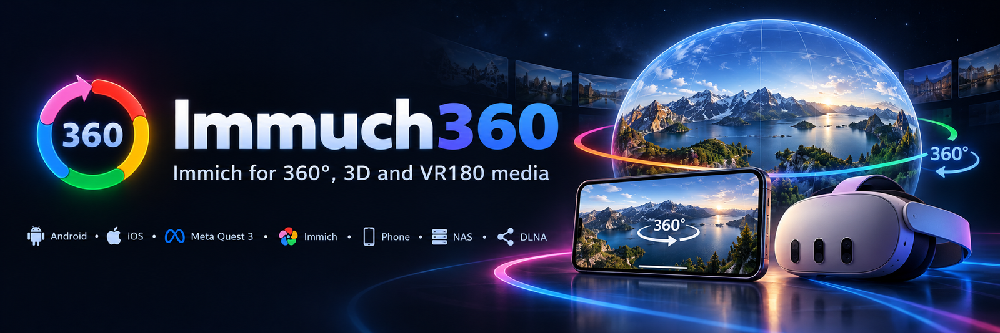

[English](README.md) | [Afrikaans](README.af.md) | [العربية](README.ar.md) | [Azərbaycanca](README.az.md) | [Беларуская](README.be.md) | [Български](README.bg.md) | [Bislama](README.bi.md) | [বাংলা](README.bn.md) | [Brezhoneg](README.br.md) | [Bosanski](README.bs.md) | [Català](README.ca.md) | [Čeština](README.cs.md) | [Чӑвашла](README.cv.md) | [Dansk](README.da.md) | [Deutsch](README.de.md) | [Deutsch (Schweiz)](README.de_CH.md) | [Ελληνικά](README.el.md) | [English (UK)](README.en_GB.md) | [Esperanto](README.eo.md) | [Español](README.es.md) | [Eesti](README.et.md) | [Euskara](README.eu.md) | [فارسی](README.fa.md) | [Suomi](README.fi.md) | [Filipino](README.fil.md) | [Français](README.fr.md) | [Gaeilge](README.ga.md) | [Galego](README.gl.md) | [Alemannisch](README.gsw.md) | [ગુજરાતી](README.gu.md) | עברית | [हिन्दी](README.hi.md) | [Hrvatski](README.hr.md) | [Magyar](README.hu.md) | [Հայերեն](README.hy.md) | [Bahasa Indonesia](README.id.md) | [Íslenska](README.is.md) | [Italiano](README.it.md) | [日本語](README.ja.md) | [ქართული](README.ka.md) | [Taqbaylit](README.kab.md) | [Қазақша](README.kk.md) | [ខ្មែរ](README.km.md) | [Kurmancî](README.kmr.md) | [ಕನ್ನಡ](README.kn.md) | [한국어](README.ko.md) | [ภาษาเขมรถิ่นไทย](README.kxm.md) | [Lëtzebuergesch](README.lb.md) | [Lombard](README.lmo.md) | [Lietuvių](README.lt.md) | [Latviešu](README.lv.md) | [Bahasa Melayu Kelantan](README.mfa.md) | [Te reo Māori](README.mi.md) | [Македонски](README.mk.md) | [മലയാളം](README.ml.md) | [Монгол](README.mn.md) | [मराठी](README.mr.md) | [Bahasa Melayu](README.ms.md) | [Norsk bokmål](README.nb_NO.md) | [नेपाली](README.ne.md) | [Nederlands](README.nl.md) | [Norsk nynorsk](README.nn.md) | [ਪੰਜਾਬੀ](README.pa.md) | [Polski](README.pl.md) | [Português](README.pt.md) | [Português (Brasil)](README.pt_BR.md) | [Română](README.ro.md) | [Русский](README.ru.md) | [සිංහල](README.si.md) | [Slovenčina](README.sk.md) | [Slovenščina](README.sl.md) | [Shqip](README.sq.md) | [Српски](README.sr_Cyrl.md) | [Srpski](README.sr_Latn.md) | [Svenska](README.sv.md) | [Kiswahili](README.sw.md) | [Schwäbisch](README.swg.md) | [தமிழ்](README.ta.md) | [తెలుగు](README.te.md) | [ไทย](README.th.md) | [Tagalog](README.tl.md) | [Türkçe](README.tr.md) | [Українська](README.uk.md) | [اردو](README.ur.md) | [Oʻzbekcha](README.uz.md) | [Tiếng Việt](README.vi.md) | [粵語](README.yue_Hant.md) | [简体中文](README.zh_Hans.md) | [繁體中文](README.zh_Hant.md)
<p align="center">
  
</p>

# Immuch360

Immuch360 היא אפליקציית Immich לנייד עם תמונות וסרטונים ב-360° שאפשר להביט בהם לכל הכיוונים, ונגן חינמי לתמונות ולסרטונים שטוחים, ב-360°, ב-3D וב-VR180, בטלפונים ובטאבלטים עם Android, ב-iPhone וב-iPad, במשקפות Meta Quest 3 ו-3S, ומבילד 20 ב-Android TV וב-Google TV. היא מיועדת למי שמצלמים במצלמת 360° (Insta360, ‏GoPro MAX, ‏DJI Osmo 360, ‏Ricoh Theta, ‏Samsung Gear 360) או במצב תמונה כדורית של טלפון, או שיש להם משקפת, ורוצים לצפות בצילומים שלהם משרת Immich, מהטלפון עצמו, מ-NAS, משרת מדיה או משרת Plex: אותו שרת, אותו חשבון, בלי תוסף בשרת, או בלי שרת בכלל. מבילד 20 היא מציגה גם מצלמות Tapo, בשידור חי ואת ההקלטות שבכרטיס הזיכרון שלהן.

<p align="center">
  <sub>פורק לא רשמי. אין קשר ל-Immich או ל-FUTO. השם נקרא "I am much 360".</sub>
</p>

<p align="center">
  <a href="https://play.google.com/store/apps/details?id=com.aprogsys.immuch360"><b>Google Play</b></a> &nbsp;·&nbsp;
  <a href="https://github.com/freeKC/Immuch360/releases">APK ל-Android</a> &nbsp;·&nbsp;
  App Store: <a href="#where-to-get-it">בבדיקה</a> &nbsp;·&nbsp;
  Meta Quest 3: <a href="#meta-quest-3">APK</a>, ‏Horizon Store בבדיקה &nbsp;·&nbsp;
  Android TV: <a href="#install-it-on-the-tv">APK</a>
</p>

<table align="center">
  <tr>
    <td align="center" width="33%"><h3>🌐 360° מובנה</h3>תמונות וסרטונים ככדור שמביטים בו לכל הכיוונים, עם הג'ירוסקופ, כולל קבצים גולמיים של המצלמה (Insta360 מבילד 16, ‏GoPro ו-DJI מבילד 18). וגם נגן וידאו חינמי: שטוח, 360°, ‏3D, ‏VR180</td>
    <td align="center" width="33%"><h3>👓 3D מובנה</h3>360° סטריאוסקופי ו-VR180, למעלה ולמטה או זה לצד זה, ותמונות מרחביות של Apple (מבילד 19): 3D אמיתי במשקפת, עין אחת בטלפון</td>
    <td align="center" width="33%"><h3>🎥 2.5D מובנה</h3>עומק על מסך שטוח מתוך סרטון סטריאוסקופי, התצוגה עוקבת אחרי הראש (ניסיוני, טלפונים וטאבלטים)</td>
  </tr>
  <tr>
    <td align="center"><h3>📱 Android, iOS, Quest 3, TV</h3>אפליקציה אחת בטלפונים, בטאבלטים ובמשקפת, 3D אמיתי במשקפת, ומבילד 20 גם ב-Android TV עם השלט</td>
    <td align="center"><h3>🔌 עם שרת או בלי</h3>שרת ה-Immich שלכם, או הגלריה של הטלפון עצמו, בלי צורך בחשבון</td>
    <td align="center"><h3>🗄️ שיתופי רשת</h3>Samba (SMB), ‏WebDAV, ומבילד 19 גם שרתי מדיה DLNA, שנמצאים ברשת ונקראים בזמן אמת, בלי להוריד דבר, ונשלחים ל-Immich כשאתם בוחרים. מבילד 19 טלפון יכול גם לשתף את הגלריה שלו עם המשקפת</td>
  </tr>
  <tr>
    <td align="center"><h3>📺 בטלוויזיה</h3>מבילד 20 אותו APK ב-Android TV וב-Google TV: תמונות וסרטונים ב-360°, השרת שלכם והשיתופים שלכם, עם השלט</td>
    <td align="center"><h3>🎬 Plex, בלי plex.tv</h3>מבילד 20 ספריות ה-Plex שלכם, מתנגנות מהקבצים המקוריים כך ש-360° נשאר 360°, בבית ומחוץ לבית</td>
    <td align="center"><h3>📹 מצלמות Tapo</h3>מבילד 20 התצוגה החיה וההקלטות שבכרטיס הזיכרון, רק ברשת שלכם, וקטע שנשלח ל-Immich כשאתם בוחרים</td>
  </tr>
</table>

## מה הבעיה שלכם?

- **"תמונות ה-360° שלי מוצגות כרצועה שטוחה ומתוחה, וסרטוני ה-360° מתנגנים שטוחים."** ראו [תמונות וסרטונים ב-360° ככדור](#360-photos-and-videos-as-a-sphere).
- **"אין לי שרת, ואני לא רוצה חשבון."** ראו [בלי שרת ובלי חשבון](#without-a-server-or-an-account).
- **"אני רוצה לצפות בסרטונים מה-NAS שלי, בטלפון או במשקפת, בלי להעתיק אותם."** ראו [שיתופי רשת](#network-shares-a-nas-a-computer-or-a-media-server).
- **"Plex מנגן את סרטוני ה-360° שלי שטוחים, ואני רוצה את ספריית ה-Plex שלי במשקפת, בטלוויזיה ומחוץ לבית."** ראו [Plex Media Server, בלי plex.tv](#plex-media-server-without-plextv).
- **"התמונות שלי בטלפון, ואין לי מחשב או NAS לשים אותן בשביל המשקפת."** ראו [שיתוף הטלפון הזה ברשת](#share-this-phone-on-the-network).
- **"אני רוצה לראות את מצלמת ה-Tapo שלי ואת הקטעים מאתמול בלילה בלי אפליקציית Tapo, ולשמור קטע ב-Immich."** ראו [מצלמות Tapo](#tapo-cameras-live-view-and-the-recordings-of-the-memory-card).
- **"קבצי ה-Insta360 שלי צריכים את אפליקציית Insta360 לפני שאפשר לצפות בהם"** (וגם קבצי GoPro ‏.360 ו-DJI ‏.osv). ראו [קבצים גולמיים של מצלמות 360°](#raw-360-camera-files-without-the-cameras-app).
- **"סרטוני ה-3D שלי נראים כפולים, וסרטוני ה-VR180 מתוחים מסביב."** ראו [3D ו-VR180](#3d-and-vr180-photos-and-videos) ו-[Spatial 2.5D](#depth-on-a-flat-screen-spatial-25d-experimental).
- **"יש לי תמונות מרחביות מה-iPhone שלי."** ראו [תמונות וסרטונים מרחביים של Apple](#apple-spatial-photos-and-videos).
- **"זה עובד בטלפון, אבל אני רוצה את זה ב-Quest."** ראו [במשקפת Meta Quest 3](#in-the-meta-quest-3-headset).
- **"אני רוצה לצפות בתמונות ובסרטוני ה-360° שלי, ובסרטונים מה-NAS או משרת ה-Plex שלי, בטלוויזיה, עם השלט."** ראו [צפייה בטלוויזיה](#watch-on-your-tv-android-tv-and-google-tv).
- **"אני לא מוצא את צילומי ה-360° שלי בין כל השאר."** ראו [רשימת ה-360°](#find-your-360-shots-the-360-list).
- **"סרטון ה-360° שלי מגמגם, או מנגן עותק מטושטש."** ראו [פרטי הווידאו ומפענחים](#video-details-decoders-and-why-a-video-stutters).
- **"האם אני שומר את כל מה שאפליקציית Immich עושה?"** כן, עם שני שינויים קטנים, ראו [כל השאר זה Immich](#everything-else-is-immich).

כשתכונה חדשה, הטקסט מציין מאיזה בילד היא קיימת. הגרסה ב-GitHub תמיד כוללת את הבילד החדש ביותר, החנויות מגיעות אחר כך: ראו [איפה להשיג](#where-to-get-it).

<a id="360-photos-and-videos-as-a-sphere"></a>
## תמונות וסרטונים ב-360° ככדור

אתם מגבים את התמונות שלכם לשרת [Immich](https://github.com/immich-app/immich), וחלקן מגיעות ממצלמת 360° או ממצב התמונה הכדורית של טלפון. באפליקציה הרשמית לנייד התמונות האלה מוצגות כרצועה שטוחה ומתוחה, וגם סרטוני 360° מתנגנים שטוחים. אפליקציית הרשת של Immich יכולה להציג תמונת 360° ככדור, אפליקציית הנייד לא: זה מבוקש מאז ינואר 2024 ב[דיון ‎#6572](https://github.com/immich-app/immich/discussions/6572).

Immuch360 פותחת אותן ככדור שמביטים בו לכל הכיוונים, בטלפונים ובטאבלטים עם Android ו-iOS. תמונה מסתובבת כשגוררים אותה, מתקרבת בצביטה או בהקשה כפולה, ממשיכה להסתובב מעט אחרי גרירה מהירה, נפתחת בתצוגה ההתחלתית שהמצלמה רשמה (מטא-נתוני GPano), ומקבלת מרקם חד יותר כשמתקרבים; פנורמות חלקיות נתמכות (חיתוך GPano). סרטון מתנגן בנגן כדורי מובנה עם קול, גרירה וג'ירוסקופ. קבצי 360° שכבר חוברו עובדים בכל מקום: ייצואים מאפליקציית Insta360 או מ-Studio, ‏GoPro Player, ‏Ricoh Theta, ותמונות כדוריות של טלפונים. קבצים גולמיים ישירות מהמצלמה מחוברים על ידי האפליקציה, ראו [קבצים גולמיים של מצלמות 360°](#raw-360-camera-files-without-the-cameras-app).

| תמונת 360° ככדור | סרטון 360° בנגן ה-360° |
|---|---|
|  |  |
| סגירה למעלה משמאל; למעלה מימין כפתור 360°/180°, כפתור פריסת ה-3D והג'ירוסקופ | הקישו על התמונה לפקדים; 360° ו-3D למעלה מימין |

### פתיחת תמונת 360° ככדור

1. פתחו את התמונה מציר הזמן, מאלבום, מ[רשימת ה-360°](#find-your-360-shots-the-360-list) או מתיקיית שיתוף. לתמונות 360° יש תג 360° על התמונה הממוזערת.
2. הקישו על 360° בסרגל העליון של המציג. המציג הכדורי נפתח, עם מחוון טעינה בזמן שהתמונה המלאה נטענת; הזום שהיה בתצוגה השטוחה נשמר.
3. גררו כדי להביט סביב, צבטו לזום, הקישו פעמיים כדי להתקרב. אחרי גרירה מהירה, התצוגה ממשיכה להסתובב מעט ומאטה.
4. כדי להביט סביב על ידי סיבוב הטלפון, הקישו על כפתור הג'ירוסקופ למעלה מימין (כבוי כברירת מחדל).
5. שני הכפתורים האחרים למעלה מימין הם 360°/180° (כדור מלא או חצי כדור VR180, לא מוצג בפנורמות חלקיות) ו-3D (הפריסה של תמונה סטריאוסקופית), ראו [3D ו-VR180](#3d-and-vr180-photos-and-videos). לתמונת Insta360 גולמית יש רק את הג'ירוסקופ.
6. סגרו עם ה-X למעלה משמאל.

### הפעלת סרטון 360°

1. פתחו את הסרטון והקישו על 360° בסרגל העליון. בסרטון 360° כפתור ה-360° בא ראשון; בטלפונים ובטאבלטים כפתור Spatial בא אחריו כל עוד ההגדרה הזו פעילה (ראו [Spatial 2.5D](#depth-on-a-flat-screen-spatial-25d-experimental)).
2. נגן ה-360° המובנה נפתח במסך מלא ומנגן עם קול: Media3 ב-Android, ‏SceneKit ב-iOS.
3. גררו כדי להביט סביב, או הזיזו את הטלפון. הנגן ב-Android תמיד עוקב אחרי הטלפון; לנגן ב-iOS יש מתג ג'ירוסקופ, פעיל כברירת מחדל.
4. הקישו על התמונה לפקדים: סגירה, 360°/180° ו-3D למעלה, ואז הפעלה, כפתורי הדילוג ופס הזמן ב-Android. לנגן ב-iOS יש בינתיים רק הפעלה והשהיה.
5. כשלסרטון יש שתי רצועות שמע או יותר (שפות, פרשנות), כפתור רצועת שמע מאפשר לבחור אחת. בזמן שהסרטון נטען או נתקע, הנגן מציג "טוען" עם מידת המילוי של מאגר ההשמעה.

הנגן מנגן את הקובץ השמור בטלפון, או את הקובץ משיתוף רשת, אם יש כזה. אחרת הוא מזרים מהשרת שלכם: את הזרם המשועתק כברירת מחדל, או את המקור אם תבקשו זאת בהגדרות, מציג התמונות, מקור הווידאו (מבילד 15; לפני כן המתג "כפה סרטון מקורי"), ראו [פרטי הווידאו ומפענחים](#video-details-decoders-and-why-a-video-stutters).

### קובץ 360° שמוצג שטוח: הצג כ-360°

לחלק מקבצי ה-360° אין תגית הקרנה, ולכן השרת לא מסמן אותם כ-360° והם מוצגים שטוחים.

1. פתחו את התמונה או הסרטון והקישו על ⋮ למעלה מימין.
2. הקישו על "הצג כ-360°", בין מצגת שקופיות להורדה. כפתור ה-360° מופיע בסרגל העליון.
3. כדי לבטל, אותו פריט נקרא עכשיו "הפסק להתייחס כ-360°".

הבחירה נשמרת בטלפון ולא משנה דבר בשרת. בקובץ משיתוף רשת היא חלה רק על הצפייה הנוכחית.

### מגבלות

- **נגן הווידאו 360° ב-iOS**: הפעלה והשהיה, עדיין בלי פס זמן.
- **הקודם והבא**: נגני ה-360° בטלפונים עדיין לא עוברים למדיה הקודמת או הבאה; התצוגה האימרסיבית ב-Quest כן.
- **פנורמות גדולות מאוד**: תמונה מוצגת לכל היותר ב-8192x4096, המרקם הגדול ביותר שרוב מעבדי הגרפיקה בטלפונים מקבלים, ולכן פנורמה גדולה יותר מוקטנת לגודל הזה.
- **‏.dng עם עין דג כפולה**: עדיין מוצג שטוח.

<a id="without-a-server-or-an-account"></a>
## בלי שרת ובלי חשבון

אין לכם שרת Immich, או שאתם לא רוצים חשבון: אתם רק רוצים שתמונות ה-360° בטלפון ייפתחו ככדור שאפשר לסובב עם הג'ירוסקופ. אפליקציית Immich מבקשת קודם כול להתחבר.

בדף ההתחברות, "שימוש ללא שרת" פותח את Immuch360 על התמונות והסרטונים של המכשיר עצמו, עם מציגי ה-360°, ה-3D, ה-VR180 וה-Spatial, רשימת ה-360° ושיתופי הרשת (מבילד 20 גם שרתי Plex ומצלמות Tapo), בלי חשבון Immich. תכונות השרת נשארות מוסתרות או אפורות עד שמחברים שרת; שום דבר לא יוצא מהמכשיר. ב-Meta Quest 3 זה פותח את התמונות והסרטונים של המשקפת עצמה; בטלוויזיה, שאין לה כאלה, זה מפנה לשיתופי הרשת (ראו [צפייה בטלוויזיה](#watch-on-your-tv-android-tv-and-google-tv)).


### התחלה בלי שרת

1. פתחו את האפליקציה. בדף ההתחברות, מתחת לכתובת השרת ולהגדרות, הקישו על "שימוש ללא שרת".
2. אפשרו גישה לתמונות ולסרטונים שלכם. אם תסרבו, האפליקציה תציג "האפליקציה לא יכולה לראות את התמונות של המכשיר הזה", עם "לאפשר גישה" ו"לפתוח את ההגדרות".
3. לשונית התמונות מציגה את ציר הזמן של המכשיר. חיפוש ואלבומים נשארים אפורים, כי הם מגיעים מהשרת. בלשונית הספרייה יש 360° למעלה, ואז במכשיר הזה (האלבומים של המכשיר) ושיתופי רשת.
4. בתפריט למעלה מימין כתוב "המכשיר הזה בלבד": האפליקציה מציגה את התמונות והסרטונים של המכשיר הזה, שום דבר לא נשלח לשום מקום.

### חיבור שרת מאוחר יותר

1. פתחו את ההגדרות (התפריט למעלה מימין, ואז הגדרות). הפריט הראשון הוא "התחברות לשרת", "סנכרון עם שרת Immich לגיבוי, חיפוש ושיתוף". לתפריט למעלה מימין יש אותו פריט.
2. התחברו כרגיל. ציר הזמן, האלבומים, הגיבוי ושאר תכונות השרת מופיעים.

### מגבלות

- **הגלריה של המכשיר עצמו**: האפליקציה מציגה את התמונות והסרטונים מהגלריה של המכשיר. ב-iPhone, הסריקה לאיתור קבצי 360° מדלגת על קבצים שנשמרו רק ב-iCloud עד שהם מורדים למכשיר.
- **בלי שרת**, רשימת ה-360° כוללת את מה שהסריקה במכשיר מצאה ואת הקבצים שבחרתם להציג כ-360°, ראו [רשימת ה-360°](#find-your-360-shots-the-360-list).

<a id="network-shares-a-nas-a-computer-or-a-media-server"></a>
## שיתופי רשת: NAS, מחשב או שרת מדיה

סרטוני ה-360° שלכם נמצאים ב-NAS או במחשב, ואתם רוצים לצפות בהם בטלפון או במשקפת בלי להעתיק אותם קודם. במשקפת, אנשים בסוף מעתיקים כל קובץ בכבל; שרתי מדיה כמו Plex ו-Jellyfin מנגנים סרטוני 360° שטוחים, כפי שמתארות בקשות בפורומים שלהם; אפליקציית Immich קוראת רק משרת ה-Immich שלכם.

Immuch360 מעיינת ומנגנת את התמונות והסרטונים של כל שרת שמדבר SMB (Samba, ‏Windows), ‏WebDAV או, מבילד 19, DLNA/UPnP (שרת מדיה: Jellyfin, ‏minidlna, ‏Gerbera, ‏Emby, ‏NAS או ממיר טלוויזיה), ישירות מהשיתוף. מבילד 20 ל-Plex Media Server יש סוג משלו, ראו [Plex Media Server, בלי plex.tv](#plex-media-server-without-plextv). היא מוצאת בעצמה את השרתים ברשת שלכם, ומנגנת את הקבצים בזמן אמת באותם מציגים כמו בשאר האפליקציה (360°, ‏3D, ‏VR180, ‏Spatial 2.5D, התצוגה האימרסיבית ב-Quest), עם שרת Immich או בלי, בטלפונים וב-Meta Quest 3. שום דבר לא מורד. כשמחובר שרת, הקבצים שתבחרו יכולים להישלח לחשבון ה-Immich שלכם (מבילד 15).

| הוספת שיתוף | תיקייה של שיתוף |
|---|---|
|  |  |
| השדות של שיתוף SMB חדש, אחרי בדיקת החיבור | תמונות 360° וסרטון, נקראים בזמן אמת מהשיתוף |

### הוספת שיתוף

1. פתחו את לשונית הספרייה, ואז שיתופי רשת. בפעם הראשונה הדף מציג "אין עדיין שיתוף" עם כפתור "הוספת שיתוף"; + למעלה מימין עושה אותו דבר בכל רגע. מבילד 20 שניהם שואלים מה להוסיף: "שיתוף רשת (NAS, מחשב, שרת מדיה)", ‏"Plex Media Server" או "מצלמת Tapo". בחרו באפשרות הראשונה.
2. הדף "הוספת שיתוף" מחפש קודם את השרתים ברשת שלכם ומציג אותם תחת "נמצאו ברשת", עם הסוג שלהם (SMB, ‏WebDAV, ‏DLNA, טלפון, ומבילד 20 גם Plex ו-Tapo). החיפוש לוקח עד כשש שניות; "סריקה חוזרת" מתחילה אותו מחדש. הוא משתמש ב-Bonjour/mDNS ובסריקה של הרשת המקומית שמאומתת בחילופי SMB או WebDAV אמיתיים, מבילד 19 בחיפוש SSDP של שרתי מדיה DLNA, ומבילד 20 ב-GDM, הגילוי של Plex, ובפרוטוקול הגילוי של TP-Link עבור מצלמות Tapo.
3. הקישו על שרת: הסוג, השרת, היציאה והנתיב ממולאים. שרת Plex או מצלמת Tapo פותחים במקום זאת דף משלהם, כבר ממולא.
4. לא ברשימה? מלאו את הטופס ידנית. סוג: "SMB (Samba, שיתוף Windows)", ‏"WebDAV (Nextcloud, Synology ואחרים)", ‏"שרת מדיה DLNA (Jellyfin, NAS, ממיר טלוויזיה)" או, מבילד 20, ‏"Plex Media Server", שפותח את הדף של [Plex Media Server, בלי plex.tv](#plex-media-server-without-plextv). ואז שם, "שם השרת או כתובתו" (שם או כתובת; כתובת מלאה כמו `smb://nas/photos`, `\\nas\photos` או `https://nas:5006/photos` ממלאת את שאר השדות), "יציאה (אופציונלי)" כשהיא לא הרגילה, "שיתוף" ל-SMB או "נתיב כתובת ה-WebDAV" ל-WebDAV, "תיקיית התחלה (אופציונלי)", "שם משתמש" ו"סיסמה", ו"חיבור מאובטח (HTTPS)" ל-WebDAV.
5. SMB: אחרי שהקלדתם את השרת ואת שם המשתמש, "בחירת שיתוף" מציג את השיתופים של השרת.
6. DLNA: לשרת מדיה אין שם משתמש או סיסמה. ציינו את השרת, את היציאה ואת "נתיב התיאור" של תיאור המכשיר שלו (`/rootDesc.xml` ל-minidlna), או הדביקו את הכתובת המלאה, כמו `http://192.168.1.10:8200/rootDesc.xml`, בשדה השרת.
7. הקישו על "בדיקת החיבור". התשובה היא "מחובר, N פריטים בתיקיית ההתחלה", או הסבר למה זה נכשל. אחר כך הקישו על שמור, בתחתית הטופס.

שם משתמש עם סיסמה ריקה נשלח כמו שהוא: Freebox Server מצפה ל-`freebox` ובלי סיסמה עבור הדיסקים שלו. כדי לשנות או להסיר שיתוף מאוחר יותר, השתמשו בעיפרון שלידו בדף שיתופי רשת.

### עיון והפעלה

1. הקישו על שיתוף. קודם מופיעות התיקיות, ואז התמונות והסרטונים כרשת עם תמונות ממוזערות (גם פריים מכל סרטון, שנשמר במטמון במכשיר). אלה שזוהו כ-360° נושאים את תג ה-360°, ומבילד 19 תמונות וסרטונים מרחביים של Apple נושאים תג 3D. משכו למטה כדי לרענן.
2. הקישו על תמונה: היא נפתחת במסך מלא (צביטה, הקשה כפולה), וכפתור ה-360° שלה פותח את המציג הכדורי.
3. הקישו על סרטון: הוא מתנגן בנגן המובנה (הפעלה, השהיה, דילוג בזמן), עם כפתור 360° שפותח את נגן ה-360° ואת כפתורי ה-3D וה-360°/180° שלו, ובטלפון כפתור Spatial לקבצים סטריאוסקופיים.
4. ב-Quest 3, כפתור ה-360° פותח את התצוגה האימרסיבית, ומבילד 19 "הצגה ב-3D" פותח תמונה מרחבית של Apple ב-3D.
5. בתפריט ⋮ יש "הצג כ-360°" לקבצים בלי תגית 360°, ובטלפון "Spatial 2.5D" לסרטונים שאינם סטריאוסקופיים.

360°, ‏3D ו-VR180 מזוהים לפי מטא-נתוני GPano או המטא-נתונים הכדוריים של הקובץ, שנקראים בבקשות טווח, ו-VR180 גם לפי שם הקובץ. מבילד 16 מזוהים גם קבצי Insta360 גולמיים (תמונת ‎.insp לפי שמה או לפי בלוק הכיול של המצלמה, סרטון ‎.insv לפי שמו והפריים שלו) ומחוברים.

<a id="send-files-of-a-share-to-immich"></a>
### שליחת קבצים משיתוף ל-Immich

מבילד 15, כשאתם מחוברים לשרת:

1. בתיקיית שיתוף, לחצו לחיצה ארוכה על תמונה או סרטון, או הקישו על בחר למעלה מימין.
2. סמנו את מה שאתם רוצים, או השתמשו ב"בחר את כל התמונות והסרטונים בתיקייה זו".
3. הקישו על "העלאה ל-Immich". הקבצים מוזרמים מהשיתוף לשרת שלכם אחד אחד, עם ההתקדמות על כל אריח, ופס בתחתית שבו כתוב "שולח 3 מתוך 12" עם כפתור ביטול. השאירו את האפליקציה פתוחה בזמן השליחה.
4. בסוף האפליקציה מציינת כמה נשלחו וכמה כבר היו בשרת: השרת שומר עותק משלו ומסיר כפילויות של קבצים שכבר יש לו. קבצים שנשלחו קודם נושאים סימן ("נשלח ל-Immich בעבר") ומדולגים בפעם הבאה.

לתמונה או לסרטון הפתוחים משיתוף יש אותו פריט בתפריט שלהם. בלי שרת, הדף מציג "יש להתחבר לשרת Immich כדי להעלות". תמונות וסרטונים של המכשיר נשלחים באותה דרך מלשונית הספרייה: במכשיר הזה, אלבום, בחירה, "העלאה ל-Immich", כולל אלה מאלבומים שאינם בבחירת הגיבוי; אחרי השליחה הם נספרים כמגובים.

### איך זה מתנגן בלי הורדה

הנגנים קוראים את הבתים שהם צריכים דרך גשר בתוך האפליקציה (כתובת loopback בלבד, אסימון אקראי לכל הפעלה, טווחי בתים), כך שדילוג בזמן בסרטון עובד ושום דבר לא מועתק למכשיר. הנגנים והמציג במשקפת אף פעם לא מקבלים את כתובת השיתוף, רק את ה-127.0.0.1 של הגשר; הבקשות לשרת נעשות על ידי האפליקציה עצמה. לניגון חלק, השיתוף נקרא בבלוקים גדולים, הקובץ נשאר פתוח בין קריאות, עד 16 MB נקראים מראש לפני הנגן, והסרטון שמתנגן נקרא דרך עד שישה חיבורי SMB במקביל, נפרדים מהחיבור שמשרת את התמונות הממוזערות והרשימות. Freebox Server עונה לאט לכל קריאה: חיבור אחד נותן 4.5 MB/s, שישה נותנים 19 MB/s, מספיק לייצוא 5.7K ב-132 Mbit/s. בזמן שהנגן ממתין לנתונים, נגני ה-360° וה-Spatial מציגים "טוען" עם מידת המילוי של מאגר ההשמעה שלהם; הנגן השטוח מציג "טוען" בלי אחוזים בזמן שהסרטון נטען או נתקע.

### שרתי מדיה DLNA

מבילד 19, האפליקציה שולחת את חיפוש ה-SSDP לשרתי מדיה לקבוצת ה-multicast של הרשת, ואת אותה בקשה ליציאה 1900 של כל כתובת ברשת המקומית /24, ואז קוראת את תיאור המכשיר של כל שרת שעונה ושומרת את אלה שמפרסמים את התוכן שלהם (ContentDirectory). תיקיות וקבצים מוצגים בעזרת פעולת Browse של השרת, עמוד אחר עמוד, ונקראים לפי הכותרות שלהם: קובץ מקבל את הסיומת של הסוג שלו כשלכותרת שלו אין סיומת, וקובץ שני עם אותה כותרת בתיקייה הופך ל-`name (2)`. שמע לא נכלל. התמונות הממוזערות הן עטיפות האלבום או התמונות הקטנות שהשרת מייצר, ונטענות על ידי האפליקציה עצמה, עם התמונה הממוזערת של האפליקציה כשלשרת אין. קובץ מתנגן מהמקור שהשרת מציע, ולא מעותק מומר כשהוא מציע את שניהם, ונקרא בבקשות טווח, כך שדילוג בזמן עובד. נבדק מול minidlna ו-Gerbera; גילוי ברשת אמיתית, Plex, ‏Jellyfin, ‏NAS, ה-Freebox Server, ‏iPhone וה-Quest הם בדיקת המכשירים של בילד 19.

<a id="a-share-that-moved"></a>
### שיתוף שעבר כתובת

מבילד 19, שיתוף DLNA ושיתוף טלפון (ראו [שיתוף הטלפון הזה ברשת](#share-this-phone-on-the-network)) שומרים את המזהה שהשרת שלהם מכריז עליו. כשאחד מהם כבר לא עונה בכתובת שלו (כתובת חדשה מהנתב, שרת שהופעל מחדש ביציאה אחרת), דף התיקייה שלו מציג "מחפש את (שם) ברשת" ומעביר את השיתוף למקום שבו הוא עונה עכשיו: מיד עבור שרת DLNA, שאין לו סיסמה, ואחרי אישור, "להשתמש בכתובת החדשה?", שמציג את שתי הכתובות, עבור שיתוף עם שם משתמש וסיסמה, כי הם יישלחו לכתובת החדשה. מבילד 20 גם שרת Plex שנמצא שוב בכתובת אחרת ברשת מועבר מיד: התעודה שלו מוכיחה שזה אותו שרת לפני שהאסימון נשלח. מצלמת Tapo מחופשת לפי כתובת ה-MAC שלה מהדף שלה, ראו [מצלמות Tapo](#tapo-cameras-live-view-and-the-recordings-of-the-memory-card).

### מגבלות

- **SMB**: רק SMB 2 ו-3, בלי SMB 1.
- **WebDAV**: אימות Basic בלבד (Digest עדיין לא נתמך); אישור HTTPS בחתימה עצמית חייב להיות מותקן במכשיר.
- **מציאת שרתים**: סריקת הרשת וחיפושי ה-DLNA, ה-Plex וה-Tapo בודקים רק את הרשת המקומית /24, ודורשים הרשאת רשת מקומית ב-iOS. ב-iPhone וב-iPad חיפוש ה-DLNA שולח רק את בקשות ה-unicast, עד ש-Apple תעניק לאפליקציה את הרשאת ה-multicast, ויש שרתים שלא עונים להן (minidlna ב-Linux): הוסיפו אותם לפי כתובת התיאור שלהם.
- **DLNA**: שרת שמציע רק עותק מומר של קובץ נותן את העותק הזה; תיקייה מציגה לכל היותר 20,000 פריטים.
- **תמונות ממוזערות**: תמונות ממוזערות של תמונות מפענחות את הקובץ כולו, ולתמונות מעל 30 MB אין תמונה ממוזערת.
- **נגנים**: בחירת רצועת השמע עדיין לא קיימת בנגן השטוח. בטלפון עדיין אי אפשר להחליק מקובץ אחד בתיקייה לבא אחריו (לתצוגה האימרסיבית ב-Quest יש הקודם והבא לקבצי ה-360° בתיקייה). בחירת 3D או 180° שנעשתה בקובץ רשת לא נשמרת.
- **העלאות**: הן רצות רק כשהאפליקציה פתוחה, וקובץ שכבר קיים בשרת נשלח במלואו לפני שהשרת מדווח עליו ככפילות.

<a id="plex-media-server-without-plextv"></a>
## Plex Media Server, בלי plex.tv

הסרטונים שלכם נמצאים ב-Plex, ו-Plex מציג את התמונות והסרטונים שלכם ב-360° שטוחים, כפי שמתארות בקשות בפורום שלו (אחת פתוחה מאז 2017). אתם רוצים את הספרייה הזו גם במשקפת, בטלוויזיה ומחוץ לבית. אפליקציית Immich קוראת רק את שרת ה-Immich שלכם, וסוג ה-DLNA של בילד 19 מגיע לצד ה-DLNA של Plex רק בבית.

מבילד 20 Immuch360 מתחברת ישירות ל-Plex Media Server שלכם, בלי plex.tv: היא מוצאת את השרת ברשת, אתם מדביקים אסימון פעם אחת, והאפליקציה קוראת בזמן אמת את הקבצים המקוריים של הספריות שלכם, בכל מציג של האפליקציה (360°, ‏3D, ‏VR180, ‏Spatial 2.5D, התצוגה האימרסיבית ב-Quest, השלט של הטלוויזיה), בבית, ודרך העברת הפורטים שלכם, גם מחוץ לבית. שום דבר לא מועתק, והקבצים שתבחרו יכולים להישלח ל-Immich.

### הוספת שרת Plex

1. פתחו את לשונית הספרייה, ואז שיתופי רשת, ואז + ו-"Plex Media Server". הסוג "Plex Media Server" בטופס השיתוף, ושרת עם התג Plex תחת "נמצאו ברשת", פותחים את אותו דף.
2. הדף "הוספת שרת Plex" מחפש את שרתי ה-Plex ברשת שלכם ("מחפשים שרתי Plex ברשת שלכם") ומציג אותם תחת "נמצאו ברשת". הקישו על השרת שלכם: כרטיס מציג את השם שלו, את גרסת ה-Plex שלו ומזהה קצר.
3. לא ברשימה? הקלידו את "כתובת השרת" שלו, כמו `192.168.1.20`, `192.168.1.20:32400` או `https://...plex.direct:32400`, ואז הקישו על "חיפוש". האפליקציה קוראת את התעודה של השרת ולא שולחת שום דבר אחר.
4. השיגו את האסימון, במחשב: פתחו את Plex בדפדפן והתחברו, פתחו תמונה או סרטון כלשהם מהספרייה שלכם, ואז "...", ‏"Get Info", ‏"View XML". לשונית חדשה נפתחת בכתובת שמסתיימת ב-`X-Plex-Token=...`. העתיקו את כל הכתובת הזו.
5. הדביקו אותה ב-"אסימון גישה", או שלחו אותה לטלפון והקישו על "הדבקה מהלוח": האפליקציה לוקחת ממנה את השרת ואת האסימון. גם הטקסט שאחרי `X-Plex-Token=` לבדו עובד. "איך משיגים אותו", בדף, אומר את אותו הדבר; מנהלי השרת יכולים להשתמש גם בערך `PlexOnlineToken` מקובץ ה-`Preferences.xml` של השרת, שלא פג תוקפו. בטלוויזיה, OK פותח את חלון המקלדת: הקלידו שם את האסימון (בדרך כלל 20 תווים).
6. הקישו על "בדיקת החיבור". היא עונה "מחובר: N ספריות", או אומרת מה לא תקין, כמו "שרת Plex דחה את האסימון הזה."
7. "גישה מחוץ לבית" מציג אז את מה שהשרת אומר: "השרת מדווח שאפשר להגיע אליו בכתובת (כתובת):(פורט).", או "השרת לא מסר את הכתובת שלו מחוץ לבית." כדי להשתמש בשרת מחוץ לבית, הקלידו את הכתובת הציבורית שלכם או את שם ה-DynDNS ב-"כתובת מחוץ לבית (IP או שם)", ואת הפורט שהועבר ב-Plex (הגדרות, גישה מרחוק) ב-"פורט מחוץ לבית". מה שאתם מקלידים תמיד גובר על מה שהשרת אומר.
8. "שם" הוא שם השרת אלא אם תשנו אותו, ו-"תיקיית התחלה (אופציונלי)" יכולה לפתוח ספרייה אחת ישירות. הקישו על "שמור". השרת מופיע עם השיתופים, כ-`plex://` והכתובת שלו.

### עיון בספריות ה-Plex שלכם

1. הקישו על השרת בשיתופי רשת. הרמה הראשונה מציגה את הספריות שהאפליקציה מציגה: תמונות, סרטים וסרטונים אחרים, סדרות טלוויזיה. מוזיקה לא נכללת.
2. מתחת לספרייה מופיעות התיקיות שלה כפי שהן בדיסק של השרת (התצוגה "לפי תיקייה" של Plex), ואז התמונות והסרטונים לפי שמות הקבצים שלהם, עם התמונות הממוזערות ש-Plex מכין. ספריית תמונות שתצוגת התיקיות שלה לא עונה מציגה במקום זאת את האלבומים שלה.
3. 360° ו-3D מזוהים על ידי קריאת הקבצים עצמם, כמו בכל שיתוף: תמונות 360° מקבלות את תג ה-360°, ותמונות מרחביות של Apple את תג ה-3D.
4. פתחו תמונה או סרטון כמו בכל שיתוף: 360°, ‏3D, ‏360°/180°, ‏Spatial 2.5D בטלפון, התצוגה האימרסיבית ב-Quest, השלט בטלוויזיה. סרטון נקרא כקובץ המקורי, בטווחי בתים דרך הגשר המקומי של האפליקציה, כך שדילוג בתוך הסרטון עובד ונתוני ה-360° וה-3D שלו מגיעים לנגנים שלמים.
5. בחרו קבצים והקישו על "העלאה ל-Immich" כדי לשלוח אותם לשרת שלכם, כמו מכל שיתוף (ראו [שליחת קבצים משיתוף ל-Immich](#send-files-of-a-share-to-immich)).

### מחוץ לבית

בכל פעם שהיא פותחת את השרת, האפליקציה מנסה קודם את הכתובת בבית, ו-400 ms אחר כך את הכתובת מחוץ לבית. הראשונה שעונה עם השרת שלכם היא זו שבשימוש; כשזו הכתובת מחוץ לבית, דף התיקייה מציג סמל גלובוס עם התווית "מחובר דרך הכתובת מחוץ לבית". לשם כך צריך להפעיל גישה מרחוק ב-Plex (הגדרות, גישה מרחוק) עם פורט שהנתב שלכם מעביר: בלי plex.tv האפליקציה לא יכולה להשתמש בממסר של Plex, ולכן שרת בלי העברת פורטים נפתח רק בבית, ומחוץ לבית הדף אומר "אי אפשר להגיע לשרת Plex שלכם מחוץ לרשת הביתית. הפעילו גישה מרחוק עם העברת פורטים ב-Plex (הגדרות, גישה מרחוק), או הקלידו את הכתובת הציבורית שלו."

הכתובת שהשרת מוסר נלמדת מחדש בכל חיבור בבית. כשהיא לא עונה מבחוץ (נתב שמשנה את הכתובת שלו, שני נתבים ברצף), הקלידו את הכתובת שלכם בדף של השרת. כשהאסימון מפסיק לעבוד (למשל, התנתקתם מהפעלת הדפדפן שממנה העתקתם אותו), דף התיקייה אומר זאת ומציע "הדבקת אסימון חדש", שפותח את הדף של השרת בשדה האסימון.

### בהשוואה ל-Plex ולסוג ה-DLNA

- **הקבצים המקוריים**: האפליקציה קוראת את הקבצים עצמם, אף פעם לא עותק ש-Plex המיר, כך שנתוני ה-360°, ה-3D וה-VR180 נשארים שלמים ומציגי האפליקציה משתמשים בהם, בעוד שאפליקציות Plex מציגות את הקבצים האלה שטוחים.
- **בלי plex.tv**: האפליקציה מדברת רק עם השרת שלכם, תמיד ב-HTTPS. השרת נבדק באמצעות תעודת ה-plex.direct שלו, הקשורה למזהה של השרת, לפני שהאסימון נשלח. האסימון נשאר במכשיר, באחסון המאובטח שלו, והולך רק לשרת שלכם, בכותרת בקשה.
- **בהשוואה להוספת אותו שרת כ-DLNA**: התיקיות כמו בדיסק, התמונות הממוזערות של Plex, גישה מחוץ לבית וחיבור מאובטח.

### מגבלות

- **רק שרתים שנתבעה עליהם בעלות**: צריך לתבוע בעלות על השרת ב-Plex (להתחבר פעם אחת לחשבון Plex), מה שנותן לו את תעודת ה-plex.direct שלו. אחרת הדף אומר "הכתובת הזו עונה בלי תעודת Plex. תבעו בעלות על השרת ב-Plex, או הוסיפו אותו כשיתוף SMB, WebDAV או DLNA."
- **IPv4 בלבד**: "כתובות IPv6 עדיין לא נתמכות. הקלידו את כתובת ה-IPv4 של השרת."
- **האסימון** נותן גישה מלאה לשרת ה-Plex שלכם. הסרת השרת באפליקציה שוכחת את האסימון במכשיר אבל לא מבטלת אותו: "האסימון נשאר בתוקף בשרת עד שתתנתקו מהפעלת הדפדפן שממנה העתקתם אותו." אסימון עם תאריך תפוגה מציג את התאריך הזה, והאפליקציה לא יכולה לחדש אותו.
- **מחוץ לבית**: רק דרך העברת פורטים, אין ממסר.
- **ספריות**: מוזיקה לא מוצגת, תיקייה מציגה עד 20,000 פריטים, ומשתמש מוגבל עלול לקבל "האסימון הזה לא יכול לקרוא את הספריות של השרת."
- **קבצים גולמיים של מצלמות 360°** (.insv, ‏.insp, ‏.360, ‏.osv) מוצגים רק אם Plex מציג אותם ברשימה; אחרת הוסיפו את אותה תיקייה ב-NAS כשיתוף SMB או WebDAV, ראו [קבצים גולמיים של מצלמות 360°](#raw-360-camera-files-without-the-cameras-app).
- **מציאת השרת**: שרת שההגדרה "Enable local network discovery (GDM)" שלו כבויה לא נמצא, אז הקלידו את הכתובת שלו. ב-iPhone וב-iPad החיפוש שולח רק בקשות unicast. גם צד ה-DLNA של אותו שרת יכול להופיע ברשימה, עם התג DLNA: בחרו בשורה עם התג Plex.
- **עדיין לא נבדק במכשיר**: החיבור, התיקיות, טווחי הבתים של סרטון, התמונות הממוזערות, אסימון שגוי והכתובת מחוץ לבית נבדקו ממחשב מול Plex Media Server 1.42.1 אמיתי, וספריות תמונות וסדרות טלוויזיה רק מול שרת מדומה. הניגון בטלפון, ב-Quest, ב-iPhone ובטלוויזיה, והמעבר לכתובת מחוץ לבית, הם בדיקת המכשיר של בילד 20.
- ל-Immuch360 אין קשר ל-Plex.

<a id="share-this-phone-on-the-network"></a>
## שיתוף הטלפון הזה ברשת

התמונות והסרטונים שלכם בטלפון, ואתם רוצים לראות אותם במשקפת, בלי מחשב, NAS או שרת Immich. מבילד 19 טלפון, Android או iPhone, מגיש את התמונות והסרטונים שלו ב-Wi-Fi, וה-Meta Quest 3 מנגן אותם. לאפליקציית Immich אין שום דבר כזה.

### הפעלה, בטלפון

1. פתחו את לשונית הספרייה, ואז שיתופי רשת. האריח הראשון הוא "שיתוף הטלפון הזה ברשת" (כתוב עליו כבוי, או פועל עם הכתובת).
2. הקישו עליו, ואז הפעילו את "שיתוף תמונות וסרטונים ב-Wi-Fi". האפליקציה מבקשת את הרשאת התמונות והסרטונים כשהיא חסרה, וב-Android 13 ואילך גם את הרשאת ההתראות.
3. הדף מציג את הכתובת (כמו `http://192.168.1.20:8360`: יציאה 8360, או יציאה פנויה אחרת כשהיא תפוסה), את השם שתחתיו הטלפון מוכרז ("Immuch360 on" ושם הטלפון), את שם המשתמש (`phone` וארבע ספרות) ואת הסיסמה (שמונה תווים), כל אחד עם כפתור העתקה, ואז "N מכשירים מחוברים" (המכשירים שהשתמשו בו בדקה האחרונה) עם הקובץ האחרון שהוגש.

שם המשתמש והסיסמה נוצרים פעם אחת ונשמרים, כך שהמשקפת שומרת את השיתוף השמור שלה; "סיסמה חדשה" מחליפה את הסיסמה. האריח לא מוצג במשקפת.

### פתיחה, במשקפת

1. במשקפת, פתחו ספרייה, שיתופי רשת, ואז +.
2. תחת "נמצאו ברשת", הקישו על הטלפון: שם המשתמש ממולא.
3. הקלידו את הסיסמה פעם אחת (רווחים ואותיות גדולות לא משנים), ואז שמור.

מכאן זה שיתוף WebDAV כמו כל שיתוף אחר: זיהוי 360°, קבצים גולמיים, התצוגה האימרסיבית, דילוג בזמן בסרטונים. כל לקוח WebDAV ברשת יכול גם לקרוא אותו. כשהטלפון מקבל כתובת אחרת, המשקפת מחפשת אותו ושואלת לפני שהיא משתמשת בכתובת החדשה (ראו [שיתוף שעבר כתובת](#a-share-that-moved)).

### מה הוא מגיש, ולכמה זמן

- **תיקיות**, לקריאה בלבד: `Albums` (כל אלבום בטלפון), `By month` (כל התמונות והסרטונים לפי חודש, החדשים ביותר קודם) ו-`360` (תמונות וסרטוני ה-360° שהאפליקציה מצאה בטלפון, כולל קבצים גולמיים ואלה שאתם מציגים כ-360°). הקבצים שומרים על השמות שלהם. ב-iPhone, תמונת Live Photo נותנת את התמונה הסטטית שלה, תמונה או סרטון ערוכים נותנים את הגרסה הערוכה, ומה שנשמר רק ב-iCloud לא נכלל.
- **Android**: השיתוף רץ בשירות בחזית עם התראה (הכתובת ושם המשתמש) וכפתור עצירה, ושומר את ה-Wi-Fi ואת המעבד ערים, כך שהוא ממשיך גם כשהמסך כבוי. החלקת האפליקציה החוצה עוצרת אותו.
- **iPhone ו-iPad**: ‏iOS לא נותן לשרת זמן ברקע, ולכן השיתוף רץ רק כשהאפליקציה בחזית, והמסך נשאר דולק בינתיים. הוא מושהה כשהאפליקציה עוברת לרקע וחוזר, עם אותה כתובת ואותה סיסמה, כשאתם חוזרים.
- **מתי הוא נעצר**: עם המתג, עם עצירה, אחרי 60 דקות בלי שום בקשה, וכשהאפליקציה נסגרת. הוא אף פעם לא מתחיל מעצמו: הוא כבוי בכל הפעלה של האפליקציה.
- **אבטחה**: רשת מקומית בלבד. השיתוף מאזין רק בכתובות ה-Wi-Fi, ה-Ethernet והנקודה החמה של הטלפון, אף פעם לא בכתובת הנתונים הסלולריים או ה-VPN שלו, ועונה רק למכשירים עם כתובת מקומית. כל בקשה דורשת את שם המשתמש והסיסמה (HTTP Basic); עשר סיסמאות שגויות ממכשיר אחד בתוך דקה חוסמות אותו לדקה. הסיסמה עוברת ב-Wi-Fi בלי הצפנה (HTTP רגיל): השתמשו בשיתוף ברשת שאתם סומכים עליה, וכבו אותו כשסיימתם.
- **הנקודה החמה של הטלפון עצמו**: המשקפת יכולה להתחבר אליה; כשהיא לא מוצאת שם את הטלפון, הקלידו את הכתובת שמוצגת בדף.
- **עדיין לא נבדק במכשיר**: השרת נבדק בבדיקות יחידה ובבדיקות מקצה לקצה עם לקוח ה-WebDAV וגשר המדיה של המשקפת עצמה, על מחשב. טלפון שמגיש ל-Quest 3 (גילוי, סרטון של 4 GB שמתנגן ומדלגים בו, מסך כבוי במשך 30 דקות, הנקודה החמה, עצירה מההתראה) וצד ה-iPhone, שעוד לא רץ על iPhone, הם בדיקת המכשירים של בילד 19.

<a id="tapo-cameras-live-view-and-the-recordings-of-the-memory-card"></a>
## מצלמות Tapo: תצוגה חיה וההקלטות שבכרטיס הזיכרון

יש לכם מצלמות Tapo בבית, ואתם רוצים לראות את מצלמת הגינה ואת הקטעים מאתמול בלילה ליד התמונות שלכם בלי לפתוח את אפליקציית Tapo, ולשמור קטע ב-Immich. לאפליקציית Immich אין שום דבר למצלמות, ואפליקציית Tapo היא אפליקציה נפרדת, מחוברת לחשבון ה-TP-Link שלכם, עם הקטעים בנפרד מהתמונות שלכם.

מבילד 20 Immuch360 מוסיפה מצלמת Tapo ליד שיתופי הרשת. היא מציגה את המצלמה בשידור חי בטלפונים ובטאבלטים עם Android, ב-Android TV וב-Meta Quest 3, ובכל הפלטפורמות את ההקלטות שבכרטיס הזיכרון שלה, יום אחרי יום: קטע מובא מהמצלמה, ואז מתנגן כמו כל סרטון ויכול להישלח ל-Immich. האפליקציה מדברת עם המצלמה רק ברשת שלכם, אף פעם לא עם השרתים של TP-Link, ואף פעם לא משנה שום דבר במצלמה.

### הוספת מצלמה

1. קודם באפליקציית Tapo: צרו את חשבון המצלמה, בהגדרות המצלמה, הגדרות מתקדמות, חשבון מצלמה (שם משתמש וסיסמה למצלמה הזו, שמשמשים לתצוגה החיה), והפעילו את התאימות לצד שלישי (תחת אני, ואז Tapo Lab).
2. ב-Immuch360, פתחו את לשונית הספרייה, ואז שיתופי רשת, ואז + ו-"מצלמת Tapo".
3. הדף "הוספת מצלמה" מחפש מצלמות ("מחפשים מצלמות Tapo ברשת שלכם") ומציג אותן תחת "נמצאו ברשת" עם התג Tapo. הקישו על המצלמה שלכם כדי למלא את "כתובת המצלמה", או הקלידו את הכתובת שלה. מצלמה עם התג Tapo בטופס השיתוף פותחת את אותו דף.
4. "שם": השם שבו המצלמה מופיעה ברשימה.
5. תחת "הקלטות בכרטיס הזיכרון", "סיסמת חשבון TP-Link": הסיסמה של החשבון שבו אתם משתמשים באפליקציית Tapo. היא פותחת את ההקלטות; כתובת הדוא״ל שלכם לא נדרשת.
6. תחת "שידור חי", "שם המשתמש של חשבון המצלמה" ו-"סיסמת חשבון המצלמה": חשבון המצלמה משלב 1.
7. מספיק אחד מהשניים ("הזינו את סיסמת חשבון TP-Link, את חשבון המצלמה, או את שניהם."): סיסמת TP-Link לבדה נותנת את ההקלטות, חשבון המצלמה לבדו את התצוגה החיה.
8. הקישו על "בדיקת המצלמה". היא מציגה "הקלטות: (דגם), קושחה (גרסה)" עם מצב כרטיס הזיכרון, ו-"תצוגה חיה: (וידאו), קול (שמע)", או מה נכשל בכל אחד.
9. הקישו על "שמור". המצלמה מופיעה תחת "מצלמות", אחרי השיתופים, עם הדגם שלה כשהוא ידוע ו-`tapo://` עם הכתובת שלה.

### צפייה בשידור חי

1. הקישו על המצלמה. התצוגה החיה שלה נמצאת בראש הדף שלה: "מתחברים למצלמה", ואז התמונה עם התג שידור חי.
2. הכפתורים על התמונה: הקול, כבוי בהתחלה ("הפעלת הקול"; "אין קול במכשיר הזה" כשהמכשיר לא יכול לנגן אותו), SD או HD, ו-"מסך מלא".
3. טלפון מציג SD בדף ו-HD במסך מלא; ה-Quest מציג HD. חזרה יוצאת קודם ממסך מלא.
4. מתחת לתמונה מופיעים הדגם והקושחה וכרטיס הזיכרון, כמו "כרטיס זיכרון: (בשימוש) בשימוש מתוך (סך הכל)" או "אין כרטיס זיכרון".

ב-iPhone וב-iPad התצוגה החיה אומרת "התצוגה החיה תגיע ל-iPhone ול-iPad בגרסה מאוחרת יותר. ההקלטות כבר מתנגנות כאן." בלי חשבון המצלמה הדף אומר "הוסיפו את חשבון המצלמה כדי לראות את התצוגה החיה."

### ניגון ושמירה של ההקלטות

1. תחת "הקלטות בכרטיס הזיכרון", דף המצלמה מציג את הימים שיש בהם הקלטות, מהחדש לישן, לפי חודש. בלי סיסמת חשבון TP-Link הוא אומר "הוסיפו את סיסמת חשבון TP-Link כדי לראות את ההקלטות."
2. הקישו על יום. הקטעים שלו מופיעים תחת השעות לפי השעון של המצלמה עצמה, כל אחד עם שעת ההתחלה שלו, האורך שלו, התמונה הממוזערת של המצלמה לאירוע, והסוג שלו: תנועה, אדם, חיית מחמד, רכב, בכי תינוק, בעל חיים, רציף או אירוע.
3. הקישו על קטע. האפליקציה מביאה אותו מהמצלמה ("מביאים את הסרטון מהמצלמה: N%", עם ביטול), ואז מנגנת אותו בנגן הווידאו, עם קול ודילוג. קטע שהובא נושא את התווית "במכשיר הזה" ונפתח מיד בפעם הבאה.
4. כדי לשמור קטע ב-Immich, כששרת מחובר: תפריט ה-⋮ של הסרטון, "העלאה ל-Immich".
5. כדי לפנות מקום: לחיצה ארוכה על קטע שהובא מציעה "מחיקת העותק במכשיר הזה" (בטלפון), ובדף המצלמה יש "מחיקת הסרטונים שהובאו מהמצלמה הזו", עם הגודל שלהם.
6. כפתור הרענון למעלה מימין, או משיכת הדף למטה, שואלים שוב את המצלמה.

כשהמצלמה כבר לא עונה בכתובת שלה, הדף שלה מחפש אותה ברשת לפי כתובת ה-MAC שלה ומעביר אותה למקום שבו היא עונה עכשיו, ברגע שהיא מציגה את אותה תעודה. מצלמה שמציגה תעודה שונה מזו שהאפליקציה ראתה בפעם הראשונה מקבלת במקום זאת שאלה: "המצלמה בכתובת (כתובת) מציגה תעודה שונה מבעבר. המשיכו רק אם איפסתם או החלפתם אותה."

### בהשוואה לאפליקציית Tapo

- **רק ברשת שלכם**: האפליקציה מדברת עם המצלמה עצמה, ברשת המקומית, ואף פעם לא עם השרתים של TP-Link. היא לא מתחברת לחשבון TP-Link, ולכן כתובת הדוא״ל שלכם לא נדרשת.
- **ההקלטות הופכות לסרטונים רגילים**: קטע שהובא הוא סרטון H.264 עם הקול שלו, שאפשר לשלוח ל-Immich, שם הוא נשאר גם אחרי שכרטיס הזיכרון הקליט מעליו.
- **לצד כל השאר**: עם שרת Immich או בלי, בטלפון, בטלוויזיה או ב-Quest (בחלון), נמצאת ברשת כמו שיתוף.
- **קריאה בלבד**: האפליקציה מבקשת מהמצלמה רק את מה שהיא מציגה; היא אף פעם לא משנה הגדרה ואף פעם לא מוחקת שום דבר במצלמה.

### מגבלות

- **עדיין לא נבדק במכשיר**: בילד 20 עדיין לא רץ עם מצלמה אמיתית. הפרוטוקול נכתב לפי הקלטות תעבורה של C510W עם קושחה 1.3.4 (התחברות V4 מאמצע 2026), והאפליקציה נבדקה מול מצלמה מדומה בבדיקות שלה. דיווחים יתקבלו בברכה, עם הדגם והקושחה ש-"בדיקת המצלמה" מציגה והשורות מה[יומן](#logs).
- **תצוגה חיה**: רק בטלפונים ובטאבלטים עם Android, ב-Android TV וב-Quest, עדיין לא ב-iPhone וב-iPad. המגבלות של TP-Link חלות: לכל היותר שני זרמי HD ושני זרמי SD בו זמנית לכל מצלמה, כולל אפליקציית Tapo, ו-Tapo Care, כרטיס הזיכרון ומקליט שמשתמש ב-RTSP או ONVIF לא יכולים לפעול כולם בו זמנית.
- **מצלמות**: מצלמות על סוללה ומצלמות שמאחורי רכזת Tapo לא נתמכות.
- **הקלטות**: הורדה אחת בכל פעם לכל מצלמה. בזמן שאפליקציית Tapo מעיינת בכרטיס הזיכרון, האפליקציה מנסה שוב אחרי 4, 8 ו-12 שניות, ואז אומרת "המצלמה עסוקה עם צופה אחר, למשל אפליקציית Tapo. נסו שוב בעוד דקה." הקלטות ב-H.265 עדיין לא מומרות ("ההקלטה הזו בפורמט H.265, שהגרסה הזו עדיין לא יודעת להמיר."), להקלטות רציפות אין תמונה ממוזערת, וקטע מתנגן רק אחרי שהובא במלואו.
- **סיסמאות**: כל סיסמה שגויה נספרת, ואחרי כמה המצלמה ננעלת לזמן מה ("המצלמה ננעלה אחרי יותר מדי סיסמאות שגויות. נסו שוב בעוד N דקות."). האפליקציה אף פעם לא מנסה שוב סיסמה שנדחתה מעצמה: רק "בדיקת המצלמה" או "נסה שוב" שואלים שוב את המצלמה. כשהמצלמה מקבלת את הסיסמה להגדרות שלה אבל לא לסרטונים שלה, כבו והפעילו מחדש את התאימות לצד שלישי באפליקציית Tapo, ואז הפעילו מחדש את המצלמה.
- **מקום**: קטעים שהובאו נשארים במטמון של האפליקציה, עד 1 GB לכל המצלמות יחד (אלה שנוגנו הכי מזמן נמחקים ראשונים); המערכת יכולה לנקות את המטמון הזה, והסרת מצלמה מוחקת את הקטעים שלה.
- **מחוץ לבית**: האפליקציה מגיעה למצלמה בכתובת שלה ברשת שלכם, ולכן לא מחוץ לה.
- ל-Immuch360 אין קשר ל-TP-Link.

<a id="raw-360-camera-files-without-the-cameras-app"></a>
## קבצים גולמיים של מצלמות 360°, בלי האפליקציה של המצלמה

מצלמות Insta360 מקליטות את שני מעגלי עין הדג של העדשות שלהן, זה לצד זה בתמונה אחת, בשתי רצועות או בשני קבצים (‎.insp הוא JPEG, ‏‎.insv הוא MP4), והדרך הרשמית להוציא מהם תמונת 360° היא אפליקציית Insta360 או Studio. בעלי X4, ‏X5, ‏X6, ‏GoPro MAX או DJI Osmo 360 שואלים מה לעשות עם הקבצים הגולמיים שבכרטיס. אפליקציית הרשת של Immich מתייחסת לכל ‎.insp כתמונה אקוויריקטנגולרית ועוטפת את שני המעגלים סביב הכדור; אפליקציית הנייד מציגה אותם שטוחים.

מבילד 16 Immuch360 מחברת את הקבצים האלה בעצמה, בטלפון, בטאבלט או במשקפת, בלי להתקין דבר בשרת:

| מצלמה וקובץ | מה האפליקציה עושה | מאז |
|---|---|---|
| תמונות Insta360 ‏‎.insp | מחוברות ב-GPU לפני המציג הכדורי, עד 8192x4096, עם חלופה ב-CPU בגודל קטן יותר | בילד 16 |
| סרטוני Insta360 ‏‎.insv ששומרים את שתי העדשות ברצועה אחת | מחוברים על ידי אפקט GPU בנגן | בילד 16 |
| סרטוני ‎.insv של Insta360 X4, ‏X4 Air, ‏X5 ו-X6, רצועה ריבועית אחת לכל עדשה | שני מפענחים בבת אחת, אחד לכל עדשה, ומרכיב GPU שמחבר אותן לכדור | בילד 18 |
| Insta360 X3 וישנות יותר ב-5.7K ומעלה: שני קבצים, `_00_` ו-`_10_` | אותו דבר, כשהקובץ השני נמצא ליד הראשון | בילד 18 |
| GoPro MAX ו-MAX 2 ‏‎.360: שתי רצועות של שלוש פאות קובייה כל אחת | אותו דבר, עם מיזוג עמודות החפיפה | בילד 18 |
| DJI Osmo 360 ‏‎.osv: שתי רצועות ריבועיות של 10 ביט | אותו דבר, עם כיול Kannala-Brandt מהקובץ | בילד 18 |
| ‏.dng עם עין דג כפולה | מוצג שטוח | עדיין לא |

### צפייה בקובץ גולמי

1. שימו את הקבצים הגולמיים במקום שהאפליקציה קוראת ממנו: הגלריה של המכשיר עצמו (מועתקים מכרטיס המצלמה), שרת ה-Immich שלכם (הוא מקבל ‎.insp ו-‎.insv, ודוחה ‎.360 ו-‎.osv), שיתוף SMB או WebDAV, ומבילד 19 שיתוף הטלפון ושרתי DLNA שמציגים את הקבצים האלה (עדיין לא נבדק).
2. שמרו יחד את שני הקבצים של זוג X3: האפליקציה מחפשת את הקובץ השני ליד הראשון, במכשיר, בשרת או בתיקיית השיתוף. כשהשני חסר, האפליקציה מציגה "ההקלטה הזו מפוצלת לשני קבצים, אחד לכל עדשה, והקובץ (שם) לא נמצא לידה", ומציעה לשמור את שני הקבצים יחד או לייצא את הסרטון מאפליקציית המצלמה.
3. פתחו את הקובץ והקישו על 360°. לקבצים גולמיים יש כפתור 360° ולתמונות גולמיות תג 360°. מבילד 18 קבצי Insta360 גולמיים מהשרת נמצאים גם ברשימת ה-360°, לפי השם שלהם.
4. תמונה נפתחת במציג הכדורי עם תווית בתחתית: "קובץ 360° גולמי, מחובר על ידי האפליקציה", ומקור הכיול: "כיול עדשות שנקרא מהקובץ", "כיול עדשות של אותה מצלמה" (נשמר מקובץ אחר של אותה מצלמה, לפי המספר הסידורי שלה, או לפי הדגם עבור קובץ שמציין רק את הדגם), או "ערכי עדשה נומינליים, ייתכנו תפרים" (הערכים של X3, כשאין משהו טוב יותר).
5. סרטון נפתח בנגן ה-360° המובנה ומחובר תוך כדי ניגון. כפתורי ה-3D וה-360°/180° שלו מוסתרים, כי סרטון גולמי הוא כדור מלא אחד. נגני הווידאו והמשקפת לא מציגים תווית.
6. במשקפת, התצוגה האימרסיבית מקבלת תמונה זמנית מחוברת עבור תמונה, ואת אותו אפקט GPU כמו בטלפון עבור סרטון. עדיין אין מחוון התקדמות בזמן שתמונה גולמית מוכנה.
7. אם התמונה נפתחת כשהיא פונה לכיוון מוזר (תמונה שצולמה כשהמצלמה שוכבת, למשל), גררו אותה בטלפון, או סובבו אותה במשקפת עם הסטיק הימני או כפתור הסיבוב.

### כשהמכשיר לא יכול לנגן את שתי העדשות

לפני ניגון סרטון עם שתי עדשות, האפליקציה שואלת את המכשיר אם הוא יכול להריץ שני מפענחים בגודל ובקצב האלה, וטלפון מזהיר "הסרטון הגולמי הזה צריך שני מפענחי וידאו (גודל) בו-זמנית: ייתכן שלא יתנגן בצורה חלקה במכשיר הזה" כשהתשובה שלילית. כשהמפענחים לא יכולים לרוץ (שתי עדשות H.264 של 2880x2880 ב-Quest 3, למשל), האפליקציה מנגנת עדשה אחת ואומרת זאת, וחצי מהכדור נשאר שחור, ואז את הזרם המשועתק של השרת אם יש כזה. אם אפקט ה-GPU לא יכול לרוץ במכשיר, הסרטון מתנגן לא מחובר, שני המעגלים על הכדור, עם "חיבור ה-360° נכשל במכשיר הזה".

מבילד 19, ב-Android וב-Quest:

- **אין מפענח חומרה** לקודק (אמולטור, ממיר טלוויזיה): המכשיר מקבל מפענחי תוכנה, שהבדיקה מגבילה ל-2048x2048 לכל עדשה כששניים רצים בבת אחת.
- **עדשה שהמכשיר לא יכול לפענח בכלל** (אין מפענח לקודק שלה, או שאף מפענח לא מציג את הפרופיל שלה) מדלגת על שלב העדשה האחת, לטובת הזרם המשועתק של השרת או, אחרת, המקור הלא מחובר בנגן הרגיל, עם ההודעה של הנגן הזה.
- **עדשה שנוסתה למרות שהגודל או הקצב שלה נדחו** מציגה את הודעת העדשה האחת רק אחרי שהפריים הראשון שלה צויר.
- **כשהמפענח של העדשה האחת נכשל** ואין זרם משועתק, הסרטון מתנגן לא מחובר במקום לעצור בשגיאה.
- **באמולטור Android** פריים של העדשה הנגדית כבר לא מהבהב (המרקם של כל עדשה נקשר עכשיו ליעד המרקם החיצוני בכל פריים).

### איך החיבור עובד

- **מה האפליקציה קוראת**: את בלוק הכיול שהמצלמה מוסיפה לכל קובץ (דגם העדשה, מרכזים, הכיוון של כל עדשה, גודל משטח הכיול) ואת רישום מד התאוצה, שמשמש ליישור האופק. מודל Mei (מצלמה מאוחדת) ממחרוזת הכיול V3 משמש ראשון, V6 (X6 וקושחה חדשה יותר) עם האיברים הראשונים שלו אחריו, והמחרוזת השוות-מרחק הישנה V1 אחרונה. שום דבר לא מנוחש מדגם המצלמה כשלקובץ יש כיול משלו. הכיול של Insta360 X5 ו-X6 (V6, בלוק סיום עם אינדקס) וחלון הווידאו של X4 נקראים מהקובץ.
- **מאיפה היא קוראת אותו**: מהשרת (הקובץ המקורי, נקרא בבקשת טווח לבתים האחרונים שלו), מהגלריה של המכשיר עצמו, ומהשיתופים.
- **תמונות וסרטונים**: תמונות מחוברות על ידי fragment shader של Flutter לפני המציג הכדורי; סרטונים עוברים לנגנים המובנים עם הכיול, אפקט GL של Media3 ב-Android וב-Quest, ‏shader של SceneKit ב-iOS.
- **שתי עדשות בשתי רצועות או בשני קבצים**: הנגנים מפענחים את שתיהן בבת אחת, מפענח חומרה אחד לכל עדשה, מותאמות לפי חותמת זמן, ומרכיב GPU מחבר אותן לכדור: ExoPlayer ו-OpenGL ES 3 ב-Android וב-Quest, מרכיב AVFoundation ב-Metal ב-iOS. מקורות HLG ו-PQ של 10 ביט עוברים מיפוי גוונים לכדור של 8 ביט.

### מגבלות

- **תפרים**: החיבור משתמש רק בכיול של המצלמה, בלי אופטימיזציה של התפרים, ולכן עצמים קרובים למצלמה יכולים להראות תפר, כמו בתצוגה המקדימה של המצלמה עצמה.
- **אופק**: היישור משתמש במד התאוצה שהמצלמה רושמת בקובץ, בממוצע. סרטון מיושר פעם אחת, מתחילת ההקלטה, ולא מיוצב, כך שסרטון שצולם ביד שומר על הרעידות שלו והאופק שלו עלול לנטות מעט. קבצי GoPro ו-DJI לא מיושרים (האופק של המצלמה נשמר).
- **קבצים בלי כיול**: קובץ בלי בלוק הכיול שלו (החברים `_008` ו-`_009` בקבוצת HDR של X3) משתמש בכיול שהאפליקציה שמרה מקובץ אחר של אותה מצלמה או של אותו דגם מצלמה, או בערכים הנומינליים של X3 אם היא לא ראתה אף אחד.
- **מה נבדק**: תמונות מול ייצואים של Insta360 Studio מקבצי X3 (אותו מסגור, אופק ישר, סטייה בכיוון של פחות ממעלה); סרטונים עם רצועה אחת באמולטור Android עם קובץ X3 ברזולוציה נמוכה. מסלולי שתי הרצועות ושני הקבצים נבדקו על קבצי X4, זוג X3, ‏GoPro MAX ו-Osmo 360 אמיתיים עם מחבר הייחוס ב-CPU של האפליקציה (אופק ישר, תפרים רציפים) ובבדיקות היחידה של Android. ניגון בטלפון, ב-Quest וב-iPhone הוא עדיין בדיקת המכשירים של בילדים 18 ו-19, וקבצים גולמיים עוד לא רצו על iPhone: נשמח למשוב.
- **בשרת**: שרת Immich דוחה העלאות של ‎.360 ו-‎.osv, כך ששני הפורמטים האלה קיימים רק במכשיר ובשיתופים.

<a id="3d-and-vr180-photos-and-videos"></a>
## תמונות וסרטונים ב-3D וב-VR180

באפליקציית Immich תמונה או סרטון 360° סטריאוסקופיים מציגים את שתי העיניים בבת אחת, תמונה כפולה, וקובץ VR180, שמכסה רק את החצי הקדמי, נמתח סביב הכדור כולו.

Immuch360 מזהה את פריסות ה-3D, למעלה ולמטה או זה לצד זה, מתוך הקובץ (תיבת ה-st3d של סרטון), או מנחשת אותן לפי צורת הפריים, ולכל מציג יש כפתור 3D כדי לשנות אותן. טלפון מציג את העין השמאלית; ה-Meta Quest 3 מציג לכל עין את החצי שלה, ב-3D אמיתי. קבצי VR180 מצוירים על חצי כדור, כשהחלק האחורי שחור במקום תמונה מתוחה. הם מזוהים מתוך הקובץ (גבולות או רשת כדוריים, חיתוך GPano) או לפי "vr180" או "180" בשם, ולכל מציג יש כפתור 360°/180°.

### שינוי הפריסה או הכיסוי

1. פתחו את התמונה או הסרטון ככדור (כפתור ה-360°).
2. כפתור ה-3D עובר בין "מונו (לא 3D)", ‏"3D, למעלה ולמטה" ו-"3D, זה לצד זה"; תיאור הכלי שלו מציין את הפריסה הנוכחית.
3. כפתור ה-360°/180° מחליף בין "360°, כדור מלא" ל-"180°, חצי כדור (VR180)". הוא לא מוצג בפנורמות חלקיות.
4. במשקפת, אותם שני כפתורים נמצאים בלוח המידע של התצוגה האימרסיבית.

הבחירה 360°/180° נשמרת במכשיר עבור המדיה של הספרייה, עדיין לא עבור קובץ משיתוף רשת. בחירת ה-3D לא נשמרת כשהמציג נסגר: הפריסה שהקובץ מצהיר עליה, או הניחוש, חלה שוב בפעם הבאה (נגן ה-Spatial 2.5D שבהמשך שומר את שלו).

נבדק ב-Galaxy S24+ וב-Quest 3 עם סרטוני דוגמה אמיתיים ב-3D וב-360° (VRTogether, ‏Vuze, ‏Kandao) ותמונת 3D אחת; VR180 באמולטור Android וב-Galaxy S24+ עם מדיה סינתטית. נשמח לדיווחים ממצלמות אחרות.

<a id="depth-on-a-flat-screen-spatial-25d-experimental"></a>
## עומק על מסך שטוח: Spatial 2.5D (ניסיוני)

סרטון סטריאוסקופי יכול לקבל עומק על מסך שטוח. שתי העיניים של הסרטון נותנות את העומק, המצלמה הקדמית עוקבת אחרי הראש שלכם, והאפליקציה מסנתזת את התצוגה שביניהן, כך שהמסך מתנהג כמו חלון אל הסצנה: הזיזו את הראש ועצמים קרובים זזים ביחס לרקע. טלפונים וטאבלטים בלבד.

### שימוש

1. בדקו שהוא פעיל: הגדרות, מציג התמונות, סרטונים, "Spatial 2.5D (ניסיוני)". הוא פעיל כברירת מחדל; כיבוי שלו מסיר את כפתור Spatial מכל מקום.
2. פתחו סרטון. כל עוד ההגדרה פעילה, הסרגל העליון מציג את כפתור Spatial (סמל 3D מסתובב) בכל סרטון; בתיקיית שיתוף רשת רק לקבצים סטריאוסקופיים יש אותו, ולשאר יש Spatial 2.5D בתפריט ⋮.
3. הקישו עליו. הרשאת המצלמה הקדמית מתבקשת בפעם הראשונה; המצלמה משמשת רק אחרי שלוחצים על הכפתור.
4. למעלה מימין: רצועת שמע כשלסרטון יש שתיים או יותר, הפריסה הנוכחית (הקישו עליה לרשימה: אוטומטי, לא סטריאוסקופי, זה לצד זה, למעלה ולמטה, שתי האחרונות גם עם עיניים מוחלפות), 360°/180° בסרטון 360°, ומרכוז מחדש, שלוקח את מיקום הראש הנוכחי שלכם כמרכז.
5. למטה: הפעלה, ציר הזמן, ואז רגישות לתנועת הראש בזמן שהראש שלכם במעקב, ומחוון נקודת המבט מ-L ל-R, שמזיז את נקודת המבט ידנית; הוא מוצג כשמעקב הראש כבוי או איבד את הפנים שלכם.
6. סגרו עם ה-X או עם כפתור החזרה של המערכת.

כשהגדרות, מתקדם, פתרון בעיות פעיל, הנגן מוסיף שכבה למעלה משמאל (קצבי רינדור ופער, דרגת איכות, נקודת מבט, מצב המעקב), תמיד מציג את מחוון נקודת המבט, ומוסיף תיבת סימון "Disparity map" (מפת פער) שמציגה את העומק המשוער במקום התמונה.

### פורמטים, פרטיות ומגבלות

- **פורמטים**: זה לצד זה ולמעלה ולמטה, גם עם עיניים מוחלפות, ברוחב מלא או בחצי רוחב, שטוח, 360° ו-VR180. הפריסה נקראת מהקובץ, ואחרת מנוחשת לפי צורת הפריים או שם הקובץ (sbs, ‏ou, ‏tb וכדומה; קובץ בחצי רוחב מזוהה רק לפי השם), ואפשר לבחור אותה ידנית בנגן. הבחירה נשמרת עבור סרטון מהספרייה, לא עבור קובץ משיתוף רשת.
- **מצלמה**: התמונות מעובדות במכשיר בלבד, אף פעם לא נשמרות ואף פעם לא נשלחות לשום מקום. לבילד של Quest 3 אין הרשאת מצלמה בכלל (למשקפת אין מצלמה שאפליקציה רשאית להשתמש בה), ונגן ה-Spatial לא מוצע שם: הכפתור וההגדרה שלו מוסתרים במשקפת.
- **מגבלות**: ניסיוני, טלפונים וטאבלטים בלבד (לא ב-Meta Quest), דורש OpenGL ES 3.0 או Metal. העומק הוא הערכה. זה עובד הכי טוב במצב רוחב כשהפנים מוארות היטב. נבדק ב-Galaxy S24+; נשמח למשוב מ-iPhone.
- **חלופה**: אם משהו משתבש (אין מצלמה, מכשיר לא נתמך, פריסה שאי אפשר לקרוא), אתם חוזרים לנגן הרגיל.

<a id="apple-spatial-photos-and-videos"></a>
## תמונות וסרטונים מרחביים של Apple

‏iPhone מצלם תמונות וסרטונים מרחביים, ושרת Immich לא אומר עליהם דבר: באפליקציית Immich הם תמונה או סרטון שטוחים. מבילד 19 Immuch360 מזהה אותם על ידי קריאת הקבצים, ומציגה תמונה מרחבית ב-3D ב-Meta Quest 3. זה לא נגן ה-Spatial 2.5D שלמעלה, שמיועד לסרטונים זה לצד זה ולמעלה ולמטה.

- **תמונות מרחביות** הן קבצי HEIC ‏(`.heic`, `.heif`, `.hif`) שמכילים שתי תמונות, אחת לכל עין, מקובצות כזוג סטריאו. האפליקציה קוראת את תחילת הקובץ (במכשיר, את המקור בשרת בבקשת טווח, או קובץ משיתוף רשת) ושומרת את התשובה בטלפון, כך שתמונה נקראת רק פעם אחת.
- **סרטונים מרחביים** (MV-HEVC) מזוהים לפי רצועת הווידאו: שכבה שנייה, ושתי העיניים מוצהרות.

### צפייה בתמונה מרחבית ב-3D במשקפת

1. במשקפת, פתחו את התמונה המרחבית במציג, או בתיקיית שיתוף רשת, שבה לתמונות ולסרטונים מרחביים יש תג 3D.
2. הקישו על "הצגה ב-3D" בסרגל העליון (גם בדף התמונה של שיתוף יש אותו).
3. התצוגה האימרסיבית נפתחת עם התמונה על מסגרת שטוחה 2 מ' לפניכם, כשכל עין מקבלת תמונה משלה, ברוחב שנלקח משדה הראייה של המצלמה כשהקובץ מציין אותו (48° אחרת). כוונון הפער שנכתב בקובץ מוחל.
4. סטיק למעלה או למטה מגדיל או מקטין אותה (בצעדים של 6°, מ-30° עד 90°); הסטיק הימני שמאלה או ימינה מחזיר אותה לפניכם.
5. כפתור ה-3D בלוח המידע מחליף בין 3D ל-"2D (עין שמאל)". כפתורי הסיבוב ו-360°/180° מוסתרים.
6. לחצו על B או Y כדי לחזור.

הקודם והבא עדיין לא זמינים מתמונה מרחבית ("הקודם והבא עדיין אינם זמינים לתמונות מרחביות"). אם המשקפת לא יכולה לפענח את העין השנייה, התמונה מוצגת ב-2D עם "לא ניתן היה לפענח את העין השנייה: מוצג ב-2D". תצוגת ה-3D מציגה את הקובץ המקורי, בלי העריכות שנעשו ב-Immich.

### בכל מקום אחר

- **תמונות**: טלפונים, טאבלטים וחלון המשקפת מציגים את העין השמאלית, כמו קודם, והפרטים הטכניים מקבלים שורה, למשל "תמונה מרחבית של Apple, שתי תצוגות של 3072 x 3072", עם שדה הראייה כשהקובץ מציין אותו. לתמונות מהשרת אין תג בציר הזמן: האפליקציה מגלה זאת כשפותחים אחת.
- **סרטונים**: הם מנגנים את שכבת הבסיס שלהם, עין אחת, בכל נגן באפליקציה. ל-Android אין דרך ציבורית לפענח את התצוגה השנייה; מכשיר עם מפענח משלו ל-MV-HEVC (בחלק משבבי Qualcomm) יקבל את הסרטון במקום, מה שעדיין לא נבדק. הניגון הראשון של סרטון כזה בהפעלה מציג "סרטון מרחבי: מכשיר זה מנגן עין אחת" (לסרטון משיתוף רשת יש במקום זאת תג 3D), והפרטים הטכניים שלו מציינים "סרטון מרחבי של Apple (MV-HEVC), מוצג ב-2D", עם העין, הבסיס ושדה הראייה שהקובץ רושם.
- **מפענחים**: בהגדרות, מתקדם, "מפענחי הווידאו של מכשיר זה" יש פריט MV-HEVC שמציג מפענח של המכשיר עבורו, או אומר שאין כזה.

### עדיין לא נבדק במכשיר

הזיהוי נבדק על תמונה מרחבית לדוגמה שנכתבה על ידי ספריית התמונות של Apple עצמה ועל קבצים סינתטיים, והרכבת ה-3D בבדיקות יחידה. התצוגה במשקפת (שתי העיניים מפוענחות, התמונה זקופה ולא הפוכה במראה, העומק בכיוון הנכון, הנוחות שלה ב-2 מ') ותמונות וסרטונים אמיתיים מ-iPhone הם בדיקת המכשירים של בילד 19. נשמח לדיווחים, עם השורות מה[יומן](#logs).

<a id="in-the-meta-quest-3-headset"></a>
## במשקפת Meta Quest 3

אנשים קונים Quest 3 כדי לצפות בתמונות ובסרטוני ה-360° שלהם, ואז שואלים איפה לשים את הקבצים, איך להעביר אותם למשקפת בלי כבל, ובאיזה נגן להשתמש: הנגנים בחנות לווידאו ב-360° וב-3D הם בתשלום.

אותה אפליקציית Android רצה ב-Quest 3 וב-3S כחלון, עם כל הספרייה שלכם. כפתור ה-360° שלה פותח תצוגה אימרסיבית שבה התמונה או הסרטון נמצאים סביבכם ואתם מביטים סביב על ידי סיבוב הראש, ב-3D אמיתי לקבצים סטריאוסקופיים (Meta Spatial SDK). המדיה מגיעה משרת ה-Immich שלכם, מהמשקפת עצמה, מ-NAS, משרת מדיה, מטלפון או משרת Plex, ומתנגנת במקומה (שרת מדיה וטלפון מבילד 19, שרת Plex מבילד 20, עדיין לא נבדקו במשקפת), ומבילד 20 החלון מציג גם את מצלמות ה-Tapo. היא חינמית ובקוד פתוח. נבדק ב-Quest 3, ועל ידי משתמש עם סרטוני Insta360 X4 8K HEVC.

### פתיחת התצוגה האימרסיבית

1. התקינו את האפליקציה במשקפת: עד שדף ה-Horizon Store יאושר, התקינו את ה-APK ידנית (sideload), ראו [התקנה](#install).
2. התחברו עם שרת ה-Immich שלכם, או הקישו על "שימוש ללא שרת" לתמונות ולסרטונים של המשקפת עצמה.
3. פתחו תמונה או סרטון 360° במציג, מציר הזמן, מרשימת ה-360°, מאלבום או מתיקיית שיתוף.
4. לחצו על כפתור ה-360°, או על "הצג כ-360°" בתפריט ⋮. במשקפת הם פותחים ישירות את התצוגה האימרסיבית, במקום המציג הכדורי של הטלפונים.
5. הביטו סביב על ידי סיבוב הראש.
6. כדי לחזור לחלון, לחצו על B או Y, או על כפתור החזרה בלוח המידע.

| פעולה | בקרים | ידיים |
|---|---|---|
| חזרה לאפליקציה | B או Y | כפתור חזרה בלוח המידע |
| הפעלה או השהיה של סרטון | הדק, כשלוח המידע מוסתר | כפתור הפעלה או השהיה בלוח המידע |
| הצגה או הסתרה של לוח המידע | A, ‏X, אחיזה או תפריט | מחוות תפריט, או צביטה כשהלוח מוסתר |
| סיבוב התצוגה, כדי להביט מאחור בלי לסובב את הראש (מבילד 17) | הסטיק הימני שמאלה או ימינה: 30° לכל דחיפה, והסיבוב ממשיך כל עוד מחזיקים (שכבה של שורה אחת מציגה את הזווית) | כפתור סיבוב בלוח המידע (90°) |
| המדיה הקודמת או הבאה | הסטיק השמאלי שמאלה או ימינה (כל אחד מהסטיקים לפני בילד 17; מבילד 16 שכבה של שורה אחת מציגה את שם המדיה, לוח המידע נשאר מוסתר) | כפתורי הקודם והבא בלוח המידע |
| 10 שניות אחורה או קדימה בסרטון | סטיק למטה או למעלה (מבילד 16 שכבה של שורה אחת מציגה את הזמן, לוח המידע נשאר מוסתר) | שני כפתורי הדילוג, או גרירת פס הזמן בלוח המידע |
| סיבוב התמונה ב-90° | סטיק למטה או למעלה בתמונה (מבילד 16 השכבה של שורה אחת מציגה את הזווית); בסרטון, כפתור הסיבוב בלוח המידע | כפתור סיבוב בלוח המידע |
| שינוי פריסת ה-3D (מונו, למעלה ולמטה, זה לצד זה) | כפתור 3D בלוח המידע | כפתור 3D בלוח המידע |
| כדור מלא או חצי כדור (VR180) | כפתור 360°/180° בלוח המידע | כפתור 360°/180° בלוח המידע |

עם בקרים, גם הכפתורים ופס הזמן של לוח המידע עובדים: כוונו אליהם עם הקרן ולחצו על ההדק.

### לוח המידע, הקודם והבא

ללוח המידע של סרטון יש פס זמן (מיקום, משך, כמה נטען למאגר) בין שני כפתורי דילוג של 10 שניות; מתחתיו באים הקודם, הפעלה או השהיה והבא, ואז סיבוב, ‏3D, ‏360°/180° וחזרה. לתמונה יש אותן שורות בלי פס הזמן ובלי הפעלה. פריסת ה-3D ובחירת ה-360°/180° נמצאות רק בכפתורי הלוח.

הקודם והבא עוברים על מדיית ה-360° של המקום שממנו הגעתם, בלי לצאת מהתצוגה האימרסיבית: ציר הזמן, רשימת ה-360° (כפי שסוננה), אלבום, תיקייה של שיתוף רשת, או המדיה של המשקפת עצמה (במכשיר הזה). תמונות וסרטונים שטוחים מדולגים. כשחוזרים לאפליקציה מציר הזמן, מאלבום או מרשימת ה-360°, היא נוחתת על המדיה שבה צפיתם (דף תיקיית שיתוף נשאר על הקובץ שפתחתם), והסרטון שעליו פתחתם את התצוגה האימרסיבית ממשיך מהמקום שבו נעצר.

מבילד 17 הסטיק הימני מסובב את התצוגה, כמו שהסטיק הימני מסובב ברוב האפליקציות למשקפות: דחיפה מסובבת ב-30°, החזקה ממשיכה לסובב, כך שמה שמאחוריכם מגיע לפניכם בלי לסובב את הראש או את הכיסא; הקודם והבא נמצאים בסטיק השמאלי. מבילד 16, בעקבות משוב של משתמש במשקפת, דילוג בזמן, סיבוב או הקודם/הבא בסטיק מציגים שכבה של שורה אחת (הזמן, הזווית או כותרת המדיה) שנעלמת אחרי 1.5 שניות במקום להעלות את לוח המידע; הלוח עדיין מופיע עם A, ‏X, האחיזה או כפתור התפריט. אותו בילד שומר על פעולת הלוח כשהבקרים נרדמים, מתעוררים או מפנים מקום למעקב ידיים, ורושם את המעברים האלה ביומן, ראו [יומן](#logs).

תמונה מרחבית של Apple שנפתחה עם "הצגה ב-3D" לא מונחת על כדור: היא מרחפת לפניכם, ראו [תמונות וסרטונים מרחביים של Apple](#apple-spatial-photos-and-videos).

### מה המשקפת מציגה

תמונות מציגות קודם תצוגה מקדימה, ואז את המקור, מוקטן לכל היותר ל-8192x4096 (המגבלה של האפליקציה). סרטונים מנגנים את הקובץ השמור במשקפת כשיש כזה, וקובץ משיתוף רשת דרך הגשר המקומי של האפליקציה; אחרת הם מוזרמים מהשרת שלכם כפי שקובעת הגדרת מקור הווידאו (מבילד 15; כברירת מחדל המקור, והגרסה המשועתקת של השרת כשאי אפשר להזרים את המקור או שהוא מעבר למפענחים של המשקפת, ראו [פרטי הווידאו ומפענחים](#video-details-decoders-and-why-a-video-stutters)). גם קבצי מצלמה גולמיים נפתחים כאן מבילד 16, מחוברים על ידי האפליקציה; כפתורי ה-3D וה-360°/180° מוסתרים לסרטון גולמי, שהוא כדור מלא אחד.

פריסות 3D, למעלה ולמטה וזה לצד זה, ב-360° וב-VR180, מוצגות ב-3D, כשכל עין מקבלת את החצי שלה מהפריים. הפריסה מגיעה מהקובץ כשהוא מצהיר עליה (סרטונים), אחרת היא מנוחשת לפי הצורה (ריבוע: למעלה ולמטה, ‏4:1: זה לצד זה); כשהיא שגויה, השתמשו בכפתור ה-3D בלוח המידע.

| תמונת 360° במשקפת | סרטון 360° במשקפת | סרטון 3D ב-360° במשקפת |
|---|---|---|
|  |  |  |
| התצוגה האימרסיבית של תמונה, עם לוח המידע (פריסה, 360°/180°, חזרה) | סרטון מתנגן, עם השהיה | סרטון סטריאוסקופי למעלה ולמטה, כל עין מקבלת את שלה (הדוגמה Kandao Obsidian) |

צילומי המסך האלה צולמו כשהאפליקציה בצרפתית, לפני בילד 14. בלוח יש עכשיו גם את פס הזמן בין שני כפתורי הדילוג של 10 שניות, הקודם והבא, וסיבוב.

### אם התמונה לא פונה אליכם

סובבו אותה עם הסטיק הימני (או עם כפתור הסיבוב בלוח המידע) עד שהמרכז שלה יהיה לפניכם. הזווית מוצגת כ"התמונה סובבה ל-N מעלות", בלוח או בשכבה של שורה אחת כשהלוח מוסתר: אנא פרסמו את המספר הזה ב-[issue](https://github.com/freeKC/Immuch360/issues), עם דגם המצלמה שלכם, כדי שהוא יוכל להפוך לברירת המחדל. הכיוון ההתחלתי עדיין לא אושר לכל המצלמות.

### מגבלות התצוגה האימרסיבית

- **הקודם והבא**: הם בודקים לכל היותר 400 פריטי מדיה קדימה בציר זמן ו-50 קבצים בתיקיית שיתוף, במשך 12 שניות לכל היותר; מעבר לזה הלוח אומר שאין מדיית 360° קודמת או הבאה. תיקיית שיתוף נבדקת קובץ אחר קובץ, כך שמציאת קובץ ה-360° הראשון אחרי הרבה קבצים שטוחים יכולה לקחת כמה שניות. הם עדיין לא זמינים מתמונה מרחבית.
- **בחירת 3D**: הפריסה שנבחרה בכפתור ה-3D לא נשמרת כשהמציג נסגר; בחירת ה-360°/180° כן נשמרת, עבור המדיה של הספרייה.
- **דילוג בזמן**: אי אפשר לדלג בסרטון שהמקור שלו לא עונה לבקשות טווח בתים; הלוח אומר זאת.
- **סרטונים שטוחים**: סרטון סטריאוסקופי שטוח (לא 360°) מתנגן בחלון עם שתי העיניים גלויות; התצוגה האימרסיבית ב-3D מיועדת למדיה ב-360° וב-VR180.
- **עוד**: הקודקים שהמשקפת מפענחת, החנות, ההרשאות וגודל ה-APK מופיעים ב-[Meta Quest 3](#meta-quest-3).

<a id="watch-on-your-tv-android-tv-and-google-tv"></a>
## צפייה בטלוויזיה (Android TV ו-Google TV)

אתם רוצים את התמונות והסרטונים ב-360°, את האלבומים שלכם ואת הסרטונים מה-NAS או משרת ה-Plex שלכם על המסך הגדול, למשפחה שעל הספה, עם השלט של הטלוויזיה. אפליקציית Immich לנייד היא לא אפליקציית טלוויזיה: משתמש שהתקין אותה בטלוויזיה גילה שהיא עובדת עם עכבר, לא עם השלט ([discussion #1614](https://github.com/immich-app/immich/discussions/1614)), ולצוות של Immich אין תוכניות לאפליקציית טלוויזיה רשמית ([discussion #13748](https://github.com/immich-app/immich/discussions/13748)).

מבילד 20 אותה אפליקציית Android רצה ב-Android TV וב-Google TV, עם השלט כקלט היחיד: APK אחד לטלפונים ולטלוויזיות, מציגי ה-360° וה-3D מסתובבים עם החצים, ושיתופי הרשת, Plex ומצלמות Tapo בטלוויזיה, עם שרת Immich או בלי.

<a id="install-it-on-the-tv"></a>
### התקנה בטלוויזיה

1. עד ש-Google Play תציע את האפליקציה בטלוויזיות, מה שממתין לבדיקה של Google לגרסת הטלוויזיה, קחו את ה-`Immuch360-v<version>-release.apk` האוניברסלי מדף [Releases](https://github.com/freeKC/Immuch360/releases).
2. בטלוויזיה, הפעילו את אפשרויות המפתחים ואת ניפוי הבאגים ב-USB (ב-Google TV: הגדרות, מערכת, מידע, בחרו "Android TV OS build" שבע פעמים, ואז הגדרות, מערכת, אפשרויות למפתחים; השמות משתנים בין טלוויזיות).
3. ממחשב באותה רשת, עם adb ‏(Android SDK Platform Tools): `adb connect <address of the TV>`, אשרו את הבקשה בטלוויזיה, ואז `adb install -r Immuch360-v<version>-release.apk`.
4. האפליקציה מופיעה בין האפליקציות של הטלוויזיה, עם הבאנר שלה. התקינו את הגרסה הבאה באותה דרך: `-r` שומר את ההתחברות ואת ההגדרות.

### הפעלה ראשונה

1. התחברו כמו בטלפון: החצים מזיזים מסגרת משדה לשדה, ו-OK על שדה ("לחצו על OK כדי להקליד") פותח את המקלדת של הטלוויזיה בחלון, לכתובת השרת, לדוא״ל ולסיסמה.
2. או בחרו "שימוש ללא שרת". לטלוויזיה אין תמונות משלה, ולכן לשונית התמונות אומרת "לטלוויזיה הזו אין תמונות או סרטונים משלה: פתחו שיתוף רשת מהספרייה." עם כפתור שיתופי רשת. הוסיפו שם שיתוף, שרת Plex או מצלמה, כמו בטלפון (ראו [שיתופי רשת](#network-shares-a-nas-a-computer-or-a-media-server)).

### ניווט עם השלט

- החצים מזיזים את המסגרת, OK פותח את מה שהיא עליו, חזרה חוזרת אחורה. מלשונית, חזרה עוברת לתפריט הצד, ואז לתמונות, ואז יוצאת מהאפליקציה.
- ערוץ למעלה ולמטה גוללים עמוד בכל פעם.
- במציגים, מקשי ההפעלה וההשהיה, ההרצה קדימה, ההרצה אחורה, הבא והקודם של השלט עובדים, ומקש המידע מציג את הפרטים של תמונה או סרטון.

### תמונות וסרטונים עם השלט

1. **תמונה**: שמאלה וימינה עוברים לקודמת או לבאה, OK מציג או מסתיר את הפקדים, למעלה עובר לסרגל העליון (שבו כפתור ה-360°) ולמטה לסרגל התחתון.
2. **סרטון**: OK משהה, ומציג את הפקדים, או מנגן. בזמן הניגון שמאלה וימינה קופצים 10 שניות אחורה או קדימה; כשהוא מושהה הם עוברים לפריט הקודם או הבא, כמו שאומר הרמז: "מושהה: החצים עוברים לפריט הקודם או הבא".
3. **תמונת 360°**, מכפתור ה-360°: החצים מסתכלים מסביב, מהר יותר כשמחזיקים אותם, והתצוגה נעצרת בהדרגה. OK עובר לכפתורי הסרגל העליון, על "הגדלה", ליד "הקטנה", שדה הראייה וה-3D; ערוץ למעלה ולמטה גם מבצעים זום. חזרה חוזרת מהכפתורים לתמונה, ואז סוגרת. הרמז אומר "חצים כדי להסתכל מסביב, OK לפקדים, חזרה כדי לסגור".
4. **סרטון 360°**, מכפתור ה-360°: החצים מסתכלים מסביב כשהפקדים מוסתרים, OK משהה ומציג אותם, חזרה מסתירה אותם, ואז סוגרת. הרמז אומר "חצים כדי להסתכל מסביב, OK כדי להשהות ולהציג את הפקדים, חזרה כדי לסגור".
5. **זכרונות**: שמאלה וימינה עוברים בין התמונות והלאה לזיכרון הבא, למעלה עובר לכפתור הסגירה ולמטה ל-"ראה בציר הזמן".
6. **שיתופים ו-Plex**: אותם מקשים בדפי התמונה והסרטון של שיתוף, שבהם שמאלה וימינה פותחים את הקובץ הקודם או הבא בתיקייה.

### ההגדרה פריסה לשלט רחוק

הגדרות, העדפות, "פריסה לשלט רחוק": "מסגרות מיקוד גדולות ומקשי שלט רחוק, בלי הפקדים שדורשים מסך מגע. אוטומטי מפעיל אותה ב-Android TV וב-Google TV." אוטומטי הוא ברירת המחדל; פועל מתאים לטאבלט שמופעל עם מקלדת או בקר משחקים; כבוי מכבה אותה בטלוויזיה. ההגדרה קיימת רק ב-Android. החצים ו-OK עובדים במציגים עם מקלדת או בקר משחקים, יהיה ערך ההגדרה אשר יהיה.

### מגבלות

- **מציג**: בטלוויזיה האפליקציה מציגה ומנגנת. גיבוי, העלאות, עריכה, מחיקה, שיתוף, בחירת כמה פריטים, Cast, ‏Spatial 2.5D, הג'ירוסקופ, המפה והמקומות, ו-"שיתוף הטלפון הזה ברשת" מוסתרים.
- **התחברות**: OAuth פותח דף אינטרנט, וטלוויזיה לא יכולה לעשות זאת: "התחברות עם (ספק) פותחת דף אינטרנט, והטלוויזיה הזו לא יכולה לעשות זאת. התחברו במקום זאת עם דוא״ל וסיסמה."
- **קישורים** מציגים את הכתובת שלהם תחת "פתיחה במכשיר אחר" במקום לפתוח דפדפן, וטקסט מוקלד בחלון המקלדת של המערכת.
- **זיכרון**: בטלוויזיה עם מעט זיכרון, תמונות 360° מוצגות ב-4096x2048 לכל היותר, בלי התמונה החדה יותר בזום.
- **סרטונים**: המפענחים של הטלוויזיה קובעים מה מתנגן, עם אותה הגדרת מקור הווידאו ואותה בדיקת מפענחים כמו בטלפון (ראו [פרטי הווידאו ומפענחים](#video-details-decoders-and-why-a-video-stutters)); עדיין לא נמדד בטלוויזיה.
- **עדיין לא נבדק במכשיר**: התמיכה בטלוויזיה נבדקה בבדיקות אוטומטיות בלבד, ועדיין לא רצה בטלוויזיה או באמולטור טלוויזיה. עוד צריך לאשר: הכיוון שבו החצים מסובבים סרטון 360°, המקלדת של הטלוויזיה (Gboard) בחלון הטקסט, מקש ה-OK של שלטים אינפרא-אדומים, השוליים והבאנר במסך הבית של הטלוויזיה. דיווחים יתקבלו בברכה.
- **Google Play בטלוויזיות** ממתין לבדיקה של Google לגרסת הטלוויזיה; עד אז, ה-APK.
- **טלוויזיות אחרות**: Fire TV לא נבדקה, ואין גרסה ל-Apple TV.

<a id="find-your-360-shots-the-360-list"></a>
## מצאו את צילומי ה-360° שלכם: רשימת ה-360°

צילומי 360° מעורבבים עם כל שאר התמונות, ואנשים מבקשים מ-Immich דרך לסנן כדורים ופנורמות ([דיון ‎#12824](https://github.com/immich-app/immich/discussions/12824)). לאפליקציית Immich אין רשימה כזו.

Immuch360 שמה תג 360° על התמונות הממוזערות של תמונות 360° (בתיקיית שיתוף רשת, גם על סרטוני 360°), ופריט 360° בראש לשונית הספרייה. מבילד 18 הרשימה הזו כוללת, עם שרת, את התמונות והסרטונים שהשרת מסמן כ-360°, את קבצי ה-Insta360 הגולמיים לפי השם שלהם, את התמונות שמצלמת 360° חיברה בעצמה ואת אלה שבחרתם להציג כ-360°, ובנוסף את מה שהסריקה במכשיר מצאה; בלי שרת, את מה שהסריקה במכשיר מצאה ואת אלה שבחרתם להציג כ-360°. כל פריט מופיע פעם אחת, בכל מקום שבו נמצאים העותקים שלו, החדשים ביותר קודם.


### סינון הרשימה

1. פתחו את לשונית הספרייה והקישו על 360° (ליד מועדפים כשיש שרת, לבד כשאין).
2. הקישו על תאריך לבחירת התקופה: הכל, שנה (פתחו אותה עבור "כל השנה" והחודשים שלה, כל אחד עם הספירה שלו), או מותאם אישית לטווח ימים.
3. עם שרת, בחרו איפה המדיה נמצאת: "בשרת", "במכשיר הזה", ו"משותף איתי" כשיש כאלה.
4. בחרו את הסוג: תמונות, סרטונים, ‏3D, ‏VR180.
5. כשהרשימה כוללת שתי מצלמות או יותר, שורה שנייה מציגה אותן לפי היצרן והדגם ב-EXIF, עם הספירות שלהן. קובץ גולמי בלי הנתונים האלה נקרא לפי המותג של הסיומת שלו (Insta360, ‏GoPro, ‏DJI), וכל השאר הוא "מצלמה לא ידועה".
6. בתוך קבוצה (המיקומים, תמונות וסרטונים, ‏3D ו-VR180, המצלמות) הצ'יפים מצטרפים; בין קבוצות הם מצמצמים את הרשימה. נקה מאפס הכל; "אין תמונה או סרטון 360° שתואמים למסננים האלה" אומר שהמסננים לא משאירים דבר.
7. פתחו תמונה או סרטון. בתצוגה האימרסיבית ב-Quest, הקודם והבא עוקבים אחרי הרשימה המסוננת.

<a id="video-details-decoders-and-why-a-video-stutters"></a>
## פרטי הווידאו, מפענחים, ולמה סרטון מגמגם

אנשים שואלים איזה קודק, גודל וקצב סיביות ה-Quest 3 מנגן, ולמה ייצוא 5.7K מגמגם במשקפת בזמן שהוא מתנגן בטלפון. התשובה היא מפענח החומרה: מפענח ה-H.264 של ה-Quest 3 ‏(XR2 Gen 2) מגיע לכל היותר לסביבות 4096x2304, ולכן סרטון H.264 של 5760x2880 (רמה 6.0, כ-200 Mbit/s, הייצוא הרגיל של Insta360) מפוענח בכ-17 fps במשקפת, עם עיוותי בלוקים, בזמן שאותו קובץ מתנגן היטב בטלפון. אותו סרטון ב-HEVC ‏(H.265) מתנגן היטב במשקפת: סרטון Insta360 X4 8K HEVC ‏(7680x3840, ‏29.97 fps, ‏210 Mbit/s, פרופיל Main רמה 6.1, ‏8 ביט) מתנגן בצורה חלקה בתצוגה האימרסיבית, ברזולוציה המקורית שלו ובלי שעתוק (דווח על ידי משתמש ב-Quest 3).

לאפליקציית Immich יש מתג אחד, "כפה סרטון מקורי", והיא מציגה רק את הקודק. Immuch360 מציגה מה הסרטון ומה המכשיר מפענח, ובוחרת את הקובץ שיתנגן.


### קריאת הפרטים של סרטון

1. פתחו את הסרטון והחליקו למעלה: הפרטים מופיעים מתחת לתמונה.
2. קודק: הקודק עם הפרופיל שלו ומחרוזת הקודקים, גודל הפריים וקצב הפריימים, למשל "H.264 High (avc1.640033) • 3840 x 1920 • 30 fps", כמו בתמונה למעלה.
3. קצב סיביות (מבילד 18): קצב הסיביות של רצועת הווידאו, או זה שהקובץ מצהיר עליו; אחרת הוא מסומן "הקובץ כולו, כולל שמע" או "הערכה לפי גודל הקובץ".
4. תמונה (מבילד 18): עומק הסיביות, SDR או פונקציית ההעברה של HDR ‏(HLG, ‏PQ, ‏Dolby Vision) ומרחב הצבע.
5. מפוענח במכשיר זה: כן או לא, חומרה או תוכנה, הגודל הגדול ביותר שהמפענח מקבל, ו"אין מפענח עבור (פרופיל)" כשלמכשיר יש את הקודק אבל לא את הפרופיל הזה.

שורה מוצגת רק אחרי שהקובץ נקרא, ורק עבור מה שהקובץ מציין. לתמונה או לסרטון מרחביים של Apple נוספת שורה משלהם, ראו [תמונות וסרטונים מרחביים של Apple](#apple-spatial-photos-and-videos).

### מה המכשיר מפענח

הגדרות, מתקדם, "מפענחי הווידאו של מכשיר זה" (מבילד 15) מציג מה הטלפון או המשקפת מפענחים: קודק, חומרה או תוכנה, הגודל הגדול ביותר, קצב פריימים, ומבילד 18 גם את הפרופילים (Main, ‏Main 10, ‏HDR10). מבילד 19 יש בו פריט MV-HEVC, הקודק של סרטונים מרחביים של Apple. כפתור העתק מעתיק את הרשימה ללוח לצורך דיווח על באג.

### בחירה בין המקור לזרם המשועתק

1. פתחו הגדרות, מציג התמונות, ואז סרטונים.
2. תחת "מקור הווידאו" ("איזה קובץ מתנגן כאשר לשרת יש עותק משועתק"), בחרו "הקובץ המקורי כאשר מכשיר זה מפענח אותו", "תמיד הקובץ המקורי" או "תמיד הזרם המשועתק".

מבילד 15 הבחירה חלה על כל סרטון מהשרת: הנגן השטוח, נגני ה-360° וה-Spatial, והתצוגה האימרסיבית ב-Quest. עד שתבחרו, טלפון שומר על מה שהמתג הקודם "כפה סרטון מקורי" קבע (כבוי כברירת מחדל: הזרם המשועתק, שהוא המקור עצמו כשהשרת לא שעתק אותו), וה-Quest מנגן את המקור כשהמשקפת מפענחת אותו. הבדיקה קוראת מהקובץ את הקודק, הגודל וקצב הפריימים ומשווה אותם למפענחי החומרה (H.264 ב-Quest 3 מוגבל ל-4096x2304 שנמדדו). נגן שלא יכול לפענח את המקור עובר לזרם המשועתק עם הודעה: "מנגן את הזרם המשועתק: הקובץ המקורי (קודק וגודל) חורג ממה שמכשיר זה מפענח".

במשקפת, התצוגה האימרסיבית מתחילה עם המקור, ובפריימים הראשונים שלו עוברת לזרם המשועתק של השרת כשהמקור מעבר למפענחים, ומציינת זאת בלוח המידע; כשאין זרם משועתק, כשגם הוא גדול מדי, או כשהקובץ מגיע מהמשקפת או משיתוף רשת, לוח המידע אומר זאת במשך 10 שניות, יחד עם מה שצריך לשנות. בילד 14, זה שהוגש ל-Horizon Store, בודק רק H.264 מעל 4096x2304, ואז מנסה את זרם הניגון של השרת באותה דרך.

עבור סרטונים גולמיים עם שתי עדשות הבדיקה מבקשת שני מפענחים בבת אחת, ומבילד 19 דוחה שני זרמים מעל 2048x2048 כל אחד במפענח תוכנה, ראו [קבצים גולמיים של מצלמות 360°](#raw-360-camera-files-without-the-cameras-app).

### לתת למשקפת סרטון שהיא יכולה לפענח

ב-Immich, היכנסו לניהול, הגדרות, הגדרות המרת קידוד סרטונים, ובחרו אחת מהאפשרויות:

- **כל סרטון H.264 מקודד מחדש ל-HEVC**: הגדירו את מקודד סרטון ל-HEVC ואת רזולוציה יעד למקורי (720p שבברירת המחדל יקטין סרטון 360° ל-1440x720), והשאירו רק HEVC בקודקים מקובלים של סרטונים. כל סרטון H.264 בספרייה משועתק, לא רק סרטוני 360°, והמשקפת מקבלת HEVC ברזולוציה מלאה.
- **רק מה שגדול מ-1440p**: השאירו H.264 בקודקים מקובלים של סרטונים, הגדירו את מדיניות המרת קידוד ל-"סרטונים גבוהים מרזולוציית היעד או לא בפורמט מקובל" ואת רזולוציה יעד ל-1440p, ועדיף עם מקודד סרטון מוגדר ל-HEVC. כל מה שגדול יותר משועתק והמשקפת מקבלת 2880x1440. גם סרטוני 4K רגילים משועתקים ל-1440p.

ההגדרות האלה חלות על השרת כולו, לכל משתמש ולכל אפליקציה, וקידוד מחדש של ספרייה גדולה לוקח שעות של זמן מעבד ומקום נוסף בדיסק; קובצי המקור לא משתנים. דפדפנים בלי תמיכה ב-HEVC (Firefox ברוב המערכות, Chrome בלי HEVC בחומרה) לא ינגנו שעתוק HEVC באפליקציית הרשת של Immich. הפתרון הקל ביותר לסרטונים חדשים הוא לייצא ב-H.265 מאפליקציית Insta360 או מ-Studio. אחרי שינוי ההגדרות האלה, צריך לשעתק מחדש את הסרטונים הקיימים: ניהול, תורי משימות (משימות בגרסאות ישנות של Immich), המרת קידוד סרטונים, הכל.

החלופה, והיחידה עבור קבצים משיתוף רשת או מהמשקפת (אין להם זרם משועתק), היא לקודד מחדש את הייצוא ל-HEVC לפני ההעלאה או ההעתקה לשיתוף:

```bash
ffmpeg -i VID_360.mp4 -c:v libx265 -crf 20 -preset medium -tag:v hvc1 -c:a copy -movflags +faststart VID_360_hevc.mp4
exiftool -overwrite_original -tagsFromFile VID_360.mp4 -XMP-GSpherical:all VID_360_hevc.mp4
exiftool -ProjectionType VID_360_hevc.mp4        # must print: equirectangular
```

‏`-tag:v hvc1` מסמן את רצועת ה-HEVC כפי שמכשירי Apple ודפדפנים מצפים, ‏`-c:a copy` שומר את השמע כמו שהוא. ffmpeg מוחק את תגית ה-360° של הייצוא, ושורת ה-exiftool מעתיקה אותה בחזרה; בלעדיה, Immich מציג את הסרטון כסרטון שטוח.

### קובצי מקור שאי אפשר להזרים

כשהשרת מתעלם מבקשות HTTP Range על המקור ואינדקס ה-MP4 ‏(moov) נמצא בסוף הקובץ, היה צריך להוריד את כל הקובץ לפני הפריים הראשון, ולכן האפליקציה עוברת לזרם הניגון של השרת. Reverse proxy לפני Immich שמאחסן את התשובות במאגר או מוחק את כותרות ה-Range יכול לגרום לזה.

<a id="everything-else-is-immich"></a>
## כל השאר זה Immich

כל מה שאפליקציית Immich הרשמית לנייד עושה נמצא כאן: גיבוי, ציר זמן, אלבומים, חיפוש, שיתוף, שותפים, הכל מסונכרן עם השרת שלכם, עם אותו שרת ואותו חשבון כמו אפליקציית הרשת. Immuch360 מותקנת לצד האפליקציה הרשמית (חבילה `com.aprogsys.immuch360`). יש שני הבדלים, מבילד 15: המתג "כפה סרטון מקורי" הפך לבחירת מקור הווידאו שתוארה למעלה, ותמונות וסרטונים שאתם מעלים ידנית מאלבום במכשיר נספרים כמגובים. בטלוויזיה, מבילד 20, האפליקציה היא מציג, ראו [צפייה בטלוויזיה](#watch-on-your-tv-android-tv-and-google-tv).

כדי להראות תמונת 360° למישהו שאין לו את האפליקציה, שתפו אותה בקישור שיתוף של Immich: אפליקציית הרשת של Immich מציגה תמונת 360° ככדור בדפדפן שלו.

הבילד הנוכחי, בילד 20 (גרסה 3.3.0-rc.0, מספר בילד 3030018), מבוסס על Immich 3.3.0-rc.0 ‏(Immich `main`, עדיין לא גרסה יציבה). בילד 19 נבדק עם שרת Immich 3.2, ובילד 20 לא משנה דבר במה שהאפליקציה מבקשת מהשרת. אנא דווחו על בעיות ב-[Issues](https://github.com/freeKC/Immuch360/issues), לא לפרויקט Immich. לתיעוד המלא של Immich עצמו, ראו [immich.app](https://immich.app).

## השוואה לאפליקציית Immich ולאפליקציות אחרות

### למה הפורק הזה קיים, בטבלה אחת

| | אפליקציית Immich לנייד | Immuch360 | מצב |
|---|:---:|:---:|---|
| תמונות 360° ככדור שמביטים בו לכל הכיוונים (גרירה, צביטה, הקשה כפולה, אינרציה, התצוגה ההתחלתית של המצלמה, פנורמות חלקיות) | ❌ רצועה שטוחה | ✅ | נבדק ב-Galaxy S24+ וב-iPhone 14 |
| ג'ירוסקופ: הבטה סביב על ידי הזזת הטלפון | ❌ | ✅ | נבדק ב-Galaxy S24+ וב-iPhone 14 |
| סרטוני 360° בנגן כדורי, עם קול, דילוג בזמן, בחירת רצועת שמע ומחוון טעינה | ❌ סרטון שטוח | ✅ Android ו-iOS (עדיין בלי פס זמן ב-iOS) | נבדק ב-Galaxy S24+ וב-iPhone 14 |
| תמונות וסרטונים ב-3D (סטריאוסקופיים) וב-360° | ❌ תמונה כפולה | ✅ עין שמאל בטלפונים, 3D אמיתי ב-Quest 3 | נבדק ב-Galaxy S24+ וב-Quest 3, עם דוגמאות 3D ב-360° אמיתיות (VRTogether, ‏Vuze, ‏Kandao) ותמונת 3D אחת; נשמח לדיווחים ממצלמות אחרות |
| תמונות וסרטונים ב-VR180 (חצי כדור) | ❌ מתוחים סביב הכדור | ✅ חצי כדור, כפתור 360°/180° | נבדק באמולטור Android וב-Galaxy S24+ עם מדיה סינתטית; נשמח למשוב ממכשירים |
| תמונות מרחביות של Apple (זוגות סטריאו HEIC) וסרטונים מרחביים (MV-HEVC) | ❌ תמונה או סרטון שטוחים, שום דבר לא מציין שהם מרחביים | ✅ מבילד 19: תמונות ב-3D ב-Quest 3, עין אחת ושורת פרטים בשאר המקומות | הזיהוי נבדק על תמונה לדוגמה שנכתבה על ידי ספריית התמונות של Apple ועל קבצים סינתטיים; התצוגה במשקפת וקבצי iPhone אמיתיים הם בדיקת המכשירים של בילד 19 |
| תצוגה אימרסיבית ב-Meta Quest 3 עם מעקב ראש, פס זמן, הקודם והבא, וסיבוב | ❌ | ✅ אותה אפליקציה, כבילד למשקפת או ה-APK של הטלפון | נבדק ב-Quest 3 (הפקדים של בילד 14, כווננו בבילד 16 אחרי משוב של משתמש), ועל ידי משתמש עם סרטוני Insta360 X4 8K HEVC |
| תג 360° על תמונות ממוזערות, ורשימת 360° עם קבצים גולמיים ומסננים (תקופה, מקור, סוג, מצלמה) | ❌ | ✅ מסננים מבילד 18 | בוצע |
| "הצג כ-360°" לקבצים שהשרת לא מסמן | ❌ | ✅ נשמר בטלפון | בוצע |
| Spatial 2.5D: עומק על מסך שטוח מסרטון סטריאוסקופי | ❌ | ✅ ניסיוני, טלפונים וטאבלטים | נבדק ב-Galaxy S24+; נשמח למשוב מ-iPhone |
| שימוש בלי שום שרת, על הגלריה של המכשיר עצמו | ❌ חובה להתחבר | ✅ | נבדק ב-Galaxy S24+, ב-Quest 3 ובאמולטור Android |
| שיתופי SMB ו-WebDAV שנמצאים ברשת ומתנגנים בזמן אמת, בלי הורדה | ❌ | ✅ כל המציגים, טלפונים ו-Quest 3 | נבדק עם Freebox Server ‏(SMB) ב-Galaxy S24+ וב-Quest 3, ומול שרתי בדיקה של Samba ו-WebDAV באמולטור Android; נשמח למשוב על NAS ו-WebDAV אחרים |
| שרתי מדיה DLNA כסוג שיתוף | ❌ | ✅ מבילד 19 | נבדק מול minidlna ו-Gerbera ב-Docker; ‏Plex, ‏Jellyfin, ‏NAS, ה-Freebox Server, ‏iPhone וה-Quest הם בדיקת המכשירים של בילד 19 |
| שליחת קבצים משיתוף ל-Immich; קבצי מכשיר שנשלחו ידנית נספרים כמגובים | ❌ קבצי מכשיר בלבד | ✅ מבילד 15 | נבדק באמולטור Android מול שרת בדיקה של Samba ושרת Immich 3.2 |
| שיתוף הטלפון הזה ברשת, בשביל המשקפת | ❌ | ✅ מבילד 19, ‏Android ו-iOS | בדיקות יחידה ובדיקות מקצה לקצה עם לקוח ה-WebDAV של המשקפת, על מחשב; טלפון שמגיש ל-Quest, וצד ה-iPhone, הם בדיקת המכשירים של בילד 19 |
| ספריות Plex Media Server שמתנגנות מהקבצים המקוריים, בבית ומחוץ לבית, בלי plex.tv | ❌ | ✅ מבילד 20, כל המציגים, בטלפונים, בטאבלטים, ב-Quest 3 ובטלוויזיות | נבדק ממחשב מול Plex Media Server 1.42.1 אמיתי (חיבור, תיקיות, טווחי בתים, תמונות ממוזערות, הכתובת מחוץ לבית); עדיין לא נבדק במכשיר |
| מצלמות Tapo: התצוגה החיה, וההקלטות שבכרטיס הזיכרון נשלחות ל-Immich כשאתם בוחרים | ❌ | ✅ מבילד 20: הקלטות בכל מקום, שידור חי ב-Android, ‏Android TV וב-Quest 3 | נבדק מול מצלמה מדומה; עדיין לא נבדק עם מצלמה אמיתית |
| ‏Android TV ו-Google TV, בשליטת השלט, באותו APK | ❌ לא אפליקציית טלוויזיה | ✅ מבילד 20 | נבדק בבדיקות אוטומטיות; עדיין לא נבדק בטלוויזיה |
| תמונות Insta360 ‏‎.insp גולמיות וסרטוני ‎.insv גולמיים עם רצועה אחת | ❌ שטוח | ✅ מבילד 16 | תמונות נבדקו מול ייצואים של Insta360 Studio מקבצי X3, סרטונים באמולטור Android עם קובץ X3 ברזולוציה נמוכה; עוד לא רץ על iPhone |
| סרטונים גולמיים עם עדשה אחת לכל רצועה או לכל קובץ (Insta360 X4, ‏X4 Air, ‏X5, ‏X6, זוגות X3, ‏GoPro ‏‎.360, ‏DJI ‏‎.osv) | ❌ שטוח או שגוי | ✅ מבילד 18 | המנתחים (parsers) והחיבור נבדקו על קבצי X4, זוג X3, ‏GoPro MAX ו-Osmo 360 אמיתיים; הניגון הוא בדיקת המכשירים של בילדים 18 ו-19 |
| ‏.dng עם עין דג כפולה | ❌ שטוח | ❌ עדיין לא | מתוכנן |
| סרטונים מהשרת: המקור כשהמכשיר מפענח אותו, אחרת הזרם המשועתק; רשימת מפענחי הווידאו של המכשיר | ❌ מתג אחד "כפה סרטון מקורי" | ✅ מבילד 15 | נבדק באמולטור Android; מגבלת ה-H.264 של Quest 3 נמדדה במשקפת |
| פרטים טכניים של סרטון: קצב סיביות, תמונה, פרופיל, האם המכשיר הזה מפענח אותו | ❌ קודק בלבד | ✅ מבילד 18 | בוצע |
| נגן חינמי לסרטונים שטוחים, ב-360°, ב-3D וב-VR180, מהשרת, מהטלפון או מ-NAS | ❌ שטוח בלבד | ✅ (הנגנים בחנות של Quest 3 בתשלום) | |
| אותו שרת, אותו חשבון, מותקנת לצד האפליקציה הרשמית | | ✅ | |

### אפליקציות אחרות שאנשים משתמשים בהן לזה

| במה אנשים משתמשים | במה הם נתקלים | מה Immuch360 עושה |
|---|---|---|
| אפליקציית הרשת של Immich | היא מציגה תמונת 360° ככדור, אבל מתייחסת ל-‎.insp גולמי כאל פנורמה מוגמרת ועוטפת את שני המעגלים שלו סביב הכדור; תצוגת VR היא עדיין בקשה ([דיון ‎#14768](https://github.com/immich-app/immich/discussions/14768)) | מחברת קבצים גולמיים במכשיר, ופותחת תצוגה אימרסיבית ב-Quest 3 |
| אפליקציית Insta360 או Studio | נחוצות כדי להפוך את הקבצים הגולמיים מהכרטיס לתמונת 360° לפני הצפייה | פותחת ישירות את הקבצים הגולמיים ‎.insp ו-‎.insv, ואת קבצי GoPro ‏‎.360 ו-DJI ‏‎.osv |
| Plex, ‏Jellyfin, ‏Synology Photos | תמונות וסרטוני 360° מוצגים שטוחים או לא מזוהים, כפי שמתארים שרשורים בפורומים שלהם (בקשה ב-Plex פתוחה מאז 2017) | קוראת את ספריית ה-Plex עצמה מבילד 20, או את אותן תיקיות ב-SMB, ‏WebDAV או DLNA, ומנגנת אותן ככדור, בלי לשנות דבר בשרת |
| אפליקציית Tapo | אפליקציה נפרדת, מחוברת לחשבון ה-TP-Link שלכם, עם הקטעים בנפרד מהתמונות שלכם | מציגה את המצלמה ליד התמונות שלכם, מדברת איתה רק ברשת שלכם, ושומרת קטע כסרטון שאפשר לשלוח ל-Immich (מבילד 20) |
| אפליקציית Immich לנייד בטלוויזיה | לא אפליקציית טלוויזיה: משתמש מדווח שהיא עובדת עם עכבר, לא עם השלט | אותה אפליקציה, שנבנתה לשלט (מבילד 20) |
| העתקת קבצים למשקפת | כל קובץ מועתק בכבל לפני שאפשר לצפות בו | מנגנת במקום מ-Immich, מ-NAS, משרת מדיה או מטלפון |
| נגני ה-360° וה-3D בחנות של Quest | בתשלום | חינמית ובקוד פתוח (AGPL) |

## פורמטים ומקורות, לפי פלטפורמה

Immuch360 היא גלריה, והיא גם נגן מדיה חינמי: היא מנגנת את מה שהאפליקציה הרשמית לא יכולה, מהמקורות שבטבלה השנייה, בנגן שמתאים לקובץ.

| מה | טלפוני Android | ‏iPhone, ‏iPad | Meta Quest 3 | ‏Android TV, ‏Google TV (מבילד 20) |
|---|---|---|---|---|
| סרטונים שטוחים (MP4, ‏MOV, ‏MKV, מה שהמכשיר מפענח) | נגן Immich, ונגן מובנה לשיתופי רשת | אותו דבר, חוץ מקבצי MKV ו-AVI משיתוף, ש-iOS לא פותח (בשרת הם מתנגנים משועתקים) | בחלון | כמו בטלפונים; OK משהה, שמאלה וימינה קופצים 10 s |
| תמונות 360° | מציג כדורי, ג'ירוסקופ | אותו דבר | אימרסיבי, מסביבכם | מציג כדורי שמסתובב עם החצים, זום עם מקשי הערוצים |
| סרטוני 360° | נגן Media3 מובנה על כדור, ג'ירוסקופ, דילוג בזמן, בחירת רצועת שמע, מחוון טעינה | נגן SceneKit מובנה על כדור, ג'ירוסקופ, בחירת רצועת שמע, מחוון טעינה; הפעלה והשהיה, עדיין בלי פס זמן | אימרסיבי, 3D אמיתי לקבצים סטריאוסקופיים, פס זמן עם דילוגים של 10 שניות, המדיה הקודמת והבאה | נגן ה-Media3 של הטלפונים, מסתובב עם החצים |
| 3D ב-360° (למעלה ולמטה, זה לצד זה) | עין שמאל, כפתור פריסה | אותו דבר | כל עין מקבלת את החצי שלה מהפריים | עין שמאל, כפתור פריסה |
| תמונות וסרטונים ב-VR180 (חצי כדור) | חצי כדור, כפתור 360°/180° | אותו דבר | חצי כדור אימרסיבי | חצי כדור, כפתור 360°/180° |
| Spatial 2.5D (עומק על מסך שטוח מסרטון סטריאוסקופי) | נגן מובנה, מעקב ראש עם המצלמה הקדמית | אותו דבר | לא מוצע | לא מוצע |
| תמונות מרחביות של Apple (זוגות סטריאו HEIC, מבילד 19) | עין שמאל, שורת פרטים מציינת שהיא מרחבית | אותו דבר | הצגה ב-3D: שתי העיניים על תמונה שמרחפת בתצוגה האימרסיבית, 3D או 2D, בגודל משתנה | עין שמאל, שורת פרטים |
| סרטונים מרחביים של Apple (MV-HEVC, מבילד 19) | עין אחת (שכבת הבסיס), עם הודעה | אותו דבר | עין אחת בחלון, עם הודעה | עין אחת, עם הודעה |
| תמונות Insta360 ‏‎.insp גולמיות (מבילד 16) | מחוברות ב-GPU לפני המציג הכדורי, עד 8192x4096 | אותו דבר | אימרסיבי, מתמונה מחוברת שהוכנה למשקפת | כמו בטלפונים |
| Insta360 ‏‎.insv גולמי, שתי העדשות ברצועה אחת (מבילד 16) | מחובר על ידי אפקט GPU בנגן Media3 | מחובר על ידי shader של SceneKit | אימרסיבי, מחובר על ידי אותו אפקט GPU | כמו בטלפונים |
| סרטונים גולמיים עם עדשה אחת לכל רצועה או לכל קובץ (מבילד 18): Insta360 X4, ‏X4 Air, ‏X5, ‏X6 ‏‎.insv, זוגות X3, ‏GoPro ‏‎.360, ‏DJI ‏‎.osv | שני מפענחי חומרה בבת אחת, אחד לכל עדשה (מבילד 19 מפענחי תוכנה במכשיר בלי מפענח חומרה, עד 2048x2048 לכל עדשה), ומרכיב GL שמחבר לכדור; עדשה אחת, אחר כך הזרם המשועתק, אחר כך הסרטון לא מחובר, כשהמכשיר לא יכול להריץ שניים | מרכיב AVFoundation ייעודי עם Metal | אימרסיבי, אותם שני מפענחים ומרכיב (פאנל 3840x1920) | כמו בטלפונים, כשהטלוויזיה מריצה שני מפענחים בו זמנית |
| תצוגה חיה של מצלמת Tapo (מבילד 20) | נגן RTSP של Media3: ‏SD בדף, HD במסך מלא, כפתור קול | עדיין לא: כרטיס אומר שזה יגיע בהמשך | בחלון, ב-HD | כמו בטלפונים |
| הקלטות של מצלמת Tapo (מבילד 20) | מובאות מכרטיס הזיכרון לסרטון H.264 עם הקול שלו, ואז מתנגנות עם דילוג | אותו דבר | אותו דבר, בחלון | אותו דבר |

עמודת הטלוויזיה עדיין לא נבדקה בטלוויזיה, ראו [צפייה בטלוויזיה](#watch-on-your-tv-android-tv-and-google-tv); שורות המצלמה עדיין לא נבדקו עם מצלמה אמיתית.

| מאיפה | איך |
|---|---|
| שרת ה-Immich שלכם | המקור או הזרם המשועתק של השרת, לפי הגדרות, מציג התמונות, מקור הווידאו (ראו [פרטי הווידאו ומפענחים](#video-details-decoders-and-why-a-video-stutters)). אותו חשבון כמו אפליקציית הרשת |
| הטלפון או המשקפת עצמם | "שימוש ללא שרת" בדף ההתחברות, או הפריט במכשיר הזה בלשונית הספרייה |
| NAS או מחשב | שיתופי SMB ו-WebDAV, ומבילד 19 שרתי מדיה DLNA, שנמצאים ברשת ונקראים בזמן אמת (סרטון SMB דרך עד שישה חיבורים), בלי להעתיק דבר; מבילד 15 הקבצים שתבחרו יכולים להישלח לחשבון ה-Immich שלכם |
| טלפון אחר (מבילד 19) | "שיתוף הטלפון הזה ברשת" בטלפון ההוא: המשקפת, או כל לקוח WebDAV ברשת, קוראים את האלבומים, החודשים ומדיית ה-360° שלו |
| Plex Media Server (מבילד 20) | ספריות התמונות, הסרטים וסדרות הטלוויזיה שלו לפי תיקייה, הקבצים המקוריים נקראים בזמן אמת ב-HTTPS שנבדק מול התעודה של השרת עצמו, בבית או דרך הכתובת מחוץ לבית, בכל הפלטפורמות; ראו [Plex Media Server, בלי plex.tv](#plex-media-server-without-plextv) |
| מצלמת Tapo (מבילד 20) | התצוגה החיה עם חשבון המצלמה (Android, ‏Android TV, ה-Quest), וההקלטות שבכרטיס הזיכרון שלה עם סיסמת חשבון TP-Link (כל הפלטפורמות), רק ברשת המקומית; ראו [מצלמות Tapo](#tapo-cameras-live-view-and-the-recordings-of-the-memory-card) |

<a id="meta-quest-3"></a>
## Meta Quest 3

Immuch360 רצה גם ב-Meta Quest 3 וב-3S ‏(Horizon OS v69 ואילך; הבילד ב-Horizon Store רשום רק לשני אלה; ה-`-release.apk` האוניברסלי אמור להתקין גם ב-Quest 2 או ב-Quest Pro, לא נבדק). איך משתמשים בה מתואר בפרק [במשקפת Meta Quest 3](#in-the-meta-quest-3-headset); החלק הזה עוסק בהתקנה ובמה ששונה במשקפת.

הבילד למשקפת מדבר עם שרתים רק ב-HTTPS, או ב-HTTP רגיל עם שמות של הרשת הביתית (`.local`, `.lan`, `.home`, `.internal`, `.home.arpa`) ועם המשקפת עצמה, כפי שה-Horizon Store דורשת. שרת שמוקלד ככתובת HTTP רגילה עם IP, כמו `http://192.168.1.10:2283`, נדחה על ידי הבילד הזה: השתמשו ב-HTTPS, בשם של הרשת הביתית (`nas.local`), או ב-`-release.apk` האוניברסלי, ששומר על המדיניות הפתוחה של הטלפונים. שיתופי WebDAV, ‏DLNA ושיתופי טלפון בכתובת HTTP רגילה של הרשת המקומית לא מושפעים: האפליקציה קוראת אותם בעצמה ומעבירה לנגנים שלה רק את הכתובת של הגשר המקומי שלה (עוד צריך לאשר זאת במשקפת עבור DLNA ושיתוף הטלפון, החדשים בבילד 19). מבילד 20 מגיעים לשרת Plex ב-HTTPS, ולמצלמת Tapo האפליקציה עצמה מגיעה, עם התצוגה החיה שלה ב-RTSP, שאינו HTTP: אף אחד מהם לא אמור להיות מושפע (עוד צריך לאשר במשקפת).

<a id="install"></a>
### התקנה

דף ה-Horizon Store ממתין לבדיקה של Meta, והוגש עם בילד 14; עד שיאושר, התקינו ידנית (sideload) את קובץ ה-`-quest-release.apk` של גרסה (נבנה למשקפת: 64 ביט, SDK יעד 34, רק ההרשאות שהמשקפת משתמשת בהן), או את ה-`-release.apk` האוניברסלי:

1. הפעילו פעם אחת את מצב המפתחים. באפליקציית Meta Horizon בטלפון, פתחו "Devices" (מכשירים), בחרו את המשקפת, ואז "Headset settings" (הגדרות המשקפת), ואז "Developer mode" (מצב מפתחים). לשם כך צריך חשבון מפתח, שהוא חינמי ב-developers.meta.com. צריך גם adb ‏(Android SDK Platform Tools) במחשב, או SideQuest.
2. חברו את המשקפת למחשב בכבל USB-C. במשקפת, אשרו "Allow USB debugging" (אפשר ניפוי באגים ב-USB).
3. התקינו את ה-APK:

   ```bash
   adb devices                      # the headset must be listed as "device"
   adb install -r Immuch360-v<version>-quest-release.apk   # for example Immuch360-v3.3.0-rc.0-20-quest-release.apk
   ```

4. במשקפת, פתחו את הספרייה, בחרו את המסנן "Unknown sources" (מקורות לא ידועים), והפעילו את Immuch360.
5. APK שהותקן ידנית לא מתעדכן מעצמו: התקינו את הגרסה הבאה באותה דרך (`adb install -r` שומר את ההתחברות ואת ההגדרות). הגרסה מ-Horizon Store וה-APK מ-GitHub חתומים במפתחות שונים, ולכן המשקפת מסרבת להתקין אחד מעל השני: כדי לעבור, הסירו קודם את האפליקציה, מה שמוחק את ההתחברות, ההגדרות ורשימת שיתופי הרשת.

### בחלון

כל האפליקציה רצה כחלון דו-ממדי שאפשר לשנות את גודלו: התחברות, ציר זמן, אלבומים, חיפוש, לשונית הספרייה (רשימת 360°, במכשיר הזה, שיתופי רשת), ההגדרות, ומציגי התמונות והסרטונים, שבהם מתנגנים תמונות וסרטונים שטוחים. במשקפת כפתור ה-360°, והצג כ-360° בתפריט ⋮, פותחים ישירות את התצוגה האימרסיבית במקום המציג הכדורי של הטלפונים, וכפתור Spatial 2.5D וההגדרה שלו לא מוצגים. מבילד 19 לתמונה מרחבית של Apple יש כפתור הצגה ב-3D, והאריח שיתוף הטלפון הזה ברשת לא מוצג: המשקפת היא זו שקוראת את השיתוף של טלפון. מבילד 20 שרתי Plex ומצלמות Tapo נפתחים גם הם בחלון, התצוגה החיה של המצלמה ב-HD; ההגדרה "פריסה לשלט רחוק" נשארת על אוטומטי, וכך היא כבויה במשקפת.

### בתמונות

צילומים שנעשו במשקפת עם כפתור הצילום (כפתור Meta והדק), ב-Quest 3, כשהאפליקציה בצרפתית; לשונית הספרייה מוצגת במצב בלי שרת.

| בלי שרת | שיתופי רשת |
|---|---|
|  |  |
| לשונית הספרייה במצב בלי שרת: המדיה של המשקפת עצמה ושיתופי הרשת | שיתוף Samba של Freebox Server, נקרא בזמן אמת מהמשקפת |

### מגבלות במשקפת

- **קודקי וידאו**: HEVC ‏(H.265) הוא הבחירה הבטוחה; H.264 נעצר בסביבות 4096x2304. מה האפליקציה בודקת, ואיך לתת למשקפת סרטון שהיא מפענחת, מתואר ב[פרטי הווידאו ומפענחים](#video-details-decoders-and-why-a-video-stutters).
- **חנות**: הגרסה בחנות מתחילה בבילד 14. התכונות שמסומנות "מבילד 15" ואילך מגיעות עם העדכונים הבאים שלה (ערוץ הבדיקות אלפא של החנות, לבודקים, מקבל כל בילד חדש); ל-APK מ-GitHub יש את כולן כבר עכשיו.
- **הרשאות**: הבילד למשקפת מבקש רק תמונות וסרטונים (המצב בלי שרת) והתראות (התקדמות הגיבוי). אין לו הרשאת אחסון, שמע, מיקום או מצלמה, בניגוד לבילד לטלפון; לכן החלפת השרת לפי שם ה-Wi-Fi לא זמינה במשקפת.
- **גודל ה-APK**: ה-Spatial SDK מוסיף כ-56 MB של קוד מקורי ל-ARM ב-64 ביט, גם בטלפונים, שבהם הוא אף פעם לא נטען.
- **רישיון**: התצוגה האימרסיבית משתמשת ב-Meta Spatial SDK, שמופץ תחת Meta Platform Technologies SDK License Agreement.

<a id="where-to-get-it"></a>
## איפה להשיג

האפליקציה נמצאת ב-Google Play לטלפונים ולטאבלטים; הגרסה ל-App Store ממתינה לבדיקה של Apple, הגרסה ל-Meta Horizon Store לבדיקה של Meta, והגרסה ב-Google Play לטלוויזיות לבדיקה של Google לגרסת הטלוויזיה. הגרסה ב-GitHub היא תמיד הבילד החדש ביותר:

| פלטפורמה | היום | בקרוב |
|---|---|---|
| טלפונים וטאבלטים עם Android | [Google Play](https://play.google.com/store/apps/details?id=com.aprogsys.immuch360), או ה-APK בדף [Releases](https://github.com/freeKC/Immuch360/releases): `Immuch360-v<version>-arm64-v8a-release.apk` לטלפון (ה-`Immuch360-v<version>-release.apk` האוניברסלי עובד בכל מקום, `-armeabi-v7a` מיועד לטלפונים ישנים של 32 ביט, וקובץ ה-`.aab` מיועד ל-Google Play, לא להתקנה ידנית). הבילד ב-GitHub בדרך כלל מקדים את החנות. בכל מקרה הוא מותקן לצד אפליקציית Immich הרשמית (חבילה `com.aprogsys.immuch360`). | Google Play: בילד 18 פעיל, בילד 19 בבדיקה של Google מאז 6 באוקטובר 2026, בילד 20 אחריו |
| iPhone ו-iPad | ממתין לבדיקה של Apple. הגרסה שבבדיקה כוללת את התכונות של בילד 11: ההעלאה ל-Immich ובחירת מקור הווידאו (בילד 15) והקבצים הגולמיים של Insta360 (בילד 16) יגיעו עם עדכון מאוחר יותר ב-App Store. קוד המקור נבנה עם Xcode או ב-Codemagic, ראו [בנו אותה בעצמכם](#build-it-yourself). | App Store, בבדיקה |
| Meta Quest 3 ו-3S | הקובץ `-quest-release.apk` מדף [Releases](https://github.com/freeKC/Immuch360/releases) (גם ה-`-release.apk` האוניברסלי עובד), מותקן ידנית במצב מפתחים, ראו [התקנה](#install). הבילד מהחנות וה-APK מ-GitHub חתומים במפתחות שונים: כדי לעבור מאחד לשני, הסירו קודם את האפליקציה (ההגדרות והשיתופים השמורים שלה הולכים איתה). | Meta Horizon Store: בילד 14 בבדיקה של Meta מאז 3 באוקטובר 2026; ערוץ האלפא של החנות (בודקים בלבד) מקבל כל בילד חדש |
| ‏Android TV ו-Google TV (מבילד 20) | ה-`Immuch360-v<version>-release.apk` האוניברסלי מדף [Releases](https://github.com/freeKC/Immuch360/releases), מותקן ידנית עם adb, ראו [התקנה בטלוויזיה](#install-it-on-the-tv). זו אותה אפליקציה כמו בטלפונים. | Google Play בטלוויזיות, אחרי הבדיקה של Google לגרסת הטלוויזיה |

הקישורים ל-App Store ול-Meta Horizon Store יתווספו כאן ברגע שהדפים יפורסמו. התחברו עם כתובת ה-URL והחשבון של שרת ה-Immich הרגיל שלכם, או הקישו על "שימוש ללא שרת" בדף ההתחברות כדי להתחיל עם התמונות והסרטונים של המכשיר עצמו. ה-APK מ-GitHub לא מתעדכן מעצמו: עקבו אחרי דף ה-Releases, ואחרי שהתקנתם את האפליקציה מחנות, קבלו את העדכונים מהחנות הזו.

<a id="build-it-yourself"></a>
## בנו אותה בעצמכם

שרשרת הבנייה היא זו של Immich mobile ‏(Flutter 3.47, מנוהלת עם [mise](https://mise.jdx.dev)):

```bash
git clone https://github.com/freeKC/Immuch360.git
cd Immuch360/mobile
mise install
mise run install
mise run codegen
flutter build apk --release --flavor phone                                   # phones: the universal APK of the GitHub releases (add --split-per-abi for the per ABI files)
flutter build appbundle --release --flavor phone                             # the App Bundle sent to Google Play (also mise run build:android)
flutter build apk --release --flavor quest --target-platform android-arm64 --android-project-arg arm64only=true   # Meta Quest 3: the -quest-release.apk of the releases (also mise run build:quest)
flutter build ios --release                                                  # iPhone and iPad, on a Mac with Xcode and your own signing team
```

צילומי המסך לחנויות נעשים על בילדי debug בסימולטור שנבנו עם `--dart-define=IMMUCH_SCREENSHOTS=true`, שרק מסתיר את סרט ה-debug. שני ה-flavors של Android הם אותה אפליקציה. מבילד 20 ה-flavor ‏`phone` מצהיר על עצמו גם כאפליקציית טלוויזיה (רשומה במפעיל הטלוויזיה ובאנר, בלי דרישה למסך מגע), מה שה-flavor ‏`quest` משמיט. ה-flavor ‏`quest` מכוון ל-SDK 34 ושומר רק את ההרשאות שהמשקפת משתמשת בהן (תמונות, סרטונים, התראות): ניהול מדיה, מיקום ברקע, אחסון ישן, שמע, מיקום מדיה, מיקום המכשיר ומצלמה מוסרים ב-`android/app/src/quest/AndroidManifest.xml`, כי Meta Horizon Store דוחה את שתי הראשונות ומבקשת הצדקה לכל הרשאה רגישה אחרת; אותו קובץ מציין את Quest 3 ו-3S כמכשירים נתמכים ומגביל HTTP רגיל למשקפת עצמה ולשמות של הרשת הביתית. ה-APK הוא 64 ביט בלבד בגלל שני הארגומנטים הנוספים בשורת הפקודה שלו (`--target-platform android-arm64 --android-project-arg arm64only=true`). ה-flavor ‏`phone` הוא מה ש-Google Play דורשת. כדי לבנות ל-iOS ב-Mac שלכם, השתמשו ב-Xcode ובצוות החתימה שלכם; עם Xcode 26, הריצו פעם אחת קודם `xcodebuild -downloadComponent MetalToolchain`, כי ה-shaders של Spatial צריכים אותו. בלי Mac, בילדים ל-iOS רצים ב-Codemagic ‏(Mac מתארח) מקובץ ה-`codemagic.yaml` של המאגר הזה. בילדי release ל-Android רצים ב-GitHub Actions ‏(`.github/workflows/immuch360-release.yml`).

אין שום סוד במאגר הזה: מפתח החתימה של Android שמור כסודות מוצפנים של GitHub Actions, וחומרי החתימה של Apple שמורים כמשתנים מוצפנים ב-Codemagic. קובצי ה-workflow מפנים אליהם רק לפי שם. בלי `android/key.jks` משלכם, בילד release נחתם במפתח ה-debug ולא יכול להיות מותקן מעל עותק מ-GitHub או מחנות (הסירו את העותק ההוא קודם); בילד debug מותקן לצידו בשם Immuch360 debug. העותק מ-Meta Horizon Store הוא ה-APK ‏`quest` של הגרסה, חתום במפתח אחר, זה שאיתו אפליקציית החנות נרשמה במקור, ולכן גם הוא לא יכול להיות מותקן מעל APK שהותקן ידנית, וגם לא להפך.

### ענפים

- **`main`**: ‏Immich `main` ב-commit ש-`immuch360` מבוסס עליו (29 בספטמבר 2026 לבילדים הנוכחיים), אף פעם לא משתנה; הוא מתקדם כשהפורק עובר rebase על Immich חדש יותר.
- **`immuch360`**: השינויים של הפורק הזה מעל Immich. כל גרסה מציינת על איזו גרסת Immich היא מבוססת.

<a id="logs"></a>
## יומן

ב-Android וב-Quest, ‏`adb logcat` מציג את התצוגה האימרסיבית של המשקפת תחת התגית `Immuch360` (מבילד 19 גם את שתי העיניים של תמונה מרחבית של Apple: איך העין השנייה פוענחה, החיתוך, היכן התמונה ממוקמת), את בדיקות המפענחים תחת `VideoDecoders`, את החיבור של סרטון גולמי זה לצד זה תחת `DualFisheyeEffect`, ואת הניגון עם שתי עדשות של בילד 18 תחת `TwoLensPlayer`, `TwoLensCompositor` ו-`LensVideoRenderer`:

```bash
adb logcat -c
# reproduce the problem, then
adb logcat -d -v time -s Immuch360 VideoDecoders DualFisheyeEffect TwoLensPlayer TwoLensCompositor LensVideoRenderer
adb logcat -d -v time > quest-full.log      # everything, including crashes and decoder errors (it can contain your server address, check before sharing)
adb logcat -d -v time -s PhoneShareService PhoneShareApi   # on the phone that shares itself (from build 19)
```

מבילד 19 לקוח ה-DLNA, שיתוף הטלפון והזיהוי של מדיה מרחבית של Apple כותבים גם ליומן של האפליקציה עצמה (יומן, בתפריט של תמונת הפרופיל למעלה מימין), תחת `Ssdp`, `DlnaFileSystem`, `NetworkBrowserPage`, `PhoneShare`, `PhoneShareServer`, `AppleSpatialService`, `HeicStereoProbe` ו-`NetworkMediaService`. מבילד 20 מצב הטלוויזיה כותב לשם תחת `TvMode` ו-`TvTextEntry`, שרתי Plex תחת `Gdm`, `UdpTransport`, `PlexClient`, `PlexFileSystem` ו-`PlexServerEditPage`, ומצלמות Tapo תחת `TapoDiscovery`, `TapoHttps`, `TapoLogin`, `TapoControl`, `TapoMedia`, `TapoFileSystem`, `TapoTest`, `TapoCamera`, `CameraPage`, `CameraEditPage` ו-`CameraLiveView`; שורות Plex אף פעם לא מכילות את האסימון, כתובת או כותרת, ושורות המצלמה משמיטות את הסיסמאות. שורות היומן נשארות במכשיר אלא אם תעתיקו אותן בעצמכם.

## פרטיות

- **שום דבר לא נשלח למפתח**: האפליקציה מדברת עם שרת ה-Immich שאתם בוחרים (וכשפותחים את המפה, עם שירות אריחי המפה שהשרת הזה משתמש בו), אין בה פרסומות, אנליטיקה או שירות דיווח קריסות שמופעל על ידי המפתח, והיא לא שולחת דבר למפתח של Immuch360.
- **בלי שרת**, אין פנייה לשום שרת: האפליקציה משתמשת ברשת רק לשיתופים, לשרתי ה-Plex ולמצלמות שאתם פותחים, ולשיתוף הטלפון, אם תפעילו אותו.
- **שיתופי רשת**: רשימת השיתופים נשמרת במכשיר ואף פעם לא נשלחת לשרת; הסיסמאות נשמרות במחזיק המפתחות או במאגר המפתחות של המכשיר.
- **Plex** (מבילד 20): האסימון נשאר באחסון המאובטח של המכשיר ונשלח רק לשרת שלכם, בכותרת בקשה ב-HTTPS; האפליקציה אף פעם לא פונה ל-plex.tv.
- **מצלמות Tapo** (מבילד 20): סיסמת חשבון TP-Link וסיסמת חשבון המצלמה נשארות באחסון המאובטח של המכשיר; האפליקציה מדברת עם המצלמה רק ברשת המקומית, אף פעם לא עם השרתים של TP-Link; קטעים שהובאו נשארים במטמון של האפליקציה ונמחקים יחד עם המצלמה.
- **טלוויזיה**: האם המכשיר הוא טלוויזיה נקבע במכשיר עצמו; שום דבר לא נשלח.
- **שיתוף הטלפון**: רשת מקומית בלבד, עם שם משתמש וסיסמה, ב-HTTP רגיל (ראו [שיתוף הטלפון הזה ברשת](#share-this-phone-on-the-network)).
- **מצלמה**: משמשת רק את נגן ה-Spatial 2.5D, במכשיר; התמונות אף פעם לא נשמרות ואף פעם לא נשלחות לשום מקום.

המדיניות המלאה נמצאת ב-[PRIVACY.md](PRIVACY.md).

## רישיון וסימן מסחרי

הפרויקט הזה הוא פורק של Immich ונשאר תחת [GNU AGPL v3](LICENSE). כל APK, כולל אלה לטלפונים, מכיל גם את Meta Spatial SDK, שאינו קוד פתוח (Meta Platform Technologies SDK License Agreement) ומשמש רק במשקפות Meta Quest. ‏Immuch360 אינה קשורה לצוות Immich או ל-FUTO, ואינה מקבלת את תמיכתם.

## מפת דרכים

מה שעוד לא בוצע, הסביר ביותר קודם. שום דבר כאן אינו הבטחה, ומשוב ב[מעקב הבעיות](https://github.com/freeKC/Immuch360/issues) עוזר להחליט מה בא קודם.

- **Google Play**: בילד 18 פעיל; בילד 19 בבדיקה של Google מאז 6 באוקטובר 2026, ובילד 20 יבוא אחריו.
- **App Store**: גרסה 3.3.0 ממתינה לבדיקה של Apple; היא כוללת את התכונות של בילד 11, ולכן ההעלאה ל-Immich ובדיקת מפענחי הווידאו (בילד 15) והקבצים הגולמיים של Insta360 (בילד 16) יגיעו עם העדכון הבא ב-App Store. הקישור יתווסף כאן כשהיא תהיה זמינה.
- **Meta Horizon Store**: הדף הוגש לבדיקה של Meta ב-3 באוקטובר 2026 עם בילד 14, וערוץ האלפא של החנות מקבל כל בילד חדש לקראת העדכון הבא. אחרי שהדף יאושר, ה-Quest 3 כבר לא יצטרך התקנה ידנית והקישור לחנות יתווסף כאן; עותק שהותקן ידנית יצטרך להיות מוסר קודם (ראו [התקנה](#install)).
- **דפי החנויות**: הדף ב-Google Play נכתב מחדש באוקטובר 2026 עם צילומי מסך חדשים, ויקבל צילומי מסך של טלוויזיה ובאנר טלוויזיה עם גרסת הטלוויזיה. הטקסט ב-App Store עדיין מתאר את הבילדים הראשונים (תמונות וסרטונים ב-360°, קבצים גולמיים שמוצגים שטוחים); הוא יציג את מציגי ה-3D, ה-VR180 וה-Spatial, את המצב בלי שרת, את שיתופי הרשת, את נגן המדיה ואת הקבצים הגולמיים של Insta360. הטקסט ב-Meta Horizon Store כבר מציג את נגן המדיה.
- **קבצים גולמיים של מצלמות 360°, הבא בתור**: מחוון התקדמות בזמן שתמונה גולמית מוכנה למשקפת; יישור של סרטוני GoPro ו-DJI מנתוני התנועה שלהם; ‏.dng עם עין דג כפולה; דיווחים ממכשירים על הניגון עם שתי עדשות של בילד 18 ‏(X4, ‏X5, ‏X6, ‏GoPro MAX 2, ‏Osmo 360) כדי לאשר את התפרים ואת תקציבי המפענחים.
- **DLNA, שיתוף הטלפון ומדיה מרחבית של Apple, הבא בתור**: הדיווחים ממכשירים של בילד 19 ‏(Plex, ‏Jellyfin, ‏NAS וה-Freebox Server ב-DLNA; טלפון שמגיש ל-Quest, גם בנקודה החמה שלו; תמונות וסרטונים מרחביים אמיתיים מ-iPhone במשקפת); הרשאת ה-multicast שהתבקשה מ-Apple, כדי ש-iPhone ימצאו כל שרת DLNA; הקודם והבא בין תמונות מרחביות במשקפת; תג מרחבי על תמונות מהשרת בציר הזמן; סרטונים מרחביים ב-3D ב-Quest, אם המפענחים שלו יאפשרו זאת.
- **נגני 360° בטלפונים, הבא בתור**: פס זמן בנגן הווידאו 360° ב-iOS (לזה של Android יש), הקודם/הבא בנגני ה-360° בטלפונים כמו בתצוגה האימרסיבית ב-Quest, ותמונות בנגן הווידאו 360° המובנה.
- **שיתופי רשת, הצעדים הבאים**: החלקה מקובץ אחד בתיקייה לבא אחריו בדפי התמונה והסרטון (התצוגה האימרסיבית ב-Quest כבר עוברת על קבצי ה-360° של תיקייה), אימות Digest ל-WebDAV, שם המשתמש מתוך רשומת ה-Bonjour.
- **סרטונים שטוחים**: בחירת רצועת השמע בנגן השטוח, לסרטונים מהשרת, מהמכשיר ומשיתופים כאחד (לנגני ה-360° וה-Spatial יש אותה).
- **Android TV, הבא בתור**: בדיקת המכשיר של בילד 20 באמולטור Google TV ובטלוויזיה אמיתית, ואז גרסת הטלוויזיה ב-Google Play (צילומי מסך של טלוויזיה, באנר הטלוויזיה, הבדיקה של Google); בהמשך, ערוצים במסך הבית של הטלוויזיה.
- **מצלמות Tapo, הבא בתור**: בדיקת המכשיר של בילד 20 עם מצלמות אמיתיות; התצוגה החיה ב-iPhone וב-iPad; הקלטות H.265; ניגון קטע בזמן שהוא מובא; יום שלם של הקלטות על ציר זמן אחד.
- **Plex, הבא בתור**: בדיקת המכשיר של בילד 20 (טלפונים, ה-Quest, ‏iPhone, טלוויזיה, מחוץ לבית); העברת האסימון מהמחשב עם קוד QR; הסתרת צד ה-DLNA של שרת Plex ברשימת השרתים שנמצאו; IPv6.
- **Upstream**: בקשות משיכה (pull requests) קטנות ל-Immich עבור החלקים שהמתחזקים רוצים, החל ממציג תמונות ה-360°.

## תודות

מציג תמונות ה-360° מבוסס על בקשת המשיכה ב-upstream ‏[immich-app/immich#31169](https://github.com/immich-app/immich/pull/31169) של dmitry-brazhenko, שבעצמה נבנתה על אב הטיפוס של bencefr ב-[#30192](https://github.com/immich-app/immich/pull/30192). תודה לשניהם.

מצלמות ה-Tapo של בילד 20 נכתבו לפי מה שהפרויקטים בקוד פתוח [pytapo](https://github.com/JurajNyiri/pytapo), ‏[Home Assistant Tapo Control](https://github.com/JurajNyiri/HomeAssistant-Tapo-Control) ו-[python-kasa](https://github.com/python-kasa/python-kasa) מתעדים על המצלמות האלה.

למה פורק: צפייה ב-360° בנייד מבוקשת מאז ינואר 2024 ועדיין אינה באפליקציה הרשמית; מציג התמונות נמצא בבדיקה ב-upstream ב-[#31169](https://github.com/immich-app/immich/pull/31169). הפורק הזה מספק אותו כבר עכשיו, אוסף משוב אמיתי ממכשירים, ויציע בחזרה ל-Immich, בבקשות משיכה קטנות, כל מה שהמתחזקים ירצו. התצוגה ל-Meta Quest נשענת על Meta Spatial SDK, שאינו קוד פתוח, ולכן היא נשארת בפורק הזה.

צילומי המסך מהטלפון בדף הזה צולמו על בילד ה-Android באמולטור, עם הממשק באנגלית ופנורמות CC0 מ-[Poly Haven](https://polyhaven.com).
