<p align="center">
  
</p>

<p align="center">
  <b>The Immich mobile app, with 360° photos and videos you can look around in, and a free media player for flat, 360°, 3D and VR180 photos and videos.</b><br>
  Android phones, iPhones and the Meta Quest 3. From your Immich server, your phone or a NAS share. Same server, same account, no server plugin needed.<br>
  <sub>Unofficial fork. Not affiliated with Immich or FUTO.</sub>
</p>

<p align="center">
  <a href="https://play.google.com/store/apps/details?id=com.aprogsys.immuch360"><b>Google Play</b></a> &nbsp;·&nbsp;
  <a href="https://github.com/freeKC/Immuch360/releases">Android APK</a> &nbsp;·&nbsp;
  App Store: <a href="#where-to-get-it">under review</a> &nbsp;·&nbsp;
  <a href="#meta-quest-3">Meta Quest 3</a>
</p>

<table align="center">
  <tr>
    <td align="center" width="33%"><h3>🌐 Native 360°</h3>Photos and videos as a sphere you look around in, with the gyroscope. A free video player too: flat, 360°, 3D, VR180</td>
    <td align="center" width="33%"><h3>👓 Native 3D</h3>Stereoscopic 360° and VR180, top/bottom or side by side</td>
    <td align="center" width="33%"><h3>🎥 Native 2.5D</h3>Spatial depth on a flat screen, the view follows your head</td>
  </tr>
  <tr>
    <td align="center"><h3>📱 Android, iOS, Meta Quest 3</h3>One app, three platforms, true 3D in the headset</td>
    <td align="center"><h3>🔌 With or without a server</h3>Your Immich server, or the phone's own gallery, no account needed</td>
    <td align="center"><h3>🗄️ Network shares</h3>Samba (SMB) and WebDAV found on the network and read live, nothing downloaded, from build 9</td>
  </tr>
</table>

## Why this fork exists, in one table

Everything the official Immich mobile app does is here, unchanged. On top of it, Immuch360 adds what the official app still lacks for 360° and 3D media:

| | Immich mobile app | Immuch360 |
|---|:---:|:---:|
| 360° photos as a sphere you can look around in | ❌ flat strip | ✅ drag, pinch, double tap, inertia |
| Gyroscope: look around by moving the phone | ❌ | ✅ |
| 360° videos in a spherical player (Android and iOS) | ❌ flat video | ✅ with sound and gyroscope |
| 3D (stereoscopic) 360° photos and videos | ❌ doubled picture | ✅ left eye on phones, true 3D on the Quest 3 |
| VR180 (half sphere) photos and videos | ❌ stretched around the sphere | ✅ half sphere, 360°/180° button |
| Meta Quest 3 immersive view with head tracking | ❌ | ✅ same APK |
| 360° badge on thumbnails and a 360° list in the Library tab | ❌ | ✅ |
| "View as 360°" for files the server does not flag | ❌ | ✅ remembered on the phone |
| Spatial 2.5D: depth on a flat screen, the view follows your head (front camera, on device) | ❌ | ✅ experimental |
| Works without any server, on the phone's own gallery | ❌ login required | ✅ "Use without a server" on the login page |
| Network shares (SMB, WebDAV): photos and videos of a NAS played live, nothing downloaded | ❌ | ✅ in every viewer, phones and Quest 3 |
| A video player for flat, 360°, 3D and VR180 files, from the server, the phone or a NAS, free | ❌ flat only | ✅ (the Quest 3 store players are paid) |
| Same server, same account, installs next to the official app | | ✅ |

## Who it is for

You back up your photos to an [Immich](https://github.com/immich-app/immich) server and some of them come from a 360° camera (Insta360, GoPro Max, Ricoh Theta, Samsung Gear 360) or from the photo sphere mode of a phone. In the official mobile app those pictures show up as a flat, stretched strip, and 360° videos play flat too. The web app can show a 360° photo as a sphere, the mobile app cannot (requested since January 2024 in [discussion #6572](https://github.com/immich-app/immich/discussions/6572)).

Immuch360 is that mobile app with the missing parts added. The name reads as "I am much 360".

Only stitched 360° files work: exports from the Insta360 app or Studio, GoPro Player, Ricoh Theta, and phone photo spheres. Raw camera files (.insp, .insv, dual fisheye .dng, GoPro .360) still show flat.

## What you get

| Regular viewer | 360° button |
|---|---|
| 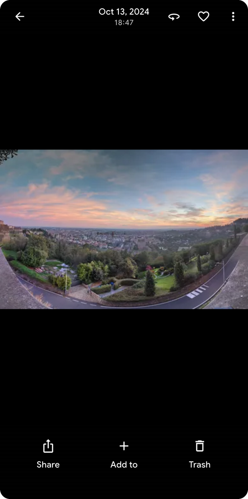 | 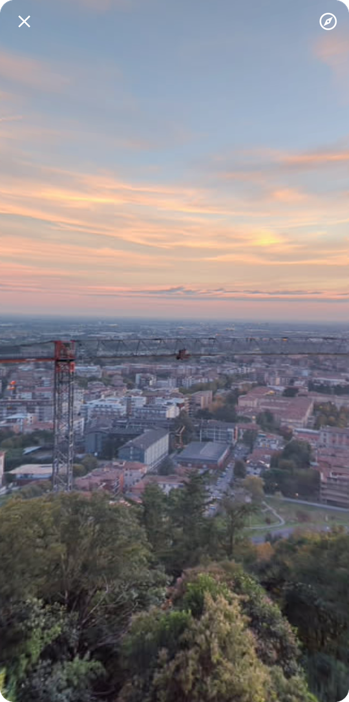 |
| A 360° photo shown flat | The same photo as a sphere you can turn, zoom, and follow with the phone's gyroscope |

| Library tab | 360° list | On an iPad | 360° list on an iPad |
|---|---|---|---|
| 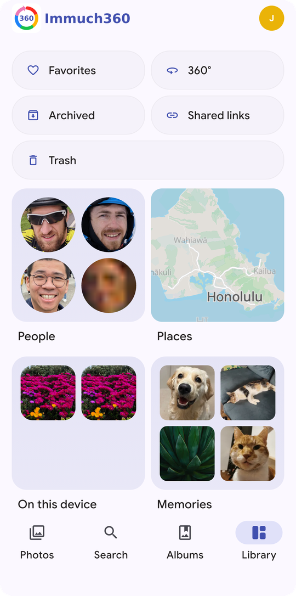 | 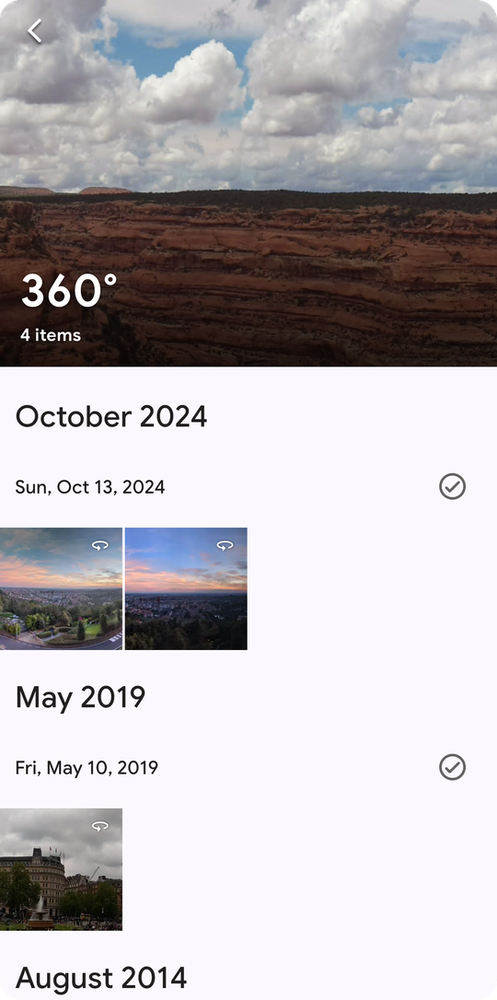 | 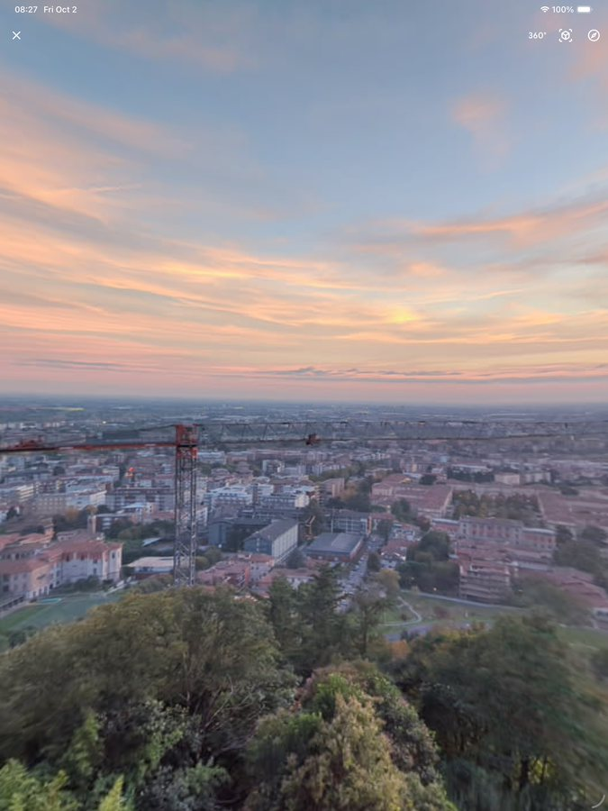 | 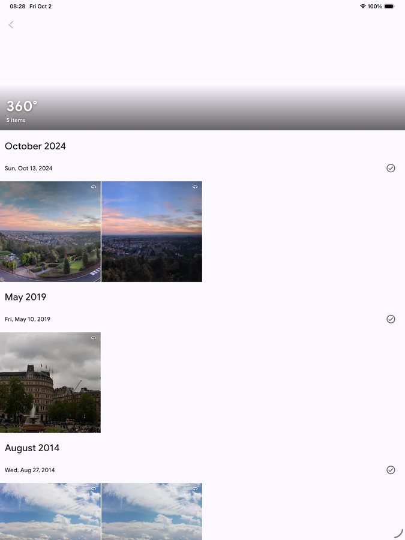 |
| A 360° entry next to Favorites | Only your 360° photos and videos, newest first | The sphere viewer on an iPad (App Store build) | The 360° list on an iPad |

- **360° photos** open as an interactive sphere: drag to look around, pinch to zoom, double tap, inertia, the initial view the camera recorded, sharper texture when zoomed in. Partial panoramas are handled.
- **Gyroscope**: turn the phone to look around (toggle in the viewer).
- **360° videos on Android and iOS**: a native spherical player with sound, drag and gyroscope; it plays the file stored on the phone when there is one, otherwise streams it from your server.
- **View as 360°**: some 360° files carry no projection tag, so the server shows them flat. The viewer menu can force the 360° view for a photo or a video; the choice is remembered on the phone and changes nothing on the server.
- **3D (stereoscopic) 360° photos and videos**: top and bottom or side by side layouts are recognised from the file (or guessed from its shape) and can be changed with the 3D button in every viewer. A phone shows the left eye; the Meta Quest 3 shows each eye its own half, in real 3D.
- **VR180 (half sphere)**: files that cover only the front half are drawn on a half sphere, with the back black instead of a stretched picture. Recognised from the file (spherical bounds or mesh, GPano crop) or from a "vr180" or "180" in the name, and switchable with a 360°/180° button in every viewer; the choice is remembered on the phone.
- **Meta Quest 3**: the same Android app runs on the headset as a window, and the 360° button switches to an immersive view where the photo or video is all around you, and you look around by turning your head.
- **Find them**: a 360° badge on thumbnails and a **360°** entry in the Library tab listing every 360° photo and video.
- **Use without a server**: on the login page, "Use without a server" opens the app on the phone's own gallery, with the 360°, 3D, VR180 and Spatial viewers and the 360° list, no Immich account needed. The server features stay hidden until you connect a server from the settings; nothing leaves the device.
- **A video player, free**: flat, 360°, 3D (side by side, top and bottom) and VR180 videos play in the native players with sound, seeking, the audio track of your choice (languages, commentary, in the 360° and Spatial players), gyroscope and head tracking, whether they come from the Immich server, the phone's own gallery or a network share. On the Meta Quest 3 this replaces the paid players of the store for your own files.
- **Network shares**: Library tab, "Network shares": add a Samba (SMB) or WebDAV share, browse its folders, and play its photos and videos live in the same viewers (360°, 3D, VR180, Spatial 2.5D, Quest immersive view), with or without an Immich server, nothing downloaded. See [Network shares](#network-shares).
- **Everything else is Immich**, unchanged: backup, timeline, albums, search, sharing, partners, all synced with your server.

## A media player too

Immuch360 is a gallery, and it is also a free media player: it plays what the official app cannot, from three sources, in the player that fits the file. On the Quest 3 the store players for 360° and 3D video are paid; this one is free and open source.

| What | Android phones | iPhone, iPad | Meta Quest 3 |
|---|---|---|---|
| Flat videos (MP4, MOV, MKV, what the device decodes) | Immich player, and a native player for network shares | Same | In the window |
| 360° photos | Sphere viewer, gyroscope | Same | Immersive, all around you |
| 360° videos | Native Media3 player on a sphere, gyroscope, seeking, audio track choice, buffering indicator | Native SceneKit player, same controls | Immersive, true 3D for stereoscopic files |
| 3D 360° (top and bottom, side by side) | Left eye, layout button | Same | Each eye gets its own half of the frame |
| VR180 (half sphere) photos and videos | Half sphere, 360°/180° button | Same | Immersive half sphere |
| Spatial 2.5D (flat screen depth from a stereoscopic video) | Native player, head tracking with the front camera | Same | Not needed, the headset is 3D |

| From | How |
|---|---|
| Your Immich server | Streams the original when the server lets it, else the transcoded stream; same account as the web app |
| The phone or headset itself | "Use without a server" on the login page, or the "On this device" entry of the Library tab |
| A NAS or a computer | Samba (SMB) and WebDAV shares, found on the network, read live over several connections, nothing copied |

| 360° photo in the headset | 360° video in the headset | 3D 360° video in the headset |
|---|---|---|
|  |  |  |
| The immersive view of a photo, with the info panel (layout, 360°/180°, Back) | A video playing, with Pause | A top and bottom stereoscopic video, each eye served (the Kandao Obsidian sample) |

Build 14 adds, in the headset, a time bar with seeking and 10 second skip buttons while a video plays, and previous/next media without leaving the immersive view (the 360° media of the timeline, the 360° list, an album, a share folder or the headset's own media). See [Meta Quest 3](#immersive-view).

## Spatial 2.5D (experimental)

A stereoscopic video can gain depth on a flat screen. The two eyes of the video give the depth, the front camera follows your head, and the app synthesises the view in between, so the screen behaves like a window on the scene: move your head and nearby objects shift against the background.

- **Formats**: side by side and top and bottom, full or half width, flat and 360°. The layout is read from the file, or chosen by hand in the player when the file does not say it.
- **How to enable**: it is on by default; the switch is in Settings, Video viewer, "Spatial 2.5D (experimental)". While it is on, a Spatial button appears in the viewer of stereoscopic videos. The camera is only used once you press that button.
- **Camera**: the front camera permission is asked only when you use the mode. Images are processed on the device only, never stored and never sent anywhere. The Quest 3 build has no camera permission at all (the headset has no camera an app may use), so the player there runs without head tracking.
- **Limitations**: experimental, phones and tablets only (not on the Meta Quest), needs OpenGL ES 3.0 or Metal. The depth is an estimate. It works best in landscape with your face well lit.
- **Fallback**: if anything goes wrong (no camera, unsupported device, unreadable layout), you are back in the normal player.

## Network shares

The photos and videos of a NAS, a computer or any server that speaks SMB (Samba, Windows) or WebDAV can be browsed and played straight from the share, with or without an Immich server, on phones and on the Meta Quest 3.

- **Add a share**: Library tab, **Network shares**, then the + button. The form first looks for the servers of your network by itself (Bonjour/mDNS and a scan of the local network, confirmed by a real SMB or WebDAV exchange) and lists them under **Found on the network**: tap one and the type, server, port and path are filled. Otherwise pick SMB or WebDAV, give the server (a name or an address; a full address such as `smb://nas/photos`, `\\nas\photos` or `https://nas:5006/photos` fills the other fields), the port if it is not the usual one, the share name (SMB) or the path (WebDAV), an optional start folder, the user name and password, and TLS for WebDAV. For SMB, **Choose a share** lists the shares of the server once the user name and password are typed. **Test** checks the connection before you save.
- **Browse**: folders first, then the photos and videos as a grid with thumbnails (a frame of each video too, cached on the device); the ones recognised as 360° carry the badge. Pull down to refresh.
- **Play**: a photo opens full screen (pinch, double tap), and its **360°** button opens the sphere viewer; a video plays in the native player with the **360°**, **3D** and **Spatial** buttons; on the Quest 3 the 360° button opens the immersive view. **View as 360°** is in the menu for files without a tag. 360°, 3D and VR180 are recognised from the GPano or spherical metadata of the file, read with range requests.
- **Nothing is downloaded**: the players read the bytes they need through a bridge inside the app (loopback address only, random token per session, byte ranges), so seeking in a video works and nothing is copied to the device. For smooth playback the share is read in large blocks, the file stays open between reads, up to 16 MB are read ahead of the player, and the video being played is read over up to six SMB connections in parallel (a Freebox Server answers each read slowly: one connection gives 4.5 MB/s, six give 19 MB/s, enough for a 5.7K export at 132 Mbit/s), separate from the connection that serves thumbnails and listings. While the player waits for data, the 360° and Spatial players show "Buffering" with the fill of their playback buffer, and the flat player shows it too.
- **Privacy**: the share list is kept on the device and never sent to a server; passwords go to the device keychain or keystore.
- **Freebox and other boxes**: a user name with an empty password is sent as such (a Freebox Server wants `freebox` and no password for its disks).
- **Limitations**: SMB 2 and 3 only (no SMB 1); WebDAV with Basic authentication (Digest is not supported yet); a self signed HTTPS certificate must be installed on the device; the network scan looks at the local /24 network only and needs the local network permission on iOS; photo thumbnails decode the whole file (none for photos over 30 MB); the audio track choice is not available in the flat player yet; no swiping from one file of a folder to the next yet, and the 3D or 180° choice made on a network file is not remembered.

## Where things are, in pictures

Screenshots from the Android build on an emulator, with synthetic test media.

| In the viewer | In the ⋮ menu |
|---|---|
| 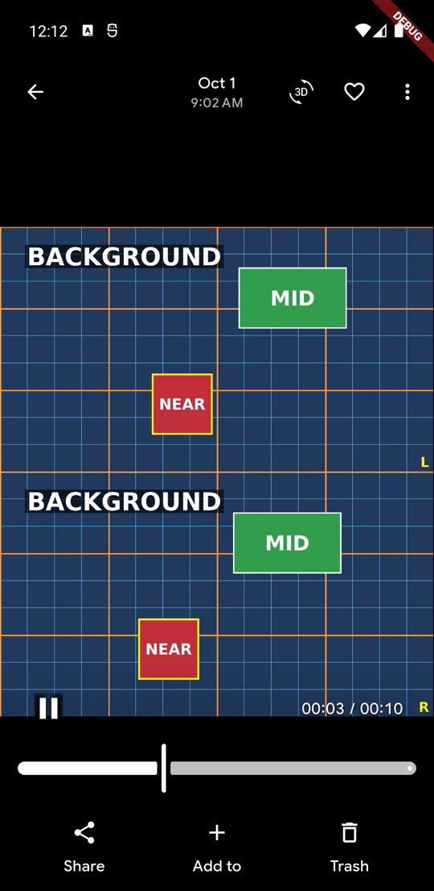 | 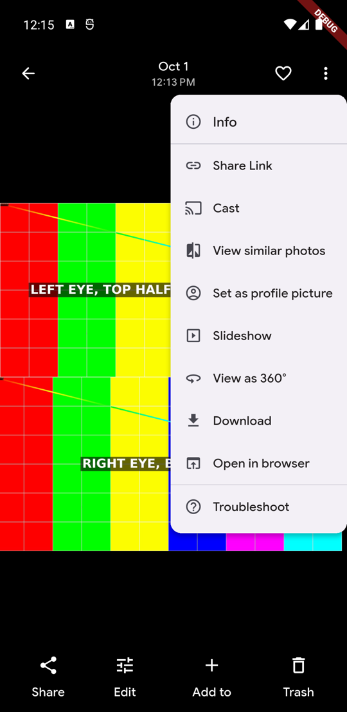 |
| The top bar of a stereoscopic video. From the left: back, date, the **Spatial** button (rotating 3D icon, only on stereoscopic videos when the setting is on), favourite, and the ⋮ menu. On a 360° photo or video the **360°** button takes the place of the Spatial one. | The ⋮ menu of a photo the server does not flag as 360°: **View as 360°** sits between Slideshow and Download. Once chosen, the entry becomes **Stop treating as 360°** and the 360° button appears in the top bar. The rest of the menu is stock Immich. |

| The sphere viewer | The settings |
|---|---|
| 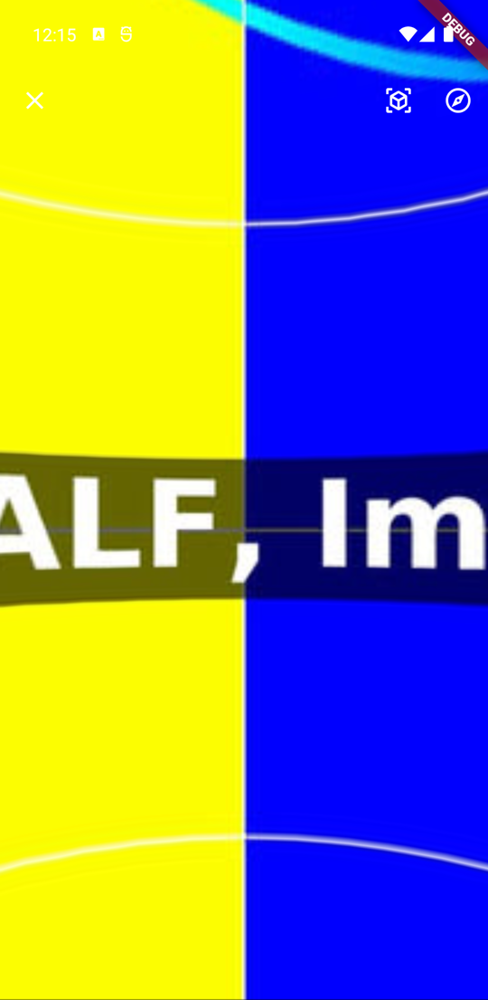 | 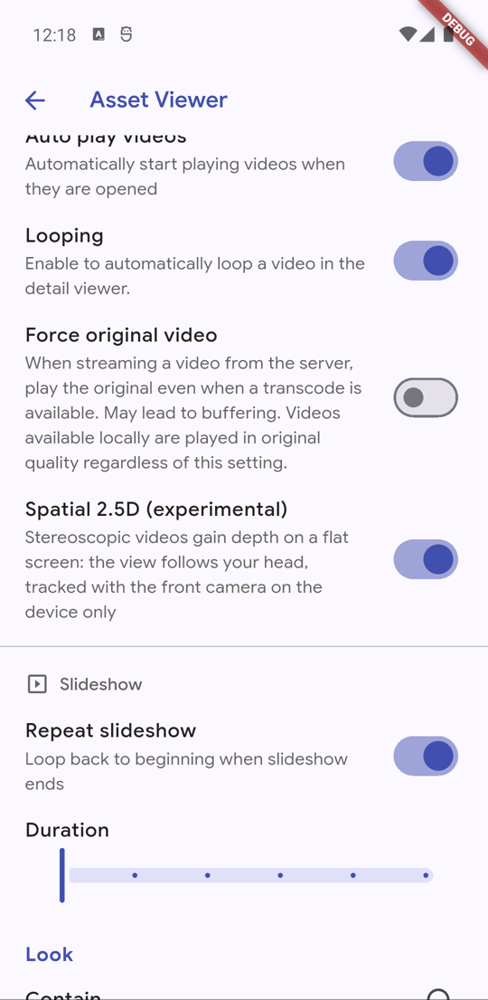 |
| A 360° photo opened as a sphere: close at the top left; at the top right the **3D** button (cycles mono, top and bottom, side by side; its label reads the current layout) and the **gyroscope** toggle. The same two buttons are in the Android and iOS 360° video players. | Settings, Asset Viewer, under the video settings: **Spatial 2.5D (experimental)**, on by default, and below it the troubleshooting overlay switch. Turning Spatial off removes the Spatial button everywhere. |

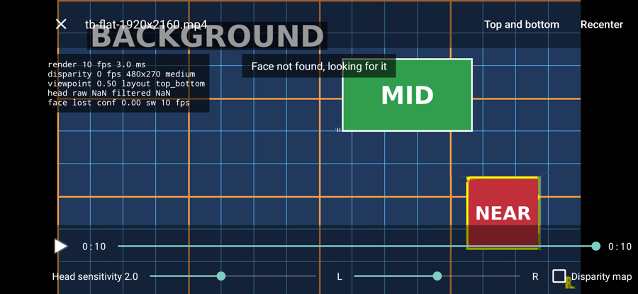

The Spatial player, here with the troubleshooting overlay on. Top right: the current **layout** (tap to cycle) and **Recenter** (takes your current head position as the centre). Bottom: play, the timeline, then the **viewpoint slider** from L to R (moves the viewpoint by hand, which also works without a camera), the **head sensitivity**, and the **Disparity map** check box that shows the estimated depth instead of the picture. The overlay at the top left lists the render and disparity rates, the quality tier, the viewpoint and the tracking state. Close with the cross or the system back.

## Where to get it

The app is on Google Play; the App Store version is waiting for Apple's review. The GitHub release is always the newest build:

| Platform | Today | Soon |
|---|---|---|
| Android phones and tablets | [Google Play](https://play.google.com/store/apps/details?id=com.aprogsys.immuch360), or the APK on the [Releases](https://github.com/freeKC/Immuch360/releases) page (take the `arm64-v8a` file for a phone when the release has one, else the universal `-release.apk`; the GitHub build is usually ahead of the store; network shares from build 9). Either way it installs next to the official Immich app (package `com.aprogsys.immuch360`). | |
| iPhone and iPad | Waiting for Apple's review. The source builds with Xcode or on Codemagic, see [Build it yourself](#build-it-yourself). | App Store, under review |
| Meta Quest 3 | The `-quest-release.apk` file of the [Releases](https://github.com/freeKC/Immuch360/releases) page (from build 7; the universal `-release.apk` works too), sideloaded in developer mode, see [Meta Quest 3](#meta-quest-3). | Meta Horizon Store, first build uploaded to the alpha channel, listing in preparation |

The App Store link will be added here as soon as the listing is published. Log in with your usual Immich server URL and account. The current build is based on Immich 3.3.0-rc.0 (Immich `main`, not a stable release yet) and was tested with an Immich 3.2 server. The APK from GitHub does not update itself: watch the Releases page, and once you have installed the app from a store, take the updates from that store. Please report problems in [Issues](https://github.com/freeKC/Immuch360/issues), not to the Immich project.

## What this fork adds compared to Immich, in detail

| Feature | Immich mobile app | Immuch360 | Status |
|---|---|---|---|
| 360° photos (equirectangular) shown as an interactive sphere | ❌ No, flat image only | ✅ **Yes**, drag to look around, pinch to zoom, partial panoramas handled (GPano crop) | Tested on a Galaxy S24+ and an iPhone 14 |
| 360° badge on thumbnails | ❌ No | ✅ **Yes** | Done |
| 360° button in the viewer top bar, zoom kept on the flat view, loading indicator | ❌ n/a | ✅ **Yes** | Done |
| Gyroscope navigation: look around by moving the phone | ❌ No | ✅ **Yes**, toggle in the 360 viewer (off by default) | Tested on a Galaxy S24+ and an iPhone 14 |
| Initial view from GPano metadata, inertia after a drag, double tap zoom, sharper texture when zoomed in | ❌ No | ✅ **Yes** | Tested on a Galaxy S24+ and an iPhone 14, device feedback welcome |
| 360° entry in the Library tab listing every 360° photo and video | ❌ No | ✅ **Yes** | Done |
| 3D (stereoscopic) 360° photos and videos, top and bottom or side by side | ❌ No | ✅ **Yes**: layout read from the file (st3d) or guessed from its shape, 3D button to change it; left eye on phones, true 3D on the Quest | Tested on an Android emulator with synthetic media; device feedback welcome |
| 360° videos played on a sphere with drag and gyroscope | ❌ No, flat video only | ✅ **Yes on Android and iOS** (native player opened by the 360° button, Media3 on Android and SceneKit on iOS; plays the file stored on the phone when there is one, otherwise streams it from your server) | Tested on a Galaxy S24+ and an iPhone 14 |
| Meta Quest 3 viewer with head tracking | ❌ No | ✅ **Yes**, the same APK opens 360 photos and videos in an immersive view (Meta Spatial SDK) | Tested on a Quest 3 |
| Spatial 2.5D for stereoscopic videos (head coupled depth on a flat screen) | ❌ No | ✅ **Yes**, experimental, on by default, switch in the settings | Experimental, feedback welcome |
| "View as 360°" for photos and videos the server does not flag as 360° | ❌ No | ✅ **Yes**, in the viewer menu, remembered on the phone | Done |
| VR180 (half sphere) photos and videos | ❌ No, stretched around the sphere | ✅ **Yes**: spherical bounds, mesh, GPano crop or file name, 360°/180° button in every viewer, remembered on the phone | Tested on an Android emulator with synthetic media; device feedback welcome |
| Use without an Immich server (local gallery, 360° detection on the device, all viewers) | ❌ No | ✅ **Yes**, from the login page; connect a server later from the settings | Tested on an Android emulator; device feedback welcome |
| Network shares: SMB (Samba) and WebDAV browsed and played live, nothing downloaded; servers found by themselves on the network | ❌ No | ✅ **Yes**: from the Library tab, every viewer, with or without a server, phones and Quest 3 | Tested against Samba and WebDAV test servers on an Android emulator; device and NAS feedback welcome |
| Media player controls: seeking, audio track choice, buffering indicator in the 360° and Spatial players; seeking and buffering in the flat player of network shares; time bar, 10 s skips, previous/next media in the Quest immersive view | ❌ n/a | ✅ **Yes**, Android, iOS and Quest 3 (immersive controls from build 14) | Done; headset feedback welcome on the immersive controls |
| Native Insta360 files (.insp, .insv, .dng dual fisheye) | ❌ Shown flat or wrongly | ❌ Server side stitching under study | Study |

The 360° photo viewer is based on the upstream pull request [immich-app/immich#31169](https://github.com/immich-app/immich/pull/31169) by dmitry-brazhenko, itself built on the prototype by bencefr in [#30192](https://github.com/immich-app/immich/pull/30192). Thanks to both.

## Why a fork

360° viewing on mobile has been requested since January 2024 and is not in the official app yet; the photo viewer is under review upstream in [#31169](https://github.com/immich-app/immich/pull/31169). This fork ships it now, gathers real device feedback, and will offer back to Immich, in small pull requests, whatever the maintainers want. The Meta Quest view relies on the Meta Spatial SDK, which is not open source, so it stays in this fork.

## Meta Quest 3

Immuch360 also runs on the Meta Quest 3 and 3S (Horizon OS v69 or later; the Horizon Store build is listed for these two only, from build 13; the universal phone APK sideloads on other Quest models, untested). The headset build only talks to servers over HTTPS, or over plain HTTP to names of the home network (`.local`, `.lan`, `.home`, `.internal`, `.home.arpa`) and to the headset itself, as the Horizon Store requires; phones keep Immich's open policy. Sideload the `-quest-release.apk` file of a release (built for the headset: 64 bit, target SDK 34, without the two permissions the Horizon Store refuses), or the universal `-release.apk`. The headset build has been uploaded to the Meta Horizon Store alpha channel; the store listing is in preparation.

### Install

1. Enable developer mode once. In the Meta Horizon phone app, open Devices, select the headset, then Headset settings, then Developer mode. This needs a developer account, which is free at developers.meta.com. You also need adb (Android SDK Platform Tools) on the computer, or SideQuest.
2. Connect the headset to a computer with a USB-C cable. In the headset, accept "Allow USB debugging".
3. Install the APK:

   ```bash
   adb devices                      # the headset must be listed as "device"
   adb install -r Immuch360-v<version>-release.apk
   ```

4. In the headset, open the Library, choose the "Unknown sources" filter, and start Immuch360.

### In the window

The whole app runs as a resizable 2D window: login, timeline, albums, search, the photo and video viewers. The gyroscope toggle of the 2D 360° viewer is hidden on the headset, because a window stays fixed in space.

### Immersive view

1. Open a 360° photo or video in the viewer.
2. Press the 360° button. The app switches to an immersive view where the media is all around you, and you look around by turning your head.
3. To go back to the window, press B or Y, or the Back button of the info panel.

| Action | Controllers | Hands |
|---|---|---|
| Back to the app | B or Y | Back button of the info panel |
| Play or pause a video | Trigger, when the info panel is hidden | Play or Pause button of the info panel |
| Show or hide the info panel | A, X, grip or menu | Menu gesture, or pinch when the panel is hidden |
| Previous or next media (from build 14) | Thumbstick left or right | Previous and Next buttons of the info panel |
| 10 seconds back or forward in a video (from build 14) | Thumbstick down or up | The two skip buttons, or drag the time bar of the info panel |
| Turn the image by 90° | Thumbstick down or up on a photo (from build 14; left or right before) | Turn button of the info panel (from build 14) |

From build 14 the info panel of a video has a time bar (position, duration, how much is buffered) with two 10 second skip buttons, and every media has Previous, Next and Turn buttons. Previous and next move through the 360° media of the place you came from, without leaving the immersive view: the timeline, the 360° list, an album, a folder of a network share, or the headset's own media in the mode without a server; flat photos and videos are skipped. When you go back to the app from the timeline, an album or the 360° list, it lands on the media you were looking at (a share folder page stays on the file you opened), and the video you opened the immersive view on resumes where it left it. The 3D layout is only on the panel's button from build 14 (it was on the thumbstick before).

### In pictures

Captures taken in the headset with the capture button (Meta button and trigger), on a Quest 3 with the mode without a server.

| The timeline | View as 360° |
|---|---|
| 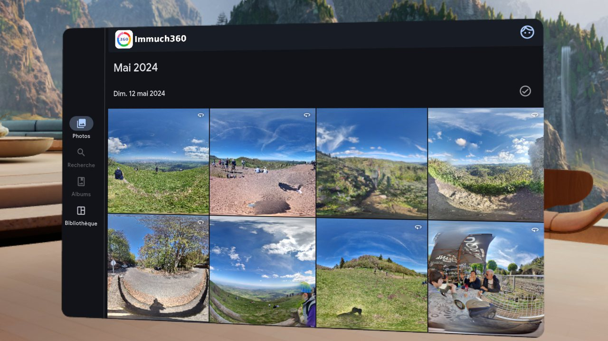 | 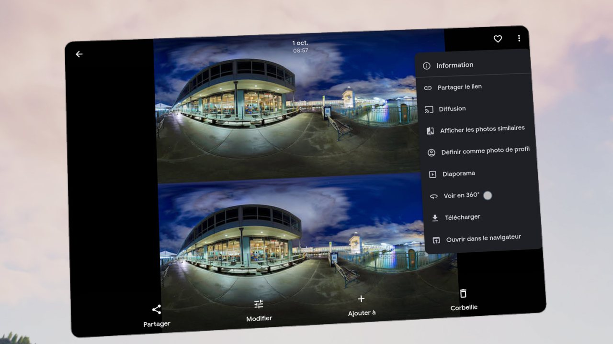 |
| The app window floating in the room, a month of 360° photos | A stereoscopic photo the server does not flag as 360°: the ⋮ menu offers View as 360° |

| Without a server | Network shares |
|---|---|
|  |  |
| The Library tab in the mode without a server: the headset's own media and the network shares | A Samba share of a Freebox Server, read live from the headset |

Photos show a preview first, then the original, downscaled to at most 8192x4096 (the app's limit). Videos play the file stored on the headset when there is one; otherwise they stream from your server: the original, or the server's transcoded version when the original cannot stream or is too large for the headset.

If the image does not face you the right way when it opens, turn it with the thumbstick until its center is in front of you. The info panel then shows "Image turned to N degrees": please post that number in an [issue](https://github.com/freeKC/Immuch360/issues), with your camera model, so that it can become the default.

### Limitations

- **Video codecs:** the H.264 hardware decoder of the Quest 3 (XR2 Gen 2) tops out around 4096x2304. A 5760x2880 H.264 video (level 6.0, about 200 Mbit/s, the usual Insta360 export) decodes at about 17 fps on the headset, with block artifacts, while the same file plays fine on a phone. The same video in HEVC (H.265) plays well on the headset. When the original is H.264 above that size, the immersive view switches to the server playback stream (the Immich transcode, when there is one), and if that one is still too large the info panel says so for 10 seconds. To give the headset a video it can decode, in Immich go to Administration, Settings, Video Transcoding Settings, and pick one of these:
  - **Every H.264 video re-encoded in HEVC:** set Video codec to HEVC and Target resolution to Original (the default 720p would shrink a 360° video to 1440x720), and keep only HEVC in Accepted video codecs. Every H.264 video of the library is transcoded, not only the 360° ones, and the headset gets HEVC at full resolution.
  - **Only what is larger than 1440p:** keep H.264 in Accepted video codecs, set Transcode policy to "Videos higher than target resolution or not in an accepted format" and Target resolution to 1440p, preferably with Video codec set to HEVC. Anything larger is transcoded and the headset gets 2880x1440. Regular 4K videos are transcoded to 1440p too.

  These settings apply to the whole server, for every user and every app, and re-encoding a large library takes hours of CPU time and extra disk space; the originals are not modified. Browsers without HEVC support (Firefox on most systems, Chrome without hardware HEVC) will not play an HEVC transcode in the Immich web app. The easiest fix for new videos is to export in H.265 from the Insta360 app or Studio. After changing these settings, the existing videos must be transcoded again: Administration, Job Queues (Jobs in older Immich versions), Transcode videos, All.

  The alternative is to re-encode the export in HEVC before uploading it:

  ```bash
  ffmpeg -i VID_360.mp4 -c:v libx265 -crf 20 -preset medium -tag:v hvc1 -c:a copy -movflags +faststart VID_360_hevc.mp4
  exiftool -overwrite_original -tagsFromFile VID_360.mp4 -XMP-GSpherical:all VID_360_hevc.mp4
  exiftool -ProjectionType VID_360_hevc.mp4        # must print: equirectangular
  ```

  `-tag:v hvc1` labels the HEVC track the way Apple devices and browsers expect, `-c:a copy` keeps the audio as it is. ffmpeg drops the 360° tag of the export, the exiftool line copies it back; without it, Immich shows the video as a flat one.
- **Originals that cannot stream:** when the server ignores HTTP Range requests on the original and the MP4 index (moov) is at the end of the file, the whole file would have to download before the first frame, so the app falls back to the server playback stream. A reverse proxy in front of Immich that buffers the responses or strips the Range headers can cause this.
- **Store:** the Horizon Store listing is being submitted (build on the alpha and production channels, screenshots and questionnaires in progress); until it is approved, sideloading.
- **Permissions:** the headset build asks only for photos and videos (the mode without a server) and notifications (backup progress). It has no storage, audio, location or camera permission, unlike the phone build; the Wi-Fi name based server switching is therefore not available on the headset.
- **3D layouts:** top and bottom and side by side 360° media are shown in 3D, each eye getting its own half of the frame. The layout is guessed from the file's shape (square: top and bottom, 4:1: side by side); when the guess is wrong, push the thumbstick up or down, or use the 3D button of the info panel, to change it.
- **Starting orientation not confirmed yet:** if a photo or video does not face you when it opens, turn it with the thumbstick and report the value (see above).
- **APK size:** the Spatial SDK adds about 56 MB of 64-bit ARM native code, on phones too, where it is never loaded.
- **License:** the immersive view uses the Meta Spatial SDK, distributed under the Meta Platform Technologies SDK License Agreement.

### Logs

The immersive view logs with the tag `Immuch360`:

```bash
adb logcat -c
# reproduce the problem, then
adb logcat -d -v time -s Immuch360
adb logcat -d -v time > quest-full.log      # everything, including crashes and decoder errors (it can contain your server address, check before sharing)
```

## Roadmap

What is planned next, in rough order. Nothing here is a promise, and feedback on the [issue tracker](https://github.com/freeKC/Immuch360/issues) helps decide what comes first.

- **Immersive view, next**: previous/next and a time bar in the 360° players of phones too (Android has the time bar already, iOS not yet), and photos in the native 360° video player.
- **Upload to Immich from a share or the device**: send the photos and videos you browse on a network share, or on the device in the Library tab, to the Immich account you are connected to.
- **App Store**: the iOS listing is under review; the link will be added here when it is live.
- **Network shares, next steps**: the audio track choice in the flat player, swiping from one file of a folder to the next, Digest authentication for WebDAV, the user name from the Bonjour record.
- **Meta Horizon Store**: the headset build is on the store's alpha and production channels and the listing is being submitted (screenshots done, permissions trimmed in build 12, questionnaires and review next), so the Quest 3 no longer needs sideloading.
- **Store listings**: the 3D, VR180 and Spatial features described on Google Play and the App Store.
- **Raw 360° camera files**: Insta360 .insp and .insv, GoPro .360, dual fisheye .dng. Stitching belongs on the server side; under study.
- **Upstream**: small pull requests to Immich for the parts the maintainers want, starting with the 360° photo viewer.

## Build it yourself

The build chain is the one of Immich mobile (Flutter 3.47, managed with [mise](https://mise.jdx.dev)):

```bash
git clone https://github.com/freeKC/Immuch360.git
cd Immuch360/mobile
mise install
mise run install
mise run codegen
flutter build apk --release --flavor phone                                   # phones, the Google Play and GitHub build
flutter build apk --release --flavor quest --target-platform android-arm64 --android-project-arg arm64only=true   # Meta Quest 3, the Horizon Store build
```

Store screenshots are taken on debug simulator builds made with `--dart-define=IMMUCH_SCREENSHOTS=true`, which only hides the debug banner. The two Android flavours are the same app. The `quest` one targets SDK 34, is 64 bit only and keeps only the permissions the headset uses (photos, videos, notifications): media management, background location, legacy storage, audio, media location, device location and camera are removed in `android/app/src/quest/AndroidManifest.xml`, because the Meta Horizon Store refuses the first two and asks for a justification of every other sensitive one; the `phone` one is what Google Play requires. iOS builds run on Codemagic (a hosted Mac) from the `codemagic.yaml` file of this repository, no Mac needed. Android release builds run on GitHub Actions (`.github/workflows/immuch360-release.yml`).

No secret lives in this repository: the Android signing key is stored as encrypted GitHub Actions secrets, and the Apple signing material is stored as encrypted variables on Codemagic. The workflow files only reference them by name.

## Branches

- `main`: mirror of Immich `main`, never modified.
- `immuch360`: the changes of this fork on top of Immich. Each release says which Immich version it is based on.

## License and trademark

This project is a fork of Immich and stays under the [GNU AGPL v3](LICENSE). Every APK, the phone ones included, also contains the Meta Spatial SDK, which is not open source (Meta Platform Technologies SDK License Agreement) and is only used on Meta Quest headsets. Immuch360 is not affiliated with, nor endorsed by, the Immich team or FUTO. For the full documentation of Immich itself, see [immich.app](https://immich.app).
