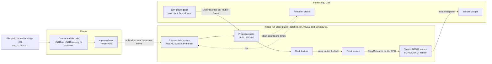

# Immuch360 Desktop: the 360° video renderer on Windows

## What it is

Immuch360 Desktop plays 360°, 180° (VR180) and 3D videos, side by side or over under, on a Windows computer, inside a
Flutter app. It also stitches raw dual fisheye videos as they play: Insta360 X3 and X4 files, and lens pairs stored in
one frame, in two tracks or in two files. libmpv decodes them, on the GPU where it can, and an OpenGL ES 3.0 pass of a
patched media_kit_video plugin draws the view straight into the texture Flutter shows.

This page is for developers who work with Flutter on the desktop, with media_kit or with mpv: why the renderer exists,
how it works, what was measured, and what can be tuned. How to use the app is in the
[README](../../README.md#on-a-windows-computer-immuch360-desktop-preview). This folder belongs to the Immuch360 fork,
not to the Immich documentation site next to it in `docs/`.

## Why it exists

Nothing ready made plays an immersive video inside a Flutter window on a desktop.

- **Flutter has no immersive video player for the desktop.** The official `video_player` has no Windows or Linux
  implementation. media_kit, built on libmpv, plays flat video on Windows, Linux and macOS with hardware decoding, and
  draws no sphere. A Flutter `Texture` cannot be the input of a `FragmentShader` or a `CustomPainter`, so the view
  cannot be projected in Dart from the video texture either.
- **The Flutter packages that play 360° video target phones.** They wrap ExoPlayer on Android and AVPlayer on iOS,
  which have no Windows version. The phone versions of Immuch360 use native players too.
- **VLC plays 360° video, in its own window.** It cannot be embedded in a Flutter app today: the Flutter binding
  `dart_vlc` was discontinued in 2022 and its repository is archived.
- **mpv can project with a user shader.** [mpv360](https://github.com/kasper93/mpv360) (MIT) is one GLSL hook at
  `MAINPRESUB` with the view as `//!PARAM` values, moved with `change-list glsl-shader-opts`. That technique was the
  first plan here, called renderer A. The measures below show why it was dropped.

### What a shader hook costs when the view moves

Under `vo=libmpv`, mpv draws through its `gpu` renderer. A `//!PARAM` value is a uniform there, but every change of
`glsl-shader-opts` reinitialises the renderer: it frees its intermediate textures and builds the hook passes again. The
log shows it plainly, with 91 "Using FBO format" lines for 90 view changes.

The measures were made on 9 October 2026 on a Windows 11 laptop with two GPUs, an Intel UHD integrated GPU and an
NVIDIA GeForce RTX 4060 Laptop GPU, with 16 GB of memory and a 2026 build of libmpv (mpv v0.41.0-1109). The clips are
synthetic equirectangular videos. The 5.7K one is H.264 (5760x2880, 30 fps, 132 Mbit/s): both GPUs leave it to the
processor, since their H.264 decoders stop at 4096 pixels. The 8K one is HEVC (7680x3840, 30 fps), decoded by the GPU.
The view changed 15, 30 or 60 times a second, as a drag does.

| GPU       | Clip       | Case                                                | Frames a second     | Other figures                                                                                                 |
| --------- | ---------- | --------------------------------------------------- | ------------------- | ------------------------------------------------------------------------------------------------------------- |
| Intel UHD | 5.7K H.264 | no hook                                             | 30.0                | 0 frames dropped                                                                                              |
| Intel UHD | 5.7K H.264 | hook, view at rest                                  | 22.8 to 25.8        | 25 to 43 frames dropped in 6 s                                                                                |
| Intel UHD | 5.7K H.264 | hook, 15 or 30 changes a second                     | 10.7 to 12.5        | mpv frame interval p50 77.7 to 91.6 ms instead of 33.3, 106 to 116 dropped in 6 s                             |
| Intel UHD | 5.7K H.264 | view moved by `video-pan-x`, which rebuilds nothing | 11.2                | 112 dropped in 6 s                                                                                            |
| Intel UHD | 5.7K H.264 | hook with `fbo-format=rgba8`                        | 22.8 to 25.3        | 28 to 43 dropped in 6 s, Flutter frame p50 37.5 to 116.6 ms                                                   |
| RTX 4060  | 8K HEVC    | hook, 15, 30 and 60 changes a second                | 30.0, 30.0 and 29.6 | Flutter frame p99 14.3 to 15.6 ms on a 120 Hz panel (budget 8.3 ms, 3.5 to 4.6 ms at rest), GPU memory stable |
| RTX 4060  | 5.7K H.264 | hook, 15, 30 and 60 changes a second                | 27.8, 17.8 and 14.8 | dedicated GPU memory 404 MB at rest, then 3845, 7292 and 7406 MB                                              |
| RTX 4060  | 5.7K H.264 | hook with `fbo-format=rgba8`                        | 30.0                | 617 MB more after 9 changes, about 70 MB a change                                                             |

Two problems show at once:

- **Memory on the dedicated GPU.** With the 5.7K clip on the RTX 4060, each view change kept 100 to 200 MB of GPU
  memory and commit charge. One second of dragging cost 3 to 6 GB, so capping the updates at 30 a second does not
  help. During that run the Windows desktop compositor (`dwm.exe`) crashed three times in three minutes, other apps
  with it, and the laptop had to be restarted.
- **The intermediate image on the integrated GPU.** As soon as a hook exists, mpv draws a full size 16 bit
  intermediate image (`rgba16f` in an OpenGL ES 3.0 context). On the Intel UHD that costs more than the projection:
  moving the view through `video-pan-x`, which rebuilds nothing, gave the same 11 frames a second.

A libmpv patched to update the uniforms without a rebuild would fix the first problem, not the second. It would also
have to be carried again at each refresh of libmpv. Renderer B, a Flutter `ImageFilter.shader` around the media_kit
texture (Impeller only), samples a frame that mpv already scaled to the texture size: at 4096 pixels wide, a 90° view
gets 1024 pixels for a window 1574 pixels wide. It stays a possible fallback for weak GPUs and is not built, because
Flutter shader assets have no per platform list and its shader would ship in the phone apps too.

So the plugin draws the view itself. This is renderer C: mpv draws each frame exactly as it would for a flat video, and
the view is a uniform of the app's own pass. Nothing of mpv changes while the view moves.

## How it works

### The context and the decoder

- **One OpenGL ES 3.0 context per player, from ANGLE.** media_kit_video creates a Direct3D 11 device on the default
  adapter, which follows the graphics preference Windows keeps for each app, and ANGLE makes a pbuffer surface over a
  shared D3D11 texture. Upstream asks ANGLE for OpenGL ES 2.0. The fork asks for 3.0 and falls back to 2.0 where the
  display refuses it, and renderer C then refuses to start, with the reason.
- **mpv draws through its render API.** `mpv_render_context_render` with `MPV_RENDER_PARAM_OPENGL_FBO` draws into a
  framebuffer of the plugin, as for a flat video.
- **Decoding.** The players ask for `hwdec=auto-safe`. With a 2026 libmpv, HEVC frames stay on the GPU (`d3d11va`) on
  both test GPUs, because mpv's d3d11egl interop imports them into ANGLE without a copy. The 2024 libmpv that media-kit
  publishes (mpv 0.39) does not find `EGL_EXT_device_query` on ANGLE's display, so it copies every hardware frame back
  to memory (`d3d11va-copy`). A size or a codec the GPU refuses is decoded by the processor (`hwdec-current` is `no`),
  as H.264 wider than 4096 pixels on both test GPUs. Raw videos in two streams always use `d3d11va-copy` or software
  decoding, since FFmpeg's `hstack` filter runs on the processor.

### The intermediate texture and the tiers

mpv draws each frame into an intermediate RGBA8 texture. Its size is the video's own, capped by a tier, with the shape
of the video kept and even sides. RGBA8 is enough: Flutter's texture is BGRA8 anyway, mpv tone maps HDR to SDR before
it draws, and it dithers to 8 bits since the plugin tells it the format.

| Tier | Intermediate texture                | Memory                        | Where it starts                                      |
| ---- | ----------------------------------- | ----------------------------- | ---------------------------------------------------- |
| Full | the video's size, at most 8192 wide | 66 MB for 5.7K, 118 MB for 8K | a dedicated GPU                                      |
| 4096 | at most 4096x2048                   | 33.5 MB                       | the step down from Full                              |
| 2880 | at most 2880x1440                   | 16.6 MB                       | an integrated GPU, or one the app does not recognise |

- **The start tier.** DXGI tells whether the adapter shares the system memory, which marks an integrated GPU. A name
  cannot: the integrated GPUs of Intel Core Ultra processors call themselves "Intel(R) Arc(TM) Graphics", as the
  dedicated Arc cards do. Where DXGI does not answer, the ANGLE renderer string decides (NVIDIA, GeForce, Quadro, RTX,
  Radeon RX, Radeon Pro, or Arc with the model number of a card).
- **Why 2880 on an integrated GPU.** The first plan was 4096. On the Intel UHD, renderer C drew a 5.7K video at 22
  frames a second at rest and 17 while dragging at the 4096 tier, against 27 and 19 at the 2880 tier. An 8K video gave
  21 at 4096 against 29 at 2880. The RTX 4060 holds 30 at Full for both.
- **When it changes.** The texture is made again only when the video's size or the tier changes, and the tier changes
  at most once a second once a frame was drawn, since mpv then draws its frame again at the new size.
- **The output.** The texture Flutter shows has the size of the view in physical pixels, at most 1440 lines high, from
  the first frame. The output follows the window, the intermediate texture follows the video and the tier.

### The projection pass

One fragment program per kind of frame draws one triangle that covers the output. The program is compiled and linked
when the projection is set, not at the first frame: a driver that refuses it is known at once, with the shader log as
the reason, and the player goes back to flat. The sources are in
[projection_shaders.h](../../mobile/packages/media_kit_video/windows/projection_shaders.h).

- **Equirectangular.** Mono, or one eye of a stereo frame (top and bottom, or side by side; the left eye by default, as
  on phones). The eye is a rectangle of the frame. The coverage is a rectangle of the sphere: the whole sphere for
  360°, its front half for VR180, with black behind.
- **Fisheye pair.** The two lenses of a raw 360° camera, with the Mei, equidistant and Kannala-Brandt lens models. It
  is the GLSL of the Android app's stitch, with the lens terms the app reads from the file's calibration. The decoded
  streams lie side by side in the frame: one stream for a file that keeps both lenses in one track, two once
  `lavfi-complex` has stacked two tracks or two files with `hstack`. A uniform turns one stream off for the one lens
  fallback.
- **GoPro EAC pair.** The two tracks of a GoPro .360, three cube faces each, side by side in the frame.

The view is yaw (positive to the right of the frame's centre), pitch (positive up) and the vertical field of view,
from 15° to 115° with 90° to start. Zooming changes the field of view. The convention is the one of the app's photo
sphere. The filter is bilinear while the view moves, then Catmull-Rom in nine bilinear reads once it has rested for
150 ms. Where the view shrinks the frame (more than 1.25 texels per output pixel), four reads per pixel replace the
bicubic one, since the intermediate texture has no mipmaps.

### From the pass to Flutter, without the processor

1. Dart sends the view at most once per Flutter frame, however fast the mouse moves. The plugin keeps at most one
   waiting draw per player, so views that come faster than the pass are merged.
2. Each draw asks mpv (`mpv_render_context_update`) whether it has a new frame. mpv draws into the intermediate texture
   only then. A paused video is redrawn from the texture kept, without any call into mpv: paused, mpv drew 0 frames
   while the view was redrawn up to 58 times a second.
3. The pass draws the view into a back texture, then `glFinish`. The back and front textures are swapped under the
   lock that Flutter's raster thread takes to read. That lock is held for the swap only: 0.01 ms at the 99th
   percentile on both GPUs, against up to 16 ms per draw when the drawing happened under it.
4. Flutter gets a `FlutterDesktopGpuSurfaceDescriptor` with a DXGI shared handle
   (`kFlutterDesktopGpuSurfaceTypeDxgiSharedHandle`, BGRA8888). When it asks for a frame, the plugin copies the front
   texture into the shared one with `CopyResource`, on the GPU. No pixel goes through the processor.
5. No swap is reported to mpv (`mpv_render_context_report_swap`). Once one is, `vo_libmpv` waits for the next before it
   hands over each frame, which put 30 to 53 frame intervals over 50 ms in 10 s into an 8K video on the RTX 4060.

The player keeps its texture id, its `VideoController` and its `Video` widget. Renderer C is turned on before the file
opens, so the first frame is already the view.

### What renderer C measured

Same laptop and clips as above, plus a synthetic 4K H.264 clip (3840x1920, 30 fps), each played at rest, while the
view turned, and paused while the view turned. The test by hand with real camera files is still to come.

| GPU       | Tier | Clip                                   | Frames a second                                                         |
| --------- | ---- | -------------------------------------- | ----------------------------------------------------------------------- |
| RTX 4060  | Full | 8K HEVC, decoded without a copy        | 30, 0 dropped while dragging, memory 8 MB higher after 30 s of dragging |
| RTX 4060  | Full | 5.7K H.264, decoded by the processor   | 30, 0 dropped                                                           |
| Intel UHD | 2880 | 4K H.264                               | 30 at rest and while dragging                                           |
| Intel UHD | 2880 | 8K HEVC, decoded without a copy        | 29.2 at rest, 28.7 while dragging                                       |
| Intel UHD | 2880 | 5.7K H.264, decoded by the processor   | 27 at rest, 19 while dragging                                           |
| Intel UHD | 2880 | 4K H.264, 2024 libmpv (`d3d11va-copy`) | 23 to 27                                                                |

### The renderer probe

The probe measures each 360° video on its own playback rather than on a test clip, since the cost depends on the video
as much as on the GPU ([renderer_probe.dart](../../mobile/lib/desktop/video/render/renderer_probe.dart)).

- **What it measures.** Over the first 5 seconds of playback, paused and buffering time left out, read once a second:
  the draws that had a new frame of mpv, against the video's frame rate (60 at most), the time each draw took, and the
  growth of the process's memory. After that, the memory again during each drag, from the drag's own start.
- **What it decides.** At 0.9 of the frame rate or more, the tier stays. Below, one tier down. At the lowest tier, below
  0.6 of the rate, the video plays flat with a message, and between 0.6 and 0.9 it plays on with the message "This
  graphics card cannot show the 360° view of this video smoothly". A memory growth over 512 MiB takes a tier down.
  Draws that fail with none that succeed, three seconds in a row, mean renderer C is refused: a tier down when the
  intermediate texture is what the driver refused, flat otherwise.
- **When the decoder is the limit.** If the processor decodes the video, or the median draw takes less than half of a
  frame's time and frames still come short, a smaller tier will not help. The page then plays the server's transcoded
  stream from where it was, with the phones' message, and nothing is kept for the renderer.
- **What it stores.** One entry per kind of video (codec, size, frame rate, decoding path), GPU (the ANGLE renderer
  string) and version of the app: the tier, the frames a second measured, `hwdec-current` and the reason of the last
  step down. At most 32 entries are kept, in `desktop_video_renderer.json` in the app's support folder
  (`%APPDATA%\com.aprogsys\Immuch360 Desktop`), not in the app's database.
- **A video that played flat is not flat from memory.** The next video of its kind starts at the lowest tier and is
  measured again, so that a busy moment does not turn the 360° view off for good.

### The decoder probe and the measured correction

The `immuch_desktop_video` package is a small FFI DLL in C++
([immuch_desktop_video.cpp](../../mobile/packages/immuch_desktop_video/windows/immuch_desktop_video.cpp)). On the
default adapter, the one mpv decodes on, it reads the Direct3D 11 decoder profiles and their output formats, checks
each frame size the way FFmpeg's d3d11va does (a decoder configuration with a raw bitstream must exist), and reads the
frame rate Direct3D 12 allows where the driver answers. It runs once per run, in a background isolate started with the
app, because Windows picks the GPU when the process starts. It took 75 to 165 ms on the test laptop. Both test GPUs decode H.264 up to 4096x4096, and the RTX 4060 HEVC
and AV1 up to 8192. The Intel UHD's driver says yes up to 16384 for HEVC and AV1, more than it plays smoothly.

That is what the measured correction is for
([decoder_measure.dart](../../mobile/lib/desktop/video/decoder_measure.dart)). After a playback has run steadily for 1
second, mpv's drop counters are read, then again 5 seconds later. The decoder mpv used (`hwdec-current`) and the frames
dropped are stored per GPU, codec, size, frame rate and number of streams, in `desktop_decoder_measures.json` in the
same folder. No file name, path or address is stored. A video keeps up when it drops at most one frame in twenty, and
never fewer than three may drop. The file keeps 100 measures, and a measure that dropped frames is tried again after 14
days. The app's decoder answers (the Video source setting, the two lens check of raw videos, the decoders page) read
it: 8K HEVC with the 2024 libmpv lost 95 of 150 frames on the Intel UHD and is marked as not keeping up.

### The fallback chain

1. Renderer C at the start tier of the GPU, then, once the first frame tells what kind of video it is, at the tier
   stored for that kind.
2. One tier down each time the probe says the current one does not keep up: Full, 4096, 2880.
3. At 2880, the view plays on with a message, or plays flat when it is far too slow.
4. A driver that refuses the view (no OpenGL ES 3.0, a pass it does not compile): the flat player, with "This computer
   cannot show the 360° view of this video: it plays flat."
5. A decoder that does not keep up with a server video: the server's transcoded stream, from where it was.
6. A raw video in two streams: both stacked in one mpv core with `lavfi-complex "[vid1] [vid2] hstack [vo]"` when this
   computer was measured to keep up, the second file of an X3 pair joining as an external track. FFmpeg pairs the
   frames of the two streams by time stamp, so the seam does not tear as with two players. Otherwise the phones' steps,
   with their messages: one lens with half of the sphere black, the server's transcoded stream, the camera's low
   resolution LRV copy when one sits next to the file, then the frame as recorded.
7. A file libmpv cannot open: the app's usual error.

On the test laptop, an X3 pair (two 2880x2880 H.264 files) stacked plays at 30 frames a second on the RTX 4060, with 0
of 150 frames dropped. The Intel UHD dropped 45 to 61 of 150, so it plays one lens, at about 30. An X4 file (two
3840x3840 HEVC tracks) stacked plays at 7 to 9 frames a second even on the RTX 4060, against 30 for one track alone,
so X4 files go straight to one lens there.

### The player pool

Players are kept and reused across pages rather than made and disposed per page
([player_pool.dart](../../mobile/lib/desktop/video/player_pool.dart)). 200 players opened and closed one after the
other left no leak on the test laptop, with the 2024 libmpv.

- **Making one costs.** Each libmpv instance starts its own core, holds a decoder, a demuxer cache of up to 256 MiB
  and, on screen, a texture. A page swiped to takes the idle player instead.
- **Disposing one costs too.** A player decoding 8K without a copy kept about 1.3 GB of GPU memory after its disposal
  (0.5 GB for 4K), at least for the 6 seconds measured, so the 360° player opens each new file on the same player. And
  with media_kit #1449, each `Player.dispose()` on Windows took a COM reference off the window's thread, which broke
  drag and drop after four. The vendored media_kit gives it back.
- **Limits.** Two players that show video, one frame grabber for thumbnails, two live camera views, one idle player
  kept per kind. A player that does not play is taken back first, and its page gets one again at the same position.
- **A lost device.** After a driver reset, a GPU switch or some sleeps, the plugin tells Dart once. The pool disposes
  that player, and the page opens its video again where it was, in a new player on a new device.

### The media bridge

libmpv is given a path of the computer, or an `http://127.0.0.1:<port>/<token>/<source>/<path>` URL of the app's
media bridge, and nothing else ([desktop_player.dart](../../mobile/lib/desktop/video/desktop_player.dart)).

- **Secrets stay in Dart.** The session token, cookies, custom headers and the server's address never reach libmpv,
  whose verbose log prints request headers and URLs. The bridge's own token is removed from every log line.
- **One trust store.** The bridge reads through the app's HTTP stack, so the certificates the user trusts in the app
  apply to video too, which FFmpeg's own TLS would not see.
- **One reader for every source.** The Immich server (the original and the transcoded stream of an asset, by range,
  nothing else), SMB, WebDAV and DLNA shares, Plex and the recordings of Tapo cameras all go through the same bridge,
  whose read ahead evens out shares that answer in bursts. The cost is one more copy in Dart: a 5.7K video at 132
  Mbit/s is 16.5 MB/s.
- **No temporary file.** Files open through mpv's `loadfile` command. media_kit's own open writes what it plays to a
  list file in the temporary folder for five seconds, which would leave the bridge token on the disk.
- **No references followed.** `access-references` is off on every player, so a playlist or a manifest found in a share
  cannot make mpv or FFmpeg fetch from other addresses.

### Without the video library

libmpv is loaded once at start, before the first page. When `libmpv-2.dll` is missing or does not load, the app starts
anyway: photos and everything else work. Where a video would play, the viewer shows a placeholder over the poster,
"Video playback comes to Immuch360 Desktop in a later version". The Linux and macOS builds, which carry no libmpv yet,
take the same path. Where libmpv loads but renderer C cannot run, the 360° player plays the video flat and says why.

## Settings and tuning

### In the app

In Settings, Advanced, turn on "Troubleshooting": a "360° video renderer" entry appears. It applies to the next 360°
video opened.

- **Automatic**, the default: the start tier of the GPU, then the tier the probe stored for that kind of video.
  Picking Automatic again, even when it is already chosen, forgets every stored measure.
- **Plugin, full size**, **Plugin, at most 4096 wide** and **Plugin, at most 2880 wide**: a forced tier, which the probe
  never moves, to compare.
- **Flat, without the 360° view**: the frame as it is.

Under it, "Measured last" names what the last 360° video got, for example "Measured last: Plugin, at most 2880 wide
(27.0 / 30 fps) on Intel(R) UHD Graphics, hwdec d3d11va-copy": copy that line into a bug report. "Video decoders of
this device", in the same page, lists what the GPU decodes. Windows picks the GPU in Settings, System, Display, Graphics.

### In the code

| What                                   | Where                                                                                                                                                                                                                                                                                                                                                                            |
| -------------------------------------- | -------------------------------------------------------------------------------------------------------------------------------------------------------------------------------------------------------------------------------------------------------------------------------------------------------------------------------------------------------------------------------- |
| The native renderer                    | [projection_renderer.cc](../../mobile/packages/media_kit_video/windows/projection_renderer.cc), [projection_shaders.h](../../mobile/packages/media_kit_video/windows/projection_shaders.h), [video_output.cc](../../mobile/packages/media_kit_video/windows/video_output.cc), [angle_surface_manager.cc](../../mobile/packages/media_kit_video/windows/angle_surface_manager.cc) |
| Its Dart calls                         | [projection_output.dart](../../mobile/packages/media_kit_video/lib/src/projection_output.dart): `VideoOutputManager.SetProjection`, `SetView` and `ProjectionStats` on the plugin's method channel, by player handle                                                                                                                                                             |
| Tiers, start tier, view updates        | [plugin_renderer.dart](../../mobile/lib/desktop/video/render/plugin_renderer.dart) (`PluginTier`, `settleDelay`)                                                                                                                                                                                                                                                                 |
| Probe thresholds                       | [renderer_probe.dart](../../mobile/lib/desktop/video/render/renderer_probe.dart) (`RendererProbeLimits`)                                                                                                                                                                                                                                                                         |
| The choice and the stored measures     | [sphere_renderer.dart](../../mobile/lib/desktop/video/render/sphere_renderer.dart), [sphere_renderer_tile.dart](../../mobile/lib/desktop/video/render/sphere_renderer_tile.dart)                                                                                                                                                                                                 |
| The 360° player page and its fallbacks | [spherical_player_route.dart](../../mobile/lib/desktop/video/spherical_player_route.dart), [projection_params.dart](../../mobile/lib/desktop/video/projection_params.dart)                                                                                                                                                                                                       |
| Raw videos in two streams              | [raw_two_streams.dart](../../mobile/lib/desktop/video/raw_two_streams.dart), [raw_two_stream_switch.dart](../../mobile/lib/desktop/video/raw_two_stream_switch.dart)                                                                                                                                                                                                             |
| mpv options, pool, decoders            | [desktop_player.dart](../../mobile/lib/desktop/video/desktop_player.dart), [player_pool.dart](../../mobile/lib/desktop/video/player_pool.dart), [gpu_decoders.dart](../../mobile/lib/desktop/video/gpu_decoders.dart), [decoder_measure.dart](../../mobile/lib/desktop/video/decoder_measure.dart)                                                                               |

| Setting                                            | Value                 |
| -------------------------------------------------- | --------------------- |
| Probe window, keep ratio, floor at the lowest tier | 5 s, 0.9, 0.6         |
| Memory growth that takes a tier down               | 512 MiB               |
| Rest before the sharper filter                     | 150 ms                |
| Decoder measure: drops that still keep up          | 1 in 20, and always 3 |
| Decoder measure: a failure is tried again after    | 14 days               |

On Windows, `mobile/test/desktop/video/plugin_shaders_windows_test.dart` compiles the three programs in ANGLE's
OpenGL ES 3.0 and checks that the equirectangular pass looks where the view looks. The measurement harness,
`mobile/integration_test/desktop_video_measure_test.dart`, plays clips in a window and records frame times, drops and
memory. `IMMUCH360_MEASURE_RENDERER=c` runs it through renderer C, and its header lists the other variables.

## Limits and what is next

- **Windows only, for now.** Linux and macOS come later. On Linux, the fork's media_kit_video carries the fix proposed
  for media_kit #1404 (hardware rendering on Flutter 3.38 and later), and renderer C would run over EGL. macOS needs a
  port of its own.
- **A Flutter package, then upstream.** Once the three systems work, the plan is to extract the renderer into a Flutter
  package of its own, and to propose to media_kit a hook where an app can add its own GL pass between mpv's frame and
  the texture Flutter shows.
- **Software decoding.** A video the GPU does not decode goes to the processor: H.264 wider than 4096 pixels on both
  test GPUs, and 8K on a GPU without an 8K decoder. The 5.7K H.264 clip plays at 30 frames a second with the RTX 4060,
  but at 27 at rest and 19 while dragging with the Intel UHD. 8K in software was not measured.
- **Integrated graphics.** The 2880 tier makes 5.7K and 8K videos softer there than on a dedicated GPU.
- **Frame time at 120 Hz.** In the first measures of renderer C on the RTX 4060, frame rate, drops, frame interval and
  memory met their targets, but Flutter's frame time at the 99th percentile stayed above the 8.3 ms of a 120 Hz panel.
- **No HDR.** The Windows embedder of Flutter has no HDR path and the texture is 8 bit BGRA: mpv tone maps HLG and PQ
  videos to SDR.
- **Raw files need both lens streams.** The two files of an X3 pair must sit together, and the Immich server refuses
  .360 and .osv uploads, so those play from the computer's folders and from shares. Stacking two streams needs the
  2026 libmpv: the 2024 one lacks `hstack` and shows one lens.
- **One eye of a 3D video**, on the screen, as on phones; true 3D is for a headset.
- **The libmpv in the ZIP.** The preview ZIPs carry media-kit's 2024 libmpv until the fork's own build is switched on
  (below). With it, the Intel UHD copies every decoded frame back to memory, which slows the 360° player there.

## Licenses and credits

- **media_kit** (MIT, [media-kit/media-kit](https://github.com/media-kit/media-kit)): `media_kit`, `media_kit_video`
  and `media_kit_libs_windows_video` are vendored from commit `c533e44` of `main` (30 August 2026). The patched
  `media_kit_video` keeps its MIT `LICENSE`, and its six patches are described in its
  [IMMUCH360-NOTE.md](../../mobile/packages/media_kit_video/IMMUCH360-NOTE.md): an OpenGL ES 3.0 context on Windows,
  the EGL display of Linux taken from GDK (#1404), a fixed texture size that stays with a cap of the output height, a
  lost Direct3D device reported to Dart, a texture no longer replaced while Flutter reads it, and renderer C itself.
  The native libraries of the Windows build are listed in [NOTICES.md](../../mobile/packages/media_kit_video/windows/NOTICES.md).
- **libmpv**, the library of [mpv](https://mpv.io), with [FFmpeg](https://ffmpeg.org) inside it. mpv is built with
  `-Dgpl=false` (LGPL 2.1 or later) and FFmpeg with `--disable-gpl --disable-nonfree --enable-version3`, so
  `libmpv-2.dll` as built is under the GNU LGPL 3 or later, loaded at run time and replaceable. Today the ZIPs carry
  media-kit's archive of 21 October 2024 (mpv v0.39.0-179-g0f78584518, FFmpeg N-117622-g8d940a07d), pinned by
  SHA-256. The fork's own build,
  [immuch360-libmpv.yml](../../.github/workflows/immuch360-libmpv.yml), compiles mpv `0b7ed670` and FFmpeg `5b9a3ad7`
  with the recipe of `Predidit/libmpv-win32-video-cmake`, every other library pinned in
  [.github/desktop/libmpv/sources.lock](../../.github/desktop/libmpv/sources.lock), and publishes the sources with each
  release. The switch `IMMUCH360_LIBMPV_FROM_CI` of `media_kit_libs_windows_video` turns it on.
- **ANGLE** (BSD-3-Clause), OpenGL ES over Direct3D 11, from `alexmercerind/flutter-windows-ANGLE-OpenGL-ES` v1.0.1,
  with SwiftShader and the Vulkan loader (Apache-2.0) and Microsoft's `d3dcompiler_47.dll`.
- **mpv360** by kasper93 (MIT) showed the shader hook technique that renderer A followed.
- **The app's own code**, the Dart side of the renderer and `immuch_desktop_video` included, is under the
  [GNU AGPL v3](../../LICENSE), like Immich.
- The libmpv build carries FreeType and libjpeg-turbo, whose licences ask for these lines. Portions of this software
  are copyright © The FreeType Project (https://freetype.org). All rights reserved. This software is based in part on
  the work of the Independent JPEG Group.

Immuch360 is an unofficial fork of Immich. It is not affiliated with, nor endorsed by, the Immich team, FUTO, the mpv
project or media_kit. Windows is a trademark of the Microsoft group of companies.
