<details><summary>🌐 <b>Schwäbisch</b> · Andre Sprocha (88)</summary><a href="../README.md">English</a> · <a href="README.af.md">Afrikaans</a> · <a href="README.ar.md">العربية</a> · <a href="README.az.md">Azərbaycanca</a> · <a href="README.be.md">Беларуская</a> · <a href="README.bg.md">Български</a> · <a href="README.bi.md">Bislama</a> · <a href="README.bn.md">বাংলা</a> · <a href="README.br.md">Brezhoneg</a> · <a href="README.bs.md">Bosanski</a> · <a href="README.ca.md">Català</a> · <a href="README.cs.md">Čeština</a> · <a href="README.cv.md">Чӑвашла</a> · <a href="README.da.md">Dansk</a> · <a href="README.de.md">Deutsch</a> · <a href="README.de_CH.md">Deutsch (Schweiz)</a> · <a href="README.el.md">Ελληνικά</a> · <a href="README.en_GB.md">English (UK)</a> · <a href="README.eo.md">Esperanto</a> · <a href="README.es.md">Español</a> · <a href="README.et.md">Eesti</a> · <a href="README.eu.md">Euskara</a> · <a href="README.fa.md">فارسی</a> · <a href="README.fi.md">Suomi</a> · <a href="README.fil.md">Filipino</a> · <a href="README.fr.md">Français</a> · <a href="README.ga.md">Gaeilge</a> · <a href="README.gl.md">Galego</a> · <a href="README.gsw.md">Alemannisch</a> · <a href="README.gu.md">ગુજરાતી</a> · <a href="README.he.md">עברית</a> · <a href="README.hi.md">हिन्दी</a> · <a href="README.hr.md">Hrvatski</a> · <a href="README.hu.md">Magyar</a> · <a href="README.hy.md">Հայերեն</a> · <a href="README.id.md">Bahasa Indonesia</a> · <a href="README.is.md">Íslenska</a> · <a href="README.it.md">Italiano</a> · <a href="README.ja.md">日本語</a> · <a href="README.ka.md">ქართული</a> · <a href="README.kab.md">Taqbaylit</a> · <a href="README.kk.md">Қазақша</a> · <a href="README.km.md">ខ្មែរ</a> · <a href="README.kmr.md">Kurmancî</a> · <a href="README.kn.md">ಕನ್ನಡ</a> · <a href="README.ko.md">한국어</a> · <a href="README.kxm.md">ภาษาเขมรถิ่นไทย</a> · <a href="README.lb.md">Lëtzebuergesch</a> · <a href="README.lmo.md">Lombard</a> · <a href="README.lt.md">Lietuvių</a> · <a href="README.lv.md">Latviešu</a> · <a href="README.mfa.md">Bahasa Melayu Kelantan</a> · <a href="README.mi.md">Te reo Māori</a> · <a href="README.mk.md">Македонски</a> · <a href="README.ml.md">മലയാളം</a> · <a href="README.mn.md">Монгол</a> · <a href="README.mr.md">मराठी</a> · <a href="README.ms.md">Bahasa Melayu</a> · <a href="README.nb_NO.md">Norsk bokmål</a> · <a href="README.ne.md">नेपाली</a> · <a href="README.nl.md">Nederlands</a> · <a href="README.nn.md">Norsk nynorsk</a> · <a href="README.pa.md">ਪੰਜਾਬੀ</a> · <a href="README.pl.md">Polski</a> · <a href="README.pt.md">Português</a> · <a href="README.pt_BR.md">Português (Brasil)</a> · <a href="README.ro.md">Română</a> · <a href="README.ru.md">Русский</a> · <a href="README.si.md">සිංහල</a> · <a href="README.sk.md">Slovenčina</a> · <a href="README.sl.md">Slovenščina</a> · <a href="README.sq.md">Shqip</a> · <a href="README.sr_Cyrl.md">Српски</a> · <a href="README.sr_Latn.md">Srpski</a> · <a href="README.sv.md">Svenska</a> · <a href="README.sw.md">Kiswahili</a> · <a href="README.ta.md">தமிழ்</a> · <a href="README.te.md">తెలుగు</a> · <a href="README.th.md">ไทย</a> · <a href="README.tl.md">Tagalog</a> · <a href="README.tr.md">Türkçe</a> · <a href="README.uk.md">Українська</a> · <a href="README.ur.md">اردو</a> · <a href="README.uz.md">Oʻzbekcha</a> · <a href="README.vi.md">Tiếng Việt</a> · <a href="README.yue_Hant.md">粵語</a> · <a href="README.zh_Hans.md">简体中文</a> · <a href="README.zh_Hant.md">繁體中文</a></details>
<p align="center">
  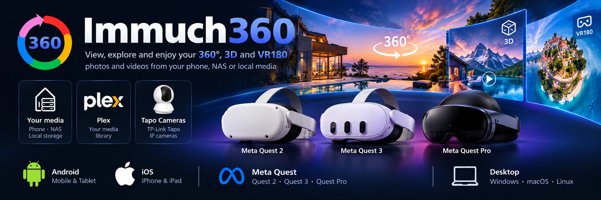
</p>

# Immuch360

Immuch360 isch d Immich-App fürs Telefon mit 360°-Fotos ond -Videos, en dene mr sich omgucka ko, ond a kostaloser Player fir flache, 360°-, 3D- ond VR180-Fotos ond -Videos, uff Android-Telefon ond -Tablets, iPhone ond iPad, uff Meta-Quest-Headsets (Quest 3 ond 3S, ond ab Build 21 Quest 2 ond Quest Pro, ungteschtet), ond ab Build 20 uff Android TV ond Google TV. Immuch360 Desktop, die gleiche App uff ma Windows-Rechner, isch als Vorschau rauskomma, guck bei [Uff ma Windows-Rechner](#on-a-windows-computer-immuch360-desktop-preview).

Se isch fir Leit, die mit ra 360°-Kamera (Insta360, GoPro MAX, DJI Osmo 360, Ricoh Theta, Samsung Gear 360) oder em Fotosphäre-Modus vom Telefon fotografieret, oder die a Headset hen, ond ihre eigene Aufnahma vom Immich-Server, vom Telefon selber, vom NAS, vom Medieserver oder vom Plex-Server aagucka wellet: gleicher Server, gleichs Konto, koi Server-Plugin, oder gar koi Server. Ab Build 20 zeigt se au Tapo-Kameras, live ond d Aufnahma vo ihrer Speicherkart.

<p align="center">
  <sub>Inoffizieller Fork. Ghört ned zu Immich ond ned zu FUTO. Dr Nama liest sich wia "I am much 360".</sub>
</p>

<p align="center">
  <a href="https://play.google.com/store/apps/details?id=com.aprogsys.immuch360"><b>Google Play</b></a> &nbsp;·&nbsp;
  <a href="https://github.com/freeKC/Immuch360/releases">Android-APK</a><br>
  App Store: <a href="#where-to-get-it">en dr Prüfong</a><br>
  Meta Quest: <a href="#meta-quest-3">APK</a>, Horizon Store freigeba, Build 21 als erschts Update eigreicht<br>
  Android TV: <a href="#install-it-on-the-tv">APK</a><br>
  Windows: <a href="https://github.com/freeKC/Immuch360/releases/tag/desktop-v3.3.0-rc.0-1">Vorschau runterlada</a>
</p>

- 🌐 **360° direkt drin**<br>Fotos ond Videos als Kugl, en dr mr sich omguckt, mit em Gyroskop, au d Rohdateia vo dr Kamera (Insta360 ab Build 16, GoPro ond DJI ab Build 18). Dazu a kostaloser Videoplayer: flach, 360°, 3D, VR180
- 👓 **3D direkt drin**<br>Stereoskopischs 360° ond VR180, oba ond onda oder nebanander, ond räumliche Fotos vo Apple (ab Build 19): echts 3D em Headset, oi Aug uffm Telefon
- 🎥 **2.5D direkt drin**<br>Diafe uff ma flacha Bildschirm aus ma stereoskopischa Video, d Aasicht folgt deim Kopf (experimentell, Telefon ond Tablets)
- 📱 **Android, iOS, Quest, TV**<br>Oi App uffm Telefon, uffm Tablet ond uff de Headsets Quest 2, Pro, 3 ond 3S, echts 3D em Headset, ab Build 20 uff Android TV mit dr Fernbedienong, ond a Vorschau fir Windows
- 🔌 **Mit oder ohne Server**<br>Dei Immich-Server, oder d Galerie vom Telefon selber, koi Konto nötig
- 🗄️ **Netzwerkfreigaba**<br>Samba (SMB), WebDAV ond, ab Build 19, DLNA-Medieserver, die em Netzwerk gfonda ond direkt glesa werdet, nix wird ronterglada, ond die an Immich gschickt werdet, wenn du des willsch. Ab Build 19 teilt a Telefon au sei eigene Galerie mit em Headset
- 📺 **Uffm Fernseher**<br>Ab Build 20 die gleiche APK uff Android TV ond Google TV: 360°-Fotos ond -Videos, dei Server ond deine Freigaba, mit dr Fernbedienong
- 🎬 **Plex, ohne plex.tv**<br>Ab Build 20 deine Plex-Bibliotheka, vo de Originaldateia abgspielt, damit 360° au 360° bleibt, drhoim ond onderwegs
- 📹 **Tapo-Kameras**<br>Ab Build 20 s Live-Bild ond d Aufnahma vo dr Speicherkart, bloß en deim Netzwerk, ond a Clip, der an Immich goht, wenn du des willsch

<details>
<summary><b>Inhalt</b></summary>

- [360°-Fotos ond -Videos als Kugl](#360-photos-and-videos-as-a-sphere)
- [Ohne Server ond ohne Konto](#without-a-server-or-an-account)
- [Netzwerkfreigaba: a NAS, a Computer oder a Medieserver](#network-shares-a-nas-a-computer-or-a-media-server)
- [Plex Media Server, ohne plex.tv](#plex-media-server-without-plextv)
- [Des Telefon em Netzwerk freigeba](#share-this-phone-on-the-network)
- [Tapo-Kameras: Live-Bild ond d Aufnahma vo dr Speicherkart](#tapo-cameras-live-view-and-the-recordings-of-the-memory-card)
- [Rohdateia vo 360°-Kameras, ohne d App vo dr Kamera](#raw-360-camera-files-without-the-cameras-app)
- [3D- ond VR180-Fotos ond -Videos](#3d-and-vr180-photos-and-videos)
- [Diafe uff ma flacha Bildschirm: Spatial 2.5D (experimentell)](#depth-on-a-flat-screen-spatial-25d-experimental)
- [Räumliche Fotos ond Videos vo Apple](#apple-spatial-photos-and-videos)
- [Em Headset Meta Quest 3](#in-the-meta-quest-3-headset)
- [Uffm Fernseher aagucka (Android TV ond Google TV)](#watch-on-your-tv-android-tv-and-google-tv)
- [Fend deine 360°-Aufnahma: d 360°-Lischte](#find-your-360-shots-the-360-list)
- [Videodetails, Decoder ond warom a Video ruckelt](#video-details-decoders-and-why-a-video-stutters)
- [Älles andre isch Immich](#everything-else-is-immich)
- [Im Vergleich mit dr Immich-App ond andre Apps](#compared-with-the-immich-app-and-other-apps)
- [Formate ond Quella, nach Plattform](#formats-and-sources-by-platform)
- [Meta Quest 3](#meta-quest-3)
- [Uff ma Windows-Rechner: Immuch360 Desktop (Vorschau)](#on-a-windows-computer-immuch360-desktop-preview)
- [Wo mr's kriagt](#where-to-get-it)
- [Selber baua](#build-it-yourself)
- [Protokoll](#logs)
- [Datenschutz](#privacy)
- [Lizenz ond Marke](#license-and-trademark)
- [Fahrplan](#roadmap)
- [Dank](#credits)

</details>

## Was für a Problem hosch?

- **"Meine 360°-Fotos sehet aus wia a flachr, auseinanderzogener Streifa, ond meine 360°-Videos laufet flach."** Guck bei [360°-Fotos ond -Videos als Kugl](#360-photos-and-videos-as-a-sphere).
- **"I han koin Server, ond i will koi Konto."** Guck bei [Ohne Server ond ohne Konto](#without-a-server-or-an-account).
- **"I will d Videos vo meim NAS aagucka, uffm Telefon oder em Headset, ohne dass i se kopier."** Guck bei [Netzwerkfreigaba](#network-shares-a-nas-a-computer-or-a-media-server).
- **"Plex spielt meine 360°-Videos flach ab, ond i will mei Plex-Bibliothek em Headset, uffm Fernseher ond onderwegs."** Guck bei [Plex Media Server, ohne plex.tv](#plex-media-server-without-plextv).
- **"Meine Fotos send uffm Telefon, ond i han koin Computer ond koi NAS, wo i se fürs Headset drufdua ko."** Guck bei [Des Telefon em Netzwerk freigeba](#share-this-phone-on-the-network).
- **"I will mei Tapo-Kamera ond d Clips vo dr letschta Nacht ohne d Tapo-App seha, ond an Clip en Immich bhalta."** Guck bei [Tapo-Kameras](#tapo-cameras-live-view-and-the-recordings-of-the-memory-card).
- **"Fir meine Insta360-Dateia brauch i d Insta360-App, bevor i se aagucka ko"** (ond fir d GoPro-.360- ond DJI-.osv-Dateia au). Guck bei [Rohdateia vo 360°-Kameras](#raw-360-camera-files-without-the-cameras-app).
- **"Meine 3D-Videos sehet doppelt aus, ond meine VR180-Videos send rondrom auseinanderzoga."** Guck bei [3D ond VR180](#3d-and-vr180-photos-and-videos) ond [Spatial 2.5D](#depth-on-a-flat-screen-spatial-25d-experimental).
- **"I han räumliche Fotos vo meim iPhone."** Guck bei [Räumliche Fotos ond Videos vo Apple](#apple-spatial-photos-and-videos).
- **"Uffm Telefon goht's, aber i will's en dr Quest."** Guck bei [Em Headset Meta Quest 3](#in-the-meta-quest-3-headset).
- **"I will meine 360°-Fotos ond -Videos, ond d Videos vo meim NAS oder meim Plex-Server, uffm Fernseher aagucka, mit dr Fernbedienong."** Guck bei [Uffm Fernseher aagucka](#watch-on-your-tv-android-tv-and-google-tv).
- **"I find meine 360°-Aufnahma zwischa älle andre ned."** Guck bei [D 360°-Lischte](#find-your-360-shots-the-360-list).
- **"Mei 360°-Video ruckelt, oder es lauft a verschwommene Kopie."** Guck bei [Videodetails ond Decoder](#video-details-decoders-and-why-a-video-stutters).
- **"I will meine 360°-Fotos ond mei Immich-Bibliothek uff meim Windows-PC, mit de Fotos aus seine Ordner, vo meim NAS ond meim Plex-Server, ond da PC mit meim Headset teila."** Guck bei [Uff ma Windows-Rechner](#on-a-windows-computer-immuch360-desktop-preview) (a Vorschau, vorerscht bloß Fotos).
- **"Bhalt i des, was d Immich-App ko?"** Ja, mit zwoi kleine Änderonga, guck bei [Älles andre isch Immich](#everything-else-is-immich).

Wenn a Funktion nei isch, schtoht em Text, ab welchem Build se drin isch. S GitHub-Release hot emmer da neieschte Build, d Stores kommet schpäter: guck bei [Wo mr's kriagt](#where-to-get-it).

<a id="360-photos-and-videos-as-a-sphere"></a>
## 360°-Fotos ond -Videos als Kugl

Du sicherscht deine Fotos uff ma [Immich](https://github.com/immich-app/immich)-Server, ond a paar dovo kommet vo ra 360°-Kamera oder vom Fotosphäre-Modus vom Telefon. En dr offizielle App fürs Telefon sehet die Bilder aus wia a flachr, auseinanderzogener Streifa, ond 360°-Videos laufet au flach. D Immich-Web-App ko a 360°-Foto als Kugl zeiga, d App fürs Telefon ned: des wird seit Januar 2024 en dr [Diskussion #6572](https://github.com/immich-app/immich/discussions/6572) gwünscht.

Immuch360 macht se als Kugl uff, en dr mr sich omguckt, uff Android- ond iOS-Telefon ond -Tablets.

A Foto dreht sich, wenn du dra ziehsch, zoomt mit zwoi Fenger oder mit Doppeltippa, dreht sich nach ma schnella Zieha no a bissle weiter, fangt bei dr Startaasicht a, die d Kamera aufzeichnet hot (GPano-Metadata), ond kriagt a schärfere Textur, wenn du neizoomsch; Teilpanoramas werdet au richtig behandelt (GPano-Zuschnitt). A Video lauft en ma eigene Kugl-Player mit Ton, Zieha ond Gyroskop.

Zammagsetzte 360°-Dateia ganget überall: Exporte aus dr Insta360-App oder em Studio, GoPro Player, Ricoh Theta ond Fotosphära vom Telefon. Rohdateia direkt aus dr Kamera setzt d App selber zamma, guck bei [Rohdateia vo 360°-Kameras](#raw-360-camera-files-without-the-cameras-app).

<p align="center">
  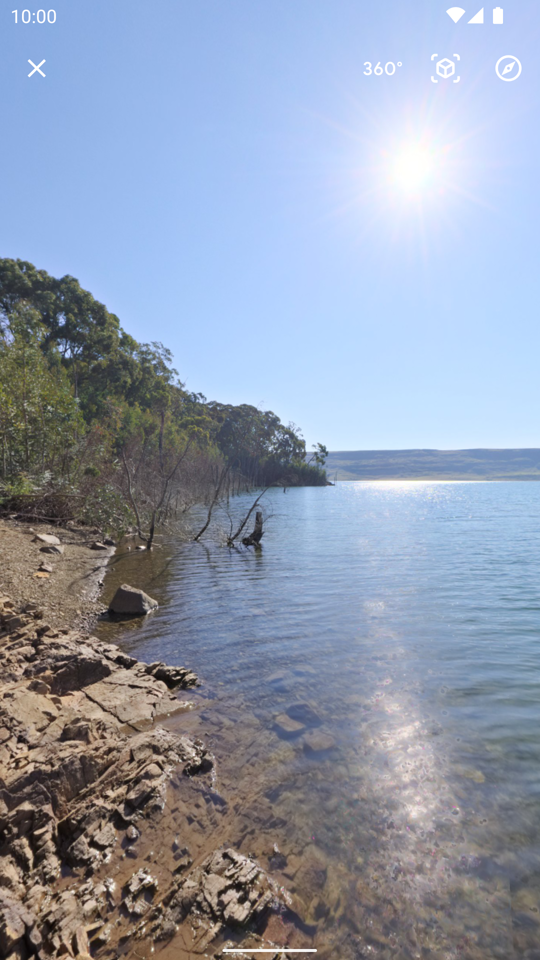
  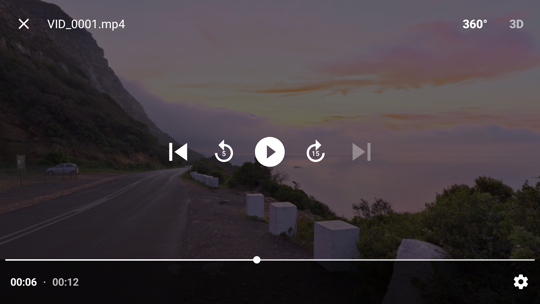
</p>

- **A 360°-Foto als Kugl**: Schließa oba links; oba rechts dr 360°/180°-Knopf, dr Knopf fürs 3D-Layout ond s Gyroskop.
- **A 360°-Video em 360°-Player**: tipp aufs Bild fir d Bedienelement; 360° ond 3D oba rechts.

### A 360°-Foto als Kugl aufmacha

1. Mach s Foto aus dr Zeitleischte, ma Album, dr [360°-Lischte](#find-your-360-shots-the-360-list) oder ma Ordner vo ra Freigab auf. 360°-Fotos hen a 360°-Abzeicha uffm Vorschaubildle.
2. Tipp oba en dr Leischte vo dr Aasicht uff 360°. D Kugl-Aasicht goht auf, mit ra Ladeaazeig, solang s ganze Bild lädt; dr Zoom vo dr flacha Aasicht bleibt.
3. Zieh, om dich omzgucka, zoom mit zwoi Fenger, tipp doppelt zom Neizooma. Nach ma schnella Zieha dreht sich d Aasicht no a bissle weiter ond wird langsamer.
4. Wenn du di durch Dreha vom Telefon omgucka willsch, tipp oba rechts uff dr Gyroskop-Knopf (standardmäßig aus).
5. D andre zwoi Knöpf oba rechts send 360°/180° (ganze Kugl oder VR180-Halbkugl, bei Teilpanoramas ned aazeigt) ond 3D (s Layout vo ma stereoskopischa Foto), guck bei [3D ond VR180](#3d-and-vr180-photos-and-videos). A rohs Insta360-Foto hot bloß s Gyroskop.
6. Mit em Kreuz oba links zuamacha.

### A 360°-Video abspiela

1. Mach s Video auf ond tipp oba en dr Leischte uff 360°. Bei ma 360°-Video kommt dr 360°-Knopf zerscht; uff Telefon ond Tablets kommt drnach dr Spatial-Knopf, solang die Eistellong a isch (guck bei [Spatial 2.5D](#depth-on-a-flat-screen-spatial-25d-experimental)).
2. Dr eigene 360°-Player goht em Vollbild auf ond spielt mit Ton: Media3 uff Android, SceneKit uff iOS.
3. Zieh, om dich omzgucka, oder beweg s Telefon. Dr Android-Player folgt emmer em Telefon; dr vo iOS hot an Gyroskop-Schalter, standardmäßig a.
4. Tipp aufs Bild fir d Bedienelement: Schließa, 360°/180° ond 3D oba, dann abspiela, d Sprungknöpf ond d Zeitleischte uff Android. Dr iOS-Player hot bis jetzt bloß abspiela ond aahalta.
5. Wenn s Video zwoi oder meh Tonspura hot (Sprocha, Kommentar), ko mr mit em Knopf Tonspur oine aussuacha. Solang s Video lädt oder hängt, zeigt dr Player "Lada" mit em Füllstand vo seim Abspielpuffer.

Dr Player spielt d Datei ab, die uffm Telefon gspeichert isch, oder d Datei vo ra Netzwerkfreigab, wenn's oine gibt. Sonscht streamt er vo deim Server: standardmäßig dr umkodierte Stream, oder s Original, wenn du des en Settings (Eistellunga), Asset Viewer (Medieaasicht), Videoquelle eistellsch (ab Build 15; vorher dr Schalter "Force original video" (Originalvideo erzwinga)), guck bei [Videodetails ond Decoder](#video-details-decoders-and-why-a-video-stutters).

### A 360°-Datei, die flach aazeigt wird: Als 360° aazeiga

Manche 360°-Dateia hen koi Projektions-Tag, drom markiert dr Server se ned als 360° ond se werdet flach aazeigt.

1. Mach s Foto oder Video auf ond tipp oba rechts uff ⋮.
2. Tipp uff "Als 360° aazeiga", zwischa Slideshow (Diashow) ond Download (Ronderlada). Dr 360°-Knopf erscheint oba en dr Leischte.
3. Zom Rückgängigmacha heißt dr gleiche Eintrag jetzt "Nemme als 360° behandla".

D Auswahl wird uffm Telefon gmerkt ond ändert nix uffm Server. Bei ra Datei vo ra Netzwerkfreigab gilt se bloß fir des oine Aagucka.

### Grenza

- **iOS-360°-Videoplayer**: abspiela ond aahalta, no koi Zeitleischte.
- **Vorigs ond Nägschts**: d 360°-Player uffm Telefon ganget no ned zom vorige oder nägschta Medium; d immersive Aasicht vo dr Quest scho.
- **Arg große Panoramas**: a Foto wird höchstens mit 8192x4096 aazeigt, dr größta Textur, die d meischta GPUs vo Telefon nemmet, drom wird a größers Panorama uff die Größe verkleinert.
- **Doppel-Fischaug als .dng**: wird emmer no flach aazeigt.

<a id="without-a-server-or-an-account"></a>
## Ohne Server ond ohne Konto

Du hosch koin Immich-Server, oder du willsch koi Konto: du willsch bloß, dass d 360°-Fotos vo deim Telefon als Kugl aufganget, die du mit em Gyroskop dreha kosch. D Immich-App will zerscht a Aameldong.

Uff dr Aamelde-Seite macht "Ohne Server nutza" Immuch360 mit de Fotos ond Videos vom Gerät selber auf, mit de Aasichta fir 360°, 3D, VR180 ond Spatial, dr 360°-Lischte ond de Netzwerkfreigaba (ab Build 20 au de Plex-Server ond de Tapo-Kameras), ohne Immich-Konto. D Server-Funktiona bleibet versteckt oder grau, bis du an Server verbindsch; nix verlässt s Gerät. Uff ra Meta Quest goht's mit de Fotos ond Videos vom Headset selber auf; uffm Fernseher, der koine hot, zeigt se uff d Netzwerkfreigaba (guck bei [Uffm Fernseher aagucka](#watch-on-your-tv-android-tv-and-google-tv)).

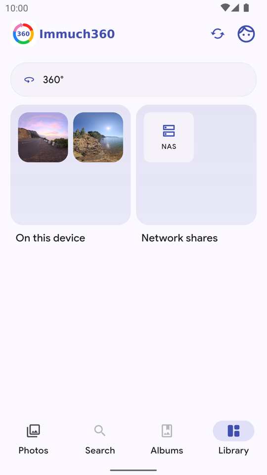

### Ohne Server aafanga

1. Mach d App auf. Uff dr Aamelde-Seite, onder dr Serveradress ond Settings, tipp uff "Ohne Server nutza".
2. Erlaub dr Zuagriff uff deine Fotos ond Videos. Wenn du's ablehnsch, sagt d App "D'App ko d'Fotos vo dem Gerät ned seha", mit "Zuagriff erlauba" ond "Eistellunga aufmacha".
3. Dr Reiter Photos (Fotos) zeigt d Zeitleischte vom Gerät. Search (Sucha) ond Albums (Alba) bleibet grau, weil se vom Server kommet. Dr Reiter Bibliothek hot 360° ganz oba, dann On this device (Uff dem Gerät) (d Alba vom Gerät) ond Netzwerkfreigaba.
4. S Menü oba rechts sagt "Bloß des Gerät": d App zeigt d Fotos ond Videos vo dem Gerät, nix wird irgendwohi gschickt.

### Schpäter an Server verbinda

1. Mach Settings auf (s Menü oba rechts, dann Settings). Dr erschte Eintrag isch "Mit ma Server verbinda", "Mit ma Immich-Server synchronisiera zom Sichera, Sucha ond Teila". S Menü oba rechts hot da gleicha Eintrag.
2. Meld di aa wia emmer. D Zeitleischte, d Alba, d Sicherong ond d andre Server-Funktiona tauchet auf.

### Grenza

- **D Galerie vom Gerät selber**: d App zeigt d Fotos ond Videos aus dr Galerie vom Gerät. Uffm iPhone überspringt d Suche nach 360°-Dateia die, wo bloß en dr iCloud liegat, bis se uffs Gerät ronterglada send.
- **Ohne Server** hot d 360°-Lischte des, was d Suche uffm Gerät gfonda hot, ond d Dateia, die du als 360° aazeiga willsch, guck bei [D 360°-Lischte](#find-your-360-shots-the-360-list).

<a id="network-shares-a-nas-a-computer-or-a-media-server"></a>
## Netzwerkfreigaba: a NAS, a Computer oder a Medieserver

Deine 360°-Videos liegat uff ma NAS oder ma Computer, ond du willsch se uffm Telefon oder em Headset aagucka, ohne se vorher zom kopiera. Fürs Headset kopieret d Leit am End jede Datei übers Kabel; Medieserver wia Plex ond Jellyfin spielet 360°-Videos flach ab, wia's en de Wünsch en ihre Foren schtoht; d Immich-App liest bloß dein Immich-Server.

Immuch360 durchsucht ond spielt d Fotos ond Videos vo jedem Server ab, der SMB (Samba, Windows), WebDAV oder, ab Build 19, DLNA/UPnP schwätzt (a Medieserver: Jellyfin, minidlna, Gerbera, Emby, a NAS oder a TV-Box), direkt vo dr Freigab. Ab Build 20 hot a Plex Media Server an eigena Typ, guck bei [Plex Media Server, ohne plex.tv](#plex-media-server-without-plextv).

D App findet d Server en deim Netzwerk selber ond spielt d Dateia direkt en de gleiche Aasichta ab wia dr Rescht vo dr App (360°, 3D, VR180, Spatial 2.5D, immersive Aasicht vo dr Quest), mit oder ohne Immich-Server, uffm Telefon ond uff dr Meta Quest 3. Nix wird ronterglada. Wenn a Server verbonda isch, kennet d Dateia, die du aussuachsch, an dei Immich-Konto gschickt werda (ab Build 15).

<p align="center">
  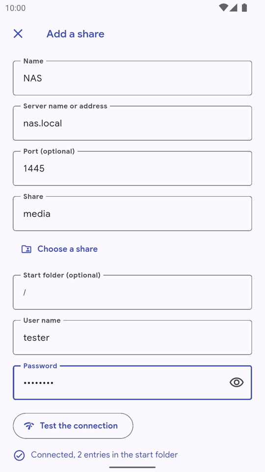
  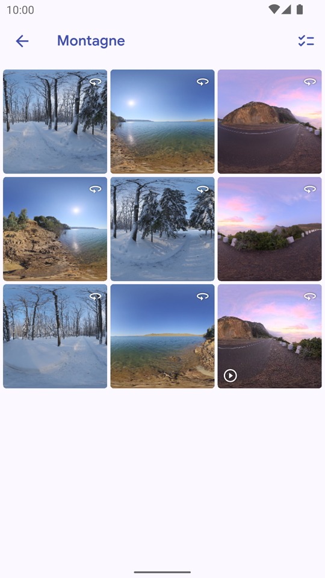
</p>

- **A Freigab hinzufüega**: d Felder vo ra neie SMB-Freigab, nach Verbindong teschta.
- **A Ordner vo ra Freigab**: 360°-Fotos ond a Video, direkt vo dr Freigab glesa.

### A Freigab hinzufüega

1. Mach da Reiter Bibliothek auf, dann Netzwerkfreigaba. S erschte Mol sagt d Seite "No koi Freigab" mit ma Knopf "A Freigab hinzufüega"; + oba rechts macht jederzeit s Gleiche. Ab Build 20 froget beide, was du dazuamacha willsch: "A Netzwerkfreigab (NAS, Computer, Medieserver)", "A Plex Media Server" oder "A Tapo-Kamera". Nemm s Erschte.
2. D Seite "A Freigab hinzufüega" sucht zerscht d Server en deim Netzwerk ond listet se onder "Em Netzwerk gfonda" auf, mit ihrem Typ (SMB, WebDAV, DLNA, Telefon, ond ab Build 20 Plex ond Tapo). D Suche dauert bis zu ongefähr sechs Sekonda; "Nomol sucha" fangt se nei aa. Se nemmt Bonjour/mDNS ond an Scan vom lokala Netzwerk, der durch an echta SMB- oder WebDAV-Austausch bschtätigt wird, ab Build 19 a SSDP-Suche nach DLNA-Medieserver, ond ab Build 20 GDM, d Suche vo Plex, ond s Suchprotokoll vo TP-Link fir d Tapo-Kameras.
3. Tipp uff an Server: Typ, Server, Port ond Pfad werdet eitraga. A Plex-Server oder a Tapo-Kamera macht stattdessa sei eigene Seite auf, scho ausgfüllt.
4. Ned en dr Lischte? Füll s Formular vo Hand aus. Typ: "SMB (Samba, Windows-Freigab)", "WebDAV (Nextcloud, Synology ond andre)", "DLNA-Medieserver (Jellyfin, NAS, TV-Box)" oder, ab Build 20, "Plex Media Server", des d Seite vo [Plex Media Server, ohne plex.tv](#plex-media-server-without-plextv) aufmacht. Dann Nama, "Servername oder Adress" (a Nama oder a Adress; a vollschtändige Adress wia `smb://nas/photos`, `\\nas\photos` oder `https://nas:5006/photos` füllt d andre Felder aus), "Port (optional)", wenn's ned dr übliche isch, "Freigab" fir SMB oder "Pfad vo dr WebDAV-Adress" fir WebDAV, "Startordner (optional)", "Benutzernama" ond "Passwort", ond "Sichere Verbindong (HTTPS)" fir WebDAV.
5. SMB: sobald Server ond Benutzernama eitippt send, listet "A Freigab aussuacha" d Freigaba vom Server auf.
6. DLNA: a Medieserver hot koin Benutzernama ond koi Passwort. Gib da Server, da Port ond da "Beschreibungspfad" vo seiner Gerätebeschreibong aa (`/rootDesc.xml` fir minidlna), oder füg die ganze Adress, wia `http://192.168.1.10:8200/rootDesc.xml`, ens Serverfeld ei.
7. Tipp uff "Verbindong teschta". D Antwort isch "Verbonda, N Eiträg em Startordner", oder es schtoht do, warom's ned klappt hot. Dann tipp onda em Formular uff Speichera.

A Benutzernama mit ma leera Passwort wird so gschickt: a Freebox Server will fir seine Platta `freebox` ond koi Passwort. Om a Freigab schpäter zom ändera oder zom lösche, nemm dr Bleistift drneba uff dr Seite Netzwerkfreigaba.

### Durchsucha ond abspiela

1. Tipp uff a Freigab. Zerscht kommet d Ordner, dann d Fotos ond Videos als Raster mit Vorschaubildla (au a Bild aus jedem Video, uffm Gerät zwischagspeichert). Die, wo als 360° erkannt werdet, hen s 360°-Abzeicha, ond ab Build 19 hen räumliche Fotos ond Videos vo Apple a 3D-Abzeicha. Zieh noch onda zom Aktualisiera.
2. Tipp uff a Foto: es goht em Vollbild auf (zwoi Fenger, Doppeltippa), ond sei 360°-Knopf macht d Kugl-Aasicht auf.
3. Tipp uff a Video: es lauft em eigene Player (abspiela, aahalta, spula), mit ma 360°-Knopf, der da 360°-Player mit seine 3D- ond 360°/180°-Knöpf aufmacht, ond uffm Telefon mit ma Spatial-Knopf fir stereoskopische Dateia.
4. Uff ra Quest macht dr 360°-Knopf d immersive Aasicht auf, ond ab Build 19 macht "En 3D aagucka" a räumlichs Foto vo Apple en 3D auf.
5. S Menü ⋮ hot "Als 360° aazeiga" fir Dateia ohne 360°-Tag, ond uffm Telefon "Spatial 2.5D" fir Videos, die ned stereoskopisch send.

360°, 3D ond VR180 werdet aus de GPano- oder Kugl-Metadata vo dr Datei erkannt, die mit Bereichsaafroga (range requests) glesa werdet, ond VR180 au am Dateinama. Ab Build 16 werdet au rohe Insta360-Dateia erkannt (a .insp-Foto am Nama oder am Kalibrierongsblock vo dr Kamera, a .insv-Video am Nama ond am Bild) ond zammagsetzt.

<a id="send-files-of-a-share-to-immich"></a>
### Dateia vo ra Freigab an Immich schicka

Ab Build 15, wenn du mit ma Server verbonda bisch:

1. En ma Ordner vo ra Freigab drück lang uff a Foto oder Video, oder tipp oba rechts uff Auswähla.
2. Kreuz a, was du willsch, oder nemm "Älle Fotos ond Videos vo dem Ordner auswähla".
3. Tipp uff "Zu Immich hochlada". D Dateia werdet oine nach dr andre vo dr Freigab zu deim Server gstreamt, mit em Fortschritt uff jeder Kachel, ond onda a Leischte, wo "3 vo 12 werdet gschickt" schtoht, mit ma Knopf Cancel (Abbrecha). Lass d App offa, solang se schickt.
4. Am End sagt d App, wie viel gschickt worra send ond wie viel scho uffm Server waret: dr Server bhält sei eigene Kopie ond sortiert doppelte Dateia aus, die er scho hot. Dateia, die scho früher gschickt worra send, hen a Markierong ("Scho früher an Immich gschickt") ond werdet s nägschte Mol übersprunga.

A offes Foto oder Video vo ra Freigab hot da gleicha Eintrag en seim Menü. Ohne Server sagt d Seite "Verbind di mit ma Immich-Server zom Hochlada". Fotos ond Videos vom Gerät werdet gnauso vom Reiter Bibliothek aus gschickt: On this device, a Album, auswähla, "Zu Immich hochlada", au die aus Alba, die ned en dr Sicherongsauswahl send; wenn se gschickt send, zählet se als gsichert.

### Wia's ohne Ronderlada lauft

D Player leset d Bytes, die se brauchet, über a Brück en dr App (bloß Loopback-Adress, Zufalls-Token pro Sitzong, Byte-Bereich), drom goht s Spula em Video ond nix wird uffs Gerät kopiert. D Player ond d Aasicht em Headset kriaget nie d Adress vo dr Freigab, bloß 127.0.0.1 vo dr Brück; d Aafroga an da Server macht d App selber.

Damit's flüssig lauft, wird d Freigab en große Blöck glesa, d Datei bleibt zwischa de Lesevorgäng offa, bis zu 16 MB werdet em Player vorausglesa, ond s Video, des grad lauft, wird über bis zu sechs SMB-Verbindonga parallel glesa, getrennt vo dr Verbindong fir d Vorschaubildla ond d Lischta. A Freebox Server antwortet uff jeden Lesevorgang langsam: oi Verbindong gibt 4,5 MB/s, sechs gebet 19 MB/s, des langt fir an 5.7K-Export mit 132 Mbit/s.

Solang dr Player uff Data wartet, zeiget dr 360°- ond dr Spatial-Player "Lada" mit em Füllstand vo ihrem Abspielpuffer; dr flache Player zeigt "Lada" ohne Prozent, solang s Video lädt oder hängt.

### DLNA-Medieserver

Ab Build 19 schickt d App d SSDP-Suche nach Medieserver an d Multicast-Gruppe vom Netzwerk, ond dia gleiche Aafrog an da Port 1900 vo jeder Adress vom lokala /24-Netzwerk, liest dann d Gerätebeschreibong vo jedem Server, der antwortet, ond bhält die, wo ihren Inhalt veröffentlichet (a ContentDirectory).

Ordner ond Dateia werdet mit dr Browse-Aktion vom Server aufglistet, Seite für Seite, ond nach ihre Titel benannt: a Datei kriagt d Endong vo ihrem Typ, wenn ihr Titel koine hot, ond a zwoite Datei mit em gleicha Titel en ma Ordner wird zu `name (2)`. Audio bleibt drauß. D Vorschaubildla send s Albumcover oder d kleine Bilder, die dr Server macht, glada vo dr App selber, ond s eigene Vorschaubildle vo dr App, wenn dr Server koins hot. A Datei lauft vom Original, des dr Server aabietet, ond ned vo ra umgwandelte Kopie, wenn er beides aabietet, glesa mit Bereichsaafroga, drom goht s Spula.

Prüft mit minidlna ond Gerbera; d Suche en ma echta Netzwerk, Plex, Jellyfin, a NAS, dr Freebox Server, a iPhone ond d Quest send dr Gerätetescht vo Build 19.

<a id="a-share-that-moved"></a>
### A Freigab, die omzoga isch

Ab Build 19 bhaltet a DLNA-Freigab ond a Telefon-Freigab (guck bei [Des Telefon em Netzwerk freigeba](#share-this-phone-on-the-network)) d ID, die ihr Server aakündigt. Wenn oine nemme onder ihrer Adress antwortet (a neie Adress vom Router, a Server, der uff ma andre Port nei gstartet isch), zeigt ihr Ordnerseite "Such (Nama) em Netzwerk" ond verlegt d Freigab dohi, wo se jetzt antwortet: sofort bei ma DLNA-Server, der koi Passwort hot, ond nach ra Bschtätigong, "Die neie Adress nemma?", die beide Adressa zeigt, bei ra Freigab mit Benutzernama ond Passwort, weil die an die neie Adress gschickt werda dätet.

Ab Build 20 zieht au a Plex-Server, der onder ra andre Adress em Netzwerk wieder gfonda wird, sofort mit om: sei Zertifikat beweist, dass es dr gleiche Server isch, bevor s Token gschickt wird. A Tapo-Kamera wird vo ihrer eigene Seite aus über ihre MAC-Adress gsucht, guck bei [Tapo-Kameras](#tapo-cameras-live-view-and-the-recordings-of-the-memory-card).

### Grenza

- **SMB**: bloß SMB 2 ond 3, koi SMB 1.
- **WebDAV**: bloß Basic-Aameldong (Digest goht no ned); a selbersignierts HTTPS-Zertifikat muss uffm Gerät installiert sei.
- **Server fenda**: dr Netzwerkscan ond d DLNA-, Plex- ond Tapo-Suche guckat bloß em lokala /24-Netzwerk ond brauchet uff iOS d Berechtigong fürs lokale Netzwerk. Uffm iPhone ond iPad schickt d DLNA-Suche bloß d Unicast-Aafroga, bis Apple dr App d Multicast-Berechtigong (Entitlement) gibt, ond manche Server antwortet do ned druff (minidlna uff Linux): füg die über ihre Beschreibongsadress hinzu.
- **DLNA**: a Server, der bloß a umgwandelte Kopie vo ra Datei aabietet, liefert die Kopie; a Ordner listet höchstens 20.000 Eiträg auf.
- **Vorschaubildla**: Vorschaubildla vo Fotos dekodieret d ganze Datei, ond Fotos über 30 MB kriaget koins.
- **Player**: d Auswahl vo dr Tonspur isch no ned em flacha Player. Uffm Telefon ko mr no ned vo oiner Datei vom Ordner zur nägschta wischa (d immersive Aasicht vo dr Quest hot vorigs ond nägschts fir d 360°-Dateia vom Ordner). D Wahl vo 3D oder 180° bei ra Netzwerkdatei wird ned gmerkt.
- **Hochlada**: lauft bloß, solang d App offa isch, ond a Datei, die dr Server scho hot, wird ganz gschickt, bevor dr Server se als doppelt meldet.

<a id="plex-media-server-without-plextv"></a>
## Plex Media Server, ohne plex.tv

Deine Videos send en Plex, ond Plex zeigt deine 360°-Fotos ond -Videos flach aa, wia's en Wünsch en seim Forum schtoht (oiner isch seit 2017 offa). Du willsch die Bibliothek au em Headset, uffm Fernseher ond onderwegs. D Immich-App liest bloß dein Immich-Server, ond dr DLNA-Typ vo Build 19 kommt bloß drhoim an d DLNA-Seite vo Plex na.

Ab Build 20 koppelt sich Immuch360 direkt mit deim Plex Media Server, ohne plex.tv: d App findet da Server em Netzwerk, du fügsch oimol a Token ei, ond d App liest d Originaldateia vo deine Bibliotheka direkt, en jeder Aasicht vo dr App (360°, 3D, VR180, Spatial 2.5D, d immersive Aasicht vo dr Quest, d Fernbedienong vom Fernseher), drhoim ond, über dei Portweiterleitong, au onderwegs. Nix wird kopiert, ond d Dateia, die du aussuachsch, kennet an Immich gschickt werda.

### A Plex-Server dazuamacha

1. Mach da Reiter Bibliothek auf, dann Netzwerkfreigaba, dann + ond "A Plex Media Server". Dr Typ "Plex Media Server" em Freigab-Formular, ond a Server mit em Plex-Schild onder "Em Netzwerk gfonda", machet die gleiche Seite auf.
2. D Seite "A Plex-Server dazuamacha" sucht d Plex-Server en deim Netzwerk ("Such noch Plex-Server en deim Netzwerk") ond listet se onder "Em Netzwerk gfonda" auf. Tipp uff dein: a Karte zeigt sein Nama, sei Plex-Version ond a kurze ID.
3. Ned en dr Lischte? Gib sei "Serveradress" ei, wia `192.168.1.20`, `192.168.1.20:32400` oder `https://...plex.direct:32400`, ond tipp dann uff "Nochgucka". D App liest s Zertifikat vom Server ond schickt sonscht nix.
4. Hol dr s Token, uff ma Computer: mach Plex en ma Webbrowser auf ond meld di a, mach irgend a Foto oder Video aus deiner Bibliothek auf, dann "...", "Get Info", "View XML". A neis Tab goht auf mit ra Adress, wo uff `X-Plex-Token=...` aufhört. Kopier die ganze Adress.
5. Füg se en "Zugriffstoken" ei, oder schick se ans Telefon ond tipp uff "Aus dr Zwischaablag eifüga": d App holt sich dr Server ond s Token drausa. Bloß dr Text noch `X-Plex-Token=` goht au. "So kriagsch's", uff dr Seite, sagt s Gleiche; Server-Admins kennet au da Wert `PlexOnlineToken` aus dr Datei `Preferences.xml` vom Server nemma, der ned abläuft. Uffm Fernseher macht OK da Tastatur-Dialog auf: tipp s Token do ei (meischtens isch's 20 Zeicha lang).
6. Tipp uff "Verbindong teschta". D Antwort isch "Verbonda: N Bibliotheka", oder se sagt, was ned stimmt, wia "Dr Plex-Server hot des Token ned gnomma."
7. "Zugriff vo außerhalb" zeigt dann, was dr Server sagt: "Dr Server sagt, er isch onter (Adress):(Port) erreichbar.", oder "Dr Server hot sei Adress außerhalb vo drhoim ned gsagt." Om da Server onderwegs zom nutza, gib dei öffentliche Adress oder dein DynDNS-Nama en "Adress außerhalb vo drhoim (IP oder Nama)" ei, ond da Port, der en Plex weitergleitet wird (Eistellunga, Fernzugriff), en "Port außerhalb vo drhoim". Was du eigibsch, gwinnt emmer gega des, was dr Server sagt.
8. "Nama" isch dr Nama vom Server, wenn du'n ned änderscht, ond "Startordner (optional)" ko direkt a Bibliothek aufmacha. Tipp uff Speichera. Dr Server schtoht no bei de Freigaba, als `plex://` mit seiner Adress.

### Deine Plex-Bibliotheka durchsucha

1. Tipp uff da Server en Netzwerkfreigaba. D erschte Ebene listet d Bibliotheka auf, die d App zeigt: Fotos, Filme ond andre Videos, Serien. Musik bleibt draußa.
2. Onder ra Bibliothek kommet ihre Ordner so, wia se uff dr Platte vom Server send (d Aasicht "by folder" vo Plex), dann d Fotos ond Videos onder ihre Dateinama, mit de Vorschaubilder, die Plex macht. A Fotobibliothek, deren Ordneraasicht ned antwortet, zeigt stattdessa ihre Alba.
3. 360° ond 3D werdet erkannt, indem d Dateia selber glesa werdet, wia uff jeder Freigab: 360°-Fotos kriaget s 360°-Schild, räumliche vo Apple s 3D-Schild.
4. Mach a Foto oder Video auf wia uff jeder Freigab: 360°, 3D, 360°/180°, Spatial 2.5D uffm Telefon, d immersive Aasicht en dr Quest, d Fernbedienong uffm Fernseher. A Video wird als Originaldatei glesa, mit Byte-Bereich über d lokale Brück vo dr App, drom goht s Spula ond seine 360°- ond 3D-Metadata kommet heil bei de Player aa.
5. Wähl Dateia aus ond tipp uff "Zu Immich hochlada", om se an dein Server zom schicka, wia vo jeder Freigab (guck bei [Dateia vo ra Freigab an Immich schicka](#send-files-of-a-share-to-immich)).

### Onderwegs

Jedes Mol, wenn se da Server aufmacht, probiert d App zerscht d Adress drhoim ond, 400 ms schpäter, d Adress außerhalb vo drhoim. Die erschte, die mit deim Server antwortet, wird gnomma; wenn's d Adress außerhalb vo drhoim isch, zeigt d Ordnerseite a Globus-Symbol mit "Über d Adress außerhalb vo drhoim verbonda".

Dafür muss en Plex dr Fernzugriff eigschaltet sei (Eistellunga, Fernzugriff), mit ma Port, den dei Router weiterleitet: ohne plex.tv ko d App s Relay vo Plex ned nutza, drom goht a Server ohne Portweiterleitong bloß drhoim auf, ond onderwegs sagt d Seite "Dei Plex-Server isch außerhalb vo deim Hoimnetzwerk ned erreichbar. Schalt en Plex dr Fernzugriff mit ra Portweiterleitong ei (Eistellunga, Fernzugriff), oder gib sei öffentliche Adress ei."

D Adress, die dr Server sagt, wird bei jeder Verbindong drhoim nei glernt. Wenn se vo draußa ned antwortet (a Router, der sei Adress wechselt, zwoi Router hinteranander), gib dei eigene uff dr Seite vom Server ei. Wenn s Token nemme goht (zom Beispiel, weil du di vo dr Browsersitzong abgmeldet hosch, aus dr du's kopiert hosch), sagt des d Ordnerseite ond bietet "A neis Token eifüga" aa, des d Seite vom Server beim Token-Feld aufmacht.

### Em Vergleich mit Plex ond mit em DLNA-Typ

- **D Originaldateia**: d App liest d Dateia selber, nie a Kopie, die Plex omgwandelt hot, drom bleibet d 360°-, 3D- ond VR180-Metadata heil ond d Aasichta vo dr App nemmet se, wo d Plex-Apps die Dateia flach zeiget.
- **Koi plex.tv**: d App schwätzt bloß mit deim Server, emmer über HTTPS. Dr Server wird über sei eigens plex.direct-Zertifikat prüft, des an d ID vom Server bonda isch, bevor s Token gschickt wird. S Token bleibt uffm Gerät, en seim sichera Speicher, ond goht bloß an dein Server, en ma Request-Header.
- **Em Vergleich dazu, da gleicha Server als DLNA dazuazmacha**: d Ordner wia uff dr Platte, d Vorschaubilder vo Plex, Zugriff vo außerhalb ond a sichere Verbindong.

### Grenza

- **Bloß beanspruchte Server**: dr Server muss en Plex beansprucht sei (oimol bei ma Plex-Konto agmeldet), des gibt ihm sei plex.direct-Zertifikat. Sonscht sagt d Seite "Die Adress antwortet ohne Plex-Zertifikat. Beanspruch dr Server en Plex, oder mach'n als SMB-, WebDAV- oder DLNA-Freigab dazua."
- **Bloß IPv4**: "IPv6-Adressa gangat no ned. Gib d IPv4-Adress vom Server ei."
- **S Token** gibt volla Zugriff uff dein Plex-Server. Wenn du da Server en dr App wegmachsch, vergisst s Gerät s Token, aber's wird ned widerrufa: "S Token bleibt auf em Server gültig, bis du di vo dr Browsersitzong abmeldsch, aus dr du's kopiert hosch." A Token mit ma Ablaufdatum zeigt des Datum, ond d App ko's ned verlängera.
- **Onderwegs**: bloß über a Portweiterleitong, a Relay gibt's ned.
- **Bibliotheka**: Musik wird ned zeigt, a Ordner listet höchstens 20.000 Eiträg auf, ond a eigschränkter Benutzer kriagt vielleicht "Des Token ka d Bibliotheka vom Server ned lesa."
- **Rohdateia vo 360°-Kameras** (.insv, .insp, .360, .osv) zeiget sich bloß, wenn Plex se auflistet; sonscht mach da gleicha NAS-Ordner als SMB- oder WebDAV-Freigab dazua, guck bei [Rohdateia vo 360°-Kameras](#raw-360-camera-files-without-the-cameras-app).
- **Da Server fenda**: a Server, bei dem d Eistellong "Enable local network discovery (GDM)" aus isch, wird ned gfonda, drom gib sei Adress ei. Uffm iPhone ond iPad schickt d Suche bloß Unicast-Aafroga. D DLNA-Seite vom gleicha Server ko au en dr Lischte auftaucha, mit em DLNA-Schild: nemm d Zeil mit em Plex-Schild.
- **No ned uffm Gerät prüft**: s Koppla, d Ordner, d Byte-Bereich vo ma Video, d Vorschaubilder, a falschs Token ond d Adress außerhalb vo drhoim send vo ma Computer aus gega an echta Plex Media Server 1.42.1 prüft worra, ond Foto- ond Serien-Bibliotheka bloß gega an simulierta Server. S Abspiela uffm Telefon, en dr Quest, uffm iPhone ond uffm Fernseher, ond dr Wechsel zur Adress außerhalb vo drhoim, send dr Gerätetescht vo Build 20.
- Immuch360 ghört ned zu Plex.

<a id="share-this-phone-on-the-network"></a>
## Des Telefon em Netzwerk freigeba

Deine Fotos ond Videos send uffm Telefon, ond du willsch se em Headset seha, ohne Computer, ohne NAS ond ohne Immich-Server. Ab Build 19 stellt a Telefon, Android oder iPhone, seine eigene Fotos ond Videos em WLAN bereit, ond a Meta Quest spielt se ab. D Immich-App hot nix dergleicha.

### Eischalta, uffm Telefon

1. Mach da Reiter Bibliothek auf, dann Netzwerkfreigaba. D erschte Kachel isch "Des Telefon em Netzwerk freigeba" (do schtoht Aus, oder A mit dr Adress).
2. Tipp druff, dann schalt "Fotos ond Videos em WLAN freigeba" ei. D App frogt nach dr Berechtigong fir Fotos ond Videos, wenn se fehlt, ond uff Android 13 ond neier au nach dr fir Benachrichtigonga.
3. D Seite zeigt d Adress (zom Beispiel `http://192.168.1.20:8360`: Port 8360, oder a andrer freier, wenn der belegt isch), da Nama, onder dem s Telefon aakündigt wird ("Immuch360 on" ond dr Nama vom Telefon), da Benutzernama (`phone` ond vier Ziffra) ond s Passwort (acht Zeicha), jeweils mit ma Kopier-Knopf, dann "N Geräte verbonda" (d Geräte, die's en dr letschte Minut gnutzt hen) mit dr letschte bereitgstellte Datei.

Benutzernama ond Passwort werdet oimol gmacht ond bhalta, drom bhält s Headset sei gspeicherte Freigab; "Neis Passwort" ersetzt s Passwort. D Kachel wird em Headset ned aazeigt.

### Aufmacha, em Headset

1. Em Headset mach Bibliothek, Netzwerkfreigaba ond dann + auf.
2. Onder "Em Netzwerk gfonda" tipp uff s Telefon: dr Benutzernama wird eitraga.
3. Tipp s Passwort oimol ei (Leerzeicha ond Großbuchstaba send egal), dann Speichera.

Ab do isch des a WebDAV-Freigab wia jede andre: 360°-Erkennong, Rohdateia, d immersive Aasicht, Spula en Videos. Jeder WebDAV-Client em Netzwerk ko se au lesa. Wenn s Telefon a andre Adress kriagt, sucht s Headset noch em ond frogt, bevor's die neie nemmt (guck bei [A Freigab, die omzoga isch](#a-share-that-moved)).

### Was se bereitstellt, ond wie lang

- **Ordner**, bloß zom Lesa: `Albums` (jedes Album vom Telefon), `By month` (älle Fotos ond Videos nach Monat, s Neischte zerscht) ond `360` (d 360°-Fotos ond -Videos, die d App uffm Telefon gfonda hot, mit de Rohdateia ond dene, die du als 360° aazeiga lasch). D Dateia bhaltet ihre eigene Nama. Uffm iPhone liefert a Live-Foto sei Standbild, a bearbeitets Foto oder Video sei bearbeitete Version, ond was bloß en dr iCloud liegt, bleibt drauß.
- **Android**: d Freigab lauft en ma Vordergrunddienscht mit ra Benachrichtigong (d Adress ond dr Benutzernama) ond ma Knopf Aufhöra, ond hält s WLAN ond da Prozessor wach, drom lauft se au bei ausgschaltetem Bildschirm weiter. Wenn du d App wegwischsch, hört se auf.
- **iPhone ond iPad**: iOS gibt ma Server koi Hintergrundzeit, drom lauft d Freigab bloß, solang d App vorna isch, ond dr Bildschirm bleibt so lang a. Se pausiert, wenn d App en da Hintergrund goht, ond kommt mit dr gleiche Adress ond em gleicha Passwort zrück, wenn du zrückkommsch.
- **Wann se aufhört**: mit em Schalter, mit Aufhöra, nach 60 Minuta ohne a oinzige Aafrog, ond wenn d App zuagmacht wird. Se fangt nie von selber aa: bei jedem Start vo dr App isch se aus.
- **Sicherheit**: bloß lokals Netzwerk. D Freigab horcht bloß uff d WLAN-, Ethernet- ond Hotspot-Adressa vom Telefon, nie uff sei Mobilfunk- oder VPN-Adress, ond antwortet bloß Geräte mit ra lokala Adress. Jede Aafrog braucht Benutzernama ond Passwort (HTTP Basic); zehn falsche Passwörter vo oim Gerät en oiner Minut sperret des für a Minut. S Passwort goht unverschlüsselt durchs WLAN (eifachs HTTP): nemm d Freigab en ma Netzwerk, dem du traust, ond schalt se aus, wenn du fertig bisch.
- **Dr Hotspot vom Telefon selber**: s Headset ko sich dort eiwähla; wenn's s Telefon dort ned findet, tipp d Adress ei, die uff dr Seite schtoht.
- **No ned uffm Gerät prüft**: dr Server isch mit Unit-Teschts ond mit End-to-End-Teschts mit em eigene WebDAV-Client ond dr Medienbrück vom Headset prüft worra, uff ma Computer. A Telefon, des a Quest 3 versorgt (Suche, a 4-GB-Video abgspielt ond gspult, dr Bildschirm 30 Minuta aus, dr Hotspot, Aufhöra aus dr Benachrichtigong), ond d iPhone-Seite, die no nie uff ma iPhone glaufa isch, send dr Gerätetescht vo Build 19.

<a id="tapo-cameras-live-view-and-the-recordings-of-the-memory-card"></a>
## Tapo-Kameras: Live-Bild ond d Aufnahma vo dr Speicherkart

Du hosch drhoim Tapo-Kameras, ond du willsch d Gartakamera ond d Clips vo dr letschta Nacht nebe deine Fotos seha, ohne d Tapo-App aufzmacha, ond an Clip en Immich bhalta. D Immich-App hot nix fir Kameras, ond d Tapo-App isch a eigene App, bei deim TP-Link-Konto agmeldet, mit de Clips weit weg vo deine Fotos.

Ab Build 20 stellt Immuch360 a Tapo-Kamera nebe d Netzwerkfreigaba. Se zeigt d Kamera live uff Android-Telefon ond -Tablets, Android TV ond dr Meta Quest, ond uff älle Plattforma d Aufnahma vo ihrer Speicherkart, Tag fir Tag: a Clip wird vo dr Kamera gholt, lauft dann wia jedes andre Video ond ko an Immich gschickt werda. D App schwätzt bloß en deim Netzwerk mit dr Kamera, nie mit de Server vo TP-Link, ond ändert nie ebbes an dr Kamera.

### A Kamera dazuamacha

1. Zerscht en dr Tapo-App: leg s Kamerakonto a, en de Eistellunga vo dr Kamera, Erweiterte Eistellunga, Kamerakonto (a Benutzernama ond a Passwort fir die Kamera, fürs Live-Bild), ond schalt d Drittanbieter-Kompatibilität ei, onder Ich, dann Tapo Lab.
2. En Immuch360 mach da Reiter Bibliothek auf, dann Netzwerkfreigaba, dann + ond "A Tapo-Kamera".
3. D Seite "A Kamera dazuamacha" sucht Kameras ("Such noch Tapo-Kameras en deim Netzwerk") ond listet se onder "Em Netzwerk gfonda" mit em Tapo-Schild auf. Tipp uff deine, om "Adress vo dr Kamera" auszfülla, oder gib ihre Adress ei. A Kamera mit em Tapo-Schild em Freigab-Formular macht die gleiche Seite auf.
4. "Nama": wia d Kamera en dr Lischte schtoht.
5. Onder "Aufnahma auf dr Speicherkart", "Passwort vom TP-Link-Konto": s Passwort vom Konto, des du en dr Tapo-App nemmsch. Des macht d Aufnahma auf; dei E-Mail-Adress brauchts ned.
6. Onder "Live", "Benutzername vom Kamerakonto" ond "Passwort vom Kamerakonto": s Kamerakonto aus Schritt 1.
7. Oins vo de zwoi langt ("Gib s Passwort vom TP-Link-Konto ei, s Kamerakonto oder beides."): s TP-Link-Passwort alloi gibt d Aufnahma, s Kamerakonto alloi s Live-Bild.
8. Tipp uff "Kamera teschta". Se zeigt "Aufnahma: (Modell), Firmware (Version)" mit em Zuastand vo dr Speicherkart, ond "Live-Bild: (Video), Ton (Audio)", oder was jeweils schiefganga isch.
9. Tipp uff Speichera. D Kamera schtoht onder "Kameras", noch de Freigaba, mit ihrem Modell, sobald des bekannt isch, ond `tapo://` mit ihrer Adress.

### Live aagucka

1. Tipp uff d Kamera. Ihr Live-Bild isch oba uff ihrer Seite: "Verbindong zur Kamera", dann s Bild mit em Live-Schild.
2. D Knöpf uffm Bild: dr Ton, am Aafang aus ("Ton eischalta"; "Koin Ton auf dem Gerät", wenn s Gerät'n ned abspiela ko), SD oder HD, ond "Vollbild".
3. A Telefon zeigt SD uff dr Seite ond HD em Vollbild; d Quest zeigt HD. Zrück verlässt zerscht s Vollbild.
4. Onder em Bild kommet s Modell ond d Firmware ond d Speicherkart, wia "Speicherkart: (belegt) vo (gesamt) belegt" oder "Koi Speicherkart".

Uffm iPhone ond iPad sagt s Live-Bild "S Live-Bild kommt en ra schpätera Version auf iPhone ond iPad. D Aufnahma laufat do scho." Ohne Kamerakonto sagt d Seite "Mach s Kamerakonto dazua, no siehsch s Live-Bild."

### D Aufnahma abspiela ond bhalta

1. Onder "Aufnahma auf dr Speicherkart" listet d Kameraseite d Täg mit Aufnahma auf, d neischte zerscht, nach Monat. Ohne s Passwort vom TP-Link-Konto sagt se "Mach s Passwort vom TP-Link-Konto dazua, no siehsch d Aufnahma."
2. Tipp uff an Tag. Seine Clips kommet onder de Stonda noch dr eigene Zeit vo dr Kamera, jeder mit seim Aafang, seiner Läng, em Vorschaubild vo dr Kamera bei ma Ereignis, ond seiner Art: Bewegong, Person, Haustier, Fahrzeug, Baby heilt, Viech, Durchgehend oder Ereignis.
3. Tipp uff an Clip. D App holt'n vo dr Kamera ("S Video wird vo dr Kamera gholt: N %", mit Cancel (Abbrecha)), ond spielt'n dann em Videoplayer ab, mit Ton ond Spula. A gholter Clip hot "Auf dem Gerät" dran ond goht s nägschte Mol sofort auf.
4. Om an Clip en Immich zom bhalta, mit verbondenem Server: s Menü ⋮ vom Video, "Zu Immich hochlada".
5. Om Platz zom macha: a langer Druck uff an gholta Clip bietet "D Kopie auf dem Gerät lösche" aa (uffm Telefon), ond d Kameraseite hot "D Videos lösche, wo vo dera Kamera gholt worra send", mit ihrer Größe.
6. Dr Aktualisiera-Knopf oba rechts, oder d Seite ronterzieha, fragt d Kamera nomol.

Wenn d Kamera nemme onder ihrer Adress antwortet, sucht ihre Seite se em Netzwerk über ihre MAC-Adress ond verlegt se dohi, wo se jetzt antwortet, sobald se s gleiche Zertifikat zeigt. A Kamera, die a anders Zertifikat zeigt wia des, wo d App zerscht gseha hot, kriagt stattdessa a Frog: "D Kamera onter (Adress) zeigt a anders Zertifikat wia vorher. Mach bloß weiter, wenn du se zrückgsetzt oder ausgwechselt hosch."

### Em Vergleich mit dr Tapo-App

- **Bloß en deim Netzwerk**: d App schwätzt mit dr Kamera selber, em lokala Netzwerk, ond nie mit de Server vo TP-Link. Se meldet sich bei koim TP-Link-Konto a, drom brauchts dei E-Mail-Adress ned.
- **Aufnahma werdet normale Videos**: a gholter Clip isch a H.264-Video mit seim Ton, des du an Immich schicka kosch, wo's bleibt, au wenn d Speicherkart scho drüber gnomma hot.
- **Nebe em Rescht**: mit oder ohne Immich-Server, uffm Telefon, uffm Fernseher oder en dr Quest (em Fenschter), em Netzwerk gfonda wia a Freigab.
- **Bloß lesa**: d App fragt d Kamera bloß noch dem, was se zeigt; se ändert nie a Eistellong ond löscht nie ebbes uff dr Kamera.

### Grenza

- **No ned uffm Gerät prüft**: Build 20 isch no nie mit ra echta Kamera glaufa. S Protokoll isch noch Mitschnitt vo ra C510W mit Firmware 1.3.4 gschrieba worra (dr V4-Login vo Mitte 2026), ond d App isch en ihre Teschts gega a simulierte Kamera prüft worra. Berichte send willkomma, mit em Modell ond dr Firmware, die "Kamera teschta" zeigt, ond de Zeila aus [Protokoll](#logs).
- **Live-Bild**: bloß uff Android-Telefon ond -Tablets, Android TV ond dr Quest, no ned uffm iPhone ond iPad. D Grenza vo TP-Link geltet: höchstens zwoi HD- ond zwoi SD-Streams gleichzeitig pro Kamera, d Tapo-App mitzählt, ond Tapo Care, d Speicherkart ond a Rekorder, der RTSP oder ONVIF nemmt, kennet ned älle gleichzeitig laufa.
- **Kameras**: Akku-Kameras ond Kameras hinter ma Tapo-Hub gangat ned.
- **Aufnahma**: oi Download uff oimol pro Kamera. Solang d Tapo-App d Speicherkart durchsucht, probiert's d App noch 4, 8 ond 12 Sekonda nomol, ond sagt dann "D Kamera isch grad mit ma andra Zuaguckr beschäftigt, z. B. dr Tapo-App. Probier's en ra Minut nomol." Aufnahma en H.265 werdet no ned omgwandelt ("Die Aufnahm isch en H.265, ond des ka die Version no ned omwandla."), durchgehende Aufnahma hen koi Vorschaubild, ond a Clip lauft erscht, wenn er ganz gholt isch.
- **Passwörter**: jeds falsche Passwort zählt, ond noch a paar sperrt sich d Kamera a Weile ("D Kamera isch noch z viel falsche Passwörter gsperrt. Probier's en N Minuta nomol."). D App probiert a abglehnts Passwort nie vo selber nomol: bloß "Kamera teschta" oder Retry (Nomol probiera) fraget d Kamera nomol. Wenn d Kamera s Passwort fir ihre Eistellunga nemmt, aber ned fir ihre Videos, schalt en dr Tapo-App d Drittanbieter-Kompatibilität aus ond wieder ei, ond start no d Kamera nei.
- **Platz**: gholte Clips bleibet em Cache vo dr App, höchstens 1 GB fir älle Kameras zamma (die, wo am längschta nemme glaufa send, ganget zerscht); s System ko den Cache leera, ond wenn du a Kamera wegmachsch, werdet ihre Clips glöscht.
- **Onderwegs**: d App erreicht d Kamera onder ihrer Adress en deim Netzwerk, also ned vo draußa.
- Immuch360 ghört ned zu TP-Link.

<a id="raw-360-camera-files-without-the-cameras-app"></a>
## Rohdateia vo 360°-Kameras, ohne d App vo dr Kamera

Insta360-Kameras zeichnet d zwoi Fischaug-Kreis vo ihre Objektiv auf, nebanander en oim Bild, en zwoi Spura oder en zwoi Dateia (a .insp isch a JPEG, a .insv a MP4), ond dr offizielle Weg, do a 360°-Bild rauszkriega, isch d Insta360-App oder s Studio. Leit mit ra X4, X5, X6, ra GoPro MAX oder ra DJI Osmo 360 frogat, was se mit de Rohdateia vo ihrer Karte macha sollet. D Immich-Web-App hält jede .insp fir a equirectangulärs Bild ond wickelt d zwoi Kreis om d Kugl; d App fürs Telefon zeigt se flach.

Ab Build 16 setzt Immuch360 die Dateia selber zamma, uffm Telefon, em Tablet oder em Headset, ohne dass mr uffm Server ebbes installiera muss:

- **Insta360-.insp-Fotos** (Build 16): uff dr GPU zammagsetzt, bevor d Kugl-Aasicht kommt, bis 8192x4096, mit ra CPU-Notlösong en kleinerer Größe.
- **Insta360-.insv-Videos, die beide Objektiv en oiner Spur hen** (Build 16): vo ma GPU-Effekt em Player zammagsetzt.
- **Insta360-X4-, -X4-Air-, -X5- ond -X6-.insv-Videos, oi quadratische Spur pro Objektiv** (Build 18): zwoi Decoder gleichzeitig, oiner pro Objektiv, ond a GPU-Kompositor, der se zur Kugl zammasetzt.
- **Insta360 X3 ond älter ab 5.7K: zwoi Dateia, `_00_` ond `_10_`** (Build 18): s Gleiche, d andre Datei wird nebe dr erschta gfonda.
- **GoPro MAX ond MAX 2 .360: zwoi Spura mit je drei Würfelseita** (Build 18): s Gleiche, mit überblendete Überlappongsspalta.
- **DJI Osmo 360 .osv: zwoi quadratische 10-Bit-Spura** (Build 18): s Gleiche, mit dr Kannala-Brandt-Kalibrierong aus dr Datei.
- **Doppel-Fischaug als .dng** (no ned): wird flach aazeigt.

### A Rohdatei aagucka

1. Leg d Rohdateia dohi, wo d App se liest: d Galerie vom Gerät selber (vo dr Karte vo dr Kamera kopiert), dei Immich-Server (der nemmt .insp ond .insv, aber koi .360 ond .osv), a SMB- oder WebDAV-Freigab, ond ab Build 19 d Telefon-Freigab ond d DLNA-Server, die die Dateia auflistet (no ned prüft).
2. Lass d zwoi Dateia vo ma X3-Paar zamma: d App sucht d andre Datei nebe dr erschta, uffm Gerät, uffm Server oder em Ordner vo dr Freigab. Wenn d andre fehlt, sagt d App "Die Aufnahm isch uff zwoi Dateia aufteilt, oine pro Objektiv, ond (Nama) isch ned drneba gfonda worra", ond schlägt vor, beide Dateia zammazlassa oder s Video aus dr App vo dr Kamera zom exportiera.
3. Mach d Datei auf ond tipp uff 360°. Rohdateia kriaget da 360°-Knopf ond rohe Fotos s 360°-Abzeicha. Ab Build 18 send d rohe Insta360-Dateia vom Server au en dr 360°-Lischte, am Nama gfonda.
4. A Foto goht en dr Kugl-Aasicht auf, mit ra Beschriftong onda: "Rohe 360°-Datei, vo dr App zammagsetzt", ond dr Quelle vo dr Kalibrierong: "Objektivkalibrierong aus dr Datei", "Objektivkalibrierong vo dr gleicha Kamera" (gmerkt vo ra andre Datei vo dr gleicha Kamera, über d Seriennummer, oder übers Modell bei ra Datei, die bloß ihr Modell nennt), oder "Nennwert vo de Objektiv, Nähte meglich" (d Wert vo ra X3, wenn nix Bessers do isch).
5. A Video goht em eigene 360°-Player auf ond wird beim Abspiela zammagsetzt. Seine 3D- ond 360°/180°-Knöpf send versteckt, weil a Rohvideo oi ganze Kugl isch. D Videoplayer ond s Headset zeiget koi Beschriftong.
6. Em Headset kriagt d immersive Aasicht fir a Foto a zammagsetzts Zwischabild, ond fir a Video da gleicha GPU-Effekt wia s Telefon. Es gibt no koi Fortschrittsaazeig, solang a rohs Foto vorbereitet wird.
7. Wenn s Bild en a komische Richtong guckt (a Foto, des mit ra liegende Kamera gmacht worra isch, zom Beispiel), zieh dra uffm Telefon, oder dreh's em Headset mit em rechta Stick oder em Knopf Dreha.

### Wenn s Gerät ned beide Objektiv abspiela ko

Bevor a Video mit zwoi Objektiv lauft, frogt d App s Gerät, ob's zwoi Decoder vo dera Größe ond Rate schafft, ond a Telefon warnt "Des Rohvideo brauchd zwoi (Größe)-Videodecoder gleichzeitig: es lauft uff dem Gerät vielleicht ned flüssig", wenn d Antwort noi isch. Wenn d Decoder ned laufet (zwoi H.264-Objektiv mit 2880x2880 uff ra Quest 3, zom Beispiel), spielt d App oi Objektiv ab ond sagt des, d halbe Kugl bleibt schwarz, ond dann da umkodierta Stream vom Server, wenn's oin gibt. Wenn dr GPU-Effekt uff ma Gerät ned lauft, wird s Video ned zammagsetzt abgspielt, mit de zwoi Kreis uff dr Kugl, ond "S Zammasetza en 360° hot uff dem Gerät ned klappt".

Ab Build 19, uff Android ond dr Quest:

- **Koi Hardware-Decoder** fir da Codec (a Emulator, a TV-Box): s Gerät kriagt Software-Decoder, die d Prüfong uff 2048x2048 pro Objektiv begrenzt, wenn zwoi gleichzeitig laufet.
- **A Objektiv, des s Gerät gar ned dekodiera ko** (koi Decoder fir sein Codec, oder koiner, der sei Profil aufführt), überspringt da Schritt mit oim Objektiv, zugunschta vom umkodierta Stream vom Server oder sonscht vom nicht zammagsetzta Original em normale Player, mit dr eigene Meldong vo dem Player.
- **A Objektiv, des probiert wird, obwohl sei Größe oder Rate abglehnt worra isch**, zeigt d Meldong fir oi Objektiv erscht, wenn sei erschts Bild zeichnet isch.
- **Wenn dr Decoder vom oinzige Objektiv ausfällt** ond's koin umkodierta Stream gibt, lauft s Video ned zammagsetzt weiter, statt bei ma Fehler schteha zom bleiba.
- **Uff ma Android-Emulator** blitzt koi Bild vom gegenüberliegenda Objektiv meh nei (jede Objektivtextur wird jetzt bei jedem Bild uffs externe Texturziel bunda).

### Wia s Zammasetza funktioniert

- **Was d App liest**: da Kalibrierongsblock, da d Kamera an jede Datei hängt (Objektivmodell, Mittelpunkt, Ausrichtong vo jedem Objektiv, Größe vo dr Kalibrierongsfläche), ond d Aufzeichnong vom Beschleunigongssensor, mit dr dr Horizont grad gstellt wird. Zerscht wird s Mei-Modell (vereinheitlichts Kameramodell) aus em Kalibrierongsstring V3 gnomma, dann V6 (X6 ond neiere Firmware) mit seine erschte Terme, ond dr ältere äquidistante String V1 zletscht. Nix wird aus em Kameramodell grata, wenn d Datei ihr Kalibrierong hot. D Kalibrierong vo dr Insta360 X5 ond X6 (V6, indizierter Anhang) ond s Videofenster vo dr X4 werdet aus dr Datei glesa.
- **Wo se's liest**: uffm Server (d Originaldatei, mit ra Bereichsaafrog fir ihre letschte Bytes glesa), en dr Galerie vom Gerät selber ond uff de Freigaba.
- **Fotos ond Videos**: Fotos werdet vo ma Flutter-Fragment-Shader zammagsetzt, bevor d Kugl-Aasicht kommt; Videos ganget mit dr Kalibrierong an d eigene Player, a Media3-GL-Effekt uff Android ond dr Quest, a SceneKit-Shader uff iOS.
- **Zwoi Objektiv en zwoi Spura oder zwoi Dateia**: d Player dekodieret beide gleichzeitig, oin Hardware-Decoder pro Objektiv, nach Zeitstempel paart, ond a GPU-Kompositor setzt se zur Kugl zamma: ExoPlayer ond OpenGL ES 3 uff Android ond dr Quest, a AVFoundation-Kompositor en Metal uff iOS. 10-Bit-Quella en HLG ond PQ werdet uff d 8-Bit-Kugl tonemappt.

### Grenza

- **Nähte**: s Zammasetza nemmt bloß d Kalibrierong vo dr Kamera, ohne Nahtoptimierong, drom kennet Sacha nah an dr Kamera a Naht zeiga, wia en dr eigene Vorschau vo dr Kamera.
- **Horizont**: s Graderichta nemmt da Beschleunigongssensor, da d Kamera en dr Datei aufzeichnet, gmittelt. A Video wird oimol grad gricht, vom Aafang vo dr Aufnahm aus, ond ned stabilisiert, drom bhält a Video aus dr Hand sei Wackler ond dr Horizont ko a bissle schief sei. GoPro- ond DJI-Dateia werdet ned grad gricht (dr Horizont vo dr Kamera bleibt).
- **Dateia ohne Kalibrierong**: a Datei ohne ihren Kalibrierongsblock (d Mitglieder `_008` ond `_009` vo ra X3-HDR-Gruppe) nemmt d Kalibrierong, die d App vo ra andre Datei vo dr gleicha Kamera oder vom gleicha Kameramodell gmerkt hot, oder d Nennwert vo dr X3, wenn se no koine gseha hot.
- **Was prüft worra isch**: Fotos gega Exporte vo X3-Dateia aus em Insta360 Studio (gleicher Ausschnitt, grader Horizont, a Gier-Abweichong onder oim Grad); Videos mit oiner Spur uff ma Android-Emulator mit ra X3-Datei en niedriger Auflösong. D Weg mit zwoi Spura ond zwoi Dateia send an echte Dateia vo X4, X3-Paar, GoPro MAX ond Osmo 360 mit em CPU-Referenz-Zammasetzer vo dr App (grader Horizont, durchgehende Nähte) ond mit de Android-Unit-Teschts prüft worra. S Abspiela uff ma Telefon, ra Quest ond ma iPhone isch emmer no dr Gerätetescht vo de Builds 18 ond 19, ond Rohdateia send no nie uff ma iPhone glaufa: Rückmeldonga send willkomma.
- **Uffm Server**: dr Immich-Server nemmt koi .360- ond .osv-Uploads aa, drom gibt's die zwoi Formate bloß uffm Gerät ond uff Freigaba.

<a id="3d-and-vr180-photos-and-videos"></a>
## 3D- ond VR180-Fotos ond -Videos

En dr Immich-App zeigt a stereoskopischs 360°-Foto oder -Video beide Auga gleichzeitig, a doppelts Bild, ond a VR180-Datei, die bloß d vordere Hälfte abdeckt, wird rondrom über d ganze Kugl zoga.

Immuch360 erkennt d 3D-Layouts, oba ond onda oder nebanander, aus dr Datei (d st3d-Box vo ma Video), oder rät se aus dr Form vom Bild, ond jede Aasicht hot an 3D-Knopf zom Ändera. A Telefon zeigt s linke Aug; a Meta Quest zeigt jedem Aug sei Hälfte, en echtem 3D. VR180-Dateia werdet uff a Halbkugl zeichnet, hinta schwarz statt ma auseinanderzogena Bild. Se werdet aus dr Datei erkannt (Kuglgrenza oder Mesh, GPano-Zuschnitt) oder an ma "vr180" oder "180" em Nama, ond jede Aasicht hot an 360°/180°-Knopf.

### Layout oder Abdeckong ändera

1. Mach s Foto oder Video als Kugl auf (dr 360°-Knopf).
2. Dr 3D-Knopf schaltet durch "Mono (koi 3D)", "3D, oba ond onda" ond "3D, nebanander"; sei Tooltip nennt s aktuelle Layout.
3. Dr 360°/180°-Knopf wechselt zwischa "360°, ganze Kugl" ond "180°, halbe Kugl (VR180)". Bei Teilpanoramas wird er ned aazeigt.
4. Em Headset send die gleiche zwoi Knöpf uffm Infofeld vo dr immersive Aasicht.

D 360°/180°-Wahl wird uffm Gerät fir d Medien vo dr Bibliothek gmerkt, no ned fir a Datei vo ra Netzwerkfreigab. D 3D-Wahl wird ned gmerkt, wenn d Aasicht zuagoht: s Layout, des d Datei aagibt, oder d Vermutong, gilt s nägschte Mol wieder (dr Spatial-2.5D-Player weiter onda merkt sich sei eigens).

Prüft uff ma Galaxy S24+ ond ra Quest 3 mit echte 3D-360°-Beispielvideos (VRTogether, Vuze, Kandao) ond ma 3D-Foto; VR180 uff ma Android-Emulator ond ma Galaxy S24+ mit künschtliche Medien. Berichte vo andre Kameras send willkomma.

<a id="depth-on-a-flat-screen-spatial-25d-experimental"></a>
## Diafe uff ma flacha Bildschirm: Spatial 2.5D (experimentell)

A stereoskopischs Video ko uff ma flacha Bildschirm Diafe kriaga. D zwoi Auga vom Video gebet d Diafe, d Frontkamera folgt deim Kopf, ond d App rechnet d Aasicht dazwischa aus, drom benimmt sich dr Bildschirm wia a Fenschter zur Szene: beweg da Kopf, ond nahe Sacha verschiebet sich gega da Hintergrund. Bloß Telefon ond Tablets.

### Benutza

1. Prüf, ob's a isch: Settings, Asset Viewer, Videos, "Spatial 2.5D (experimentell)". Standardmäßig isch's a; wenn du's ausschaltsch, verschwindet dr Spatial-Knopf überall.
2. Mach a Video auf. Solang d Eistellong a isch, zeigt d obere Leischte bei jedem Video da Spatial-Knopf (a drehendes 3D-Symbol); en ma Ordner vo ra Netzwerkfreigab kriaget en bloß stereoskopische Dateia, ond d andre hen Spatial 2.5D em Menü ⋮.
3. Tipp druff. D Berechtigong fir d Frontkamera wird s erschte Mol abgfrogt; d Kamera wird erscht gnutzt, wenn du da Knopf drückt hosch.
4. Oba rechts: Tonspur, wenn s Video zwoi oder meh hot, s aktuelle Layout (tipp druff fir d Lischte: Automatisch, Net stereoskopisch, Nebanander, Oba ond onda, d letschte zwoi au mit vertauschte Auga), 360°/180° bei ma 360°-Video, ond Nei zentriera, des dei aktuelle Kopfposition als Mitte nemmt.
5. Onda: abspiela, d Zeitleischte, dann Kopfempfindlichkeit, solang dei Kopf verfolgt wird, ond dr Blickpunkt-Schieber vo L bis R, der da Blickpunkt vo Hand verschiebt; der kommt, wenn d Kopfverfolgong aus isch oder dei Gsicht verlora hot.
6. Mit em Kreuz oder em Zrück vom System zuamacha.

Mit Settings, Advanced (Erweitert), Troubleshooting (Fehlersuach) a fügt dr Player oba links a Einblendong dazu (Render- ond Disparitätsrate, Qualitätsstufe, Blickpunkt, Verfolgongszuschtand), zeigt da Blickpunkt-Schieber emmer aa, ond fügt a Kontrollkäschtle "Disparity map" (Disparitätskarte) dazu, des statt em Bild d gschätzte Diafe zeigt.

### Formate, Datenschutz ond Grenza

- **Formate**: nebanander ond oba ond onda, au mit vertauschte Auga, volle oder halbe Breite, flach, 360° ond VR180. S Layout wird aus dr Datei glesa, sonscht aus dr Bildform oder em Dateinama grata (sbs, ou, tb ond so; a Datei mit halber Breite wird bloß am Nama erkannt), ond ko em Player vo Hand gwählt werda. D Wahl wird fir a Video aus dr Bibliothek gmerkt, ned fir a Datei vo ra Netzwerkfreigab.
- **Kamera**: d Bilder werdet bloß uffm Gerät verarbeitet, nie gspeichert ond nie irgendwohi gschickt. Dr Quest-Build hot gar koi Kameraberechtigong (s Headset hot koi Kamera, die a App nutza derf), ond dr Spatial-Player wird dort ned aagebota: sei Knopf ond sei Eistellong send em Headset versteckt.
- **Grenza**: experimentell, bloß Telefon ond Tablets (ned uff dr Meta Quest), braucht OpenGL ES 3.0 oder Metal. D Diafe isch a Schätzong. Am beschta goht's em Querformat mit gut beleuchtetem Gsicht. Prüft uff ma Galaxy S24+; Rückmeldonga vom iPhone send willkomma.
- **Notlösong**: wenn ebbes schiefgoht (koi Kamera, Gerät ned unterstützt, Layout ned lesbar), bisch wieder em normale Player.

<a id="apple-spatial-photos-and-videos"></a>
## Räumliche Fotos ond Videos vo Apple

A iPhone macht räumliche Fotos ond Videos, ond dr Immich-Server sagt nix drüber: en dr Immich-App send des a flachs Foto oder Video. Ab Build 19 erkennt Immuch360 se, endem's d Dateia liest, ond zeigt a räumlichs Foto en 3D uff ma Meta-Quest-Headset. Des isch ned dr Spatial-2.5D-Player weiter oba, der isch fir Videos nebanander ond oba ond onda.

- **Räumliche Fotos** send HEIC-Dateia (`.heic`, `.heif`, `.hif`), die zwoi Bilder hen, oins pro Aug, als Stereopaar gruppiert. D App liest da Aafang vo dr Datei (uffm Gerät, s Original vom Server mit ra Bereichsaafrog, oder a Datei vo ra Netzwerkfreigab) ond merkt sich d Antwort uffm Telefon, drom wird a Foto bloß oimol glesa.
- **Räumliche Videos** (MV-HEVC) werdet an dr Videospur erkannt: a zwoite Ebene, ond beide Auga aagebe.

### A räumlichs Foto en 3D em Headset aagucka

1. Em Headset mach s räumliche Foto en dr Aasicht auf, oder en ma Ordner vo ra Netzwerkfreigab, wo räumliche Fotos ond Videos a 3D-Abzeicha hen.
2. Tipp oba en dr Leischte uff "En 3D aagucka" (d Fotoseite vo ra Freigab hot des au).
3. D immersive Aasicht goht auf, mit em Foto uff ma flacha Rahma 2 m vor dir, jedes Aug kriagt sei eigens Bild, mit ra Breite aus em Sichtfeld vo dr Kamera, wenn d Datei des aagibt (sonscht 48°). D Disparitätsaapassong aus dr Datei wird aagwendet.
4. Stick nuff oder na macht's größer oder kleiner (Schritt vo 6°, vo 30° bis 90°); dr rechte Stick noch links oder rechts holt's wieder vor di.
5. Dr 3D-Knopf uffm Infofeld wechselt zwischa 3D ond "2D (links Aug)". D Knöpf Dreha ond 360°/180° send versteckt.
6. Drück B oder Y zom Zrückganga.

Vorigs ond Nägschts gibt's vo ma räumlicha Foto aus no ned ("Zrück ond Weiter gibt's fir räumliche Fotos no ned"). Wenn s Headset s zwoite Aug ned dekodiera ko, wird s Foto en 2D aazeigt mit "S zwoite Aug hot ned dekodiert werda kenna: en 2D azeigt". D 3D-Aasicht zeigt d Originaldatei, ohne d Bearbeitonga en Immich.

### Überall sonscht

- **Fotos**: Telefon, Tablets ond s Fenschter em Headset zeiget s linke Aug, wia bisher, ond d technische Details kriaget a Zeil dazu, zom Beispiel "Räumlichs Apple-Foto, zwoi Asichta mit 3072 x 3072", mit em Sichtfeld, wenn d Datei des aagibt. Server-Fotos hen en dr Zeitleischte koi Abzeicha: d App merkt's, wenn oins aufgmacht wird.
- **Videos**: se spielet ihre Basisebene ab, oi Aug, en jedem Player vo dr App. Android hot koin öffentlicha Weg, om d zwoite Aasicht zom dekodiera; a Gerät mit ma eigene Decoder fir MV-HEVC (uff manche Qualcomm-Chips) dät s Video stattdessa kriaga, was no ned prüft isch. S erschte Abspiela vo so ma Video en ra Sitzong sagt "Räumlichs Video: des Gerät spielt oi Aug ab" (a Video vo ra Netzwerkfreigab hot stattdessa s 3D-Abzeicha), ond seine technische Details saget "Räumlichs Apple-Video (MV-HEVC), en 2D azeigt", mit em Aug, dr Basislinie ond em Sichtfeld, die d Datei aufzeichnet.
- **Decoder**: Settings, Advanced, "Videodecoder vo dem Gerät" hot an MV-HEVC-Eintrag, der an Decoder vom Gerät dafür aufführt, oder sagt, dass es koin gibt.

### No ned uffm Gerät prüft

D Erkennong isch an ma Beispiel-Foto prüft worra, des Apples eigene Bildbibliothek gschrieba hot, ond an künschtliche Dateia, ond d 3D-Zammasetzong mit Unit-Teschts. D Aasicht em Headset (beide Auga dekodiert, s Foto aufrecht ond ned gspiegelt, d Diafe en dr richtige Richtong, wie aagnehm's uff 2 m isch) ond echte Fotos ond Videos vom iPhone send dr Gerätetescht vo Build 19. Berichte send willkomma, mit de Zeila aus [Protokoll](#logs).

<a id="in-the-meta-quest-3-headset"></a>
## Em Headset Meta Quest 3

D Leit kaufet a Quest 3, om ihre eigene 360°-Fotos ond -Videos aazgucka, ond frogat dann, wo se d Dateia hidua sollet, wia se ohne Kabel uffs Headset kommet, ond welchen Player se nemma sollet: d Player aus em Store fir 360°- ond 3D-Video koschtet Geld.

Die gleiche Android-App lauft uff dr Quest 3 ond 3S, ond ab Build 21 uff dr Quest 2 ond Quest Pro (ungteschtet), als Fenschter, mit deiner ganze Bibliothek. Ihr 360°-Knopf macht a immersive Aasicht auf, en dr s Foto oder Video rondrom om di isch ond du di durch Kopfdreha omguckt, en echtem 3D fir stereoskopische Dateia (Meta Spatial SDK).

D Medien kommet vo deim Immich-Server, vom Headset selber, vo ma NAS, ma Medieserver, ma Telefon oder ma Plex-Server, ond werdet direkt dort abgspielt, wo se liegat (a Medieserver ond a Telefon ab Build 19, a Plex-Server ab Build 20, no ned em Headset prüft), ond ab Build 20 zeigt s Fenschter au d Tapo-Kameras. Se isch kostalos ond Open Source. Prüft uff ra Quest 3, ond vo ma Nutzer mit 8K-HEVC-Videos vo ra Insta360 X4.

### D immersive Aasicht aufmacha

1. Installier d App uffs Headset: bis dr Eintrag em Horizon Store freigeba isch, lad d APK seitlich (Sideload), guck bei [Installiera](#install).
2. Meld di mit deim Immich-Server aa, oder tipp uff "Ohne Server nutza" fir d Fotos ond Videos vom Headset selber.
3. Mach a 360°-Foto oder -Video en dr Aasicht auf, aus dr Zeitleischte, dr 360°-Lischte, ma Album oder ma Ordner vo ra Freigab.
4. Drück da 360°-Knopf, oder "Als 360° aazeiga" em Menü ⋮. Em Headset machet die direkt d immersive Aasicht auf, statt dr Kugl-Aasicht vom Telefon.
5. Guck di om, endem du da Kopf drehsch.
6. Zom Zrück ens Fenschter drück B oder Y, oder da Knopf Zrück uffm Infofeld.

| Aktion | Controller | Händ |
|---|---|---|
| Zrück zur App | B oder Y | Knopf Zrück |
| A Video abspiela oder aahalta | Abzug, wenn s Infofeld versteckt isch | Knopf Abspiela oder Pause |
| S Infofeld zeiga oder verstecka | A, X, Griff oder Menü | Menügeste, oder Fenger zammadrücka, wenn s Feld versteckt isch |
| D Aasicht dreha (ab Build 17) | Rechter Stick noch links oder rechts, 30° pro Druck | Knopf Dreha (90°) |
| Vorigs oder nägschts Medium | Linker Stick noch links oder rechts | Knöpf Vorigs ond Nägschts |
| 10 Sekonda zrück oder vor em Video | Stick na oder nuff | D zwoi Sprungknöpf, oder d Zeitleischte zieha |
| S Bild om 90° dreha | Stick na oder nuff bei ma Foto, Knopf Dreha bei ma Video | Knopf Dreha |
| S 3D-Layout ändera (mono, oba ond onda, nebanander) | 3D-Knopf | 3D-Knopf |
| Ganze Kugl oder Halbkugl (VR180) | 360°/180°-Knopf | 360°/180°-Knopf |

En dera Tabelle send d Knöpf ond d Zeitleischte die vom Infofeld. Mit Controller ganget se au: zeig mit em Strahl druff ond drück da Abzug.

- **D Aasicht dreha**: om hinter di zom gucka ohne da Kopf zom dreha. Dr rechte Stick dreht weiter, solang mr en hebt, ond a oizeilige Einblendong zeigt da Winkel.
- **Oizeilige Einblendong**: ab Build 16 zeigt Spula, Dreha vo ma Foto, oder vorigs ond nägschts mit em Stick a oizeilige Einblendong (d Zeit, da Winkel oder da Nama vom Medium), ond s Infofeld bleibt versteckt. Vor Build 17 isch jeder Stick zom vorige oder nägschte Medium ganga.

### S Infofeld, vorigs ond nägschts

S Infofeld vo ma Video hot a Zeitleischte (Position, Dauer, wie viel puffert isch) zwischa zwoi Sprungknöpf vo 10 Sekonda; drunter kommet Vorigs, Abspiela oder Pause ond Nägschts, dann Dreha, 3D, 360°/180° ond Zrück. A Foto hot die gleiche Zeila ohne Zeitleischte ond Abspiela. S 3D-Layout ond d 360°/180°-Wahl send bloß uff de Knöpf vom Feld.

Vorigs ond nägschts ganget durch d 360°-Medien vom Ort, vo dem du kommsch, ohne d immersive Aasicht zom verlassa: d Zeitleischte, d 360°-Lischte (so wia se gfiltert isch), a Album, a Ordner vo ra Netzwerkfreigab, oder d eigene Medien vom Headset (On this device). Flache Fotos ond Videos werdet übersprunga. Wenn du vo dr Zeitleischte, ma Album oder dr 360°-Lischte zrück zur App gohsch, landet se bei dem Medium, des du grad aaguckt hosch (a Ordnerseite vo ra Freigab bleibt bei dr Datei, die du aufgmacht hosch), ond s Video, bei dem du d immersive Aasicht aufgmacht hosch, lauft dort weiter, wo's aufghört hot.

Ab Build 17 dreht dr rechte Stick d Aasicht, so wia dr rechte Stick en de meischte Headset-Apps dreht: a Druck dreht om 30°, Festhebba dreht weiter, drom kommt des, was hinter dir isch, nach vorna, ohne dass du da Kopf oder da Stuhl drehsch; vorigs ond nägschts send uffm linka Stick.

Ab Build 16, nach ra Rückmeldong vo ma Nutzer em Headset, zeigt Spula, Dreha oder vorigs/nägschts mit em Stick a oizeilige Einblendong (d Zeit, da Winkel oder da Titel vom Medium), die nach 1,5 Sekonda verblasst, statt s Infofeld nuffzholla; s Feld kommt emmer no mit A, X, em Griff oder em Menüknopf. Dr gleiche Build sorgt drfür, dass s Umschalta vom Feld weiter goht, wenn d Controller eischlafet, aufwachet oder dr Handverfolgong Platz machet, ond schreibt die Wechsel ens Protokoll, guck bei [Protokoll](#logs).

A räumlichs Foto vo Apple, des mit "En 3D aagucka" aufgmacht wird, kommt ned uff a Kugl: es schwebt vor dir, guck bei [Räumliche Fotos ond Videos vo Apple](#apple-spatial-photos-and-videos).

### Was s Headset zeigt

Fotos zeiget zerscht a Vorschau, dann s Original, verkleinert uff höchstens 8192x4096 (d Grenze vo dr App). Videos spielet d Datei ab, die em Headset gspeichert isch, wenn's oine gibt, ond a Datei vo ra Netzwerkfreigab über d lokale Brück vo dr App; sonscht streamet se vo deim Server, so wia's d Eistellong Videoquelle sagt (ab Build 15; standardmäßig s Original, ond d umkodierte Version vom Server, wenn s Original ned streama ko oder über de Decoder vom Headset liegt, guck bei [Videodetails ond Decoder](#video-details-decoders-and-why-a-video-stutters)). Rohdateia vo dr Kamera ganget ab Build 16 au do auf, vo dr App zammagsetzt; d 3D- ond 360°/180°-Knöpf send bei ma Rohvideo versteckt, weil des oi ganze Kugl isch.

3D-Layouts, oba ond onda ond nebanander, 360° ond VR180, werdet en 3D aazeigt, jedes Aug kriagt sei Hälfte vom Bild. S Layout kommt aus dr Datei, wenn se oins aagibt (Videos), sonscht wird's aus dr Form grata (quadratisch: oba ond onda, 4:1: nebanander); wenn's falsch isch, nemm da 3D-Knopf uffm Infofeld.

<p align="center">
  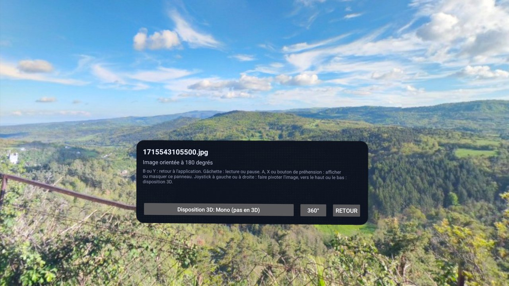
  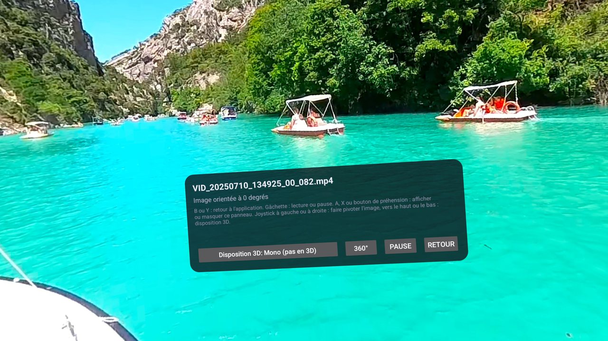
  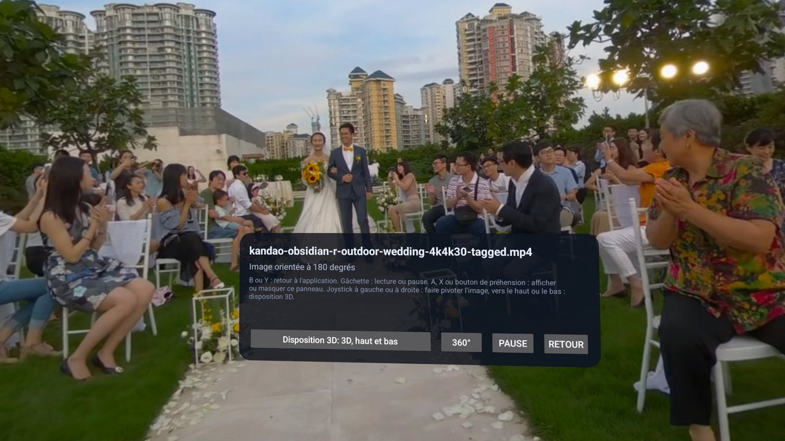
</p>

- **360°-Foto em Headset**: d immersive Aasicht vo ma Foto, mit em Infofeld (Layout, 360°/180°, Zrück).
- **360°-Video em Headset**: a Video, des lauft, mit Pause.
- **3D-360°-Video em Headset**: a stereoskopischs Video oba ond onda, jedes Aug kriagt seins (s Beispiel Kandao Obsidian).

Die Bildschirmfotos send mit dr App uff Französisch gmacht worra, vor Build 14. S Feld hot jetzt au d Zeitleischte zwischa de zwoi Sprungknöpf vo 10 Sekonda, Vorigs ond Nägschts, ond Dreha.

### Wenn s Bild ned zu dir guckt

Dreh's mit em rechta Stick (oder em Knopf Dreha uffm Infofeld), bis sei Mitte vor dir isch. Dr Winkel wird als "Bild uff N Grad drehd" aazeigt, uffm Feld oder uff dr oizeilige Einblendong, wenn s Feld versteckt isch: schreib die Zahl bitte en a [Issue](https://github.com/freeKC/Immuch360/issues), mit deim Kameramodell, damit se dr Standard werda ko. D Startausrichtong isch no ned fir jede Kamera bschtätigt.

### Grenza vo dr immersive Aasicht

- **Vorigs ond nägschts**: se guckat höchstens 400 Medien voraus en ra Zeitleischte ond 50 Dateia en ma Ordner vo ra Freigab, höchstens 12 Sekonda lang; drüber naus sagt s Feld, dass es koi vorigs oder nägschts 360°-Medium gibt. A Ordner vo ra Freigab wird Datei für Datei prüft, drom ko's a paar Sekonda dauera, bis d erschte 360°-Datei nach viele flache gfonda isch. Vo ma räumlicha Foto aus gibt's die no ned.
- **3D-Wahl**: s Layout, des mit em 3D-Knopf gwählt worra isch, wird ned gmerkt, wenn d Aasicht zuagoht; d 360°/180°-Wahl scho, fir d Medien vo dr Bibliothek.
- **Spula**: a Video, dessa Quelle uff Byte-Bereichsaafroga ned antwortet, ko mr ned spula; s Feld sagt des.
- **Flache Videos**: a flachs (ned 360°) stereoskopischs Video lauft em Fenschter mit beide Auga sichtbar; d immersive 3D-Aasicht isch fir 360°- ond VR180-Medien.
- **Meh**: d Codecs, die s Headset dekodiert, dr Store, d Berechtigonga ond d APK-Größe schtehet bei [Meta Quest 3](#meta-quest-3).

<a id="watch-on-your-tv-android-tv-and-google-tv"></a>
## Uffm Fernseher aagucka (Android TV ond Google TV)

Du willsch d 360°-Fotos ond -Videos, deine Alba ond d Videos vo deim NAS oder Plex-Server uffm großa Bildschirm, fir d Familie uffm Sofa, mit dr Fernbedienong vom Fernseher. D Immich-App fürs Telefon isch koi Fernseher-App: a Nutzer, der se uff ma Fernseher installiert hot, hot gmerkt, dass se mit ra Maus goht, ned mit dr Fernbedienong ([Diskussion #1614](https://github.com/immich-app/immich/discussions/1614)), ond s Immich-Team plant koi offizielle Fernseher-App ([Diskussion #13748](https://github.com/immich-app/immich/discussions/13748)).

Ab Build 20 lauft die gleiche Android-App uff Android TV ond Google TV, mit dr Fernbedienong als oizige Eingab: oi APK fir Telefon ond Fernseher, d 360°- ond 3D-Aasichta, die mr mit de Pfeil dreht, ond d Netzwerkfreigaba, Plex ond d Tapo-Kameras uffm Fernseher, mit oder ohne Immich-Server.

<a id="install-it-on-the-tv"></a>
### Uffm Fernseher installiera

1. Bis Google Play d App uff Fernseher aabietet, was uff d Prüfong vom Fernseher-Release durch Google wartet, nemm d universelle `Immuch360-v<version>-release.apk` vo dr Seite [Releases](https://github.com/freeKC/Immuch360/releases).
2. Schalt uffm Fernseher d Entwickleroptiona ond s USB-Debugging ei (uff ma Google TV: Eistellunga, System, Info, siebamol uff "Android TV OS build" drücka, dann Eistellunga, System, Entwickleroptiona; d Nama send vo Fernseher zu Fernseher verschieda).
3. Vo ma Computer em gleicha Netzwerk, mit adb (Android SDK Platform Tools): `adb connect <address of the TV>`, d Abfrog uffm Fernseher bschtätiga, dann `adb install -r Immuch360-v<version>-release.apk`.
4. D App taucht bei de Apps vom Fernseher auf, mit ihrem Banner. S nägschte Release installiersch gnauso: `-r` bhält d Aameldong ond d Eistellunga.

### S erschte Mol starta

1. Meld di a wia uffm Telefon: d Pfeil schiebet an Rahma vo Feld zu Feld, ond OK uff ma Feld ("OK drücka zom Tippa") macht d Tastatur vom Fernseher en ma Dialog auf, fir d Serveradress, d E-Mail ond s Passwort.
2. Oder nemm "Ohne Server nutza". A Fernseher hot koine eigene Fotos, drom sagt dr Reiter Photos (Fotos) "Dr Fernseher hot koine eigene Fotos oder Videos: Mach a Netzwerkfreigab aus dr Bibliothek auf." mit ma Knopf Netzwerkfreigaba. Mach do a Freigab, an Plex-Server oder a Kamera dazua, wia uffm Telefon (guck bei [Netzwerkfreigaba](#network-shares-a-nas-a-computer-or-a-media-server)).

### Mit dr Fernbedienong navigiera

- D Pfeil schiebet da Rahma, OK macht des auf, wo er drauf isch, Zrück goht zrück. Vo ma Reiter aus goht Zrück zom Seitamenü, dann zu Photos (Fotos), dann aus dr App naus.
- Kanal hoch ond ronter blätteret a Seite uff oimol.
- En de Aasichta gangat d Tasta vo dr Fernbedienong fir Abspiela ond Pause, Vorspula, Zrückspula, nägschts ond vorigs, ond d Info-Taste zeigt d Details vo ma Foto oder Video.

### Fotos ond Videos mit dr Fernbedienong

1. **A Foto**: links ond rechts ganget zom vorige oder nägschta, OK zeigt oder versteckt d Bedienelement, Hoch goht zur obera Leiste (wo dr 360°-Knopf isch) ond Ronter zur untera Leiste.
2. **A Video**: OK pausiert ond zeigt d Bedienelement, oder spielt ab. Solang's lauft, springet links ond rechts 10 Sekonda zrück oder vor; solang's pausiert isch, ganget se zom vorige oder nägschta Element, wia dr Hinweis sagt: "Pausiert: D Pfeil ganga zom vorherige oder nächschte Element".
3. **A 360°-Foto**, vom 360°-Knopf aus: mit de Pfeil guckt mr rom, schneller, solang mr se druckt hält, ond d Aasicht lauft sanft aus. OK goht zu de Knöpf vo dr obera Leiste, uff "Vergrößra", nebe "Verkloinra", em Blickfeld ond 3D; Kanal hoch ond ronter zoomet au. Zrück goht vo de Knöpf zrück zom Bild, ond macht dann zua. Dr Hinweis lautet "Pfeil zom Romgucka, OK für d Bedienelement, Zrück zom Zuamacha".
4. **A 360°-Video**, vom 360°-Knopf aus: mit de Pfeil guckt mr rom, solang d Bedienelement versteckt send, OK pausiert ond zeigt se, Zrück versteckt se, ond macht dann zua. Dr Hinweis lautet "Pfeil zom Romgucka, OK zom Pausiera ond Bedienelement azoiga, Zrück zom Zuamacha".
5. **Memories (Erinnerunga)**: links ond rechts ganget durch d Fotos ond weiter zur nägschta Erinnerong, Hoch goht zom Zuamacha-Knopf ond Ronter zu "View in timeline (En dr Zeitleischte aagucka)".
6. **Freigaba ond Plex**: die gleiche Tasta uff de Foto- ond Videoseita vo ra Freigab, wo links ond rechts d vorige oder nägschte Datei vom Ordner aufmachet.

### D Eistellong Layout für d Fernbedienong

Settings (Eistellunga), Preferences (Vorlieba), "Layout für d Fernbedienong": "Große Fokusrahma ond Tasta vo dr Fernbedienong, ohne d Bedienelement, wo an Touchscreen brauchat. Automatisch schaltet's auf Android TV ond Google TV ei." Automatisch isch dr Standard; Ei passt fir a Tablet, des mr mit ra Tastatur oder ma Gamepad bedient; Aus schaltet's uffm Fernseher aus. D Eistellong gibt's bloß uff Android. D Pfeil ond OK gangat en de Aasichta mit ra Tastatur oder ma Gamepad, egal wia d Eistellong isch.

### Grenza

- **A Aasicht**: uffm Fernseher zeigt d App aa ond spielt ab. Sicherong, Hochlada, Bearbeita, Lösche, Teila, mehrere Element auswähla, Cast, Spatial 2.5D, dr Gyroskop, d Kart ond Places (Orte), ond "Des Telefon em Netzwerk freigeba" send versteckt.
- **Aameldong**: OAuth macht a Webseit auf, ond des ko a Fernseher ned: "D Amäldong mit (Anbieter) macht a Webseit auf, ond des ka dr Fernseher ned. Meld di liabr mit E-Mail ond Passwort a."
- **Links** zeiget ihre Adress onder "Auf ma andra Gerät aufmacha", statt an Browser aufzmacha, ond Text wird em Tastatur-Dialog vom System eitippt.
- **Speicher**: uff ma Fernseher mit wenig Speicher werdet 360°-Fotos höchstens mit 4096x2048 zeigt, ohne s schärfere Bild beim Zooma.
- **Videos**: d Decoder vom Fernseher entscheidet, was lauft, mit dr gleicha Eistellong Videoquelle ond dr gleicha Decoder-Prüfong wia uffm Telefon (guck bei [Videodetails ond Decoder](#video-details-decoders-and-why-a-video-stutters)); uff ma Fernseher no ned gmessa.
- **No ned uffm Gerät prüft**: d Fernseher-Unterstützong isch bloß mit automatische Teschts prüft worra ond isch no nie uff ma Fernseher oder ma Fernseher-Emulator glaufa. No zom bschtätiga: en welche Richtong d Pfeil a 360°-Video drehet, d Tastatur vom Fernseher (Gboard) em Text-Dialog, d OK-Taste vo Infrarot-Fernbedienonga, d Ränder ond s Banner uffm Startbildschirm vom Fernseher. Berichte send willkomma.
- **Google Play uff Fernseher** wartet uff d Prüfong vom Fernseher-Release durch Google; bis dohi d APK.
- **Andre Fernseher**: Fire TV isch ned teschtet, ond a Version fir Apple TV gibt's ned.

<a id="find-your-360-shots-the-360-list"></a>
## Fend deine 360°-Aufnahma: d 360°-Lischte

360°-Aufnahma send mit älle andre Fotos vermischt, ond d Leit wünschet sich vo Immich a Möglichkeit, Kugla ond Panoramas zom filtera ([Diskussion #12824](https://github.com/immich-app/immich/discussions/12824)). D Immich-App hot so a Lischte ned.

Immuch360 macht a 360°-Abzeicha uff d Vorschaubildla vo 360°-Fotos (en ma Ordner vo ra Netzwerkfreigab au uff 360°-Videos), ond an 360°-Eintrag ganz oba em Reiter Bibliothek. Ab Build 18 hot die Lischte, mit ma Server, d Fotos ond Videos, die dr Server als 360° markiert, d rohe Insta360-Dateia am Nama, d Fotos, die a 360°-Kamera selber zammagsetzt hot, ond die, die du als 360° aazeiga lasch, dazu des, was d Suche uffm Gerät gfonda hot; ohne Server des, was d Suche uffm Gerät gfonda hot, ond die, die du als 360° aazeiga lasch. Jedes taucht oimol auf, egal wo seine Kopien send, s Neischte zerscht.

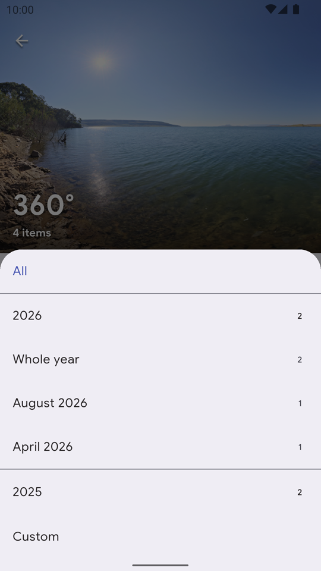

### D Lischte filtera

1. Mach da Reiter Bibliothek auf ond tipp uff 360° (nebe Favorites (Favorita) mit Server, alloi ohne).
2. Tipp uff Date (Datum) fir da Zeitraum: All (Älles), a Johr (mach's auf fir "S ganze Johr" ond seine Monat, jeweils mit Anzahl), oder Custom (Eigens) fir an Bereich vo Däg.
3. Mit Server wähl aus, wo d Medien send: "Uff em Server", "On this device", ond "Shared with me" (Mit mir teilt), wenn's welche gibt.
4. Wähl d Art: Photos, Videos, 3D, VR180.
5. Wenn d Lischte zwoi oder meh Kameras hot, listet a zwoite Zeil se nach EXIF-Hersteller ond -Modell auf, mit ihre Anzahla. A Rohdatei ohne die kriagt da Nama vo dr Marke vo ihrer Endong (Insta360, GoPro, DJI), älles andre isch "Unbekannte Kamera".
6. Innerhalb vo oiner Gruppe (d Orte, Photos ond Videos, 3D ond VR180, d Kameras) zählet d Chips zamma; zwischa de Gruppa schränket se d Lischte ei. Clear (Leera) setzt älles zrück; "Koi 360°-Foto oder -Video passt zu dene Filter" hoißt, dass d Filter nix übrig lasset.
7. Mach a Foto oder Video auf. En dr immersive Aasicht vo dr Quest folgat vorigs ond nägschts dr gfilterte Lischte.

<a id="video-details-decoders-and-why-a-video-stutters"></a>
## Videodetails, Decoder ond warom a Video ruckelt

D Leit frogat, welchen Codec, welche Größe ond welche Bitrate d Quest 3 abspielt, ond warom a 5.7K-Export em Headset ruckelt, während er uffm Telefon guat lauft. D Antwort isch dr Hardware-Decoder: dr H.264-Decoder vo dr Quest 3 (XR2 Gen 2) hört bei ongefähr 4096x2304 auf, drom wird a H.264-Video mit 5760x2880 (Level 6.0, ongefähr 200 Mbit/s, dr übliche Insta360-Export) em Headset mit ongefähr 17 fps dekodiert, mit Blockartefakt, während die gleiche Datei uffm Telefon guat lauft.

S gleiche Video en HEVC (H.265) lauft em Headset guat: a 8K-HEVC-Video vo ra Insta360 X4 (7680x3840, 29,97 fps, 210 Mbit/s, Main-Profil Level 6.1, 8 Bit) lauft flüssig en dr immersive Aasicht, en seiner eigene Auflösong ond ohne Umkodiera (gmeldet vo ma Nutzer uff ra Quest 3).

D Immich-App hot oin Schalter "Force original video" ond zeigt bloß da Codec. Immuch360 zeigt, was a Video isch ond was s Gerät dekodiert, ond nemmt d Datei, die lauft.

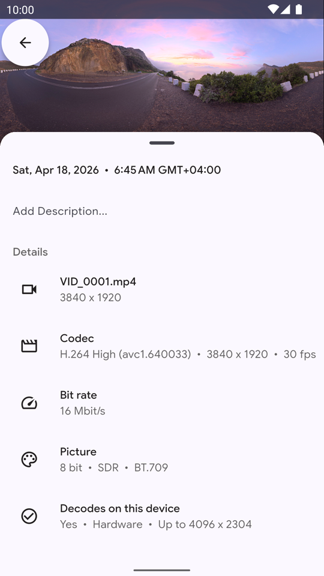

### D Details vo ma Video lesa

1. Mach s Video auf ond wisch nach oba: d Details kommet onder em Bild.
2. Codec: dr Codec mit seim Profil ond em codecs-String, d Bildgröße ond d Bildrate, zom Beispiel "H.264 High (avc1.640033) • 3840 x 1920 • 30 fps", wia uffm Bild oba.
3. Bitrate (ab Build 18): d Bitrate vo dr Videospur, oder die, die d Datei aagibt; sonscht isch se mit "ganze Datei, mit Ton" oder "gschätzt aus dr Dateigröß" markiert.
4. Bild (ab Build 18): d Bittiefe, SDR oder d HDR-Übertragong (HLG, PQ, Dolby Vision) ond dr Farbraum.
5. Wird auf dem Gerät dekodiert: ja oder noi, Hardware oder Software, d größte Größe, die dr Decoder nemmt, ond "Koi Decoder fir (Profil)", wenn s Gerät da Codec hot, aber ned des Profil.

A Zeil kommt erscht, wenn d Datei glesa isch, ond bloß fir des, was d Datei aagibt. A räumlichs Foto oder Video vo Apple kriagt a eigene Zeil, guck bei [Räumliche Fotos ond Videos vo Apple](#apple-spatial-photos-and-videos).

### Seha, was s Gerät dekodiert

Settings, Advanced, "Videodecoder vo dem Gerät" (ab Build 15) listet auf, was s Telefon oder s Headset dekodiert: Codec, Hardware oder Software, größte Größe, Bildrate, ond ab Build 18 d Profile (Main, Main 10, HDR10). Ab Build 19 hot's an MV-HEVC-Eintrag, dr Codec vo de räumlicha Videos vo Apple. Dr Knopf Kopiera legt d Lischte fir an Fehlerbericht en d Zwischaablag.

### S Original oder da umkodierta Stream wähla

1. Mach Settings, Asset Viewer, dann Videos auf.
2. Onder "Videoquelle" ("Welle Datei lauft, wenn dr Server a umkodierte Kopie hot") wähl "S'Original, wenn des Gerät des dekodiera ko", "Emmer s'Original" oder "Emmer dr umkodierte Stream".

Ab Build 15 gilt d Wahl fir jedes Server-Video: da flacha Player, da 360°- ond da Spatial-Player, ond d immersive Aasicht vo dr Quest. Bis du ebbes wählsch, bhält a Telefon des, was dr frühere Schalter "Force original video" gsagt hot (standardmäßig aus: dr umkodierte Stream, der s Original selber isch, wenn dr Server's ned umkodiert hot), ond d Quest spielt s Original, wenn s Headset's dekodiera ko.

D Prüfong liest Codec, Größe ond Bildrate aus dr Datei ond vergleicht se mit de Hardware-Decoder (H.264 uff dr Quest 3 wird uff die gmessene 4096x2304 begrenzt). A Player, der s Original ned dekodiera ko, wechselt zom umkodierta Stream mit ra Meldong: "Dr umkodierte Stream lauft: s'Original (Codec ond Größe) isch meh als des Gerät dekodiera ko".

Em Headset startet d immersive Aasicht s Original ond wechselt bei de erschte Bilder zom umkodierta Stream vom Server, wenn s Original über de Decoder liegt, ond sagt des uffm Infofeld; wenn's koin umkodierta Stream gibt, wenn der au no z groß isch, oder wenn d Datei vom Headset oder vo ra Netzwerkfreigab kommt, sagt s Infofeld des 10 Sekonda lang, mit dem, was mr ändera sott. Build 14, der em Horizon Store eigreicht isch, prüft bloß H.264 über 4096x2304 ond probiert dann gnauso da Abspielstream vom Server.

Fir rohe Videos mit zwoi Objektiv frogt d Prüfong nach zwoi Decoder gleichzeitig, ond ab Build 19 lehnt se zwoi Streams über je 2048x2048 fir an Software-Decoder ab, guck bei [Rohdateia vo 360°-Kameras](#raw-360-camera-files-without-the-cameras-app).

### Em Headset a Video gebe, des's dekodiera ko

En Immich gang uff Administration (Verwaltong), Settings, Video Transcoding Settings (Eistellunga fir s Video-Umkodiera), ond wähl oins vo dene:

- **Jedes H.264-Video en HEVC nei kodiert**: stell Video codec (Videocodec) uff HEVC ond Target resolution (Zielauflösong) uff Original (d Standard-720p dätet a 360°-Video uff 1440x720 schrompfa), ond bhalt bloß HEVC en Accepted video codecs (Akzeptierte Videocodecs). Jedes H.264-Video vo dr Bibliothek wird umkodiert, ned bloß d 360°-Videos, ond s Headset kriagt HEVC en voller Auflösong.
- **Bloß des, was größer als 1440p isch**: bhalt H.264 en Accepted video codecs, stell Transcode policy (Umkodier-Regel) uff "Videos higher than target resolution or not in an accepted format" (Videos über dr Zielauflösong oder ned em akzeptierta Format) ond Target resolution uff 1440p, am beschta mit Video codec uff HEVC. Älles, was größer isch, wird umkodiert, ond s Headset kriagt 2880x1440. Normale 4K-Videos werdet au uff 1440p umkodiert.

Die Eistellunga geltet fir da ganza Server, fir jeden Nutzer ond jede App, ond s Neikodiera vo ra großa Bibliothek koscht Stonda CPU-Zeit ond extra Plattaplatz; d Originale werdet ned verändert. Browser ohne HEVC-Unterstützong (Firefox uff de meischte Systeme, Chrome ohne Hardware-HEVC) spielet a HEVC-Umkodierong en dr Immich-Web-App ned ab. Am eifachschta isch's bei neie Videos, aus dr Insta360-App oder em Studio en H.265 zom exportiera. Nach ra Änderong vo dene Eistellunga müsset d vorhandene Videos nomol umkodiert werda: Administration, Job Queues (Aufgabawarteschlanga) (Jobs (Aufgaba) en ältere Immich-Versiona), Transcode videos (Videos umkodiera), All.

D Alternative, ond d oinzige fir Dateia vo ra Netzwerkfreigab oder vom Headset (die hen koin umkodierta Stream), isch, da Export vorm Hochlada oder Kopiera uff d Freigab en HEVC nei zom kodiera:

```bash
ffmpeg -i VID_360.mp4 -c:v libx265 -crf 20 -preset medium -tag:v hvc1 -c:a copy -movflags +faststart VID_360_hevc.mp4
exiftool -overwrite_original -tagsFromFile VID_360.mp4 -XMP-GSpherical:all VID_360_hevc.mp4
exiftool -ProjectionType VID_360_hevc.mp4        # must print: equirectangular
```

`-tag:v hvc1` kennzeichnet d HEVC-Spur so, wia's Apple-Geräte ond Browser erwartet, `-c:a copy` lässt da Ton wia er isch. ffmpeg wirft da 360°-Tag vom Export weg, d exiftool-Zeil kopiert en zrück; ohne den zeigt Immich s Video als flachs Video.

### Originale, die ned streama kennet

Wenn dr Server HTTP-Range-Aafroga fürs Original ignoriert ond dr MP4-Index (moov) am End vo dr Datei liegt, müsst d ganze Datei vorm erschta Bild ronterglada werda, drom weicht d App uff da Abspielstream vom Server aus. A Reverse Proxy vor Immich, der d Antworta puffert oder d Range-Header wegmacht, ko des verursacha.

<a id="everything-else-is-immich"></a>
## Älles andre isch Immich

Älles, was d offizielle Immich-App fürs Telefon ko, isch do drin: Sicherong, Zeitleischte, Alba, Suche, Teila, Partner, älles mit deim Server synchronisiert, mit em gleicha Server ond em gleicha Konto wia d Web-App. Immuch360 wird nebe dr offizielle App installiert (Paket `com.aprogsys.immuch360`). Es gibt zwoi Unterschied, ab Build 15: dr Schalter "Force original video" isch zur Wahl Videoquelle worra, die oba beschrieba isch, ond Fotos ond Videos, die du vo Hand aus ma Gerätealbum hochlädsch, zählet als gsichert. Uffm Fernseher isch d App ab Build 20 a reine Aasicht, guck bei [Uffm Fernseher aagucka](#watch-on-your-tv-android-tv-and-google-tv).

Om a 360°-Foto ebber zom zeiga, der d App ned hot, teil's mit ma gteilte Immich-Link: d Immich-Web-App zeigt a 360°-Foto en seim Browser als Kugl.

Dr aktuelle Build, Build 21 (Version 3.3.0-rc.0, Buildnummer 3030019), basiert uff Immich 3.3.0-rc.0 (Immich `main`, no koi stabile Version). Build 19 isch mit ma Immich-3.2-Server teschtet worra, ond Build 20 ond 21 änderet nix an dem, was d App vom Server will. Meld Probleme bitte onder [Issues](https://github.com/freeKC/Immuch360/issues), ned beim Immich-Projekt. D vollschtändige Doku vo Immich selber fendsch onder [immich.app](https://immich.app).

<a id="compared-with-the-immich-app-and-other-apps"></a>
## Im Vergleich mit dr Immich-App ond andre Apps

### Warom's den Fork gibt, en oiner Tabelle

| | Immich-App fürs Telefon | Immuch360 |
|---|:---:|:---:|
| 360°-Fotos als Kugl, en dr mr sich omguckt (zieha, zwoi Fenger, doppeltippa, Nachlauf, d Startaasicht vo dr Kamera, Teilpanoramas) | ❌ flachr Streifa | ✅ |
| Gyroskop: omgucka durch Bewega vom Telefon | ❌ | ✅ |
| 360°-Videos en ma Kugl-Player, mit Ton, Spula, Wahl vo dr Tonspur ond ra Puffer-Aazeig | ❌ flachs Video | ✅ Android ond iOS (uff iOS no koi Zeitleischte) |
| 3D- (stereoskopische) 360°-Fotos ond -Videos | ❌ doppelts Bild | ✅ links Aug uffm Telefon, echts 3D uff dr Quest |
| VR180-Fotos ond -Videos (Halbkugl) | ❌ om d Kugl zoga | ✅ Halbkugl, 360°/180°-Knopf |
| Räumliche Fotos vo Apple (HEIC-Stereopaare) ond räumliche Videos (MV-HEVC) | ❌ a flachs Foto oder Video, nix sagt, dass es räumlich isch | ✅ ab Build 19: Fotos en 3D uff dr Quest, oi Aug ond a Detailzeil sonscht überall |
| Immersive Aasicht uff dr Meta Quest mit Kopfverfolgong, Zeitleischte, vorigs ond nägschts, ond Dreha | ❌ | ✅ gleiche App, als Headset-Build oder als Telefon-APK |
| 360°-Abzeicha uff Vorschaubildla, ond a 360°-Lischte mit Rohdateia ond Filter (Zeitraum, Quelle, Art, Kamera) | ❌ | ✅ Filter ab Build 18 |
| "Als 360° aazeiga" fir Dateia, die dr Server ned markiert | ❌ | ✅ uffm Telefon gmerkt |
| Spatial 2.5D: Diafe uff ma flacha Bildschirm aus ma stereoskopischa Video | ❌ | ✅ experimentell, Telefon ond Tablets |
| Nutza ganz ohne Server, mit dr Galerie vom Gerät selber | ❌ Aameldong nötig | ✅ |
| SMB- ond WebDAV-Freigaba, em Netzwerk gfonda ond direkt abgspielt, nix ronterglada | ❌ | ✅ älle Aasichta, Telefon ond Quest |
| DLNA-Medieserver als Freigab-Typ | ❌ | ✅ ab Build 19 |
| D Dateia vo ra Freigab an Immich schicka; vo Hand gschickte Gerätedateia zählet als gsichert | ❌ bloß Gerätedateia | ✅ ab Build 15 |
| Des Telefon em Netzwerk freigeba, fürs Headset | ❌ | ✅ ab Build 19, Android ond iOS |
| Plex-Media-Server-Bibliotheka, vo de Originaldateia abgspielt, drhoim ond onderwegs, ohne plex.tv | ❌ | ✅ ab Build 20, jede Aasicht, uff Telefon, Tablets, dr Quest ond Fernseher |
| Tapo-Kameras: s Live-Bild, ond d Aufnahma vo dr Speicherkart, die an Immich ganget, wenn du des willsch | ❌ | ✅ ab Build 20: Aufnahma überall, live uff Android, Android TV ond dr Quest |
| Android TV ond Google TV, mit dr Fernbedienong bedient, en dr gleicha APK | ❌ koi Fernseher-App | ✅ ab Build 20 |
| Die gleiche App uff ma Windows-Rechner | ❌ bloß Telefon ond Tablets | ✅ Vorschau, no koine Videos |
| Rohe Insta360-.insp-Fotos ond .insv-Videos mit oiner Spur | ❌ flach | ✅ ab Build 16 |
| Rohvideos mit oim Objektiv pro Spur oder pro Datei (Insta360 X4, X4 Air, X5, X6, X3-Paare, GoPro .360, DJI .osv) | ❌ flach oder falsch | ✅ ab Build 18 |
| Doppel-Fischaug als .dng | ❌ flach | ❌ no ned |
| Server-Videos: s Original, wenn s Gerät's dekodiera ko, sonscht dr umkodierte Stream; Lischte vo de Videodecoder vom Gerät | ❌ oi Schalter "Force original video" | ✅ ab Build 15 |
| Technische Details vo ma Video: Bitrate, Bild, Profil, ob des Gerät's dekodiert | ❌ bloß dr Codec | ✅ ab Build 18 |
| A kostaloser Player fir flache, 360°-, 3D- ond VR180-Videos, vom Server, vom Telefon oder vom NAS | ❌ bloß flach | ✅ (d Player em Store vo dr Quest 3 koschtet Geld) |
| Gleicher Server, gleichs Konto, installiert sich nebe dr offizielle App | | ✅ |

<details>
<summary><b>Stand vo jeder Zeil</b>: wia se teschtet worra isch</summary>

- **360°-Fotos als Kugl**: teschtet uff ma Galaxy S24+ ond ma iPhone 14.
- **Gyroskop**: teschtet uff ma Galaxy S24+ ond ma iPhone 14.
- **360°-Videos**: teschtet uff ma Galaxy S24+ ond ma iPhone 14.
- **3D-360°-Fotos ond -Videos**: teschtet uff ma Galaxy S24+ ond ra Quest 3, mit echte 3D-360°-Beispiel (VRTogether, Vuze, Kandao) ond ma 3D-Foto; Berichte vo andre Kameras willkomma.
- **VR180**: teschtet uff ma Android-Emulator ond ma Galaxy S24+ mit künschtliche Medien; Rückmeldonga vo Geräte willkomma.
- **Räumliche Fotos ond Videos vo Apple**: Erkennong prüft an ma Beispiel-Foto aus Apples Bildbibliothek ond an künschtliche Dateia; d Aasicht em Headset ond echte iPhone-Dateia send dr Gerätetescht vo Build 19.
- **Immersive Aasicht vo dr Meta Quest**: teschtet uff ra Quest 3 (d Steuerong vo Build 14, en Build 16 nach dr Rückmeldong vo ma Nutzer aapasst), ond vo ma Nutzer mit 8K-HEVC-Videos vo ra Insta360 X4.
- **360°-Abzeicha ond 360°-Lischte**: fertig.
- **Als 360° aazeiga**: fertig.
- **Spatial 2.5D**: teschtet uff ma Galaxy S24+; Rückmeldonga vom iPhone willkomma.
- **Ganz ohne Server**: teschtet uff ma Galaxy S24+, ra Quest 3 ond ma Android-Emulator.
- **SMB- ond WebDAV-Freigaba**: teschtet mit ma Freebox Server (SMB) uff ma Galaxy S24+ ond ra Quest 3, ond gega Samba- ond WebDAV-Teschtserver uff ma Android-Emulator; Rückmeldonga zu andre NAS ond WebDAV willkomma.
- **DLNA-Medieserver**: prüft gega minidlna ond Gerbera en Docker; Plex, Jellyfin, a NAS, dr Freebox Server, a iPhone ond d Quest send dr Gerätetescht vo Build 19.
- **D Dateia vo ra Freigab an Immich schicka**: teschtet uff ma Android-Emulator gega an Samba-Teschtserver ond an Immich-3.2-Server.
- **Des Telefon em Netzwerk freigeba**: Unit-Teschts ond End-to-End-Teschts mit em WebDAV-Client vom Headset, uff ma Computer; a Telefon, des a Quest versorgt, ond d iPhone-Seite send dr Gerätetescht vo Build 19.
- **Plex Media Server**: vo ma Computer aus gega an echta Plex Media Server 1.42.1 prüft (Koppla, Ordner, Byte-Bereich, Vorschaubilder, d Adress außerhalb vo drhoim); no ned uffm Gerät prüft.
- **Tapo-Kameras**: gega a simulierte Kamera prüft; no ned mit ra echta Kamera prüft.
- **Android TV ond Google TV**: mit automatische Teschts prüft; no ned uff ma Fernseher prüft.
- **Die gleiche App uff ma Windows-Rechner**: 475 automatische Desktop-Teschts uff Windows, ond uff ma Windows-11-PC startet d App, macht a gspeicherte Sitzong uff ma Immich-Server auf, synchronisiert ond goht sauber zua; dr Tescht vo jeder Funktion vo Hand lauft no.
- **Rohe Insta360-.insp-Fotos ond .insv-Videos mit oiner Spur**: Fotos gega Exporte vo X3-Dateia aus em Insta360 Studio prüft, Videos uff ma Android-Emulator mit ra X3-Datei en niedriger Auflösong; no ned uff ma iPhone glaufa.
- **Rohvideos mit oim Objektiv pro Spur oder pro Datei**: Parser ond Zammasetza an echte Dateia vo X4, X3-Paar, GoPro MAX ond Osmo 360 prüft; s Abspiela isch dr Gerätetescht vo de Builds 18 ond 19.
- **Doppel-Fischaug als .dng**: plant.
- **Server-Videos ond d Video-Decoder**: teschtet uff ma Android-Emulator; d H.264-Grenze vo dr Quest 3 isch em Headset gmessa worra.
- **Technische Details vo ma Video**: fertig.

</details>

### Andre Apps, die d Leit dafür nemmet

- **D Immich-Web-App**
  - Uff was se schtoßet: se zeigt a 360°-Foto als Kugl, hält aber a rohe .insp fir a fertigs Panorama ond wickelt ihre zwoi Kreis om d Kugl; a VR-Aasicht isch emmer no a Wunsch ([Diskussion #14768](https://github.com/immich-app/immich/discussions/14768)).
  - Was Immuch360 macht: setzt Rohdateia uffm Gerät zamma ond macht a immersive Aasicht en dr Quest auf.
- **D Insta360-App oder s Studio**
  - Uff was se schtoßet: mr braucht se, om d Rohdateia vo dr Karte en a 360°-Bild zom verwandla, bevor mr's aagucka ko.
  - Was Immuch360 macht: macht d rohe .insp- ond .insv-Dateia direkt auf, ond d GoPro-.360- ond DJI-.osv-Dateia.
- **Plex, Jellyfin, Synology Photos**
  - Uff was se schtoßet: 360°-Fotos ond -Videos werdet flach aazeigt oder ned erkannt, wia's en Beiträg en ihre Foren schtoht (a Wunsch bei Plex isch seit 2017 offa).
  - Was Immuch360 macht: liest ab Build 20 d Plex-Bibliothek selber, oder die gleiche Ordner über SMB, WebDAV oder DLNA, ond spielt se als Kugl ab, ohne uffm Server ebbes zom ändera.
- **D Tapo-App**
  - Uff was se schtoßet: a eigene App, bei deim TP-Link-Konto agmeldet, mit de Clips weit weg vo deine Fotos.
  - Was Immuch360 macht: zeigt d Kamera nebe deine Fotos, schwätzt bloß en deim Netzwerk mit ihr, ond bhält an Clip als Video, des du an Immich schicka kosch (ab Build 20).
- **D Immich-App fürs Telefon uff ma Fernseher**
  - Uff was se schtoßet: koi Fernseher-App: a Nutzer berichtet, dass se mit ra Maus goht, ned mit dr Fernbedienong.
  - Was Immuch360 macht: die gleiche App, gmacht fir d Fernbedienong (ab Build 20).
- **Dateia uffs Headset kopiera**
  - Uff was se schtoßet: jede Datei wird übers Kabel kopiert, bevor mr se aagucka ko.
  - Was Immuch360 macht: spielt direkt vo Immich, ma NAS, ma Medieserver oder ma Telefon ab.
- **D 360°- ond 3D-Player em Quest-Store**
  - Uff was se schtoßet: koschtet Geld.
  - Was Immuch360 macht: kostalos ond Open Source (AGPL).

<a id="formats-and-sources-by-platform"></a>
## Formate ond Quella, nach Plattform

Immuch360 isch a Galerie, ond au a kostaloser Medieplayer: er spielt des ab, was d offizielle App ned ko, aus de Quella vo dr zwoita Lischte, en dem Player, der zur Datei passt.

- **Flache Videos (MP4, MOV, MKV, was s Gerät dekodiert)**
  - Android-Telefon: Immich-Player, ond a eigener Player fir Netzwerkfreigaba.
  - iPhone, iPad: s Gleiche, außer de MKV- ond AVI-Dateia vo ra Freigab, die iOS ned aufmacht (uffm Server laufet se umkodiert).
  - Meta Quest: em Fenschter.
  - Android TV, Google TV: wia uffm Telefon; OK pausiert, links ond rechts springet 10 s.
- **360°-Fotos**
  - Android-Telefon: kugl-Aasicht, Gyroskop.
  - iPhone, iPad: s Gleiche.
  - Meta Quest: immersiv, rondrom om di.
  - Android TV, Google TV: kugl-Aasicht, mit de Pfeil dreht, mit de Kanaltasta zoomt.
- **360°-Videos**
  - Android-Telefon: eigener Media3-Player uff ra Kugl, Gyroskop, Spula, Wahl vo dr Tonspur, Puffer-Aazeig.
  - iPhone, iPad: eigener SceneKit-Player uff ra Kugl, Gyroskop, Wahl vo dr Tonspur, Puffer-Aazeig; abspiela ond aahalta, no koi Zeitleischte.
  - Meta Quest: immersiv, echts 3D fir stereoskopische Dateia, Zeitleischte mit 10-Sekonda-Sprüng, vorigs ond nägschts Medium.
  - Android TV, Google TV: dr Media3-Player vom Telefon, mit de Pfeil dreht.
- **3D-360° (oba ond onda, nebanander)**
  - Android-Telefon: links Aug, Layout-Knopf.
  - iPhone, iPad: s Gleiche.
  - Meta Quest: jedes Aug kriagt sei Hälfte vom Bild.
  - Android TV, Google TV: links Aug, Layout-Knopf.
- **VR180-Fotos ond -Videos (Halbkugl)**
  - Android-Telefon: halbkugl, 360°/180°-Knopf.
  - iPhone, iPad: s Gleiche.
  - Meta Quest: immersive Halbkugl.
  - Android TV, Google TV: halbkugl, 360°/180°-Knopf.
- **Spatial 2.5D (Diafe uff ma flacha Bildschirm aus ma stereoskopischa Video)**
  - Android-Telefon: eigener Player, Kopfverfolgong mit dr Frontkamera.
  - iPhone, iPad: s Gleiche.
  - Meta Quest: ned aagebota.
  - Android TV, Google TV: ned aagebota.
- **Räumliche Fotos vo Apple (HEIC-Stereopaare, ab Build 19)**
  - Android-Telefon: links Aug, a Detailzeil sagt, dass es räumlich isch.
  - iPhone, iPad: s Gleiche.
  - Meta Quest: En 3D aagucka: beide Auga uff ma Foto, des en dr immersive Aasicht schwebt, 3D oder 2D, Größe veränderbar.
  - Android TV, Google TV: links Aug, a Detailzeil.
- **Räumliche Videos vo Apple (MV-HEVC, ab Build 19)**
  - Android-Telefon: oi Aug (d Basisebene), mit ma Hinweis.
  - iPhone, iPad: s Gleiche.
  - Meta Quest: oi Aug em Fenschter, mit ma Hinweis.
  - Android TV, Google TV: oi Aug, mit ma Hinweis.
- **Rohe Insta360-.insp-Fotos (ab Build 16)**
  - Android-Telefon: uff dr GPU zammagsetzt, bevor d Kugl-Aasicht kommt, bis 8192x4096.
  - iPhone, iPad: s Gleiche.
  - Meta Quest: immersiv, aus ma zammagsetzta Bild, des fürs Headset vorbereitet isch.
  - Android TV, Google TV: wia uffm Telefon.
- **Rohe Insta360-.insv, beide Objektiv en oiner Spur (ab Build 16)**
  - Android-Telefon: vo ma GPU-Effekt em Media3-Player zammagsetzt.
  - iPhone, iPad: vo ma SceneKit-Shader zammagsetzt.
  - Meta Quest: immersiv, vom gleicha GPU-Effekt zammagsetzt.
  - Android TV, Google TV: wia uffm Telefon.
- **Rohvideos mit oim Objektiv pro Spur oder pro Datei (ab Build 18): Insta360 X4, X4 Air, X5, X6 .insv, X3-Paare, GoPro .360, DJI .osv**
  - Android-Telefon: zwoi Hardware-Decoder gleichzeitig, oiner pro Objektiv (ab Build 19 Software-Decoder uff ma Gerät ohne Hardware-Decoder, bis 2048x2048 pro Objektiv), ond a GL-Kompositor, der se zur Kugl zammasetzt; oi Objektiv, dann dr umkodierte Stream, dann s Video ned zammagsetzt, wenn s Gerät koine zwoi schafft.
  - iPhone, iPad: a eigener AVFoundation-Kompositor mit Metal.
  - Meta Quest: immersiv, gleiche zwoi Decoder ond Kompositor (Panel mit 3840x1920).
  - Android TV, Google TV: wia uffm Telefon, wenn dr Fernseher zwoi Decoder gleichzeitig laufa lassa ko.
- **Live-Bild vo dr Tapo-Kamera (ab Build 20)**
  - Android-Telefon: Media3-RTSP-Player: SD uff dr Seite, HD em Vollbild, Ton-Knopf.
  - iPhone, iPad: no ned: a Karte sagt, dass es schpäter kommt.
  - Meta Quest: em Fenschter, en HD.
  - Android TV, Google TV: wia uffm Telefon.
- **Aufnahma vo dr Tapo-Kamera (ab Build 20)**
  - Android-Telefon: vo dr Speicherkart en a H.264-Video mit seim Ton gholt, dann mit Spula abgspielt.
  - iPhone, iPad: s Gleiche.
  - Meta Quest: s Gleiche, em Fenschter.
  - Android TV, Google TV: s Gleiche.

D Eiträg fir Android TV ond Google TV, ab Build 20, send no ned uff ma Fernseher prüft, guck bei [Uffm Fernseher aagucka](#watch-on-your-tv-android-tv-and-google-tv); d Kamera-Eiträg send no ned mit ra echta Kamera prüft.

Uff Windows zeigt d Vorschau vo Immuch360 Desktop d Fotos, flach ond 360°, rohe Insta360-.insp-Fotos mitgrechnet, mit dr Maus ond dr Taschtatur, vom Server, aus de Ordner vom PC, vo de Freigaba ond vo Plex; Videos spielt se no ned ab, die zeiget an Platzhalter (guck bei [No ned do](#not-there-yet)).

- **Dei Immich-Server**: s Original oder dr umkodierte Stream vom Server, so wia's Settings, Asset Viewer, Videoquelle sagt (guck bei [Videodetails ond Decoder](#video-details-decoders-and-why-a-video-stutters)). Gleichs Konto wia d Web-App.
- **S Telefon oder Headset selber**: "Ohne Server nutza" uff dr Aamelde-Seite, oder dr Eintrag On this device em Reiter Bibliothek.
- **A NAS oder a Computer**: SMB- ond WebDAV-Freigaba, ond ab Build 19 DLNA-Medieserver, em Netzwerk gfonda, direkt glesa (a SMB-Video über bis zu sechs Verbindonga), nix kopiert; ab Build 15 kennet d Dateia, die du aussuachsch, an dei Immich-Konto gschickt werda.
- **A andrs Telefon (ab Build 19)**: "Des Telefon em Netzwerk freigeba" uff dem Telefon: s Headset, oder jeder WebDAV-Client em Netzwerk, liest seine Alba, Monat ond 360°-Medien.
- **A Plex Media Server (ab Build 20)**: seine Foto-, Film- ond Serien-Bibliotheka nach Ordner, d Originaldateia direkt über HTTPS glesa, gega s eigene Zertifikat vom Server prüft, drhoim oder über d Adress außerhalb vo drhoim, uff älle Plattforma; guck bei [Plex Media Server, ohne plex.tv](#plex-media-server-without-plextv).
- **A Tapo-Kamera (ab Build 20)**: s Live-Bild mit em Kamerakonto (Android, Android TV, d Quest), ond d Aufnahma vo ihrer Speicherkart mit em Passwort vom TP-Link-Konto (älle Plattforma), bloß em lokala Netzwerk; guck bei [Tapo-Kameras](#tapo-cameras-live-view-and-the-recordings-of-the-memory-card).
- **D Ordner vo ma Windows-Rechner (Desktop-Vorschau)**: d Ordner, wo du en Immuch360 Desktop aussuachsch, glesa anstatt dr Galerie vo ma Telefon; dr Rechner ko se au mitm Headset teila, guck bei [Uff ma Windows-Rechner](#on-a-windows-computer-immuch360-desktop-preview).

<a id="meta-quest-3"></a>
## Meta Quest 3

Immuch360 lauft au uff de Meta-Quest-Headsets mit Horizon OS v69 oder neier. Ab Build 21 isch dr Build em Horizon Store fir d Quest 2, Quest Pro, Quest 3 ond 3S glistet, die vier, die d universelle `-release.apk` scho nennt; d allererschte Quest ned, dr Store nemmt se nemme aa.

D Quest 3 ond 3S send teschtet. D Quest 2 ond Quest Pro send no ned teschtet: ihre Video-Decoder send langsamer, ond d Grenza, die d App prüft, send uff ra Quest 3 gmessa worra, drom ko a großes H.264-Video uff dene mit ra Meldong abgwiesa werda oder ruckla. Berichte vo dene zwoi Headsets send willkomma onder [Issues](https://github.com/freeKC/Immuch360/issues).

Wia mr se benutzt, schtoht en [Em Headset Meta Quest 3](#in-the-meta-quest-3-headset); der Abschnitt goht oms Installiera ond om des, was em Headset anders isch.

Dr Headset-Build schwätzt mit Server bloß über HTTPS, oder über eifachs HTTP mit Nama vom Heimnetz (`.local`, `.lan`, `.home`, `.internal`, `.home.arpa`) ond mit em Headset selber, so wia's dr Horizon Store verlangt. A Server, der als eifache HTTP-Adress mit ra IP eitippt isch, wia `http://192.168.1.10:2283`, wird vo dem Build abglehnt: nemm HTTPS, an Nama vom Heimnetz (`nas.local`), oder d universelle `-release.apk`, die d offene Regel vo de Telefon bhält.

WebDAV-, DLNA- ond Telefon-Freigaba onder ra eifacha HTTP-Adress vom lokala Netzwerk send ned betroffa: d App liest se selber ond gibt ihre Player bloß d Adress vo ihrer lokala Brück (em Headset fir DLNA ond d Telefon-Freigab no zom bschtätiga, beides nei en Build 19). Ab Build 20 wird a Plex-Server über HTTPS erreicht, ond a Tapo-Kamera vo dr App selber, ihr Live-Bild über RTSP, des koi HTTP isch: koins vo beide sott betroffa sei (em Headset no zom bschtätiga).

<a id="install"></a>
### Installiera

Meta hot dr Eintrag em Horizon Store am 7. Oktober 2026 mit Build 14 freigeba, ond Build 21 isch als sei erschts Update eigreicht. Bis d Store-Seite öffentlich isch, oder om an Build z kriaga, bevor dr Store ihn hot, lad d Datei `-quest-release.apk` vo ma Release seitlich (gebaut fürs Headset: 64 Bit, Ziel-SDK 34, bloß d Berechtigonga, die s Headset braucht), oder d universelle `-release.apk`:

1. Schalt oimol da Entwicklermodus ei. En dr Meta-Horizon-App uffm Telefon mach Devices (Geräte) auf, wähl s Headset, dann Headset settings (Headset-Eistellunga), dann Developer mode (Entwicklermodus). Dafür braucht mr a Entwicklerkonto, des uff developers.meta.com nix koscht. Uffm Computer brauchsch au adb (Android SDK Platform Tools), oder SideQuest.
2. Verbind s Headset mit ma USB-C-Kabel mit em Computer. Em Headset nemm "Allow USB debugging" (USB-Debugging erlauba) aa.
3. Installier d APK:

   ```bash
   adb devices                      # the headset must be listed as "device"
   adb install -r Immuch360-v<version>-quest-release.apk   # for example Immuch360-v3.3.0-rc.0-21-quest-release.apk
   ```

4. Em Headset mach d Library auf, wähl da Filter "Unknown sources" (Unbekannte Quella) ond start Immuch360.
5. A seitlich gladene APK aktualisiert sich ned selber: installier s nägschte Release gnauso (`adb install -r` bhält d Aameldong ond d Eistellunga). D Version aus em Horizon Store ond d GitHub-APK send mit verschiedene Schlüssel signiert, drom nemmt s Headset ned oine über d andre: zom Wechsla erscht d App deinstalliera, dabei ganget d Aameldong, d Eistellunga ond d Lischte vo de Netzwerkfreigaba verlora.

### Em Fenschter

D ganze App lauft als 2D-Fenschter, dessa Größe mr ändera ko: Aameldong, Zeitleischte, Alba, Suche, dr Reiter Bibliothek (360°-Lischte, On this device, Netzwerkfreigaba), d Eistellunga, ond d Foto- ond Videoaasichta, wo flache Fotos ond Videos laufet.

Em Headset machet dr 360°-Knopf ond Als 360° aazeiga em Menü ⋮ direkt d immersive Aasicht auf statt dr Kugl-Aasicht vom Telefon, ond dr Spatial-2.5D-Knopf ond sei Eistellong werdet ned aazeigt.

Ab Build 19 hot a räumlichs Foto vo Apple an Knopf En 3D aagucka, ond d Kachel Des Telefon em Netzwerk freigeba wird ned aazeigt: s Headset isch des, wo d Freigab vo ma Telefon liest. Ab Build 20 ganget au d Plex-Server ond d Tapo-Kameras em Fenschter auf, s Live-Bild vo dr Kamera en HD; d Eistellong "Layout für d Fernbedienong" bleibt uff Automatisch, ond des lässt se em Headset aus.

### En Bilder

Bildschirmfotos em Headset mit em Aufnahmeknopf (Meta-Knopf ond Abzug), uff ra Quest 3, mit dr App uff Französisch; dr Reiter Bibliothek isch em Modus ohne Server zeigt.

<p align="center">
  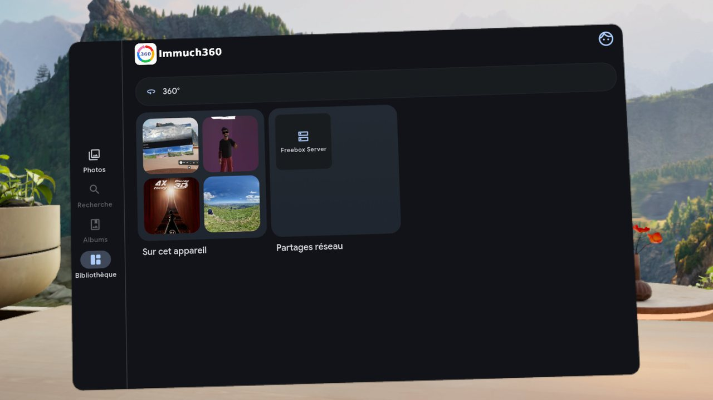
  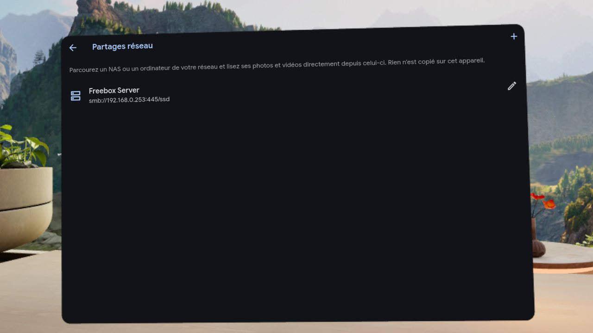
</p>

- **Ohne Server**: dr Reiter Bibliothek em Modus ohne Server, mit de eigene Medien vom Headset ond de Netzwerkfreigaba.
- **Netzwerkfreigaba**: a Samba-Freigab vo ma Freebox Server, direkt vom Headset glesa.

### Grenza em Headset

- **Videocodecs**: HEVC (H.265) isch d sichere Wahl; H.264 hört bei ongefähr 4096x2304 auf. Was d App prüft, ond wia mr em Headset a Video gibt, des's dekodiert, schtoht en [Videodetails ond Decoder](#video-details-decoders-and-why-a-video-stutters).
- **Store**: d Store-Version fangt bei Build 14 aa. D Funktiona mit "ab Build 15" ond schpäter kommet mit Build 21, ihrem erschte Update, sobald Meta des prüft hot (dr Alpha-Tescht-Kanal vom Store, fir Teschter, kriagt jeden neie Build); d GitHub-APK hot jetzt scho älle.
- **Berechtigonga**: dr Headset-Build frogt bloß nach Fotos ond Videos (dr Modus ohne Server) ond Benachrichtigonga (Fortschritt vo dr Sicherong). Er hot koi Berechtigong fir Speicher, Audio, Standort oder Kamera, anders als dr Telefon-Build; drom gibt's em Headset koin Serverwechsel noch em WLAN-Nama.
- **APK-Größe**: s Spatial SDK bringt ongefähr 56 MB nativa 64-Bit-ARM-Code mit, au uff de Telefon, wo's nie glada wird.
- **Lizenz**: d immersive Aasicht nemmt s Meta Spatial SDK, des onder em Meta Platform Technologies SDK License Agreement verteilt wird.

<a id="on-a-windows-computer-immuch360-desktop-preview"></a>
## Uff ma Windows-Rechner: Immuch360 Desktop (Vorschau)

Dei Immich-Bibliothek isch uff ma Server, andre Fotos liegat en de Ordner vom PC, d Videos uff ma NAS oder ma Plex-Server, ond du dätsch di gern en deine 360°-Fotos uff ma großa Bildschirm omgucka, oder d Fotos vom PC em Headset zeiga. Immuch360 Desktop isch die gleiche App uff ma Windows-Rechner, baut aus de gleiche Quella wia d Telefon-Apps.

Uff ma Rechner bietet Immich sei Web-App em Browser a. **Was Immuch360 Desktop dazuabringt**: d Ordner vom PC ganz ohne Server oder Konto, SMB-, WebDAV-, DLNA- ond Plex-Freigaba, direkt aus dr App durchsuacht, rohe Insta360-.insp-Fotos als Kugel aufgmacht, ond dr PC drhoim mit ra Meta Quest teilt.

Der erschte Build isch a Vorschau: Fotos ganget, Videos kommet mit de nägschte Desktop-Builds. D Apps fir Telefon, Tablet, Quest ond Fernseher ändert sich dodurch ned ond bhaltet da Nama Immuch360.

<a id="download-and-install-on-windows"></a>
### Uff Windows runterlada ond installiera

Dr erschte Build isch s GitHub-Pre-Release [Immuch360 Desktop 3.3.0-rc.0, desktop build 1 (Windows preview)](https://github.com/freeKC/Immuch360/releases/tag/desktop-v3.3.0-rc.0-1). Sei Datei isch `Immuch360-Desktop-3.3.0-rc.0-desktop.1-windows-x64.zip` (33,5 MB, 65 Dateia ausgpackt), mit `SHA256SUMS.txt` zom Prüfa. Er isch ausm Zweig `desktop` beim Commit 21f285c34 baut: dr Telefon-Build 20 plus d Rechner-Version. Er brauchd Windows 10 oder 11, 64 Bit.

1. Lad d ZIP runter ond pack se irgendwo aus, zom Beispiel en Dokumente.
2. Start `immuch360.exe` aus em ausgpackta Ordner. Lass da Ordner beianander: s Programm brauchd d Dateia drnebe.
3. D Dateia send no ned signiert, drom ko Windows SmartScreen "Der Computer wurde durch Windows geschützt" zeiga: nemm "Weitere Informationen", dann "Trotzdem ausführen". Wo Smart App Control a isch, blockiert des onsignierte Programm.
4. Wart uffs Fenschter. Dr erschte Start vo ma neia Build dauert zwischa 10 Sekonda ond ra Minut, wahrscheinlich, weil Microsoft Defender d neie Dateia prüft: start d App derweil ned nomol. D nägschte Starts dauret a, zwoi Sekonda.
5. Uff dr Aamelde-Seite meld di an deim Immich-Server mit seiner Adress, deiner E-Mail ond deim Passwort a, oder klick uff "Ohne Server nutza".

Om d ZIP z prüfa, lass `certutil -hashfile Immuch360-Desktop-3.3.0-rc.0-desktop.1-windows-x64.zip SHA256` en ra Eingabeaufforderong laufa, em Ordner vom Download: s Ergebnis isch des, wo en `SHA256SUMS.txt` schtoht. No gibt's koin Installer ond koi automatisches Update: guck uff d Seite [Releases](https://github.com/freeKC/Immuch360/releases), ond pack da nägschte Build genauso aus.

### Was d Vorschau ko

- **Dei Immich-Server**: d Zeitleischte, Alba, Leit, Erinnerunga ond d Suach, ond d Server-Fotos en voller Größe, wia uffm Telefon.
- **Ohne Server**: d Ordner vo deine Fotos ond Videos (Bilder ond Videos werdet vorgschlaga) ersetzet d Galerie vo ma Telefon. Außerhalb vo de Ordner, wo du ausgsuacht hosch, wird nix glesa, ond ohne Server verlässt nix da Rechner.
- **Hochlada ond Sicherong** aus dene Ordner uff dein Immich-Server, solang d App offa isch.
- **360°-Fotos als Kugel**, mit dr Maus ond dr Taschtatur; d rohe .insp-Fotos vo Insta360-Kameras gand auf wia uffm Telefon.
- **Netzwerkfreigaba**: Samba (SMB), WebDAV ond DLNA-Medieserver, ond Plex-Server ohne plex.tv, durchsuacht wia uffm Telefon: ihre Fotos gand auf, ihre Videos wartet uffn Videoplayer (guck bei [No ned do](#not-there-yet)). Bei Tapo-Kameras d Aufnahma vo dr Speicherkart: d Lischte, ond s Holen vo ma Clip.
- **Den Rechner em Netzwerk freigeba**: d Alba, Monat ond 360°-Medien vo deine Ordner, bloß zom Lesa, fir a Meta Quest oder a anders Gerät drhoim, so wia a Telefon sich selber freigibt.
- **Dateia**: Downloads vom Server landet en ma Ordner, wo du aussuachsch, "En an Ordner speichra" hebt a Kopie vo de ausgwählte Fotos ond Videos auf, ond d Seite Logs (Protokoll) hot "Protokoll en a Datei speichra".

### Uff ma Rechner nutza

1. **Such dei Ordner aus.** Ohne Server fangt d Zeitleischte mit "Such d Ordner vo deine Fotos ond Videos aus" a: klick uff "An Ordner hinzufüega". Mit ma Server zeigt sich die gleiche Kart en dr Bibliothek onder "Uff dem Rechner", ond bei de Alba zom Sichra, bis a Ordner ausgsuacht isch. Danach hent se a Zeil "Ordner uff dem Rechner", ond Settings au, "Der Rechner".
2. **Cloud-, USB- ond Netzwerkordner.** Dateia, wo OneDrive (oder a andre Cloud) bloß online hält, werdet zählt, aber ned glesa, drom lädt a neier Ordner ned dei ganze Cloud runter: "Runterlada ond mitnemma" holt se, wenn du se willsch. A USB-Laufwerk, des onder ma andre Buchstaba wiederkommt, bhält seine Fotos. Netzwerkordner, ond Ordner uff ra Speicherkart oder ma USB-Laufwerk (dass Windows des no auswerfa ko), werdet ned uff Änderonga überwacht: nemm Aktualisiera, wenn du dort Dateia dazuato hosch.
3. **Di en ma 360°-Foto omgucka**: zieh mit dr Maus, zoom mitm Rädle, ma Doppelklick oder + ond - (uff jedem Taschtatur-Layout, au AZERTY), beweg di mit de Pfeiltaschta. F oder F11 schaltet uff Vollbild ond Escape goht wieder raus; Home ond End gand zom erschta ond zom letschta Foto; I zeigt d Details.
4. **Vo Foto zu Foto**: en ma flacha Foto gand d Pfeiltaschta links ond rechts, oder d Winkelpfeil, wo am Rand auftauchet, solang sich d Maus bewegt, zom vorherige ond zom nägschte. Buchstaba, wo du ens Beschreibungsfeld tippsch, bleibet em Text.
5. **Da Rechner mitm Headset teila**: mach d Bibliothek auf, dann Netzwerkfreigaba; d erschte Kachel isch "Den Rechner em Netzwerk freigeba", d Rechner-Seite vo [Des Telefon em Netzwerk freigeba](#share-this-phone-on-the-network). Schalt "Fotos ond Videos em Netzwerk freigeba" ei, dann füeg da Rechner em Headset dazu, wia's en dem Abschnitt schtoht. D Freigab hört auf, wenn d App zua isch oder noch ra Schtond ohne Nutzong.
6. **S Netzwerk erlauba**: Windows frogt vielleicht, ob Immuch360 Desktop s Netzwerk nutza derf. Erlaub's uff private Netzwerk, sonscht findet s Headset da Rechner ned. Uff ma Netzwerk, wo Windows als öffentlich markiert (a Café, a Hotel), oder wo's da Typ ned kennt, startet d Freigab ned, außer du nimmsch "Fir die Sitzong freigeba", ond dr Rechner meldet sich bloß uff ma Netzwerk, wo'r freigibt.
7. **Settings, "Der Rechner"**: d Ordner, dr Download-Ordner, dr Netzwerkadapter zom Finda vo Freigaba ond zom Freigeba vom Rechner (wenn'r mehrere hot, WLAN ond Ethernet zom Beispiel), ond vertraute Zertifikat: d Zertifizierongsstell vo deim eigene Server, als PEM-Datei, fir a HTTPS-Adress, dera Windows ned vo selber traut. Client-Zertifikat werdet en Settings, Advanced importiert, wia uffm Telefon.

### Im Vergleich mit de Telefon-Apps

- **D Sicherong lauft, solang d App offa isch** (oder minimiert), ned em Hintergrund mit zuam Fenschter. Wenn du s Fenschter zuamachsch, während Uploads laufet oder dr Rechner freigeba isch, frogt d App vorher.
- **Ordner statt Galerie**: d App liest d Ordner, wo du aussuachsch, ond hebt ihren eigene Index, Vorschaubilder ond Cache uffm Rechner auf.
- **Oi Fenschter**: wenn du d App a zwoits Mol aufmachsch, kommt s erschte Fenschter wieder vor, statt dass a zwoite Kopie startet.
- **Aus deine Ordner wird nix glöscht**: "Vom Gerät lösche" isch versteckt, ond Lösche nemmt bloß d Kopie uffm Server weg, bis d App Dateia en da Windows-Papierkorb schicka ko.
- **Maus ond Taschtatur** statt Touch ond Gyroskop.

<a id="not-there-yet"></a>
### No ned do

- **Videos**: die zeiget vorerscht an Platzhalter, ond ihre Vorschaubilder a Film-Symbol. S Abspiela kommt als nägschts: zerscht flache Videos, dann 360°-, 3D- ond VR180-Videos ond d rohe 360°-Videos.
- **Spatial 2.5D**, schpäter mit dr Webcam; d **Tapo-Liveaasicht**; d **Kart** ond d Aasicht Orte; **Aamelda mit OAuth** (meld di stattdessa mit E-Mail ond Passwort a); **Google Cast**; **Benachrichtigonga**.
- **An Installer, an signierta Build ond automatische Updates**: der Build isch a Ordner mit `immuch360.exe`.
- **Linux ond macOS**: ihre Projekt send en de Quella, aber se send uff dene Systeme no ned baut oder ausprobiert wora; se kommet noch Windows.
- **Übersetzonga**: d neie Texte vo dr Rechner-Version send vorerscht uff Englisch.

### Bekannte Probleme

- **Solang s Headset a Datei vom freigebena Rechner liest** (a Video, wo's abspielt, a Foto, wo's runterlädt), ko Windows die Datei ned umbenenna, verschieba oder lösche ond sagt, dass se en Immuch360 Desktop offa isch: halt zerscht s Abspiela a. D Sicherong hält deine Dateia ned so fescht: a Datei ko umbenannt, verschoba oder glöscht werda, während se hochglada wird.
- **Raue Kanta**: d Funktiona oba bestandet ihre automatische Teschts uff Windows (475 Desktop-Teschts), ond uff ma Windows-11-PC startet d App, macht a gspeicherte Sitzong uff ma Immich-Server auf, synchronisiert ond goht sauber zua. Dr Tescht vo jeder Funktion vo Hand uff ma echta PC lauft no.

Wenn ebbes schiefgoht, mach bitte a [Issue](https://github.com/freeKC/Immuch360/issues) auf, mit em Protokoll, wo du uff dr Seite Logs (Protokoll) gspeichert hosch, guck bei [Protokoll](#logs). Guck s Protokoll a, bevor du's teilsch: s ko dei Serveradress enthalta.

<a id="build-it-yourself-on-windows"></a>
### Selber baua uff Windows

Du brauchsch Windows 10 oder 11 uff x64, Flutter 3.47.2 fir Windows, Visual Studio 2022 oder seine Build Tools mit dr Workload "Desktopentwicklung mit C++", da Entwicklermodus en de Windows-Eischtellonga eigschaltet (Flutter brauchd da fir d Plugins), ond Python 3 fir s Bundle-Skript.

1. Hol da Zweig `desktop` ond lass d Code-Generierong laufa. Die brauchd Java ond Node, drom lass se uff Linux, macOS oder en WSL laufa; mit WSL lass da Klon uff ma Windows-Laufwerk, des WSL onder `/mnt/c` oder `/mnt/d` sieht:

   ```bash
   git clone https://github.com/freeKC/Immuch360.git
   cd Immuch360
   git switch desktop
   cd mobile
   mise install
   mise run install
   mise run codegen
   ```

2. Uff Windows, em gleicha Ordner `mobile`, bau d App:

   ```bat
   flutter pub get
   REM try it, with hot reload: a debug build, with a profile of its own (Immuch360 Desktop Debug), so it runs next to the app
   flutter run -d windows -t lib/main_desktop.dart
   REM the app, in build\windows\x64\runner\Release\immuch360.exe
   flutter build windows --release -t lib/main_desktop.dart
   ```

3. Dr Ordner `Release` lauft uff dem PC, wo'n baut hot. Fir an andre PC bhalt da ganza Ordner ond leg d Visual-C++-Runtime nebe `immuch360.exe`. Vom Hauptordner vom Klon aus kopiert s Bundle-Skript se, lässt weg, was bloß fir Android isch, prüft, ob jede DLL, wo d App lädt, em Ordner oder en Windows selber isch, ond macht d ZIP:

   ```bat
   python .github\desktop\windows_bundle.py --release mobile\build\windows\x64\runner\Release --out <folder> --zip <file.zip>
   ```

D CI vom Zweig `desktop` (`.github/workflows/immuch360-desktop.yml`) lässt d Telefon-Prüfonga ond d ganze Teschtsammlong uff Linux laufa, d Desktop-Teschts uff Windows, ond baut die gleiche ZIP; ihre Linux- ond macOS-Jobs (`flutter build linux` ond `flutter build macos`, mit em gleicha `-t lib/main_desktop.dart`) send uff dene Systeme no ned glaufa.

<a id="where-to-get-it"></a>
## Wo mr's kriagt

D App gibt's uff Google Play fir Telefon ond Tablets; d Version fürn App Store wartet uff d Prüfong vo Apple, dr Eintrag em Meta Horizon Store isch freigeba ond sei erschts Update isch en dr Prüfong vo Meta, ond d Google-Play-Version fir Fernseher wartet uff d Prüfong vom Fernseher-Release durch Google. Immuch360 Desktop, fir Windows, isch a Vorschau uff GitHub. S GitHub-Release isch emmer dr neischte Build:

- **Android-Telefon ond -Tablets**
  - Heit: [Google Play](https://play.google.com/store/apps/details?id=com.aprogsys.immuch360), oder d APK uff dr Seite [Releases](https://github.com/freeKC/Immuch360/releases): `Immuch360-v<version>-arm64-v8a-release.apk` fir a Telefon (d universelle `Immuch360-v<version>-release.apk` goht überall, `-armeabi-v7a` isch fir ältere 32-Bit-Telefon, ond d Datei `.aab` isch fir Google Play, ned zom seitlich Lada). Dr GitHub-Build isch meischtens em Store voraus. So oder so wird er nebe dr offizielle Immich-App installiert (Paket `com.aprogsys.immuch360`).
  - Bald: uff Google Play isch Build 18 online, Build 20 seit em 7. Oktober 2026 en dr Prüfong vo Google, anstatt vo Build 19.
- **iPhone ond iPad**
  - Heit: wartet uff d Prüfong vo Apple. D Version en dr Prüfong hot d Funktiona vo Build 11: s Hochlada zu Immich ond d Wahl Videoquelle (Build 15) ond d rohe Insta360-Dateia (Build 16) kommet mit ma schpätera Update em App Store. Dr Quellcode baut sich mit Xcode oder uff Codemagic, guck bei [Selber baua](#build-it-yourself).
  - Bald: App Store, en dr Prüfong.
- **Meta Quest 2, Quest Pro, Quest 3 ond 3S (d Quest 2 ond Quest Pro ungteschtet)**
  - Heit: d Datei `-quest-release.apk` vo dr Seite [Releases](https://github.com/freeKC/Immuch360/releases) (d universelle `-release.apk` goht au), seitlich glada em Entwicklermodus, guck bei [Installiera](#install). Dr Store-Build ond d GitHub-APK send mit verschiedene Schlüssel signiert: om vom oina zom andre zom wechsla, erscht d App deinstalliera (ihre Eistellunga ond gspeicherte Freigaba ganget mit).
  - Bald: em Meta Horizon Store isch dr Eintrag am 7. Oktober 2026 mit Build 14 freigeba worra, ond Build 21, sei erschts Update, isch en dr Prüfong vo Meta; dr Alpha-Kanal vom Store (bloß Teschter) kriagt jeden neie Build.
- **Android TV ond Google TV (ab Build 20)**
  - Heit: d universelle `Immuch360-v<version>-release.apk` vo dr Seite [Releases](https://github.com/freeKC/Immuch360/releases), seitlich glada mit adb, guck bei [Uffm Fernseher installiera](#install-it-on-the-tv). Des isch die gleiche App wia uffm Telefon.
  - Bald: Google Play uff Fernseher, noch dr Prüfong vom Fernseher-Release durch Google.
- **Windows 10 ond 11, 64 Bit (Vorschau)**
  - Heit: Immuch360 Desktop, d ZIP `Immuch360-Desktop-3.3.0-rc.0-desktop.1-windows-x64.zip` vom [Desktop-Pre-Release](https://github.com/freeKC/Immuch360/releases/tag/desktop-v3.3.0-rc.0-1), ausgpackt ond gstartet, wia's bei [Uff Windows runterlada ond installiera](#download-and-install-on-windows) schtoht. Vorerscht bloß Fotos: Videos kommet mit de nägschte Desktop-Builds.
  - Bald: Videos abspiela; an Installer, an signierta Build ond Updates schpäter.

D Links zom App Store ond zom Meta Horizon Store kommet do nei, sobald d Einträg veröffentlicht send. Meld di mit dr üblicha Adress vo deim Immich-Server ond deim Konto aa, oder tipp uff dr Aamelde-Seite uff "Ohne Server nutza", om mit de Fotos ond Videos vom Gerät selber aazfanga. D APK vo GitHub aktualisiert sich ned selber: guck uff d Seite Releases, ond wenn du d App aus ma Store installiert hosch, hol d Updates aus dem Store.

<a id="build-it-yourself"></a>
## Selber baua

D Bau-Kette isch die vo dr Immich-App fürs Telefon (Flutter 3.47, verwaltet mit [mise](https://mise.jdx.dev)):

```bash
git clone https://github.com/freeKC/Immuch360.git
cd Immuch360/mobile
mise install
mise run install
mise run codegen
flutter build apk --release --flavor phone                                   # phones: the universal APK of the GitHub releases (add --split-per-abi for the per ABI files)
flutter build appbundle --release --flavor phone                             # the App Bundle sent to Google Play (also mise run build:android)
flutter build apk --release --flavor quest --target-platform android-arm64 --android-project-arg arm64only=true   # Meta Quest 2, Pro, 3 and 3S: the -quest-release.apk of the releases (also mise run build:quest)
flutter build ios --release                                                  # iPhone and iPad, on a Mac with Xcode and your own signing team
```

D Store-Bildschirmfotos werdet uff Debug-Builds fürn Simulator gmacht, die mit `--dart-define=IMMUCH_SCREENSHOTS=true` baut send, des bloß s Debug-Banner versteckt.

D zwoi Android-Varianta (Flavours) send die gleiche App. Ab Build 20 gibt sich d Variante `phone` au als Fernseher-App aus (a Eintrag em Launcher vom Fernseher ond a Banner, koi Touchscreen nötig), des lässt d Variante `quest` weg.

D Variante `quest` zielt uff SDK 34 ond bhält bloß d Berechtigonga, die s Headset braucht (Fotos, Videos, Benachrichtigonga): Medienverwaltong, Standort em Hintergrund, alter Speicher, Audio, Medienstandort, Gerätestandort ond Kamera werdet en `android/app/src/quest/AndroidManifest.xml` rausgnomma, weil dr Meta Horizon Store die erschte zwoi ablehnt ond fir jede andre heikle Berechtigong a Begründong will; die gleiche Datei nennt d Quest 2, Quest Pro, Quest 3 ond 3S als unterstützte Geräte ond beschränkt eifachs HTTP uffs Headset selber ond uff Nama vom Heimnetz. D APK isch bloß 64 Bit wega de zwoi extra Argument en ihrer Befehlszeil (`--target-platform android-arm64 --android-project-arg arm64only=true`). D Variante `phone` isch die, die Google Play verlangt.

Om fir iOS uff deim eigene Mac zom baua, nemm Xcode ond dei eigens Signier-Team; mit Xcode 26 lass vorher oimol `xcodebuild -downloadComponent MetalToolchain` laufa, weil d Spatial-Shader des brauchet. Ohne Mac laufet iOS-Builds uff Codemagic (a gmieteter Mac) aus dr Datei `codemagic.yaml` vo dem Repository. Android-Release-Builds laufet uff GitHub Actions (`.github/workflows/immuch360-release.yml`).

Immuch360 Desktop, d Windows-Version, wird ausm Zweig `desktop` mit Flutter fir Windows baut: d Schritt schtandet bei [Selber baua uff Windows](#build-it-yourself-on-windows).

En dem Repository liegt koi Geheimnis: dr Android-Signierschlüssel isch als verschlüsselte GitHub-Actions-Secrets gspeichert, ond s Apple-Signiermaterial als verschlüsselte Variable uff Codemagic. D Workflow-Dateia nennet se bloß beim Nama. Ohne dei eigene `android/key.jks` wird a Release-Build mit em Debug-Schlüssel signiert ond lässt sich ned über a Kopie vo GitHub oder aus ma Store installiera (die erscht deinstalliera); a Debug-Build installiert sich drneba als Immuch360 debug. D Kopie em Meta Horizon Store isch d `quest`-APK vom Release, signiert mit ma andre Schlüssel, dem, mit dem d Store-App s erschte Mol registriert worra isch, drom lässt die sich au ned über a seitlich gladene APK installiera, ond andersrom au ned.

### Zweig

- **`main`**: Immich `main` bei dem Commit, uff dem `immuch360` basiert (29. September 2026 fir d aktuelle Builds), nie verändert; er rückt vor, wenn dr Fork uff a neiers Immich rebased wird.
- **`immuch360`**: d Änderonga vo dem Fork uff Immich drauf. Jedes Release sagt, uff welcher Immich-Version es basiert.
- **`desktop`**: Immuch360 Desktop, d Rechner-Version, uff `immuch360` drauf. D Telefon-Releases werdet do neigmerged, ond d Desktop-Pre-Releases werdet draus baut (Desktop-Build 1 ausm Commit 21f285c34, dr Telefon-Build 20 plus d Rechner-Version). Nix onder `mobile/android` ond `mobile/ios` ändert sich do drauf.

<a id="logs"></a>
## Protokoll

Uff Android ond dr Quest zeigt `adb logcat` d immersive Aasicht vom Headset onder em Tag `Immuch360` (ab Build 19 au d zwoi Auga vo ma räumlicha Foto vo Apple: wia s zwoite Aug dekodiert worra isch, dr Zuschnitt, wo s Foto hikommt), d Decoder-Prüfonga onder `VideoDecoders`, s Zammasetza vo ma Rohvideo nebanander onder `DualFisheyeEffect`, ond s Abspiela mit zwoi Objektiv vo Build 18 onder `TwoLensPlayer`, `TwoLensCompositor` ond `LensVideoRenderer`:

```bash
adb logcat -c
# reproduce the problem, then
adb logcat -d -v time -s Immuch360 VideoDecoders DualFisheyeEffect TwoLensPlayer TwoLensCompositor LensVideoRenderer
adb logcat -d -v time > quest-full.log      # everything, including crashes and decoder errors (it can contain your server address, check before sharing)
adb logcat -d -v time -s PhoneShareService PhoneShareApi   # on the phone that shares itself (from build 19)
```

Ab Build 19 schreibet dr DLNA-Client, d Telefon-Freigab ond d Erkennong vo räumliche Medien vo Apple au ens eigene Protokoll vo dr App (Logs (Protokoll), em Menü vom Profilbild oba rechts), onder `Ssdp`, `DlnaFileSystem`, `NetworkBrowserPage`, `PhoneShare`, `PhoneShareServer`, `AppleSpatialService`, `HeicStereoProbe` ond `NetworkMediaService`. Ab Build 20 schreibt dr Fernseher-Modus dort onder `TvMode` ond `TvTextEntry`, d Plex-Server onder `Gdm`, `UdpTransport`, `PlexClient`, `PlexFileSystem` ond `PlexServerEditPage`, ond d Tapo-Kameras onder `TapoDiscovery`, `TapoHttps`, `TapoLogin`, `TapoControl`, `TapoMedia`, `TapoFileSystem`, `TapoTest`, `TapoCamera`, `CameraPage`, `CameraEditPage` ond `CameraLiveView`; d Plex-Zeila enthaltet nie s Token, a Adress oder an Titel, ond d Kamera-Zeila lasset d Passwörter weg. D Protokollzeila bleibet uffm Gerät, außer du kopiersch se selber.

Uff ma Rechner (Immuch360 Desktop) hot d Seite Logs (Protokoll) au "Protokoll en a Datei speichra": s Protokoll, oder a ZIP mit em Protokoll ond de Berichte vo de letschte Abstürz, wenn's welche gibt (dr vorgschlagene Nama hört dann mit "with-crash-reports" auf). A Absturzbericht isch a kleiner Minidump: d Threads, wo se standa bliba send ond bloß des, was mr brauchd, om ihre Aufruf z folga, mit de Nama vo de Programmdateia aber ned ihre Ordner; ned dr Speicher vo dr App. Guck s Protokoll a, bevor du's teilsch: s ko dei Serveradress enthalta.

<a id="privacy"></a>
## Datenschutz

- **Nix goht an da Entwickler**: d App schwätzt mit em Immich-Server, den du aussuachsch (ond, wenn du d Karte aufmachsch, mit em Kartakachel-Dienscht, den der Server nemmt), hot koi Werbong, koi Analyse ond koin Absturzbericht-Dienscht vom Entwickler, ond schickt nix an da Entwickler vo Immuch360.
- **Ohne Server** wird koi Server kontaktiert: d App nemmt s Netzwerk bloß fir d Freigaba, Plex-Server ond Kameras, die du aufmachsch, ond fir d Telefon-Freigab, wenn du se eischaltsch.
- **Netzwerkfreigaba**: d Lischte vo de Freigaba bleibt uffm Gerät ond wird nie an an Server gschickt; d Passwörter kommet en d Schlüsselbund oder da Keystore vom Gerät.
- **Plex** (ab Build 20): s Token bleibt em sichera Speicher vom Gerät ond wird bloß an dein eigena Server gschickt, en ma Request-Header über HTTPS; d App kontaktiert nie plex.tv.
- **Tapo-Kameras** (ab Build 20): s Passwort vom TP-Link-Konto ond s Passwort vom Kamerakonto bleibet em sichera Speicher vom Gerät; d App schwätzt bloß em lokala Netzwerk mit dr Kamera, nie mit de Server vo TP-Link; gholte Clips bleibet em Cache vo dr App ond werdet mit dr Kamera glöscht.
- **Fernseher**: ob s Gerät a Fernseher isch, wird uffm Gerät festgstellt; nix wird gschickt.
- **Telefon-Freigab**: bloß lokals Netzwerk, mit Benutzernama ond Passwort, über eifachs HTTP (guck bei [Des Telefon em Netzwerk freigeba](#share-this-phone-on-the-network)).
- **Kamera**: bloß vom Spatial-2.5D-Player gnutzt, uffm Gerät; d Bilder werdet nie gspeichert ond nie irgendwohi gschickt.
- **Uff ma Rechner** (Immuch360 Desktop, Windows-Vorschau): d App liest bloß d Ordner, wo du aussuachsch, hebt ihren Index, d Vorschaubilder ond da Cache uffm Rechner auf, ond speichert Passwörter ond Token mitm Datenschutz vo Windows, bloß fir dei Windows-Konto. D Freigab vom Rechner hält sich an d Regla vo dr Telefon-Freigab, ond startet ned uff ma Netzwerk, wo Windows als öffentlich markiert, oder wo's da Typ ned kennt, außer du sagsch's.

D vollschtändige Datenschutzerklärong schtoht en [PRIVACY.md](../PRIVACY.md).

<a id="license-and-trademark"></a>
## Lizenz ond Marke

Des Projekt isch a Fork vo Immich ond bleibt onder dr [GNU AGPL v3](../LICENSE). Jede APK, au die fürs Telefon, hot au s Meta Spatial SDK drin, des ned Open Source isch (Meta Platform Technologies SDK License Agreement) ond bloß uff Meta-Quest-Headsets gnutzt wird; Immuch360 Desktop, d Windows-Version, hot's ned drin. Immuch360 ghört ned zum Immich-Team oder zu FUTO ond wird vo dene au ned unterstützt.

<a id="roadmap"></a>
## Fahrplan

Was no ned fertig isch, s Wahrscheinlichschte zerscht. Nix dovo isch a Versprecha, ond Rückmeldonga em [Issue-Tracker](https://github.com/freeKC/Immuch360/issues) helfet zom entscheida, was zerscht kommt.

- **Immuch360 Desktop, Windows zerscht**: d erschte Vorschau isch draußa (guck bei [Uff ma Windows-Rechner](#on-a-windows-computer-immuch360-desktop-preview)). Als nägschts Videos abspiela (zerscht flache Videos, dann 360°, 3D, VR180 ond d rohe Dateia), gmessa uff de zwoi Grafikkarta vo ma Laptop; dann dr Tescht vo jeder Funktion uff ma Windows-PC ond d Korrekture; dann Spatial 2.5D mit dr Webcam; dann Linux ond macOS, Pakete, Signiera ond Updates.
- **Google Play**: Build 18 isch online; Build 20 isch seit em 7. Oktober 2026 en dr Prüfong vo Google, anstatt vo Build 19. Build 21 ändert nix uffm Telefon ond uffm Tablet.
- **App Store**: d Version 3.3.0 wartet uff d Prüfong vo Apple; se hot d Funktiona vo Build 11, drom kommet s Hochlada zu Immich ond d Prüfong vo de Videodecoder (Build 15) ond d rohe Insta360-Dateia (Build 16) mit em nägschta Update em App Store. Dr Link kommt do nei, wenn se online isch.
- **Meta Horizon Store**: Meta hot dr Eintrag am 7. Oktober 2026 mit Build 14 freigeba. Build 21 isch als sei erschts Update eigreicht: er bringt älles seit Build 14 (Uploads vo ra Freigab an Immich, d Videoquelle nach dem gwählt, was s Headset dekodiera ko, rohe Dateia vo Insta360, GoPro ond DJI, DLNA, d Telefon-Freigab, räumliche Fotos vo Apple, Plex-Media-Server-Bibliotheka, Tapo-Kameras), ond dr Store listet ihn fir d Quest 2, Quest Pro, Quest 3 ond 3S. Dr Store-Link kommt do nei, sobald d Seite öffentlich isch; a seitlich gladene Kopie muss erscht deinstalliert werda (guck bei [Installiera](#install)).
- **Store-Einträg**: dr Eintrag uff Google Play isch em Oktober 2026 mit neie Bildschirmfotos nei gschrieba worra, ond kriagt mit em Fernseher-Release Fernseher-Bildschirmfotos ond a Fernseher-Banner. Dr Text em App Store beschreibt no d erschte Builds (360°-Fotos ond -Videos, Rohdateia flach aazeigt); er wird d Aasichta fir 3D, VR180 ond Spatial, da Modus ohne Server, d Netzwerkfreigaba, da Medieplayer ond d rohe Insta360-Dateia vorstella. Dr Text em Meta Horizon Store stellt da Medieplayer scho vor.
- **Rohdateia vo 360°-Kameras, als nägschts**: a Fortschrittsaazeig, solang a rohs Foto fürs Headset vorbereitet wird; Graderichta vo GoPro- ond DJI-Videos aus ihre eigene Bewegongsdata; Doppel-Fischaug als .dng; Berichte vo Geräte zom Abspiela mit zwoi Objektiv vo Build 18 (X4, X5, X6, GoPro MAX 2, Osmo 360), om Nähte ond Decoder-Budgets zom bschtätiga.
- **DLNA, Telefon-Freigab ond räumliche Medien vo Apple, als nägschts**: d Geräteberichte vo Build 19 (Plex, Jellyfin, a NAS ond dr Freebox Server über DLNA; a Telefon, des a Quest versorgt, au über sein Hotspot; echte räumliche Fotos ond Videos vom iPhone em Headset); d Multicast-Berechtigong, die bei Apple aagfrogt isch, damit iPhones jeden DLNA-Server findet; vorigs ond nägschts zwischa räumliche Fotos em Headset; a räumlichs Abzeicha uff Server-Fotos en dr Zeitleischte; räumliche Videos en 3D uff dr Quest, wenn ihre Decoder des zulasset.
- **360°-Player uffm Telefon, als nägschts**: a Zeitleischte em iOS-360°-Videoplayer (dr vo Android hot oine), vorigs/nägschts en de 360°-Player vom Telefon wia en dr immersive Aasicht vo dr Quest, ond Fotos em eigene 360°-Videoplayer.
- **Netzwerkfreigaba, nägschte Schritt**: wischa vo oiner Datei vom Ordner zur nägschta uff de Foto- ond Videoseita (d immersive Aasicht vo dr Quest goht scho durch d 360°-Dateia vo ma Ordner), Digest-Aameldong fir WebDAV, dr Benutzernama aus em Bonjour-Eintrag.
- **Flache Videos**: d Wahl vo dr Tonspur em flacha Player, fir Server-, Geräte- ond Freigab-Videos gleichermaßa (dr 360°- ond dr Spatial-Player hen se).
- **Android TV, als nägschts**: dr Gerätetescht vo Build 20 uffm Google-TV-Emulator ond uff ma echta Fernseher, dann s Fernseher-Release uff Google Play (Fernseher-Bildschirmfotos, s Fernseher-Banner, d Prüfong vo Google); schpäter Kanäl uffm Startbildschirm vom Fernseher.
- **Tapo-Kameras, als nägschts**: dr Gerätetescht vo Build 20 mit echte Kameras; s Live-Bild uffm iPhone ond iPad; H.265-Aufnahma; an Clip abspiela, während er no gholt wird; d Aufnahma vo ma ganza Tag uff oiner Zeitleischte.
- **Plex, als nägschts**: dr Gerätetescht vo Build 20 (Telefon, d Quest, a iPhone, a Fernseher, onderwegs); s Token mit ma QR-Code vom Computer rüberhola; d DLNA-Seite vo ma Plex-Server en dr Lischte vo de gfondene Server verstecka; IPv6.
- **Upstream**: kleine Pull Requests an Immich fir d Teil, die d Maintainer wellet, aagfanga mit dr 360°-Fotoaasicht.

<a id="credits"></a>
## Dank

D 360°-Fotoaasicht basiert uff em Upstream-Pull-Request [immich-app/immich#31169](https://github.com/immich-app/immich/pull/31169) vo dmitry-brazhenko, der selber uff em Prototyp vo bencefr en [#30192](https://github.com/immich-app/immich/pull/30192) uffbaut. Dank an älle zwoi.

D Tapo-Kameras vo Build 20 send noch dem gschrieba worra, was d Open-Source-Projekte [pytapo](https://github.com/JurajNyiri/pytapo), [Home Assistant Tapo Control](https://github.com/JurajNyiri/HomeAssistant-Tapo-Control) ond [python-kasa](https://github.com/python-kasa/python-kasa) über die Kameras dokumentieret.

Warom a Fork: 360°-Aagucka uffm Telefon wird seit Januar 2024 gwünscht ond isch no ned en dr offizielle App; d Fotoaasicht isch upstream en [#31169](https://github.com/immich-app/immich/pull/31169) en dr Prüfong. Der Fork liefert se jetzt, sammelt Rückmeldonga vo echte Geräte, ond wird Immich en kleine Pull Requests des zrückgebe, was d Maintainer wellet. D Aasicht fir d Meta Quest hängt am Meta Spatial SDK, des ned Open Source isch, drom bleibt se en dem Fork.

D Bildschirmfotos vom Telefon uff dera Seite send mit em Android-Build en ma Emulator gmacht worra, mit dr englische Oberfläche ond CC0-Panoramas vo [Poly Haven](https://polyhaven.com).
